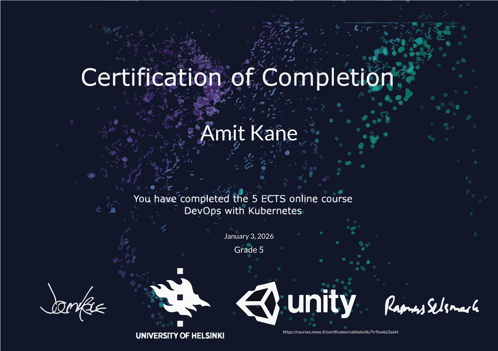

 
 
 

## [DevOps with Kubernetes - University of Helsinki MOOC](https://courses.mooc.fi/org/uh-cs/courses/devops-with-kubernetes)
**Completed: Jan 2026** | **53 Exercises**

---

---

### Chapter-2: Kubernetes basics  

**First deploy**  
- [1.1. Random string logger in Kubernetes](https://github.com/arkb2023/devops-kubernetes/tree/1.1/log_output)  
- [1.2. Basic Todo web server deployment](https://github.com/arkb2023/devops-kubernetes/tree/1.2/the_project)  
- [1.3. Declarative manifests for log output](https://github.com/arkb2023/devops-kubernetes/tree/1.3/log_output)  
- [1.4. Declarative deployment for Todo project](https://github.com/arkb2023/devops-kubernetes/tree/1.4/the_project)  

**Introduction to Networking**  
- [1.5. Expose application externally with port‑forward](https://github.com/arkb2023/devops-kubernetes/tree/1.5/the_project)  
- [1.6. Access Todo app via NodePort Service](https://github.com/arkb2023/devops-kubernetes/tree/1.6/the_project)  
- [1.7. External access through Ingress for log output](https://github.com/arkb2023/devops-kubernetes/tree/1.7/log_output)  
- [1.8. Switch Todo project to Ingress](https://github.com/arkb2023/devops-kubernetes/tree/1.8/the_project)  
- [1.9. Deploy Ping-Pong Service - Second app with Ingress path routing /pingpong](https://github.com/arkb2023/devops-kubernetes/tree/1.9/ping-pong)  

**Introduction to Storage**  
- [1.10. Multi-container pod with shared file](https://github.com/arkb2023/devops-kubernetes/tree/1.10/log_output)  
- [1.11. Share data using PersistentVolumeClaim](https://github.com/arkb2023/devops-kubernetes/tree/1.11/log_output)  
- [1.12. Timer based picture caching app](https://github.com/arkb2023/devops-kubernetes/tree/1.12/the_project)  
- [1.13. Todo App Frontend Basics - Input field, validation, hardcoded list](https://github.com/arkb2023/devops-kubernetes/tree/1.13/the_project)  

---

### Chapter-3: More building blocks  

**Networking between pods**  
- [2.1. Pod-to-Pod HTTP Connectivity - LogOutput fetches ping counts](https://github.com/arkb2023/devops-kubernetes/tree/2.1/log_output)  
- [2.2. Deploy Todo Backend Service - In-memory todos API endpoints](https://github.com/arkb2023/devops-kubernetes/tree/2.2/the_project)  

**Organizing a cluster**  
- [2.3. Exercises Namespace Isolation - Move apps to dedicated namespace](https://github.com/arkb2023/devops-kubernetes/blob/2.3/README.namespace.md)  
- [2.4. Project Namespace Separation - Todo apps to project namespace](https://github.com/arkb2023/devops-kubernetes/blob/2.4/the_project)  

**Configuring applications**  
- [2.5. Log App ConfigMap Injection - File volume + env vars](https://github.com/arkb2023/devops-kubernetes/blob/2.5/log_output)  
- [2.6. Todo Project Config Externalization - Env vars from ConfigMaps](https://github.com/arkb2023/devops-kubernetes/blob/2.6/the_project)  

**StatefulSets and Jobs**  
- [2.7. Postgres StatefulSet Persistent Counter - Database-backed ping-pong storage](https://github.com/arkb2023/devops-kubernetes/tree/2.7/ping-pong)  
- [2.8. Todo Backend Database Persistence - StatefulSet with secrets](https://github.com/arkb2023/devops-kubernetes/tree/2.8/the_project)  
- [2.9. Wikipedia Random Todo CronJob - Hourly reading reminder generator](https://github.com/arkb2023/devops-kubernetes/tree/2.9/the_project)  

**Monitoring**  
- [2.10. Todo Backend Request Logging - Grafana monitoring integration](https://github.com/arkb2023/devops-kubernetes/tree/2.10/the_project)  

---

### Chapter-4: To the cloud

**Introduction to Google Kubernetes Engine**  
- [3.1. Ping-Pong GKE LoadBalancer Deployment - Postgres StatefulSet exposure](https://github.com/arkb2023/devops-kubernetes/tree/3.1/ping-pong)  
- [3.2. GKE Ingress Path Routing - LogOutput + Ping-Pong multi-app exposure](https://github.com/arkb2023/devops-kubernetes/tree/3.2/ping-pong)  
- [3.3. Ingress to Gateway API Migration - HTTPRoute replaces routing](https://github.com/arkb2023/devops-kubernetes/tree/3.3/ping-pong)  
- [3.4. Gateway API Route Rewriting - Ping-Pong /pingpong to root prefix](https://github.com/arkb2023/devops-kubernetes/tree/3.4/ping-pong)  

**Deployment Pipeline**  
- [3.5. Todo Project GKE Deployment - Kustomize configuration overlay](https://github.com/arkb2023/devops-kubernetes/tree/3.5/the_project)  
- [3.6. Todo Project CI/CD Automation - GKE deployment with RecreateStrategy](https://github.com/arkb2023/devops-kubernetes/tree/3.6/the_project)  
- [3.7. Git Branch Environments - Kustomize multi-namespace deployments](https://github.com/arkb2023/devops-kubernetes/tree/3.7/the_project)  
- [3.8. Branch Deletion Cleanup - Automated namespace teardown workflow](https://github.com/arkb2023/devops-kubernetes/tree/3.8/the_project)  

**GKE features**  
- [3.9. DBaaS vs DIY Postgres Comparison - Costs, maintenance, backups analysis](https://github.com/arkb2023/devops-kubernetes/tree/3.9/exercises/3.9-dbaas-vs-diy)
- [3.10. Daily Todo DB Backup CronJob - pg_dump to Google Cloud Storage](https://github.com/arkb2023/devops-kubernetes/tree/3.10/the_project)  
- [3.11. Todo Project Resource Quotas - Requests/limits via kubectl top tuning](https://github.com/arkb2023/devops-kubernetes/tree/3.11/the_project)  
- [3.12. Enable GKE Cloud Logging - Project app/container logs to Monitoring](https://github.com/arkb2023/devops-kubernetes/tree/3.12/the_project)  

---

### Chapter-5: GitOps and friends  

**Update Strategies and Prometheus**  
- [4.1. App Dependencies ReadinessProbes - Ping-Pong DB + LogOutput HTTP checks](https://github.com/arkb2023/devops-kubernetes/tree/4.1/ping-pong)  
- [4.2. Todo Project Health Probes - Backend DB connectivity endpoints](https://github.com/arkb2023/devops-kubernetes/tree/4.2/the_project)  
- [4.3. Prometheus StatefulSet Pod Count - kube_pod_info{created_by_kind="StatefulSet"}](https://github.com/arkb2023/devops-kubernetes/tree/4.3/monitoring)  
- [4.4. Ping-Pong Canary AnalysisTemplate - Namespace CPU rate sum threshold](https://github.com/arkb2023/devops-kubernetes/tree/4.4/ping-pong)  
- [4.5. Todo Completed Field - PUT /todos/{id} done status update](https://github.com/arkb2023/devops-kubernetes/tree/4.5/the_project)  

**Messaging Systems**
- [4.6. Slack Broadcaster Service - NATS todo pub/sub idempotent scaling](https://github.com/arkb2023/devops-kubernetes/tree/4.6/the_project)  

**GitOps**  
- [4.7. LogOutput GitOps Migration - ArgoCD repo sync automation](https://github.com/arkb2023/devops-kubernetes/tree/4.7/log_output)  
- [4.8. Todo Project GitOps - ArgoCD main branch auto-sync](https://github.com/arkb2023/devops-kubernetes/tree/4.8/the_project) 
- [4.9. Multi-Env GitOps - Staging/Prod tag promotion](https://github.com/arkb2023/devops-kubernetes/tree/4.9/the_project) 
- [4.10. App-Code vs Config Repo Separation - Dual-repo GitOps finale](https://github.com/arkb2023/devops-kubernetes/tree/4.10/the_project) 

---

### Chapter-6: Under the hood

**Custom Resource Definitions**  
- [5.1. DummySite CRD Controller - URL fetch HTML Deployment](https://github.com/arkb2023/devops-kubernetes/tree/5.1/exercises/5.1-diy-crd-controller)  

**Service-Mesh**  
- [5.2. Istio Ambient Mode Install - Sample app k3d deployment](https://github.com/arkb2023/devops-kubernetes/tree/5.2/exercises/5.2-istio-service-mesh-sample-app/)
- [5.3. 5.3 LogOutput Istio Mesh - Greeter 75/25 HTTPRoute split](https://github.com/arkb2023/devops-kubernetes/tree/5.3/log_output)  
- [5.4. Wikipedia Multi-Container Pod - Init/sidecar nginx shared volume](https://github.com/arkb2023/devops-kubernetes/tree/5.4/exercises/5.4-init-sidecar)

**Beyond-kubernetes**  
- [5.5. Platform comparison: Rancher vs OpenShift](https://github.com/arkb2023/devops-kubernetes/tree/5.5/exercises/5.5-platform-comparison)  
- [5.6. Knative Serving k3d Install - Autoscaling traffic split examples](https://github.com/arkb2023/devops-kubernetes/tree/5.6/exercises/5.6-serverless)  
- [5.7. Ping-Pong Knative Serverless - Deployment to KSvc conversion](https://github.com/arkb2023/devops-kubernetes/tree/5.7/ping-pong)  
- [5.8. CNCF Landscape Mapping - Direct/indirect project usage](https://github.com/arkb2023/devops-kubernetes/tree/5.8/exercises/5.8-landscape)  

---

 
