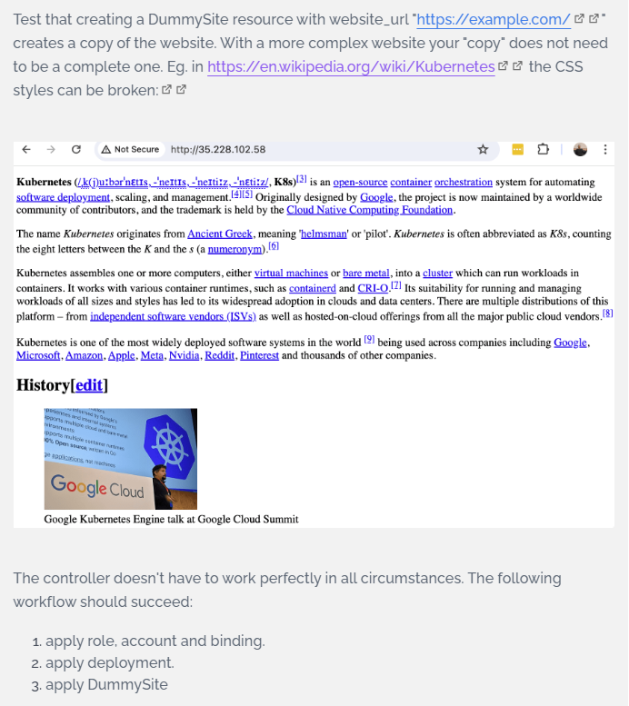

## [Exercise 5.1: DIY CRD & Controller](https://courses.mooc.fi/org/uh-cs/courses/devops-with-kubernetes/chapter-6/custom-resource-definitions)

  


---

### 1. Overview:

1. Custom Resource Definition `dummysites.stable.dwk/v1` of kind `DummySite` declares static website URLs as custom resources for automated cluster deployment

2. Controller Deployment `dummysite-controller-dep` ensures Pod runs with Python operator code using Kubernetes client library

3. Controller watches control plane events for CRD: `GROUP=stable.dwk, VERSION=v1, PLURAL=dummysites, NAMESPACE=default` using a watch stream with 30-second timeouts to process `ADDED` events

4. ADD event handler creates nginx stack:
   - Fetches website HTML: `requests.get()` + Chrome User-Agent headers
   - Creates/patches a Kubernetes ConfigMap ds-cm-<dummysite-name> with `index.html` data
   - Creates a Deployment ds-deploy-<dummysite-name> using `nginx:alpine`, exposing port `80` and mounting the ConfigMap at `/usr/share/nginx/html`
   - Creates a Service ds-svc-<dummysite-name> with type `ClusterIP`, listening on port 80 and targeting container port 80

5. RBAC:
   - ClusterRole `dummysite-controller-role`: full CRUD and watch permissions on `dummysites.stable.dwk`, `configmaps`, `services`, and `deployments.apps`
   - ServiceAccount `dummysite-controller-account` 
   - ClusterRoleBinding `dummysite-controller-rolebinding` binds ServiceAccount to ClusterRole

6. Local access: `kubectl port-forward svc/ds-svc-<dummysite-name> 8080:80` exposes the nginx-served website at `http://localhost:8080`

---

### 2. Directory and File Structure

<pre>
exercises/5.1-diy-crd-controller/
├── README.md                                     # Instructions & deployment guide
├── controller
│   ├── Dockerfile                                # Builds Python operator
│   ├── controller.py                             # Watch + reconcile logic
│   ├── deployment.yaml                           # Controller Deployment + SA
│   ├── requirements.txt
├── crd
│   └── dummysite-crd.yaml                        # CustomResourceDefinition (stable.dwk/v1)
├── rbac
│   ├── clusterrole-serviceaccount-binding.yaml   # SA + ClusterRole binding 
│   ├── clusterrole.yaml                          # Permissions spec
│   └── serviceaccount.yaml                       # dummysite-controller-account
├── tests
│   ├── dummysite-wikipedia.yaml                  # Wikipedia test
│   └── dummysite.yaml                            # httpbin test

</pre>

---

### 3. Deployment workflow
- Build and push controller to Docker hub
  ```bash
  cd exercises/5.1-diy-crd-controller/
  docker build -t arkb2023/dummysite-controller:1.25 ./controller
  docker push arkb2023/dummysite-controller:1.25
  ```
  > Docker image are published at:  
  > https://hub.docker.com/repository/docker/arkb2023/dummysite-controller/tags/1.25/


- Install CRD
  ```bash
  kubectl apply -f crd/dummysite-crd.yaml
  ```
- Install RBAC
  ```bash
  kubectl apply -f rbac/clusterrole.yaml -f rbac/serviceaccount.yaml -f rbac/clusterrole-serviceaccount-binding.yaml
  ```
- Deploy Controller
  ```bash
  kubectl apply -f controller/deployment.yaml
  ```

---

### 4. Verify Deployment
- CRD Verification  
  ```bash
  # Get CRD
  kubectl get customresourcedefinitions dummysites.stable.dwk
  # Output
  NAME                    CREATED AT
  dummysites.stable.dwk   2025-12-24T13:22:39Z

  # Describe CRD
  kubectl describe customresourcedefinitions dummysites.stable.dwk

  # Output
  Name:         dummysites.stable.dwk
  Namespace:
  Labels:       <none>
  Annotations:  <none>
  API Version:  apiextensions.k8s.io/v1
  Kind:         CustomResourceDefinition
  Metadata:
    Creation Timestamp:  2025-12-24T13:22:39Z
    Generation:          1
    Resource Version:    536019
    UID:                 af902c9d-e728-4267-9214-c6ba5a216322
  Spec:
    Conversion:
      Strategy:  None
    Group:       stable.dwk
    Names:
      Kind:       DummySite
      List Kind:  DummySiteList
      Plural:     dummysites
      Short Names:
        ds
      Singular:  dummysite
    Scope:       Namespaced
    Versions:
      Additional Printer Columns:
        Description:  The source website URL
        Json Path:    .spec.website_url
        Name:         Website URL
        Type:         string
      Name:           v1
      Schema:
        openAPIV3Schema:
          Properties:
            Spec:
              Properties:
                website_url:
                  Type:  string
              Type:      object
          Type:          object
      Served:            true
      Storage:           true
  Status:
    Accepted Names:
      Kind:       DummySite
      List Kind:  DummySiteList
      Plural:     dummysites
      Short Names:
        ds
      Singular:  dummysite
    Conditions:
      Last Transition Time:  2025-12-24T13:22:39Z
      Message:               no conflicts found
      Reason:                NoConflicts
      Status:                True
      Type:                  NamesAccepted
      Last Transition Time:  2025-12-24T13:22:39Z
      Message:               the initial names have been accepted
      Reason:                InitialNamesAccepted
      Status:                True
      Type:                  Established
    Stored Versions:
      v1
  Events:  <none>
  ```
- RBAC Verification
  - Service Account Verification
    ```bash
    # Get SA
    kubectl get serviceaccounts dummysite-controller-account
    # Output
    NAME                           SECRETS   AGE
    dummysite-controller-account   0         14h
    ```
  - Cluster Role Verification
    ```bash
    # Describe Cluster Role
    kubectl describe clusterrole dummysite-controller-role
    # Output
    Name:         dummysite-controller-role
    Labels:       <none>
    Annotations:  <none>
    PolicyRule:
      Resources              Non-Resource URLs  Resource Names  Verbs
      ---------              -----------------  --------------  -----
      dummysites.stable.dwk  []                 []              [get list watch create delete patch]
      configmaps             []                 []              [get list watch create update patch delete]
      namespaces             []                 []              [get list watch create update patch delete]
      pods                   []                 []              [get list watch create update patch delete]
      services               []                 []              [get list watch create update patch delete]
      deployments.apps       []                 []              [get list watch create update patch delete]
    ```
  - Cluster Role Binding verification
    ```bash
    kubectl describe clusterrolebinding dummysite-rolebinding
    
    # Output
    Name:         dummysite-rolebinding
    Labels:       <none>
    Annotations:  <none>
    Role:
      Kind:  ClusterRole
      Name:  dummysite-controller-role
    Subjects:
      Kind            Name                          Namespace
      ----            ----                          ---------
      ServiceAccount  dummysite-controller-account  default
    ```
- Controller Deployment
  ```bash
  # Get Deployment
  kubectl get deployment dummysite-controller-dep -o wide
  
  # Output
  NAME                       READY   UP-TO-DATE   AVAILABLE   AGE    CONTAINERS             IMAGES                               SELECTOR
  dummysite-controller-dep   1/1     1            1           157m   dummysite-controller   arkb2023/dummysite-controller:1.25   app=dummysite-controller
  ```  
- Controller Startup logs
  
  ```bash
  # Log dump
  kubectl logs -f deployment/dummysite-controller-dep --tail=20
  # Output
  2025-12-25 04:12:55,784 INFO === STARTING DummySite Controller ===
  2025-12-25 04:19:48,594 INFO Loading in-cluster config...
  2025-12-25 04:19:48,692 INFO CustomObjectsApi OK
  2025-12-25 04:19:48,692 INFO Found 0 existing DummySites
  2025-12-25 04:19:48,692 INFO Watch stream + Full Stack creation...
  2025-12-25 04:19:48,692 INFO Watch loop #1 (timeout=30s)
  ```
  > Shows clean startup, healthy watch loop

---

### 5. Test websites

- Deploy Wikipedia DummySite 
  ```bash
  # Apply DummySite named `wikipedia-site` with website_url: "https://en.wikipedia.org/wiki/Kubernetes"
  kubectl apply -f tests/dummysite-wikipedia.yaml
  # Output
  dummysite.stable.dwk/wikipedia-site created
  ```
- Verify DummySite CR
  ```bash
  # Describe wikipedia-site
  kubectl describe dummysites.stable.dwk wikipedia-site

  # Output
  Name:         wikipedia-site
  Namespace:    default
  Labels:       <none>
  Annotations:  <none>
  API Version:  stable.dwk/v1
  Kind:         DummySite
  Metadata:
    Creation Timestamp:  2025-12-25T04:24:45Z
    Generation:          1
    Resource Version:    553430
    UID:                 0c736200-5353-4529-9e04-970debd9756e
  Spec:
    website_url:  https://en.wikipedia.org/wiki/Kubernetes
  Events:         <none>
  ```

- Controller Reconciliation Logs
  - First reconcile (Full stack creation):
    ```bash
    # Log dump
    kubectl logs -f deployment/dummysite-controller-dep --tail=20
    # Output
    EVENT #1: ADDED 'wikipedia-site'
    Fetching https://en.wikipedia.org/wiki/Kubernetes...
    resp.text len 383620
    Creating new ConfigMap ds-cm-wikipedia-site
    ConfigMap ds-cm-wikipedia-site ready (383620 bytes)
    DummySite 'wikipedia-site' COMPLETE!
    Deployment 'ds-deploy-wikipedia-site' created
    Service 'ds-svc-wikipedia-site' created
    Nginx stack 'ds-deploy-wikipedia-site' deployed!
    ```
    > Website contents fetched
    > Serving nginx stack resources created

  - Recurring reconcile (Idempotent + Fresh content)
    ```bash
    # Log dump
    kubectl logs -f deployment/dummysite-controller-dep --tail=20
    # Output
    EVENT #1: ADDED 'wikipedia-site' (loop #8)
    resp.text len 383620
    Updating ConfigMap ds-cm-wikipedia-site
    ConfigMap ds-cm-wikipedia-site ready (383620 bytes)
    Deployment 'ds-deploy-wikipedia-site' already exists!
    Service 'ds-svc-wikipedia-site' already exists!
    Nginx stack 'ds-deploy-wikipedia-site' deployed!
    ```
    > Pattern: Refetches content for freshness while preserving infrastructure

- Verify Controller Generated Stack for Wikipedia site
  - Wikipedia Deployment (nginx + ConfigMap mount) created  
    ```bash 
    # Describe wikipedia-site deployment
    kubectl describe deployments.apps  ds-deploy-wikipedia-site
    # Output
    Name:                   ds-deploy-wikipedia-site
    Namespace:              default
    CreationTimestamp:      Wed, 24 Dec 2025 19:26:38 +0530
    Labels:                 <none>
    Annotations:            deployment.kubernetes.io/revision: 1
    Selector:               app=ds-wikipedia-site
    Replicas:               1 desired | 1 updated | 1 total | 1 available | 0 unavailable
    StrategyType:           RollingUpdate
    MinReadySeconds:        0
    RollingUpdateStrategy:  25% max unavailable, 25% max surge
    Pod Template:
      Labels:  app=ds-wikipedia-site
      Containers:
      nginx:
        Image:        nginx:alpine
        Port:         80/TCP
        Host Port:    0/TCP
        Environment:  <none>
        Mounts:
          /usr/share/nginx/html from html (rw)
      Volumes:
      html:
        Type:          ConfigMap (a volume populated by a ConfigMap)
        Name:          ds-cm-wikipedia-site
        Optional:      false
      Node-Selectors:  <none>
      Tolerations:     <none>
    Conditions:
      Type           Status  Reason
      ----           ------  ------
      Progressing    True    NewReplicaSetAvailable
      Available      True    MinimumReplicasAvailable
    OldReplicaSets:  <none>
    NewReplicaSet:   ds-deploy-wikipedia-site-58d6959d48 (1/1 replicas created)
    Events:          <none>
    ```

  - Wikipedia Service (ClusterIP + Port) created
    ```bash
    kubectl get svc ds-svc-wikipedia-site

    NAME                    TYPE        CLUSTER-IP     EXTERNAL-IP   PORT(S)   AGE
    ds-svc-wikipedia-site   ClusterIP   10.43.232.76   <none>        80/TCP    12h
    ```

  - Wikipedia ConfigMap (383KB Wikipedia HTML) created  
    ```bash
    # Describe wikipedia-site Config map
    kubectl describe configmaps ds-cm-wikipedia-site
    
    # Output
    Name:         ds-cm-wikipedia-site
    Namespace:    default
    Labels:       app=ds-wikipedia-site
    Annotations:  <none>

    Data
    ====
    index.html:
    ----
    <!DOCTYPE html>
    <html class="client-nojs vector-feature-language-in-header-enabled vector-feature-language-in-main-page-header-disabled vector-feature-page-tools-pinned-disabled vector-feature-toc-pinned-clientpref-1 vector-feature-main-menu-pinned-disabled vector-feature-limited-width-clientpref-1 vector-feature-limited-width-content-enabled vector-feature-custom-font-size-clientpref-1 vector-feature-appearance-pinned-clientpref-1 vector-feature-night-mode-enabled skin-theme-clientpref-day vector-sticky-header-enabled vector-toc-available" lang="en" dir="ltr">
    <head>
    <meta charset="UTF-8">
    <title>Kubernetes - Wikipedia</title>
    <script>(function()

    ....<snip>....
    
    </body>
    </html>

    BinaryData
    ====

    Events:  <none>
    ```
    > Shows cached wikipedia `index.html` contents

- Access Wikipedia site

  - Port forward
  ```bash
  kubectl port-forward svc/ds-svc-wikipedia-site 8080:80
  ```
  - Wikipedia via nginx at `http://locahost:8080`
  

---


### 6. Clenaup

- Delete DummySite CR
  ```bash
  kubectl delete dummysite wikipedia-site 
  ```
- Current Controller implementation only logs DELETED event detected
  ```logs
  2025-12-25 07:37:29,994 INFO EVENT #2: DELETED 'wikipedia-site'
  2025-12-25 07:37:29,994 INFO Deletion 'wikipedia-site' (cleanup not implemented)
  ```
> Future Enhancement: DELETE handler auto-cleans nginx stack when DummySite CR deleted.

- Workaround- Manual stack cleanup
  ```bash
  kubectl delete configmaps ds-cm-wikipedia-site
  kubectl delete service ds-svc-wikipedia-site
  kubectl delete deployment ds-deploy-wikipedia-site
  ```
- Remove deployment
  ```bash
  # Remobe controller
  kubectl delete -f controller/deployment.yaml

  # Remove RBAC
  kubectl delete -f rbac/clusterrole.yaml -f rbac/serviceaccount.yaml -f rbac/clusterrole-serviceaccount-binding.yaml

  # Remove CRD
  kubectl delete -f crd/dummysite-crd.yaml
  ```
---
