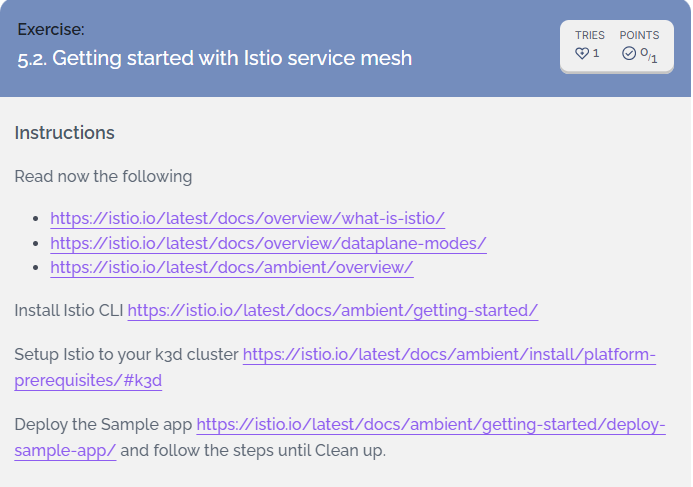
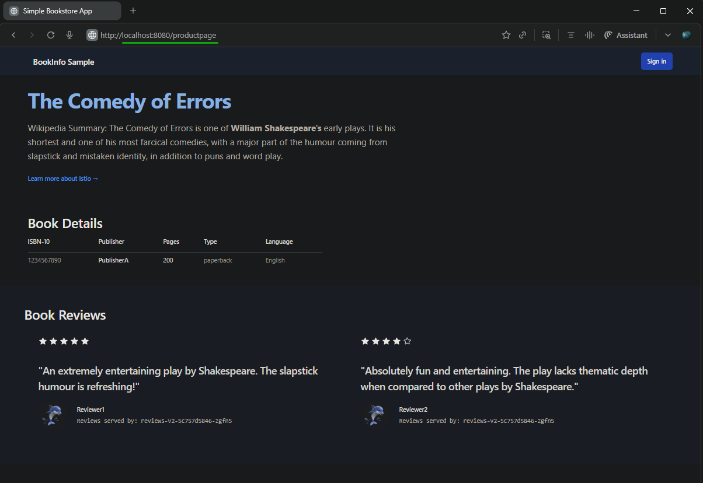
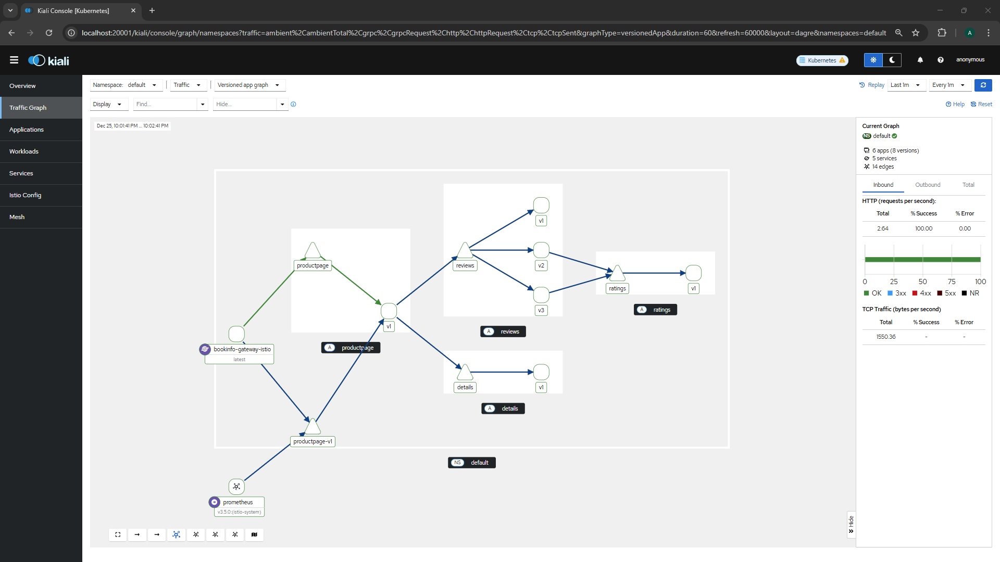
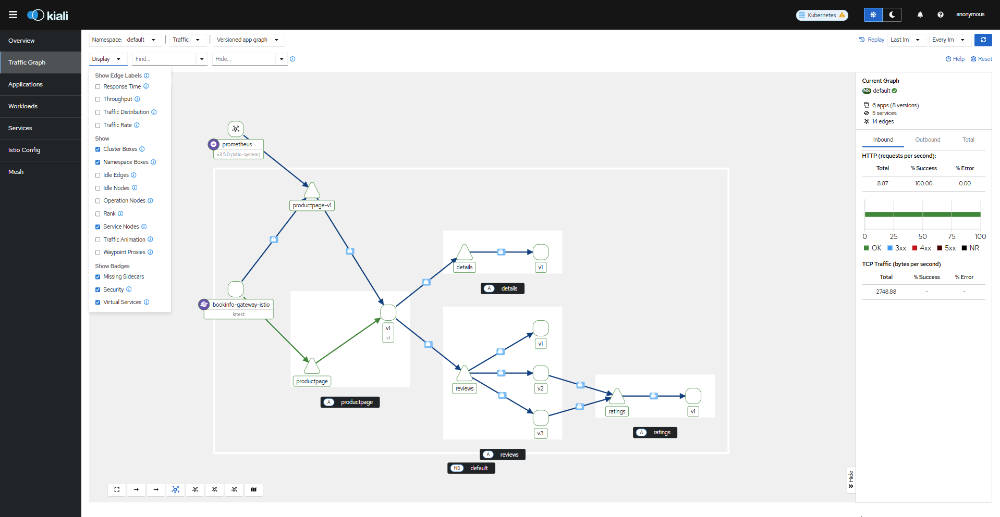
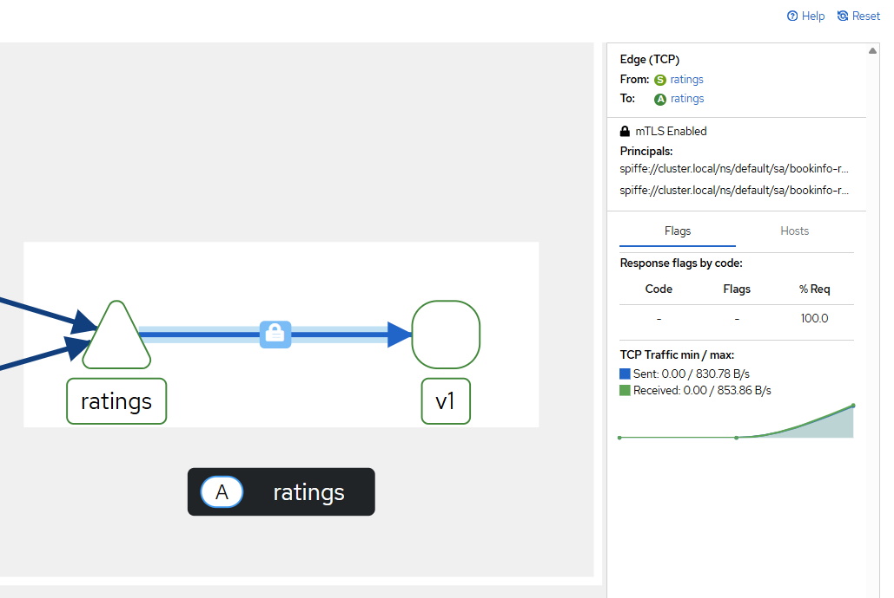
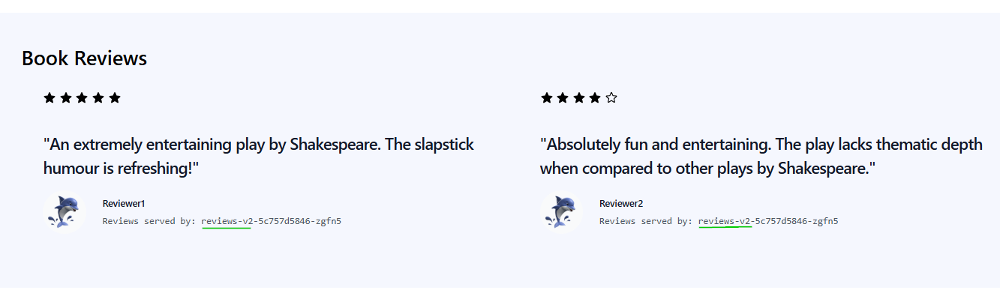

## [Exercise: 5.2. Getting started with Istio service mesh](https://courses.mooc.fi/org/uh-cs/courses/devops-with-kubernetes/chapter-6/service-mesh)



---

### 1. [Deploy a sample application](https://istio.io/latest/docs/ambient/getting-started/deploy-sample-app/)

- Deploy the Bookinfo application
    ```bash
    # Bookinfo
    kubectl apply -f https://raw.githubusercontent.com/istio/istio/1.28.2/samples/bookinfo/platform/kube/bookinfo.yaml
    # Output
    service/details serverside-applied
    serviceaccount/bookinfo-details serverside-applied
    deployment.apps/details-v1 serverside-applied
    service/ratings serverside-applied
    serviceaccount/bookinfo-ratings serverside-applied
    deployment.apps/ratings-v1 serverside-applied
    service/reviews serverside-applied
    serviceaccount/bookinfo-reviews serverside-applied
    deployment.apps/reviews-v1 serverside-applied
    deployment.apps/reviews-v2 serverside-applied
    deployment.apps/reviews-v3 serverside-applied
    service/productpage serverside-applied
    serviceaccount/bookinfo-productpage serverside-applied
    deployment.apps/productpage-v1 serverside-applied

    # Bookinginfo versions
    kubectl apply -f https://raw.githubusercontent.com/istio/istio/1.28.2/samples/bookinfo/platform/kube/bookinfo-versions.yaml
    # Output
    service/reviews-v1 serverside-applied
    service/reviews-v2 serverside-applied
    service/reviews-v3 serverside-applied
    service/productpage-v1 serverside-applied
    service/ratings-v1 serverside-applied
    service/details-v1 serverside-applied

    # Verify the application is running
    kubectl -n default get pod| egrep "NAME|details|product|ratings|reviews"
    # Output
    NAME                                         READY   STATUS      RESTARTS     AGE
    details-v1-77b775f46-tfw46                   1/1     Running     0            23m
    productpage-v1-78dfd4688c-c5t6w              1/1     Running     0            23m
    ratings-v1-7c4c8d6794-b242p                  1/1     Running     0            23m
    reviews-v1-849f9bc5d6-662lh                  1/1     Running     0            23m
    reviews-v2-5c757d5846-zgfn5                  1/1     Running     0            23m
    reviews-v3-6d5d98f5c4-rkj94                  1/1     Running     0            23m
    ```

- Deploy and configure the ingress gateway
    ```bash
    # Booking gateway
    kubectl apply -f https://raw.githubusercontent.com/istio/istio/1.28.2/samples/bookinfo/gateway-api/bookinfo-gateway.yaml
    # Output
    gateway.gateway.networking.k8s.io/bookinfo-gateway serverside-applied
    httproute.gateway.networking.k8s.io/bookinfo serverside-applied

    # Change the service type to ClusterIP by annotating the gateway:
    kubectl annotate gateway bookinfo-gateway networking.istio.io/service-type=ClusterIP --namespace=default
    # Output
    gateway.gateway.networking.k8s.io/bookinfo-gateway annotated

    # check the status of the gateway, run:
    kubectl get gateway bookinfo-gateway
    # Output
    NAME               CLASS   ADDRESS                                            PROGRAMMED   AGE
    bookinfo-gateway   istio   bookinfo-gateway-istio.default.svc.cluster.local   True         21s
    ```

- Access the application
    ```bash
    # connect to the Bookinfo productpage service through the gateway you just provisioned. 
    kubectl port-forward svc/bookinfo-gateway-istio 8080:80 &
    # Output
    Forwarding from 127.0.0.1:8080 -> 80
    Forwarding from [::1]:8080 -> 80
    ```

- Open your browser and navigate to http://localhost:8080/productpage to view the Bookinfo application.  
    

- [Additional] check from curl command line
    ```bash
    curl -s localhost:8080/productpage | grep -o "bookinfo reviews.*stars" || echo "Open http://localhost:8080/productpage"
    # Output
    Handling connection for 8080
    Open http://localhost:8080/productpage
    ```
- Rrefresh the page, to see the display of the book ratings changing as the requests are distributed across the different versions of the reviews service.  
    

---

### 2. [Secure and visualize the application](https://istio.io/latest/docs/ambient/getting-started/secure-and-visualize/)

- Add Bookinfo to the mesh
    ```bash
    kubectl label namespace default istio.io/dataplane-mode=ambient
    # Output
    namespace/default labeled
    ```
- Visualize the application and metrics - using Istio’s dashboard, Kiali and Prometheus
    ```bash
    # Prometheus
    kubectl apply -f https://raw.githubusercontent.com/istio/istio/1.28.2/samples/addons/prometheus.yaml
    # Output
    serviceaccount/prometheus serverside-applied
    configmap/prometheus serverside-applied
    clusterrole.rbac.authorization.k8s.io/prometheus serverside-applied
    clusterrolebinding.rbac.authorization.k8s.io/prometheus serverside-applied
    service/prometheus serverside-applied
    deployment.apps/prometheus serverside-applied

    # Kiali
    kubectl apply -f https://raw.githubusercontent.com/istio/istio/1.28.2/samples/addons/kiali.yaml
    # Output
    serviceaccount/kiali serverside-applied
    configmap/kiali serverside-applied
    clusterrole.rbac.authorization.k8s.io/kiali serverside-applied
    clusterrolebinding.rbac.authorization.k8s.io/kiali serverside-applied
    service/kiali serverside-applied
    deployment.apps/kiali serverside-applied
    ```
- Access Kiali dashboard by running the following command
    ```bash
    istioctl dashboard kiali
    http://localhost:20001/kiali
    ```

- Send traffic to the Bookinfo application, so Kiali generates the traffic graph:
    ```bash
    for i in $(seq 1 100); do curl -sSI -o /dev/null http://localhost:8080/productpage; done
    ```

- Traffic Graph  
      
    > Select Traffic Graph > Namespace > Default

- mTLS status between the services  
    
    > Select Display > Security

- Inbound and outbound traffic metrics on link connecting two endpoints  
    

---

### 3. [Enforce authorization policies](https://istio.io/latest/docs/ambient/getting-started/enforce-auth-policies/)
- Enforce Layer 4 authorization policy
    ```bash
    kubectl apply -f - <<EOF
    apiVersion: security.istio.io/v1
    kind: AuthorizationPolicy
    metadata:
    name: productpage-ztunnel
    namespace: default
    spec:
    selector:
        matchLabels:
        app: productpage
    action: ALLOW
    rules:
    - from:
        - source:
            principals:
            - cluster.local/ns/default/sa/bookinfo-gateway-istio
    EOF
    # Output
    authorizationpolicy.security.istio.io/productpage-ztunnel serverside-applied
    ```
- Verify Policy Applied
    ```bash
    # Get AuthorizationPolicy productpage-ztunnel
    kubectl get authorizationpolicy productpage-ztunnel
    # Output
    NAME                  ACTION   AGE
    productpage-ztunnel   ALLOW    5m31s

    # Describe AuthorizationPolicy productpage-ztunnel
    kubectl describe authorizationpolicy productpage-ztunnel
    # Output
    Name:         productpage-ztunnel
    Namespace:    default
    Labels:       <none>
    Annotations:  <none>
    API Version:  security.istio.io/v1
    Kind:         AuthorizationPolicy
    Metadata:
    Creation Timestamp:  2025-12-25T16:58:22Z
    Generation:          1
    Resource Version:    587916
    UID:                 fa631cb8-243e-48f3-b2b3-d71e46bed43d
    Spec:
    Action:  ALLOW
    Rules:
        From:
        Source:
            Principals:
            cluster.local/ns/default/sa/bookinfo-gateway-istio
    Selector:
        Match Labels:
        App:  productpage
    Status:
    Conditions:
        Last Transition Time:  2025-12-25T16:58:22.799449284Z
        Message:               attached to ztunnel
        Observed Generation:   1
        Reason:                Accepted
        Status:                True
        Type:                  ZtunnelAccepted
    Events:                    <none>
    ```

- Deploy Curl Pod (Test Client)
    ```bash
    kubectl apply -f https://raw.githubusercontent.com/istio/istio/1.28.2/samples/curl/curl.yaml
    # Output
    serviceaccount/curl serverside-applied
    service/curl serverside-applied
    deployment.apps/curl serverside-applied
    
    # Curl pod is using a different service account, it will not have access the productpage service
    kubectl exec deploy/curl -- curl -s "http://productpage:9080/productpage"
    # Output
    command terminated with exit code 56
    ```

- Enforce Layer 7 authorization policy
    ```bash
    istioctl waypoint apply --enroll-namespace --wait
    # Output
    ✅ waypoint default/waypoint applied
    ✅ waypoint default/waypoint is ready!
    ✅ namespace default labeled with "istio.io/use-waypoint: waypoint"
    ```
- Waypoint proxy `Programmed=True`
    ```bash
    kubectl get gtw waypoint
    # Output
    NAME       CLASS            ADDRESS         PROGRAMMED   AGE
    waypoint   istio-waypoint   10.43.200.113   True         45s
    ```

- Adding a L7 authorization policy will explicitly allow the curl service to send GET requests to the productpage service
    ```bash
    kubectl apply -f - <<EOF
    # Output
    apiVersion: security.istio.io/v1
    kind: AuthorizationPolicy
    metadata:
    name: productpage-waypoint
    namespace: default
    spec:
    targetRefs:
    - kind: Service
        group: ""
        name: productpage
    action: ALLOW
    rules:
    - from:
        - source:
            principals:
            - cluster.local/ns/default/sa/curl
        to:
        - operation:
            methods: ["GET"]
    EOF
    # Output
    authorizationpolicy.security.istio.io/productpage-waypoint serverside-applied
    ```
- Update L4 policy to also allow connections from the waypoint.
    ```bash
    kubectl apply -f - <<EOF
    # Output
    apiVersion: security.istio.io/v1
    kind: AuthorizationPolicy
    metadata:
    name: productpage-ztunnel
    namespace: default
    spec:
    selector:
        matchLabels:
        app: productpage
    action: ALLOW
    rules:
    - from:
        - source:
            principals:
            - cluster.local/ns/default/sa/bookinfo-gateway-istio
            - cluster.local/ns/default/sa/waypoint
    EOF
    # Output
    authorizationpolicy.security.istio.io/productpage-ztunnel serverside-applied
    ```
- Confirm the new waypoint proxy is enforcing the updated authorization policy:
    ```bash
    # This fails with an RBAC error because you're not using a GET operation
    kubectl exec deploy/curl -- curl -s "http://productpage:9080/productpage" -X DELETE
    # Output
    RBAC: access denied

    # This fails with an RBAC error because the identity of the reviews-v1 service is not allowed
    kubectl exec deploy/reviews-v1 -- curl -s http://productpage:9080/productpage
    # Output
    RBAC: access denied

    # This works as you're explicitly allowing GET requests from the curl pod
    ```bash
    kubectl exec deploy/curl -- curl -s http://productpage:9080/productpage | grep -o "<title>.*</title>"
    # Output:
    <title>Simple Bookstore App</title>
    ```

---

### 4. [Manage traffic](https://istio.io/latest/docs/ambient/getting-started/manage-traffic/)
- Split traffic between services - Bookinfo application has three versions of the reviews service. Split traffic between these versions to test new features or perform A/B testing.  

- Configure traffic routing to send 90% of requests to reviews v1 and 10% to reviews v2:
    ```bash
    kubectl apply -f - <<EOF
    apiVersion: gateway.networking.k8s.io/v1
    kind: HTTPRoute
    metadata:
    name: reviews
    spec:
    parentRefs:
    - group: ""
        kind: Service
        name: reviews
        port: 9080
    rules:
    - backendRefs:
        - name: reviews-v1
        port: 9080
        weight: 90
        - name: reviews-v2
        port: 9080
        weight: 10
    EOF
    # Output
    httproute.gateway.networking.k8s.io/reviews serverside-applied
    ```
- To confirm that roughly 10% of the of the traffic from 100 requests goes to reviews-v2, you can run the following command:
    ```bash
    kubectl exec deploy/curl -- sh -c "for i in \$(seq 1 100); do curl -s http://productpage:9080/productpage | grep reviews-v.-; done"
    ```
    >  Majority of requests go to reviews-v1
- Requests from the reviews-v1 don’t have any stars  
    

- Requests from reviews-v2 have black stars  
    

---

### 5. [Clean up](https://istio.io/latest/docs/ambient/getting-started/cleanup/)
- Remove waypoint proxies
    ```bash
    # Unlabel
    kubectl label namespace default istio.io/use-waypoint-
    # Output
    namespace/default unlabeled

    # Delete
    istioctl waypoint delete --all
    # Output
    waypoint default/waypoint deleted
    ```
- Remove the namespace from the ambient data plane
    ```bash
    kubectl label namespace default istio.io/dataplane-mode-
    # Output
    namespace/default unlabeled
    ```
- Remove the sample application
    ```bash
    # Delete reviews
    kubectl delete httproute reviews
    # Output
    httproute.gateway.networking.k8s.io "reviews" deleted from default namespace

    # Delete authorization policies
    kubectl delete authorizationpolicy productpage-ztunnel productpage-waypoint
    # Output
    authorizationpolicy.security.istio.io "productpage-ztunnel" deleted from default namespace
    authorizationpolicy.security.istio.io "productpage-waypoint" deleted from default namespace


    # Delete curl pod
    kubectl delete -f https://raw.githubusercontent.com/istio/istio/1.28.2/samples/curl/curl.yaml
    # Output
    serviceaccount "curl" deleted from default namespace
    service "curl" deleted from default namespace
    deployment.apps "curl" deleted from default namespace

    # Delete bookinfo
    kubectl delete -f https://raw.githubusercontent.com/istio/istio/1.28.2/samples/bookinfo/platform/kube/bookinfo.yaml
    # Output
    service "details" deleted from default namespace
    serviceaccount "bookinfo-details" deleted from default namespace
    deployment.apps "details-v1" deleted from default namespace
    service "ratings" deleted from default namespace
    serviceaccount "bookinfo-ratings" deleted from default namespace
    deployment.apps "ratings-v1" deleted from default namespace
    service "reviews" deleted from default namespace
    serviceaccount "bookinfo-reviews" deleted from default namespace
    deployment.apps "reviews-v1" deleted from default namespace
    deployment.apps "reviews-v2" deleted from default namespace
    deployment.apps "reviews-v3" deleted from default namespace
    service "productpage" deleted from default namespace
    serviceaccount "bookinfo-productpage" deleted from default namespace
    deployment.apps "productpage-v1" deleted from default namespace

    # Delete bookinfo-versions
    kubectl delete -f https://raw.githubusercontent.com/istio/istio/1.28.2/samples/bookinfo/platform/kube/bookinfo-versions.yaml
    # Output
    service "reviews-v1" deleted from default namespace
    service "reviews-v2" deleted from default namespace
    service "reviews-v3" deleted from default namespace
    service "productpage-v1" deleted from default namespace
    service "ratings-v1" deleted from default namespace
    service "details-v1" deleted from default namespace

    # Delete bookinfo-gateway
    kubectl delete -f https://raw.githubusercontent.com/istio/istio/1.28.2/samples/bookinfo/gateway-api/bookinfo-gateway.yaml
    # Output
    gateway.gateway.networking.k8s.io "bookinfo-gateway" deleted from default namespace
    httproute.gateway.networking.k8s.io "bookinfo" deleted from default namespace
    
    # Uninstall Istio
    istioctl uninstall -y --purge
    # Output
    All Istio resources will be pruned from the cluster

    Removed apps/v1, Kind=Deployment/istiod.istio-system.
    Removed apps/v1, Kind=DaemonSet/istio-cni-node.istio-system.
    Removed apps/v1, Kind=DaemonSet/ztunnel.istio-system.
    Removed /v1, Kind=Service/istiod.istio-system.
    Removed /v1, Kind=Service/istiod-revision-tag-default.istio-system.
    Removed /v1, Kind=ConfigMap/istio.istio-system.
    Removed /v1, Kind=ConfigMap/istio-cni-config.istio-system.
    Removed /v1, Kind=ConfigMap/istio-sidecar-injector.istio-system.
    Removed /v1, Kind=ConfigMap/values.istio-system.
    Removed /v1, Kind=Pod/istiod-6cdd8b57f7-v4jpg.istio-system.
    Removed /v1, Kind=ServiceAccount/istio-cni.istio-system.
    Removed /v1, Kind=ServiceAccount/istio-reader-service-account.istio-system.
    Removed /v1, Kind=ServiceAccount/istiod.istio-system.
    Removed /v1, Kind=ServiceAccount/ztunnel.istio-system.
    Removed rbac.authorization.k8s.io/v1, Kind=RoleBinding/istiod.istio-system.
    Removed rbac.authorization.k8s.io/v1, Kind=Role/istiod.istio-system.
    Removed autoscaling/v2, Kind=HorizontalPodAutoscaler/istiod.istio-system.
    Removed admissionregistration.k8s.io/v1, Kind=MutatingWebhookConfiguration/istio-revision-tag-default..
    Removed admissionregistration.k8s.io/v1, Kind=MutatingWebhookConfiguration/istio-sidecar-injector..
    Removed admissionregistration.k8s.io/v1, Kind=ValidatingWebhookConfiguration/istio-validator-istio-system..
    Removed admissionregistration.k8s.io/v1, Kind=ValidatingWebhookConfiguration/istiod-default-validator..
    Removed rbac.authorization.k8s.io/v1, Kind=ClusterRole/istio-cni..
    Removed rbac.authorization.k8s.io/v1, Kind=ClusterRole/istio-cni-ambient..
    Removed rbac.authorization.k8s.io/v1, Kind=ClusterRole/istio-cni-repair-role..
    Removed rbac.authorization.k8s.io/v1, Kind=ClusterRole/istio-reader-clusterrole-istio-system..
    Removed rbac.authorization.k8s.io/v1, Kind=ClusterRole/istiod-clusterrole-istio-system..
    Removed rbac.authorization.k8s.io/v1, Kind=ClusterRole/istiod-gateway-controller-istio-system..
    Removed rbac.authorization.k8s.io/v1, Kind=ClusterRoleBinding/istio-cni..
    Removed rbac.authorization.k8s.io/v1, Kind=ClusterRoleBinding/istio-cni-ambient..
    Removed rbac.authorization.k8s.io/v1, Kind=ClusterRoleBinding/istio-cni-repair-rolebinding..
    Removed rbac.authorization.k8s.io/v1, Kind=ClusterRoleBinding/istio-reader-clusterrole-istio-system..
    Removed rbac.authorization.k8s.io/v1, Kind=ClusterRoleBinding/istiod-clusterrole-istio-system..
    Removed rbac.authorization.k8s.io/v1, Kind=ClusterRoleBinding/istiod-gateway-controller-istio-system..
    Removed apiextensions.k8s.io/v1, Kind=CustomResourceDefinition/authorizationpolicies.security.istio.io..
    Removed apiextensions.k8s.io/v1, Kind=CustomResourceDefinition/destinationrules.networking.istio.io..
    Removed apiextensions.k8s.io/v1, Kind=CustomResourceDefinition/envoyfilters.networking.istio.io..
    Removed apiextensions.k8s.io/v1, Kind=CustomResourceDefinition/gateways.networking.istio.io..
    Removed apiextensions.k8s.io/v1, Kind=CustomResourceDefinition/peerauthentications.security.istio.io..
    Removed apiextensions.k8s.io/v1, Kind=CustomResourceDefinition/proxyconfigs.networking.istio.io..
    Removed apiextensions.k8s.io/v1, Kind=CustomResourceDefinition/requestauthentications.security.istio.io..
    Removed apiextensions.k8s.io/v1, Kind=CustomResourceDefinition/serviceentries.networking.istio.io..
    Removed apiextensions.k8s.io/v1, Kind=CustomResourceDefinition/sidecars.networking.istio.io..
    Removed apiextensions.k8s.io/v1, Kind=CustomResourceDefinition/telemetries.telemetry.istio.io..
    Removed apiextensions.k8s.io/v1, Kind=CustomResourceDefinition/virtualservices.networking.istio.io..
    Removed apiextensions.k8s.io/v1, Kind=CustomResourceDefinition/wasmplugins.extensions.istio.io..
    Removed apiextensions.k8s.io/v1, Kind=CustomResourceDefinition/workloadentries.networking.istio.io..
    Removed apiextensions.k8s.io/v1, Kind=CustomResourceDefinition/workloadgroups.networking.istio.io..
    ✔ Uninstall complete

    # Delete namespace
    kubectl delete namespace istio-system
    # Output
    namespace "istio-system" deleted
    
    # emove the Kubernetes Gateway API CRDs:
    kubectl delete -f https://github.com/kubernetes-sigs/gateway-api/releases/download/v1.4.0/experimental-install.yaml
    # Output
    customresourcedefinition.apiextensions.k8s.io "backendtlspolicies.gateway.networking.k8s.io" deleted
    customresourcedefinition.apiextensions.k8s.io "gatewayclasses.gateway.networking.k8s.io" deleted
    customresourcedefinition.apiextensions.k8s.io "gateways.gateway.networking.k8s.io" deleted
    customresourcedefinition.apiextensions.k8s.io "grpcroutes.gateway.networking.k8s.io" deleted
    customresourcedefinition.apiextensions.k8s.io "httproutes.gateway.networking.k8s.io" deleted
    customresourcedefinition.apiextensions.k8s.io "referencegrants.gateway.networking.k8s.io" deleted
    customresourcedefinition.apiextensions.k8s.io "tcproutes.gateway.networking.k8s.io" deleted
    customresourcedefinition.apiextensions.k8s.io "tlsroutes.gateway.networking.k8s.io" deleted
    customresourcedefinition.apiextensions.k8s.io "udproutes.gateway.networking.k8s.io" deleted
    customresourcedefinition.apiextensions.k8s.io "xbackendtrafficpolicies.gateway.networking.x-k8s.io" deleted
    customresourcedefinition.apiextensions.k8s.io "xlistenersets.gateway.networking.x-k8s.io" deleted
    customresourcedefinition.apiextensions.k8s.io "xmeshes.gateway.networking.x-k8s.io" deleted
    ```

