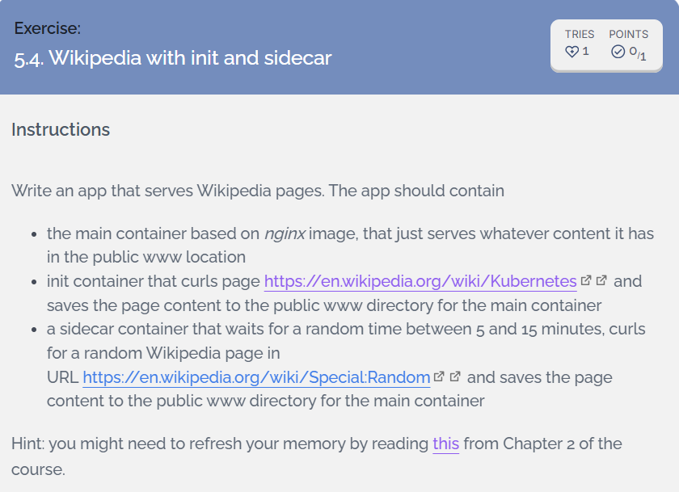
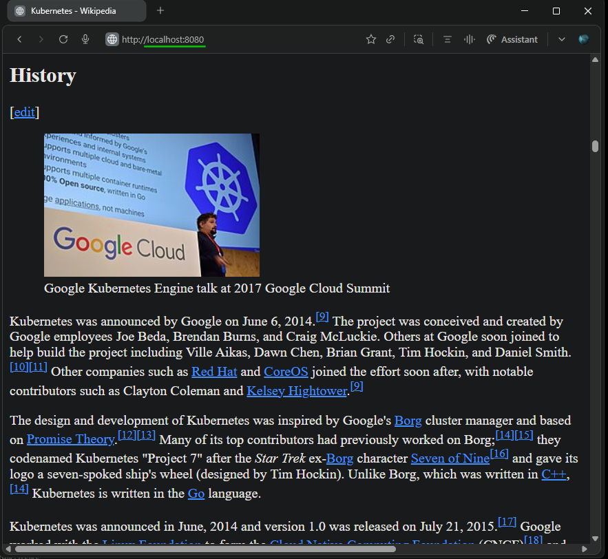
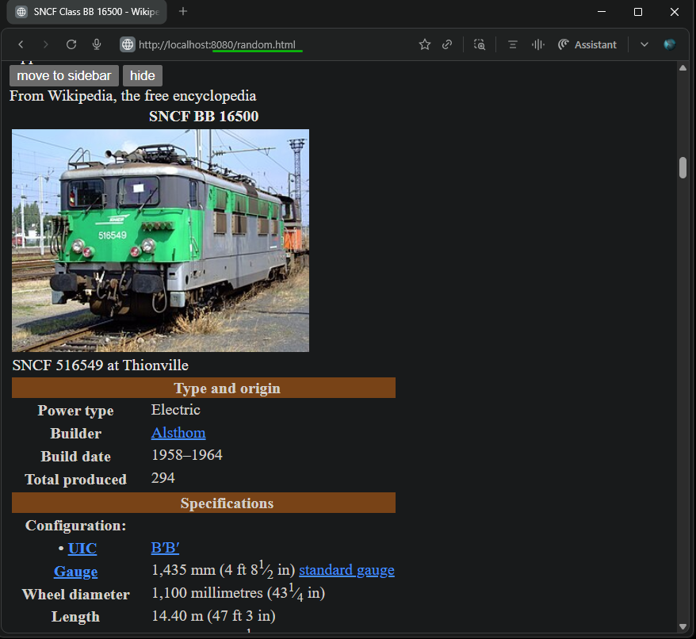
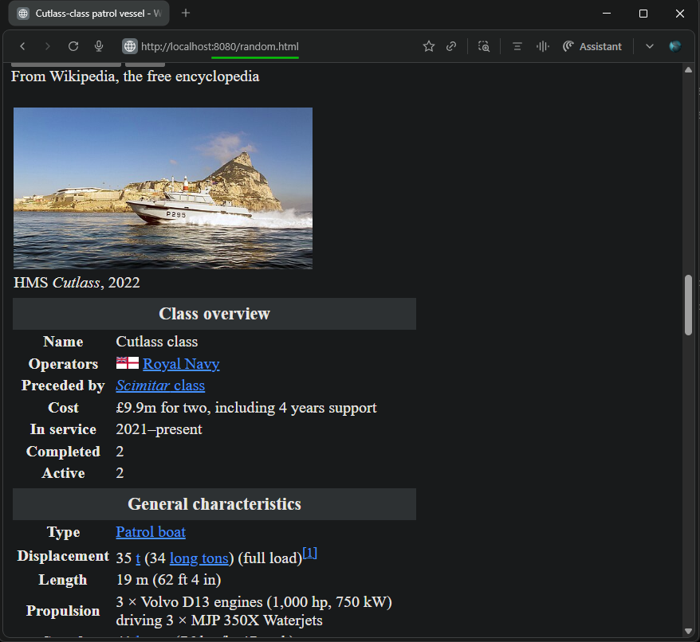

## [Exercise 5.4. Wikipedia with init and sidecar](https://courses.mooc.fi/org/uh-cs/courses/devops-with-kubernetes/chapter-6/service-mesh)

  

---

### 1. Overview:

This implementation uses init containers, sidecar containers, and shared volumes to create a dynamic Wikipedia content server.

- Init Container (`curlimages/curl:8.4.0`): One-time setup, downloads [Kubernetes Wikipedia page](https://en.wikipedia.org/wiki/Kubernetes) and stores in `index.html`
- Sidecar Container (`busybox:1.36`): Long-running companion process, refreshes [random Wikipedia page](https://en.wikipedia.org/wiki/Special:Random) every 5-15 minutes, stores in `random.html`
- Main Container (`nginx:1.27-alpine`): HTTP server (port 80) serves shared volume:
  - `http://localhost:8081/` serves `index.html`
  - `http://localhost:8081/random.html` serves `random.html`

---

### 2. Directory and File Structure

<pre>
apps/wikipedia/                   # Base manifests for wikipedia
├── kustomization.yaml            # Kustomization entry point 
├── namespace.yaml                # Namespace
└── wikipedia-pod.yaml            # Pod definition (init + sidecar + main)

exercises/5.4-init-sidecar/
└── README.md                     # Readme
</pre>

---

### 3. Deploy Application
- Deploy with Kustomize
  ```bash
  kustomize build apps/wikipedia/ | kubectl apply -f -
  # Output
  namespace/exercises created
  pod/wikipedia-pod created
  ```

  - Pod Status: 2/2 Running
    ```bash
    devops-kubernetes [main]$ kubectl -n exercises get pod
    NAME            READY   STATUS    RESTARTS   AGE
    wikipedia-pod   2/2     Running   0          2m38s
    ```
  - Pod Lifecycle Verification  
    - Init Containers: `init-kubernetes-wiki` (curlimages/curl:8.4.0), Completed, index.html (Kubernetes wiki)
    - Main Container: `nginx` (nginx:1.27-alpine), Running, Port 80, /usr/share/nginx/html (shared volume)
    - Sidecar Container: `wiki-refresher` (busybox:1.36), Running, Random 5-15min refresh loop, /shared/random.html  
    - Shared Volume: emptyDir (www-data)
    ```bash
    kubectl -n exercises describe pod
    # Output
    Name:             wikipedia-pod
    Namespace:        exercises
    Priority:         0
    Service Account:  default
    Node:             k3d-dwk-local-agent-1/172.18.0.5
    Start Time:       Sun, 28 Dec 2025 15:58:39 +0530
    Labels:           app=wikipedia
    Annotations:      <none>
    Status:           Running
    IP:               10.42.2.253
    IPs:
      IP:  10.42.2.253
    Init Containers:
      init-kubernetes-wiki:
        Container ID:  containerd://f2d7e2bc80fbac1882074d4041925e6e73028ad5f6383b545489631553320ba8
        Image:         curlimages/curl:8.4.0
        Image ID:      docker.io/curlimages/curl@sha256:4a3396ae573c44932d06ba33f8696db4429c419da87cbdc82965ee96a37dd0af
        Port:          <none>
        Host Port:     <none>
        Command:
          sh
          -c
          curl -s https://en.wikipedia.org/wiki/Kubernetes \
            | sed 's/href="\/wiki\//href="https:\/\/en.wikipedia.org\/wiki\//g' \
            > /shared/index.html

        State:          Terminated
          Reason:       Completed
          Exit Code:    0
          Started:      Sun, 28 Dec 2025 15:58:39 +0530
          Finished:     Sun, 28 Dec 2025 15:58:40 +0530
        Ready:          True
        Restart Count:  0
        Environment:    <none>
        Mounts:
          /shared from www-data (rw)
          /var/run/secrets/kubernetes.io/serviceaccount from kube-api-access-8sdqq (ro)
    Containers:
      nginx:
        Container ID:   containerd://d3174be8219d4c7e00096b9e69db3fd9778c805ae1a6594889a28f0cd841620e
        Image:          nginx:1.27-alpine
        Image ID:       docker.io/library/nginx@sha256:65645c7bb6a0661892a8b03b89d0743208a18dd2f3f17a54ef4b76fb8e2f2a10
        Port:           80/TCP
        Host Port:      0/TCP
        State:          Running
          Started:      Sun, 28 Dec 2025 15:58:41 +0530
        Ready:          True
        Restart Count:  0
        Environment:    <none>
        Mounts:
          /usr/share/nginx/html from www-data (rw)
          /var/run/secrets/kubernetes.io/serviceaccount from kube-api-access-8sdqq (ro)
      wiki-refresher:
        Container ID:  containerd://6e1153a08caec70172f1248a179eafb06f9b495fb039972561c904b37f5446b7
        Image:         busybox:1.36
        Image ID:      docker.io/library/busybox@sha256:6b219909078e3fc93b81f83cb438bd7a5457984a01a478c76fe9777a8c67c39e
        Port:          <none>
        Host Port:     <none>
        Command:
          sh
          -c
          # Initial download
          echo "$(date): Initial random wiki download"
          wget --no-check-certificate -q -O /shared/random.html \
            --header='Accept: text/html' https://en.wikipedia.org/wiki/Special:Random && \
          sed -i 's|href=\"/wiki/|href=\"https://en.wikipedia.org/wiki/|g' /shared/random.html

          # Random 5-15 minutes (300-900 seconds)
          while true; do
            INTERVAL=$((RANDOM % 601 + 300))  # 300-900s = 5-15min
            echo "$(date): Next refresh in ${INTERVAL}s"
            sleep ${INTERVAL}
            echo "$(date): Refreshing random wiki"
            wget --no-check-certificate -q -O /shared/random.html \
              --header='Accept: text/html' https://en.wikipedia.org/wiki/Special:Random && \
            sed -i 's|href=\"/wiki/|href=\"https://en.wikipedia.org/wiki/|g' /shared/random.html
            echo "$(date): Refreshing random wiki done"
          done

        State:          Running
          Started:      Sun, 28 Dec 2025 15:58:41 +0530
        Ready:          True
        Restart Count:  0
        Environment:    <none>
        Mounts:
          /shared from www-data (rw)
          /var/run/secrets/kubernetes.io/serviceaccount from kube-api-access-8sdqq (ro)
    Conditions:
      Type                        Status
      PodReadyToStartContainers   True
      Initialized                 True
      Ready                       True
      ContainersReady             True
      PodScheduled                True
    Volumes:
      www-data:
        Type:       EmptyDir (a temporary directory that shares a pod's lifetime)
        Medium:
        SizeLimit:  <unset>
      kube-api-access-8sdqq:
        Type:                    Projected (a volume that contains injected data from multiple sources)
        TokenExpirationSeconds:  3607
        ConfigMapName:           kube-root-ca.crt
        Optional:                false
        DownwardAPI:             true
    QoS Class:                   BestEffort
    Node-Selectors:              <none>
    Tolerations:                 node.kubernetes.io/not-ready:NoExecute op=Exists for 300s
                                node.kubernetes.io/unreachable:NoExecute op=Exists for 300s
    Events:
      Type    Reason     Age    From               Message
      ----    ------     ----   ----               -------
      Normal  Scheduled  2m57s  default-scheduler  Successfully assigned exercises/wikipedia-pod to k3d-dwk-local-agent-1
      Normal  Pulled     2m57s  kubelet            Container image "curlimages/curl:8.4.0" already present on machine
      Normal  Created    2m57s  kubelet            Created container init-kubernetes-wiki
      Normal  Started    2m56s  kubelet            Started container init-kubernetes-wiki
      Normal  Pulled     2m55s  kubelet            Container image "nginx:1.27-alpine" already present on machine
      Normal  Created    2m55s  kubelet            Created container nginx
      Normal  Started    2m55s  kubelet            Started container nginx
      Normal  Pulled     2m55s  kubelet            Container image "busybox:1.36" already present on machine
      Normal  Created    2m55s  kubelet            Created container wiki-refresher
      Normal  Started    2m55s  kubelet            Started container wiki-refresher
    ```

- Shared Volume Verification: (Identical Across Containers)  
  `index.html`: kubernetes wikipedia [html](https://en.wikipedia.org/wiki/Kubernetes)  
  `random.html`: [Random wikipedia page](https://en.wikipedia.org/wiki/Special:Random)  

  ```bash
  # Nginx container
  kubectl exec wikipedia-pod -n exercises -c nginx -- ls -la /usr/share/nginx/html/
  total 488
  drwxrwxrwx    2 root     root          4096 Dec 28 10:37 .
  drwxr-xr-x    3 root     root          4096 Apr 16  2025 ..
  -rw-r--r--    1 100      nginx       393550 Dec 28 10:28 index.html
  -rw-r--r--    1 root     root         91479 Dec 28 10:37 random.html

  # Sidecar Container
  kubectl exec wikipedia-pod -n exercises -c wiki-refresher -- ls -la /shared/
  # Output
  total 488
  drwxrwxrwx    2 root     root          4096 Dec 28 10:37 .
  drwxr-xr-x    1 root     root          4096 Dec 28 10:28 ..
  -rw-r--r--    1 100      101         393550 Dec 28 10:28 index.html
  -rw-r--r--    1 root     root         91479 Dec 28 10:37 random.html
  ```

- Sidecar Logs (Random 5-15min Intervals)
  ```bash
  kubectl logs -f wikipedia-pod -n exercises -c wiki-refresher
  # Output
  Sun Dec 28 10:28:41 UTC 2025: Initial random wiki download
  Sun Dec 28 10:28:42 UTC 2025: Next refresh in 501s
  Sun Dec 28 10:37:00 UTC 2025: Refreshing random wiki
  Sun Dec 28 10:37:02 UTC 2025: Refreshing random wiki done
  Sun Dec 28 10:37:02 UTC 2025: Next refresh in 309s
  Sun Dec 28 10:42:09 UTC 2025: Refreshing random wiki
  Sun Dec 28 10:42:12 UTC 2025: Refreshing random wiki done
  Sun Dec 28 10:42:12 UTC 2025: Next refresh in 805s
  Sun Dec 28 10:55:31 UTC 2025: Refreshing random wiki
  Sun Dec 28 10:55:32 UTC 2025: Refreshing random wiki done
  Sun Dec 28 10:55:32 UTC 2025: Next refresh in 613s
  Sun Dec 28 11:05:42 UTC 2025: Refreshing random wiki
  Sun Dec 28 11:05:44 UTC 2025: Refreshing random wiki done
  Sun Dec 28 11:05:44 UTC 2025: Next refresh in 674s
  ```
### 4. Applcation Access
- Port-Forward:
  ```bash
  kubectl port-forward pod/wikipedia-pod 8080:80 -n exercises
  # Output
  Forwarding from 127.0.0.1:8080 -> 80
  Forwarding from [::1]:8080 -> 80
  ```
- Kubernetes Wikipedia (Static - Init Container): `http://localhost:8080`  

  

- Random Wikipedia Page #1 (Sidecar Refresh): `http://localhost:8080/random.html`  

  

- Random Wikipedia Page #2 (Different Article): `http://localhost:8080/random.html`  

  


### 5. Clenaup

- Delete Application
  ```bash
  kustomize build apps/wikipedia/ | kubectl delete -f -
  # Output
  namespace "exercises" deleted
  pod "wikipedia-pod" deleted from exercises namespace
  ```

---
