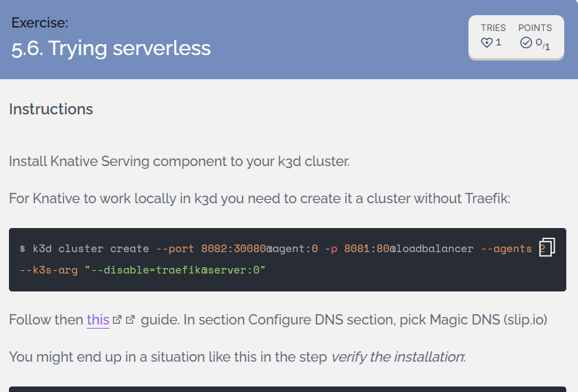
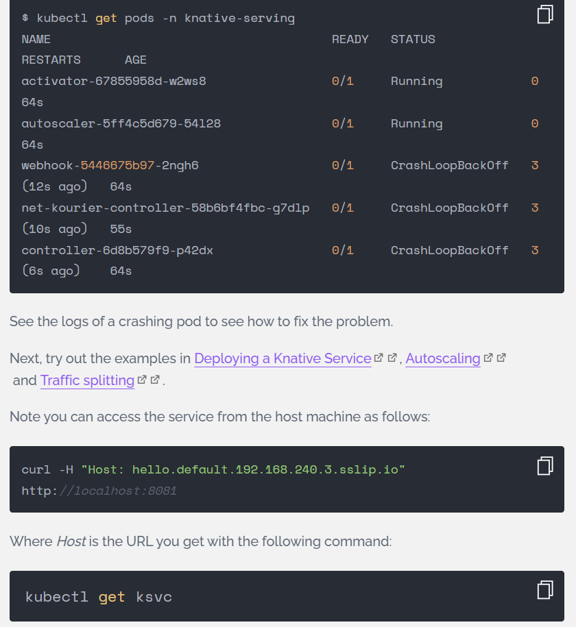

## [Exercise: 5.6. Trying serverless](https://courses.mooc.fi/org/uh-cs/courses/devops-with-kubernetes/chapter-6/beyond-kubernetes)

  
  

---
### 1. Overiew

Knative Serving (Serverless Kubernetes) demonstrates autoscaling, and traffic splitting using Knative on a `k3s v1.32 LTS` cluster.

Official Guides Followed:  
- [Install Knative Serving components](https://knative.dev/docs/install/yaml-install/serving/install-serving-with-yaml/)  
- [Deploy Knative Service](https://knative.dev/docs/getting-started/first-service/)  
- [Autoscaling Demo](https://knative.dev/docs/getting-started/first-autoscale/)  
- [Traffic Splitting](https://knative.dev/docs/getting-started/first-traffic-split/)  


### 2. Knative-Optimized k3d Cluster (No Traefik + Custom Ports):  
```bash
# Knative-specific cluster
k3d cluster create dwk-local \
  --image rancher/k3s:v1.32.0-k3s1 \
  --port '8082:30080@agent:0' \
  --port '8081:80@loadbalancer' \
  --agents 2 \
  --k3s-arg "--disable=traefik@server:0"

# Cluster Verification
kubectl get nodes
# Output
NAME                     STATUS   ROLES                  AGE   VERSION
k3d-dwk-local-agent-0    Ready    <none>                 60s   v1.32.0+k3s1
k3d-dwk-local-agent-1    Ready    <none>                 60s   v1.32.0+k3s1
k3d-dwk-local-server-0   Ready    control-plane,master   63s   v1.32.0+k3s1

# Cluster list
k3d cluster list
# Output
NAME        SERVERS   AGENTS   LOADBALANCER
dwk-local   1/1       2/2      true
```

### 3. [Install Knative Serving components](https://knative.dev/docs/install/yaml-install/serving/install-serving-with-yaml/)

  ```bash
  # Install Knative Serving CRDs
  kubectl apply -f https://github.com/knative/serving/releases/download/knative-v1.20.1/serving-crds.yaml

  # Install the core components of Knative Serving
  kubectl apply -f https://github.com/knative/serving/releases/download/knative-v1.20.1/serving-core.yaml

  # Install the Knative Kourier controller
  kubectl apply -f https://github.com/knative-extensions/net-kourier/releases/download/knative-v1.20.0/kourier.yaml

  # Configure Knative Serving to use Kourier by default:
  kubectl patch configmap/config-network \
    --namespace knative-serving \
    --type merge \
    --patch '{"data":{"ingress-class":"kourier.ingress.networking.knative.dev"}}'

  # Fetch the External IP address or CNAME by running the command:
  kubectl --namespace kourier-system get service kourier
  # Output
  NAME      TYPE           CLUSTER-IP      EXTERNAL-IP                        PORT(S)                      AGE
  kourier   LoadBalancer   10.43.106.249   172.18.0.3,172.18.0.4,172.18.0.5   80:31129/TCP,443:30848/TCP   27s

  # Knative component pods READY and Running
  kubectl get pods -n knative-serving
  # Output
  NAME                                      READY   STATUS    RESTARTS   AGE
  activator-7c67cf64d4-nxjrl                1/1     Running   0          84s
  autoscaler-5564c5c759-gm5kx               1/1     Running   0          84s
  controller-7544bfc5db-xtjn8               1/1     Running   0          84s
  net-kourier-controller-56fbdbc79f-2mmjm   1/1     Running   0          32s
  webhook-5c756fc6c5-lqlgg                  1/1     Running   0          84s
  devops-kubernetes [main]$

  # Configure default-domain that configures Knative Serving to use sslip.io as the default DNS suffix.
  kubectl apply -f https://github.com/knative/serving/releases/download/knative-v1.20.1/serving-default-domain.yaml
  ```

---

### 4. [Deploy Knative Service](https://knative.dev/docs/getting-started/first-service/#deploying-a-knative-service)

  ```bash
  kubectl apply -f ./exercises/5.6-serverless/hello.yaml
  ```

  - Knative Service status
    ```bash
    kubectl get ksvc
    # Output
    NAME    URL                                        LATESTCREATED   LATESTREADY   READY   REASON
    hello   http://hello.default.172.18.0.3.sslip.io   hello-00001     hello-00001   True
    ```
    > Knative generates specific URL per service (172.18.0.3.sslip.io)

  - Kourier LoadBalancer (backing the URL above)
    ```bash
    kubectl get svc kourier -n kourier-system
    # Output
    NAME      TYPE           CLUSTER-IP      EXTERNAL-IP                        PORT(S)                      AGE
    kourier   LoadBalancer   10.43.106.249   172.18.0.2,172.18.0.4,172.18.0.5   80:31129/TCP,443:30848/TCP   12h
    ```
    > Knative exposes service via Kourier LoadBalancer mapped to `localhost:8081`

---

### 5. [Autoscaling Demo](https://knative.dev/docs/getting-started/first-autoscale/)  
- Access Knative Service (Triggers Scale UP)
  ```bash
  curl -H "Host: hello.default.172.18.0.3.sslip.io" http://localhost:8081
  # Output
  Hello World!
  ```

- Monitor autoscaling Lifecycle
  
  ```bash
  kubectl get pod -l serving.knative.dev/service=hello -w
  # Output
  NAME                                     READY   STATUS    RESTARTS   AGE
  hello-00001-deployment-d8bf89ffb-ps5n4   0/2     Pending   0          0s
  hello-00001-deployment-d8bf89ffb-ps5n4   0/2     Pending   0          0s
  hello-00001-deployment-d8bf89ffb-ps5n4   0/2     ContainerCreating   0          0s
  hello-00001-deployment-d8bf89ffb-ps5n4   1/2     Running             0          1s
  hello-00001-deployment-d8bf89ffb-ps5n4   2/2     Running             0          1s
  hello-00001-deployment-d8bf89ffb-ps5n4   2/2     Terminating         0          63s
  hello-00001-deployment-d8bf89ffb-ps5n4   1/2     Terminating         0          91s
  hello-00001-deployment-d8bf89ffb-ps5n4   0/2     Completed           0          93s
  hello-00001-deployment-d8bf89ffb-ps5n4   0/2     Completed           0          94s
  hello-00001-deployment-d8bf89ffb-ps5n4   0/2     Completed           0          94s
  ```
  
  Key Observations:  
  - State Transitions: `Pending > ContainerCreating > Running > Terminating > Completed`  
  - Cold Start: `0/2 Pending > 0/2 ContainerCreating > 1/2 Running > 2/2 Running`  
  - Traffic Window: `2/2 Running` serves requests  
  - Scale-Down: 60s idle → `2/2 Terminating > 0/2 Completed`  


### 6. [Traffic Splitting (Blue/Green)](https://knative.dev/docs/getting-started/first-traffic-split/)

- Create New Revision: Edit [`hello.yaml`](./hello.yaml), Change TARGET="World" to TARGET="Knative"

- Deploy the updated version  
  ```bash
  kubectl apply -f ./exercises/5.6-serverless/hello.yaml
  ```
- Two Revisions Coexist  
  ```bash
  kubectl get revisions
  # Output
  NAME          CONFIG NAME   GENERATION   READY   REASON   ACTUAL REPLICAS   DESIRED REPLICAS
  hello-00001   hello         1            True             0                 0
  hello-00002   hello         2            True             0                 0
  ```
- Single Service to multiplex dual Revisions
  ```bash
  kubectl get ksvc
  # Output
  NAME    URL                                        LATESTCREATED   LATESTREADY   READY   REASON
  hello   http://hello.default.172.18.0.3.sslip.io   hello-00002     hello-00002   True
  ```

- Service Configured to split (50/50) traffic between `hello-00001` and `hello-00002`
  ```
  kubectl describe ksvc hello
  # Output
  Name:         hello
  Namespace:    default
  Labels:       <none>
  Annotations:  serving.knative.dev/creator: system:admin
                serving.knative.dev/lastModifier: system:admin
  API Version:  serving.knative.dev/v1
  Kind:         Service
  Metadata:
    Creation Timestamp:  2025-12-28T14:19:23Z
    Generation:          2
    Resource Version:    7484
    UID:                 162ffd8e-5e03-460a-978b-5e6fae0fab24
  Spec:
    Template:
      Metadata:
        Creation Timestamp:  <nil>
      Spec:
        Container Concurrency:  0
        Containers:
          Env:
            Name:   TARGET
            Value:  Knative
          Image:    ghcr.io/knative/helloworld-go:latest
          Name:     user-container
          Ports:
            Container Port:  8080
            Protocol:        TCP
          Readiness Probe:
            Success Threshold:  1
            Tcp Socket:
              Port:  0
          Resources:
        Enable Service Links:  false
        Timeout Seconds:       300
    Traffic:
      Latest Revision:  true
      Percent:          50
      Latest Revision:  false
      Percent:          50
      Revision Name:    hello-00001
  Status:
    Address:
      URL:  http://hello.default.svc.cluster.local
    Conditions:
      Last Transition Time:        2025-12-28T15:44:10Z
      Status:                      True
      Type:                        ConfigurationsReady
      Last Transition Time:        2025-12-28T15:44:11Z
      Status:                      True
      Type:                        Ready
      Last Transition Time:        2025-12-28T15:44:11Z
      Status:                      True
      Type:                        RoutesReady
    Latest Created Revision Name:  hello-00002
    Latest Ready Revision Name:    hello-00002
    Observed Generation:           2
    Traffic:
      Latest Revision:  true
      Percent:          50
      Revision Name:    hello-00002
      Latest Revision:  false
      Percent:          50
      Revision Name:    hello-00001
    URL:                http://hello.default.172.18.0.3.sslip.io
  Events:
    Type    Reason   Age   From                Message
    ----    ------   ----  ----                -------
    Normal  Created  92m   service-controller  Created Configuration "hello"
    Normal  Created  92m   service-controller  Created Route "hello"
  ```
- Test Traffic Split between revisions  
  ```bash
  curl -H "Host: hello.default.172.18.0.3.sslip.io" http://localhost:8081
  Hello Knative!

  curl -H "Host: hello.default.172.18.0.3.sslip.io" http://localhost:8081
  Hello World!
  
  curl -H "Host: hello.default.172.18.0.3.sslip.io" http://localhost:8081
  Hello Knative!
  
  curl -H "Host: hello.default.172.18.0.3.sslip.io" http://localhost:8081
  Hello World!
  ```

- Two pods sping up - one each for `hello-00002` and `hello-00001`
  ```bash
  kubectl get pod -l serving.knative.dev/service=hello -w
  # Output
  NAME                                      READY   STATUS    RESTARTS   AGE
  hello-00002-deployment-6d57774cc4-2h249   0/2     Pending   0          0s
  hello-00002-deployment-6d57774cc4-2h249   0/2     Pending   0          0s
  hello-00002-deployment-6d57774cc4-2h249   0/2     ContainerCreating   0          0s
  hello-00002-deployment-6d57774cc4-2h249   1/2     Running             0          1s
  hello-00002-deployment-6d57774cc4-2h249   2/2     Running             0          1s
  hello-00001-deployment-d8bf89ffb-xfz6t    0/2     Pending             0          0s
  hello-00001-deployment-d8bf89ffb-xfz6t    0/2     Pending             0          0s
  hello-00001-deployment-d8bf89ffb-xfz6t    0/2     ContainerCreating   0          0s
  hello-00001-deployment-d8bf89ffb-xfz6t    1/2     Running             0          25s
  hello-00001-deployment-d8bf89ffb-xfz6t    2/2     Running             0          25s
  hello-00002-deployment-6d57774cc4-2h249   2/2     Terminating         0          4m5s
  hello-00001-deployment-d8bf89ffb-xfz6t    2/2     Terminating         0          3m48s
  hello-00002-deployment-6d57774cc4-2h249   1/2     Terminating         0          4m31s
  hello-00002-deployment-6d57774cc4-2h249   0/2     Completed           0          4m35s
  hello-00002-deployment-6d57774cc4-2h249   0/2     Completed           0          4m35s
  hello-00002-deployment-6d57774cc4-2h249   0/2     Completed           0          4m35s
  hello-00001-deployment-d8bf89ffb-xfz6t    1/2     Terminating         0          4m14s
  hello-00001-deployment-d8bf89ffb-xfz6t    0/2     Completed           0          4m18s
  hello-00001-deployment-d8bf89ffb-xfz6t    0/2     Completed           0          4m19s
  hello-00001-deployment-d8bf89ffb-xfz6t    0/2     Completed           0          4m19s
  ```

---

### Addendum: Knative Installation Troubleshooting

- Issue: Multiple Knative pods `CrashLoopBackOff`  
  ```bash
  kubectl get pods -n knative-serving -w
  Output:
  NAME                                    READY   STATUS             RESTARTS       AGE
  activator-599666c664-w4pv6              0/1     Running            5 (114s ago)   7m56s
  autoscaler-6d4bd8b6d7-wxpkl             0/1     Running            6 (117s ago)   7m56s
  controller-6fdb4996cd-zfggr             0/1     CrashLoopBackOff   6 (115s ago)   7m56s
  net-kourier-controller-5dc864c5-w58nn   0/1     CrashLoopBackOff   6 (18s ago)    6m38s
  webhook-745dcd59ff-xqqlh                0/1     CrashLoopBackOff   6 (116s ago)   7m56s
  ```
- Root Cause: Kubernetes `1.31.5+k3s1` < Knative minimum requirement `1.32.0`  
  ```bash
  # Autoscaler logs:
  kubectl -n knative-serving logs -f autoscaler-6d4bd8b6d7-wxpkl
  # Output
  2025/12/28 13:14:52 Failed to get k8s version kubernetes version "1.31.5+k3s1" is not compatible, need at least "1.32.0-0" (this can be overridden with the env var "KUBERNETES_MIN_VERSION")

  # Net-kourier-controller logs:
  kubectl -n knative-serving logs -f net-kourier-controller-5dc864c5-w58nn
  # Output
  {"severity":"EMERGENCY","timestamp":"2025-12-28T13:15:49.256771463Z","logger":"net-kourier-controller","caller":"sharedmain/main.go:463","message":"Version check failed","commit":"1848911-dirty","knative.dev/pod":"net-kourier-controller-5dc864c5-w58nn","error":"kubernetes version \"1.31.5+k3s1\" is not compatible, need at least \"1.32.0-0\" (this can be overridden with the env var \"KUBERNETES_MIN_VERSION\")","stacktrace":"knative.dev/pkg/injection/sharedmain.CheckK8sClientMinimumVersionOrDie\n\tknative.dev/pkg@v0.0.0-20251022152246-7bf6febca0b3/injection/sharedmain/main.go:463\nknative.dev/pkg/injection/sharedmain.MainWithConfig\n\tknative.dev/pkg@v0.0.0-20251022152246-7bf6febca0b3/injection/sharedmain/main.go:271\nknative.dev/pkg/injection/sharedmain.MainWithContext\n\tknative.dev/pkg@v0.0.0-20251022152246-7bf6febca0b3/injection/sharedmain/main.go:226\nmain.main\n\tknative.dev/net-kourier/cmd/kourier/main.go:32\nruntime.main\n\truntime/proc.go:285"}

  # Webhook logs: 
  kubectl -n knative-serving logs -f webhook-745dcd59ff-xqqlh
  # Output
  {"severity":"EMERGENCY","timestamp":"2025-12-28T13:16:52.939853724Z","logger":"webhook","caller":"sharedmain/main.go:463","message":"Version check failed","commit":"00d08e7","knative.dev/pod":"webhook-745dcd59ff-xqqlh","error":"kubernetes version \"1.31.5+k3s1\" is not compatible, need at least \"1.32.0-0\" (this can be overridden with the env var \"KUBERNETES_MIN_VERSION\")","stacktrace":"knative.dev/pkg/injection/sharedmain.CheckK8sClientMinimumVersionOrDie\n\tknative.dev/pkg@v0.0.0-20251224022520-6fe064596819/injection/sharedmain/main.go:463\nknative.dev/pkg/injection/sharedmain.MainWithConfig\n\tknative.dev/pkg@v0.0.0-20251224022520-6fe064596819/injection/sharedmain/main.go:271\nknative.dev/pkg/injection/sharedmain.MainWithContext\n\tknative.dev/pkg@v0.0.0-20251224022520-6fe064596819/injection/sharedmain/main.go:226\nmain.main\n\tknative.dev/serving/cmd/webhook/main.go:170\nruntime.main\n\truntime/proc.go:285"}
  ```

  > All components fail identically:    
  >   "error":"kubernetes version \"1.31.5+k3s1\" is not compatible, need at least \"1.32.0-0\"

- Solution: Recreate cluster with Kubernetes `v1.32.0+k3s1`
  ```bash
  k3d cluster create dwk-local \
    --image rancher/k3s:v1.32.0-k3s1 \
    --port '8082:30080@agent:0' \
    --port '8081:80@loadbalancer' \
    --agents 2 \
    --k3s-arg "--disable=traefik@server:0"
  ```

---
