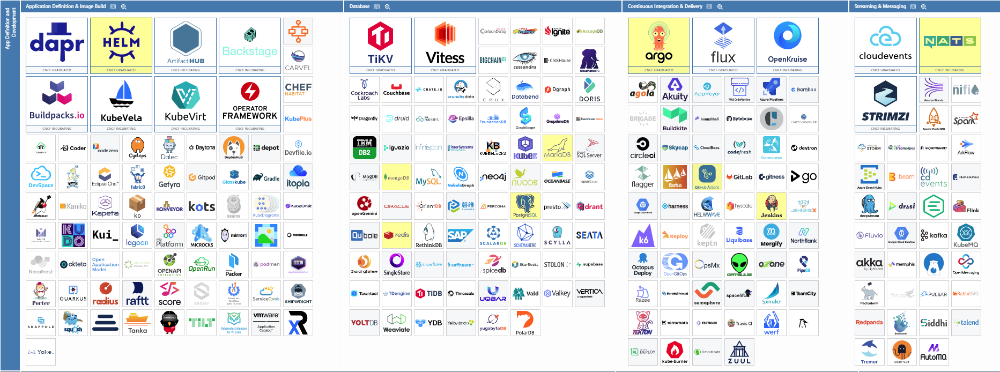
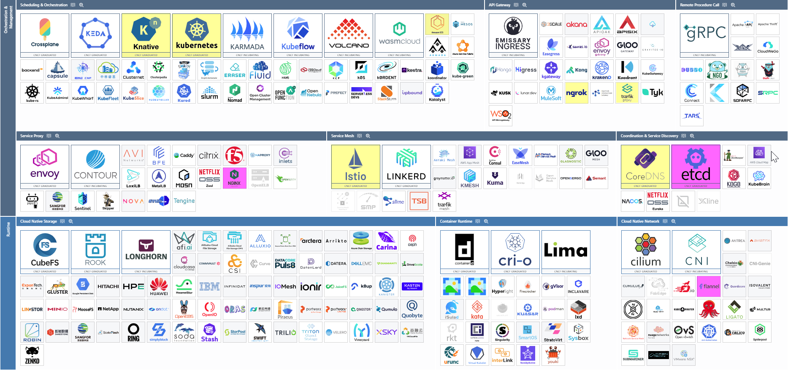
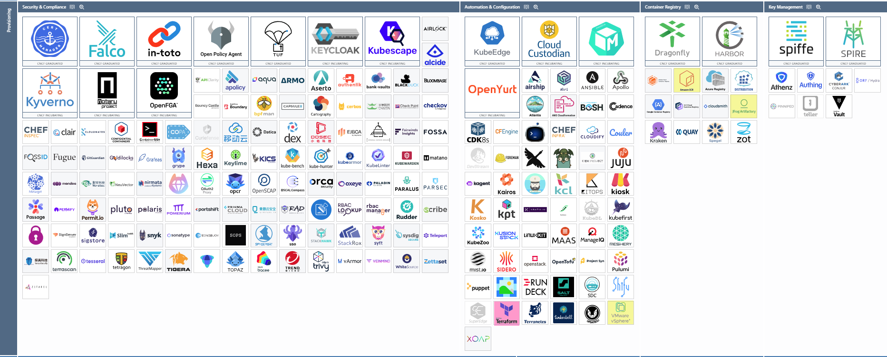
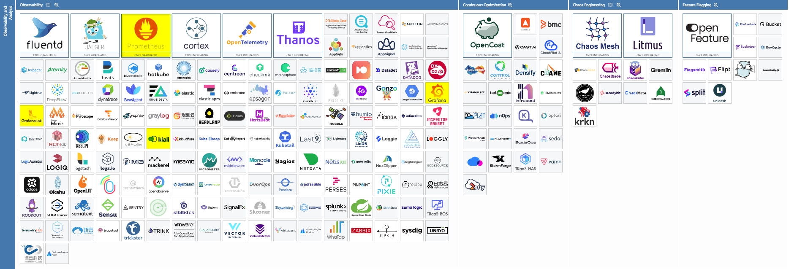

## CNCF Cloud Native Landscape

### Directly Used (Yellow shaded rectangles)
- Kubernetes - Core course platform (k3d/k3s clusters throughout)
- Docker - Containerized apps + local clusters (docker build, Docker Desktop)
- Knative - Ch6/Beyond-Kubernetes (Ex 5.6 serverless, Ex 5.7 deployment)
- Kustomize - Ch4/Deployment-Pipeline (Ex 3.5+ all subsequent exercises)
- Istio - Ch6/Service-Mesh (Ex 5.2, Ex 5.3 Log app Service Mesh)
- ArgoCD - Ch5/GitOps (Ex 4.7-4.10 project steps 24-25, finale)
- CRDs - Ch6/CRDs (Ex 5.1 DIY CRD & Controller)
- Helm - Ch3/Monitoring (Ex 2.10 step 13: Prometheus/Grafana/Loki repos + installs)
- Prometheus - Ch3/Monitoring cluster metrics (Ex 2.10 step 13)
- Grafana - Ch3/Monitoring dashboards (Ex 2.10 step 13)
- Loki - Ch3/Monitoring log aggregation (Ex 2.10 step 13)
- NATS - Ch5/Messaging (Ex 4.6 step 23)
- PostgreSQL - Ch3/StatefulSets+ (Ex 2.7+ ping-pong/todo backend DB)
- GitHub Actions - Ch4/Deployment-Pipeline (Ex 3.6-3.8 CI/CD)
- nginx - Ch6/CRDs (Ex 5.1 DIY controller)
- Traefik CRDs - Ex 4.9 step 25 (IngressRoute/Middleware traffic split)
- Kourier - Ch6/Beyond-Kubernetes (Ex 5.6-5.7 Knative gateway)
- Kiali - Ch-6/service-mesh (Ex: 5.3)

Outside Course:
- VMWare vSphere, Amazon ECR, Amazon ECS, JFrog Artifactory, ngrok, SQL Server, MongoDB, Redis, Jenkins

### Indirect Dependencies (Light-pink shaded rectangles)
- k3s - k3d runtime (cluster engine)
- Flannel - K3s default CNI (pod networking)
- etcd - K3s embedded datastore (cluster state)
- Traefik - K3s default Ingress controller (kube-system/traefik)
- nginx - k3d LoadBalancer (k3d-dwk-local-loadbalancer)
- containerd - K3s CRI (pod/container execution)
- CoreDNS - Cluster DNS resolution (*.svc.cluster.local)
- local-path-provisioner - K3s default StorageClass (PostgreSQL PVCs)
- Alertmanager - Prometheus alerting (kube-prometheus-stack)
- Promtail - Loki log shipper (loki-stack agent)
