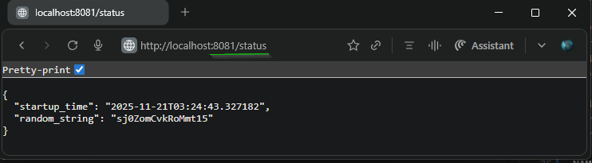

## Exercise 1.7: External Access with Ingress  
### Log Output App Enhancements  

- Built upon the application from [Exercise 1.3: Declarative approach](https://github.com/arkb2023/devops-kubernetes/tree/1.3/log_output).  
- Implemented a [Ingress](./manifests/ingress.yaml) resource to route requests with path prefix `/status` to the `log-output-svc` service on port `2345`.  
- Created the `log-output-svc` [service](./manifests/service.yaml) of type `ClusterIP` on port `2345`, directing traffic to the `log-output` app container listening on port `3000`.  
- **Result**: The `log-output` app endpoint `/status` is accessible externally at `http://localhost:8081/status` via the ingress controller, which acts as a reverse proxy within the cluster.

***


### 1. **Directory and File Structure**
<pre>
log_output
├── Dockerfile
├── README.md
├── log_output.py
└── manifests
    ├── deployment.yaml
    ├── ingress.yaml
    └── service.yaml
</pre>

***

### 2. Prerequisites
- Docker, k3d, kubectl installed

### 3. Build and Push the Docker Image to DockerHub

```bash
docker build -t arkb2023/log-output:1.7.2 .
docker push arkb2023/log-output:1.7.2
```
> Docker image published at: https://hub.docker.com/repository/docker/arkb2023/log-output/tags/1.7.2

### 4. **Deploy to Kubernetes**

**Create cluster**

```bash
k3d cluster create --port 8082:30080@agent:0 -p 8081:80@loadbalancer --agents 2
```

Where,  

`--port 8082:30080@agent:0`: Exposes host port 8082 mapped to port 30080 on the first agent node, allowing access through `localhost:8082`.

`-p 8081:80@loadbalancer`: Exposes host port 8081 mapped to the load balancer's port 80.

---

**Apply the `Deployment` `Service` and `Ingress` Manifests**
```bash
kubectl apply -f manifests/
```
*Output*
```text
deployment.apps/log-output-dep created
ingress.networking.k8s.io/dwk-ingress created
service/log-output-svc created
```

**Verify that the manifests are operational**
```bash
kubectl get deploy,svc,ing
```
*Output*
```text
NAME                             READY   UP-TO-DATE   AVAILABLE   AGE
deployment.apps/log-output-dep   1/1     1            1           99m

NAME                     TYPE        CLUSTER-IP      EXTERNAL-IP   PORT(S)    AGE
service/kubernetes       ClusterIP   10.43.0.1       <none>        443/TCP    100m
service/log-output-svc   ClusterIP   10.43.211.233   <none>        2345/TCP   99m

NAME                                    CLASS     HOSTS   ADDRESS                            PORTS   AGE
ingress.networking.k8s.io/dwk-ingress   traefik   *       172.18.0.3,172.18.0.4,172.18.0.5   80      99m
```

**Inspect Pod logs for application readiness**
```bash
kubectl logs -f log-output-dep-74bbd57c65-xjgqd
```
*Output*
```text
INFO:     Started server process [7]
INFO:     Waiting for application startup.
INFO:     Application startup complete.
INFO:     Uvicorn running on http://0.0.0.0:3000 (Press CTRL+C to quit)
INFO:     10.42.2.4:46088 - "GET /status HTTP/1.1" 200 OK
INFO:     10.42.2.4:36226 - "GET /status HTTP/1.1" 200 OK
```

### 5. Verify Application Endpoint Response  
Access the application endpoint in a browser at: `http://localhost:8081/status`  
 

### 6. **Cleanup**

**Delete the `Deployment` `Service` and `Ingress` Resources**  

```bash
kubectl delete -f manifests/
```
*Output*
```text
deployment.apps "log-output-dep" deleted from default namespace
ingress.networking.k8s.io "dwk-ingress" deleted from default namespace
service "log-output-svc" deleted from default namespace
```

**Stop the k3d Cluster**  
```bash
k3d cluster delete k3s-default
```
*Output*
```text
INFO[0000] Deleting cluster 'k3s-default'
INFO[0003] Deleting cluster network 'k3d-k3s-default'
INFO[0003] Deleting 1 attached volumes...
INFO[0003] Removing cluster details from default kubeconfig...
INFO[0003] Removing standalone kubeconfig file (if there is one)...
INFO[0003] Successfully deleted cluster k3s-default!
```
---