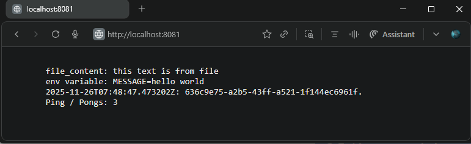

## Exercise 2.5: Documentation and ConfigMaps

### Objective  
Create a ConfigMap for the "Log output" application that defines one file `information.txt` and one environment variable `MESSAGE`.

### Resources  
- [`configmap.yaml`](./manifests/configmap.yaml) defines:  
  - ConfigMap named `log-output-config`  
  - Data includes the file `information.txt` and environment variable `MESSAGE` in key-value format with the required contents.

- [`deployment.yaml`](./manifests/deployment.yaml) specifications enhanced to:  
  - Add volume `config-volume` sourced from ConfigMap `log-output-config`  
  - Mount `config-volume` into the Pod’s `log-reader` container at path `/app/config`  
  - Inject `MESSAGE` from the ConfigMap as an environment variable into `log-reader` container  
  - Map ConfigMap key `information.txt` to the volume mount as a file

### Application Updates  
- **Log Output Application:**  
  On receiving a `GET /` request, the app:  
  - Reads contents from the mounted file `/app/config/information.txt`  
  - Accesses the environment variable `MESSAGE`  
  - Fetches the current pong count from the `Ping Pong` app  
  - Generates a timestamp and random UUID string  
  - Combines and returns this information in the HTTP response in the following format:

    ```text
    file content: this text is from file
    env variable: MESSAGE=hello world
    2024-03-30T12:15:17.705Z: 8523ecb1-c716-4cb6-a044-b9e83bb98e43.
    Ping / Pongs: 3
    ```

### Base Application Versions Used  
- [Log output v2.1](https://github.com/arkb2023/devops-kubernetes/tree/2.1/log_output)  
- [Ping pong v2.1](https://github.com/arkb2023/devops-kubernetes/tree/2.1/ping-pong)

***

### 1. **Directory and File Structure**
<pre>
├── log_output
│   ├── README.md
│   ├── manifests
│   │   ├── configmap.yaml
│   │   ├── deployment.yaml
│   │   ├── ingress.yaml
│   │   └── service.yaml
│   └── reader
│       ├── Dockerfile
│       └── reader.py
├── ping-pong
│   ├── Dockerfile
│   ├── README.md
│   ├── manifests
│   │   ├── deployment.yaml
│   │   ├── ingress.yaml
│   │   └── service.yaml
│   └── pingpong.py
</pre>

***


### 2. Prerequisites

- Ensure the following tools are installed:
  - Docker  
  - k3d (K3s in Docker)  
  - kubectl (Kubernetes CLI)
- Create and run a Kubernetes cluster with k3d, using 2 agent nodes and port mapping to expose the ingress load balancer on host port 8081:
    ```bash
    k3d cluster create mycluster --agents 2 --port 8081:80@loadbalancer
    ```
  - `exercises` namespace created and configured in the cluster
    ```bash
    kubectl create namespace exercises
    ```

***

### 3. Build and Push the Docker Image to DockerHub

```bash
cd log_output/reader/
docker build -t arkb2023/log-reader:2.5.1 .
docker push arkb2023/log-reader:2.5.1
```
> Docker images are published at:  
https://hub.docker.com/repository/docker/arkb2023/log-reader/tags/2.5.1  
https://hub.docker.com/repository/docker/arkb2023/ping-pong/tags/2.1  


### 4. **Deploy to Kubernetes**

**Apply the `log-output` and `ping-pong` application manifests to the `exercises` namespace:**

```bash
kubectl apply \
  -f log_output/manifests/ \
  -f ping-pong/manifests/ \
  -n exercises
```
*Output*
```text
configmap/log-output-config created
deployment.apps/log-output-dep created
ingress.networking.k8s.io/dwk-log-output-ingress created
service/log-output-svc created
deployment.apps/ping-pong-dep created
ingress.networking.k8s.io/dwk-ping-pong-ingress created
service/ping-pong-svc created
```

### Verify Both Pods Are Running

```bash
kubectl get pods -n exercises
```

*Output:*
```text
NAME                             READY   STATUS    RESTARTS   AGE
log-output-dep-cf8488db5-4967j   1/1     Running   0          69m
ping-pong-dep-57d7c4b697-s4nv8   1/1     Running   0          66m
```

### Verify ConfigMap Data is Successfully Mounted

List files in the mounted ConfigMap volume inside the `log-reader` container:

```bash
kubectl -n exercises exec -it log-output-dep-cf8488db5-4967j -c log-reader -- ls -l /app/config/
```

*Output:*
```text
total 0
lrwxrwxrwx 1 root root 22 Nov 26 07:26 information.txt -> ..data/information.txt
```

Display contents of the `information.txt` file:

```bash
kubectl -n exercises exec -it log-output-dep-cf8488db5-4967j -c log-reader -- cat /app/config/information.txt
```

*Output:*
```text
this text is from file
```

Verify the environment variable `MESSAGE` inside the container:

```bash
kubectl -n exercises exec -it log-output-dep-cf8488db5-4967j -c log-reader -- printenv | grep MESSAGE
```

*Output:*
```text
MESSAGE=hello world
```

***

### 5. Validate

- Access the application via URL: `http://localhost:8081`

- The browser displays the application response in the required format:

  

### 6. **Cleanup**

**Delete the `log-output` and `ping-pong` application manifests from the `exercises` namespace:**

```bash
kubectl delete \
  -f ./log_output/manifests/ \
  -f ./ping-pong/manifests/ \
  -n exercises
```
*Output*
```text
configmap "log-output-config" deleted from exercises namespace
deployment.apps "log-output-dep" deleted from exercises namespace
ingress.networking.k8s.io "dwk-log-output-ingress" deleted from exercises namespace
service "log-output-svc" deleted from exercises namespace
deployment.apps "ping-pong-dep" deleted from exercises namespace
ingress.networking.k8s.io "dwk-ping-pong-ingress" deleted from exercises namespace
service "ping-pong-svc" deleted from exercises namespace
```

---
