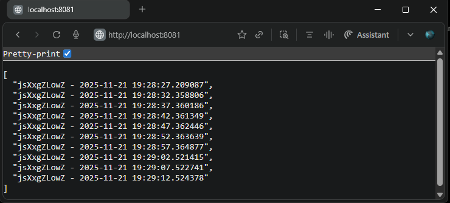

## Exercise 1.10. Even more services  
### Log Output App Enhancements  

- Built upon the application from [Exercise 1.7: External Access with Ingress](https://github.com/arkb2023/devops-kubernetes/tree/1.7/log_output).  
- Log Output application is now split into two separate containers/apps:  
    - [generator.py](./generator/generator.py):  
      Periodically writes a random string and timestamp every 5 seconds into a shared file at `/usr/src/app/files/output.log`  
    - [reader.py](./reader/reader.py):  
      Serves HTTP GET requests by reading and responding with the content of the shared log file.  
    - Each app has its own Dockerfile for independent building:  
        - [Dockerfile for Generator app](./generator/Dockerfile)
        - [Dockerfile for Reader app](./reader/Dockerfile)
- [deployment.yaml](./manifests/deployment.yaml): Defines a single deployment where both containers run inside the same pod. An `emptyDir` volume named `shared-image` is mounted on `/usr/src/app/files` inside both containers, enabling file sharing.
- **Result**: The `log-reader` app responds successfully to GET requests at `http://localhost:8081/` by returning the contents of the shared log file generated by the `log-generator` app.

***


### 1. **Directory and File Structure**
<pre>
log_output
├── README.md
├── generator
│   ├── Dockerfile
│   ├── generator.py
├── manifests
│   ├── deployment.yaml
│   ├── ingress.yaml
│   └── service.yaml
└── reader
    ├── Dockerfile
    └── reader.py
</pre>

***

### 2. Prerequisites
- Docker, k3d, kubectl installed

### 3. Build and Push the Docker Image to DockerHub

```bash
docker build -t arkb2023/log-generator:1.10.2 ./log_output/generator/
docker build -t arkb2023/log-reader:1.10.3 ./log_output/reader/

docker push arkb2023/log-generator:1.10.2
docker push arkb2023/log-reader:1.10.3
```
> Docker images are published at:  
https://hub.docker.com/repository/docker/arkb2023/log-generator/tags/1.10.2  
https://hub.docker.com/repository/docker/arkb2023/log-reader/tags/1.10.3

### 4. **Deploy to Kubernetes**

**Create cluster**

```bash
k3d cluster create --port 8082:30080@agent:0 -p 8081:80@loadbalancer --agents 2
```

**Apply the `Deployment` `Service` and `Ingress` Manifests**
```bash
kubectl create -f ./log_output/manifests
```
*Output*
```text
deployment.apps/log-output-dep created
ingress.networking.k8s.io/dwk-log-output-ingress created
service/log-output-svc created
```

**Verify that the manifests are operational**
```bash
kubectl get deploy,svc,ing
```
*Output*
```text
NAME                             READY   UP-TO-DATE   AVAILABLE   AGE
deployment.apps/log-output-dep   0/1     1            0           12s

NAME                     TYPE        CLUSTER-IP    EXTERNAL-IP   PORT(S)    AGE
service/kubernetes       ClusterIP   10.43.0.1     <none>        443/TCP    144m
service/log-output-svc   ClusterIP   10.43.20.45   <none>        2345/TCP   12s

NAME                                               CLASS     HOSTS   ADDRESS                            PORTS   AGE
ingress.networking.k8s.io/dwk-log-output-ingress   traefik   *       172.18.0.3,172.18.0.4,172.18.0.5   80      12s
```
**Inspect Log Generator container logs on the Pod for application readiness**  
```bash
kubectl logs log-output-dep-5898d5f955-hbbnz -c log-generator
```  
*Output*  
```text
INFO:     Started server process [7]
INFO:     Waiting for application startup.
DEBUG:generator:Startup event triggered with random_string: jsXxgZLowZ
DEBUG:generator:Log file path: /usr/src/app/files/output.log
DEBUG:generator:write_logs task created
DEBUG:generator:Writing log entry
DEBUG:generator:Log written: jsXxgZLowZ - 2025-11-21 19:28:27.209087
INFO:     Application startup complete.
INFO:     Uvicorn running on http://0.0.0.0:3001 (Press CTRL+C to quit)
DEBUG:generator:Writing log entry
DEBUG:generator:Log written: jsXxgZLowZ - 2025-11-21 19:28:32.358806
DEBUG:generator:Writing log entry
DEBUG:generator:Log written: jsXxgZLowZ - 2025-11-21 19:28:37.360186
DEBUG:generator:Writing log entry
DEBUG:generator:Log written: jsXxgZLowZ - 2025-11-21 19:28:42.361349
DEBUG:generator:Writing log entry
DEBUG:generator:Log written: jsXxgZLowZ - 2025-11-21 19:28:47.362446
DEBUG:generator:Writing log entry
DEBUG:generator:Log written: jsXxgZLowZ - 2025-11-21 19:28:52.363639
```

**Inspect Log Reader container logs on the Pod for application readiness**  
```bash
kubectl logs log-output-dep-5898d5f955-hbbnz -c log-reader
```  
*Output*  
```text
DEBUG:reader:Log file path: /usr/src/app/files/output.log
INFO:     Started server process [7]
INFO:     Waiting for application startup.
INFO:     Application startup complete.
INFO:     Uvicorn running on http://0.0.0.0:3000 (Press CTRL+C to quit)
DEBUG: Request received at 2025-11-21T19:28:59.389865
DEBUG: Successfully read 280 bytes from /usr/src/app/files/output.log
INFO:     10.42.0.4:34910 - "GET / HTTP/1.1" 200 OK
DEBUG: Request received at 2025-11-21T19:29:16.663380
DEBUG: Successfully read 400 bytes from /usr/src/app/files/output.log
INFO:     10.42.0.4:47004 - "GET / HTTP/1.1" 200 OK
```


### 5. Verify Application Endpoint Response  
Access the application endpoint in a browser at: `http://localhost:8081`  
 

### 6. **Cleanup**

**Delete the `Deployment` `Service` and `Ingress` Resources**  

```bash
kubectl delete -f manifests/
```
*Output*
```text
deployment.apps "log-output-dep" deleted from default namespace
ingress.networking.k8s.io "dwk-log-output-ingress" deleted from default namespace
service "log-output-svc" deleted from default namespace
```

**Stop the k3d Cluster**  
```bash
k3d cluster delete k3s-default
```
*Output*
```text
INFO[0000] Deleting cluster 'k3s-default'
INFO[0003] Deleting cluster network 'k3d-k3s-default'
INFO[0003] Deleting 1 attached volumes...
INFO[0003] Removing cluster details from default kubeconfig...
INFO[0003] Removing standalone kubeconfig file (if there is one)...
INFO[0003] Successfully deleted cluster k3s-default!
```
---