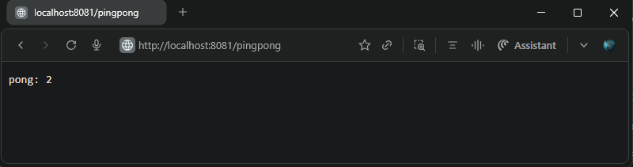
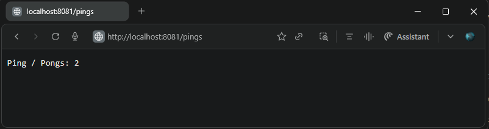
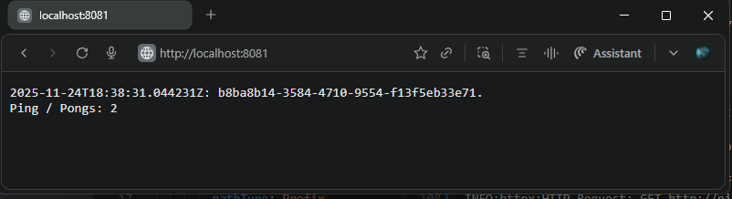

## Exercise 2.1. Connecting pods  
### Transitions the `Log Output` and `Ping Pong` applications from file-based data sharing via persistent volumes to HTTP-based inter-application communication.

**Volume Resources**  
The previously shared `persistent volume` and `persistent volume claim` used for data exchange between the two applications have been removed.

**Application Updates**  
- `Log Output` Application  
  - Enhanced to perform an HTTP GET request to the `Ping Pong` application’s `/pings` endpoint via the service URL `http://ping-pong-svc:3456/pings`  
  - On receiving a `GET /` request, the app fetches the current pong count from the `Ping Pong` app, generates a timestamp and a random UUID string, then combines and returns this information as the HTTP response.  
- `Ping Pong` Application  
  - Supports two HTTP GET endpoints:  
    - `GET /pingpong`: Increments the ping count and responds with `Pong`  
    - `GET /pings`: Returns the current `ping request count`  
- Base application versions used:  
  - [Log output v1.11](https://github.com/arkb2023/devops-kubernetes/tree/1.11/log_output)  
  - [Ping pong v1.11](https://github.com/arkb2023/devops-kubernetes/tree/1.11/ping-pong)  

***

### 1. **Directory and File Structure**
<pre>
├── log_output
│   ├── README.md
│   ├── manifests
│   │   ├── deployment.yaml
│   │   ├── ingress.yaml
│   │   └── service.yaml
│   └── reader
│       ├── Dockerfile
│       └── reader.py
├── ping-pong
│   ├── Dockerfile
│   ├── README.md
│   ├── manifests
│   │   ├── deployment.yaml
│   │   ├── ingress.yaml
│   │   └── service.yaml
│   └── pingpong.py
</pre>

***


### 2. Prerequisites
- Docker, k3d, kubectl installed

### 3. Build and Push the Docker Image to DockerHub

```bash
docker build -t arkb2023/log-reader:2.2 ./log_output/reader/
docker build -t arkb2023/ping-pong:2.1 ./ping-pong/

docker push arkb2023/log-reader:2.2
docker push arkb2023/ping-pong:2.1
```
> Docker images are published at:  
https://hub.docker.com/repository/docker/arkb2023/ping-pong/tags/2.1  
https://hub.docker.com/repository/docker/arkb2023/log-reader/tags/2.2  

### 4. **Deploy to Kubernetes**

**Create cluster**

```bash
k3d cluster create --port 8081:80@loadbalancer --agents 2
```

**Apply the `Deployment` `Service` and `Ingress` Manifests**  

```bash
kubectl apply \
  -f ./log_output/manifests/deployment.yaml \
  -f ./log_output/manifests/ingress.yaml \
  -f ./log_output/manifests/service.yaml \
  -f ./ping-pong/manifests/deployment.yaml \
  -f ./ping-pong/manifests/service.yaml \
  -f ./ping-pong/manifests/ingress.yaml
```
*Output*
```text
deployment.apps/log-output-dep configured
ingress.networking.k8s.io/dwk-log-output-ingress unchanged
service/log-output-svc unchanged
deployment.apps/ping-pong-dep unchanged
service/ping-pong-svc unchanged
ingress.networking.k8s.io/dwk-ping-pong-ingress unchanged
```

**Verify Both Pods Are Running**  
```bash
kubectl get pods
```
*Output*
```text
NAME                             READY   STATUS    RESTARTS   AGE
log-output-dep-5b745db5b-cnd9c   1/1     Running   0          4m41s
ping-pong-dep-6fbc7f5c6d-tpp57   1/1     Running   0          4m41s
```

### 5. Validate Inter-App HTTP Request/Response

- **GET /pingpong — Ping Pong app increments ping count and replies with "Pong".**

  - Examining `ping pong` application logs confirms receipt of `GET /pingpong` requests with `200 OK` responses:

    ```bash
    kubectl logs -f ping-pong-dep-6fbc7f5c6d-tpp57
    ```

    **Output:**

    ```text
    INFO:     10.42.0.4:57812 - "GET /pingpong HTTP/1.1" 200 OK
    ```

  - Browser access to `/pingpong` endpoint displays response indicating the incremented ping count.  
      

- **GET /pings — Ping Pong app returns the current pong count.**

  - `Ping pong` application logs show handling of `GET /pings` requests with successful `200 OK` responses:

    ```bash
    kubectl logs -f ping-pong-dep-6fbc7f5c6d-tpp57
    ```

    **Output:**

    ```text
    INFO:     10.42.0.24:43580 - "GET /pings HTTP/1.1" 200 OK
    ```

  - Browser access to `/pings` endpoint returns the current pong count as expected.  
      
    

- **GET / — Log Output app responds with timestamp, unique ID, and pong count retrieved from Ping Pong app.**

  - `Log Output` app logs confirm it makes HTTP GET requests to the Ping Pong app service URL `http://ping-pong-svc:3456/pings` and receives `200 OK` responses:

    ```bash
    kubectl logs -f log-output-dep-5b745db5b-cnd9c
    ```

    **Output:**

    ```text
    INFO:httpx:HTTP Request: GET http://ping-pong-svc:3456/pings "HTTP/1.1 200 OK"
    INFO:     10.42.0.4:57512 - "GET / HTTP/1.1" 200 OK
    ```

  - Corresponding `Ping Pong` app logs verify these requests from `log-output` pod:

    ```bash
    kubectl logs -f ping-pong-dep-6fbc7f5c6d-tpp57
    ```

    **Output:**

    ```text
    INFO:     10.42.0.24:43580 - "GET /pings HTTP/1.1" 200 OK
    ```

  - External browser accessing the Log Output app’s `/` endpoint receives a response combining timestamp, unique ID, and the current pong count, verifying inter-app communication works as expected.  
      
    

### 6. **Cleanup**

**Delete the `Deployment` `Service` and `Ingress` Manifests** 
```bash
kubectl delete \
  -f ./log_output/manifests/deployment.yaml \
  -f ./log_output/manifests/ingress.yaml \
  -f ./log_output/manifests/service.yaml \
  -f ./ping-pong/manifests/deployment.yaml \
  -f ./ping-pong/manifests/service.yaml \
  -f ./ping-pong/manifests/ingress.yaml
```
*Output*
```text
deployment.apps "log-output-dep" deleted from default namespace
ingress.networking.k8s.io "dwk-log-output-ingress" deleted from default namespace
service "log-output-svc" deleted from default namespace
deployment.apps "ping-pong-dep" deleted from default namespace
service "ping-pong-svc" deleted from default namespace
ingress.networking.k8s.io "dwk-ping-pong-ingress" deleted from default namespace
```

**Stop the k3d Cluster**  
```bash
k3d cluster delete k3s-default
```
*Output*
```text
INFO[0000] Deleting cluster 'k3s-default'
INFO[0003] Deleting cluster network 'k3d-k3s-default'
INFO[0003] Deleting 1 attached volumes...
INFO[0003] Removing cluster details from default kubeconfig...
INFO[0003] Removing standalone kubeconfig file (if there is one)...
INFO[0003] Successfully deleted cluster k3s-default!
```

---
