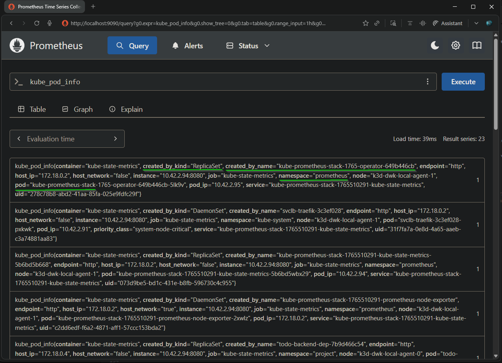
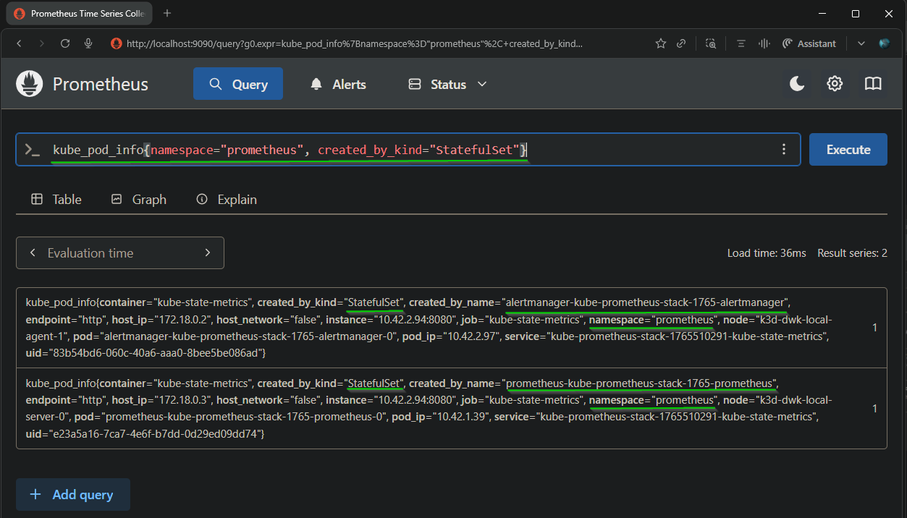
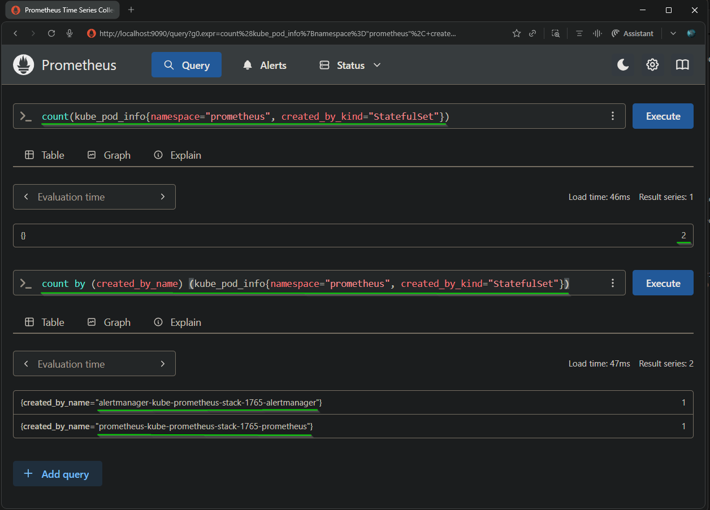

## Exercise: 4.3. Prometheus

**Goal**: Query Prometheus for the number of pods created by StatefulSets in the `prometheus` namespace using `kube_pod_info`.

**Base Application:**  
    [the_project v2.10](https://github.com/arkb2023/devops-kubernetes/blob/2.10/the_project)

## Cluster and stack setup

- Kubernetes environment: k3d `dwk-local` (server + agents).  
- Monitoring stack: Installed `kube-prometheus-stack` via Helm in namespace `prometheus`.
- Helm version v3.19.2

## Steps performed

- AddHelm repos - `prometheus-community` and `grafana`:  
    ```bash
    helm repo add prometheus-community https://prometheus-community.github.io/helm-charts
    helm repo add grafana https://grafana.github.io/helm-charts
    helm repo update
    ```
-  Download charts catalog:  
    ```bash
    helm repo update
    ```
    Output:  
    ```text
    Hang tight while we grab the latest from your chart repositories...
    ...Successfully got an update from the "grafana" chart repository
    ...Successfully got an update from the "prometheus-community" chart repository
    ...Successfully got an update from the "stable" chart repository
    ...Successfully got an update from the "bitnami" chart repository
    Update Complete. ⎈Happy Helming!⎈
    ```
- Create namespace `prometheus`:  
    ```bash
    kubectl create namespace prometheus
    ```
    Output:  
    ```text
    namespace/prometheus created
    ```
- Deploy the charts:
    ```bash
    helm install prometheus-community/kube-prometheus-stack --generate-name --namespace prometheus
    ```
    Output:  
    ```text
    NAME: kube-prometheus-stack-1765510291
    LAST DEPLOYED: Fri Dec 12 09:01:53 2025
    NAMESPACE: prometheus
    STATUS: deployed
    REVISION: 1
    NOTES:
    kube-prometheus-stack has been installed. Check its status by running:
    kubectl --namespace prometheus get pods -l "release=kube-prometheus-stack-1765510291"

    Get Grafana 'admin' user password by running:

    kubectl --namespace prometheus get secrets kube-prometheus-stack-1765510291-grafana -o jsonpath="{.data.admin-password}" | base64 -d ; echo

    Access Grafana local instance:

    export POD_NAME=$(kubectl --namespace prometheus get pod -l "app.kubernetes.io/name=grafana,app.kubernetes.io/instance=kube-prometheus-stack-1765510291" -oname)
    kubectl --namespace prometheus port-forward $POD_NAME 3000

    Get your grafana admin user password by running:

    kubectl get secret --namespace prometheus -l app.kubernetes.io/component=admin-secret -o jsonpath="{.items[0].data.admin-password}" | base64 --decode ; echo


    Visit https://github.com/prometheus-operator/kube-prometheus for instructions on how to create & configure Alertmanager and Prometheus instances using the Operator.
    ```

- Verify pods:  
    ```bash
    kubectl -n prometheus get pods
    ```
    Output:  
    ```text
    NAME                                                              READY   STATUS    RESTARTS   AGE
    alertmanager-kube-prometheus-stack-1765-alertmanager-0            2/2     Running   0          2m2s
    kube-prometheus-stack-1765-operator-649b446cb-5lk9v               1/1     Running   0          2m15s
    kube-prometheus-stack-1765510291-grafana-5cdc4c5ddd-l9kc9         3/3     Running   0          2m15s
    kube-prometheus-stack-1765510291-kube-state-metrics-5b6bd5wbx29   1/1     Running   0          2m15s
    kube-prometheus-stack-1765510291-prometheus-node-exporter-2xwlz   1/1     Running   0          2m15s
    kube-prometheus-stack-1765510291-prometheus-node-exporter-dncjb   1/1     Running   0          2m15s
    kube-prometheus-stack-1765510291-prometheus-node-exporter-svzqn   1/1     Running   0          2m15s
    prometheus-kube-prometheus-stack-1765-prometheus-0                2/2     Running   0          2m2s
    ```
- Verify Services:  
    ```bash
    kubectl -n prometheus get svc
    ```
    Output:  
    ```text
    NAME                                                        TYPE        CLUSTER-IP      EXTERNAL-IP   PORT(S)                      AGE
    alertmanager-operated                                       ClusterIP   None            <none>        9093/TCP,9094/TCP,9094/UDP   49m
    kube-prometheus-stack-1765-alertmanager                     ClusterIP   10.43.235.208   <none>        9093/TCP,8080/TCP            50m
    kube-prometheus-stack-1765-operator                         ClusterIP   10.43.230.135   <none>        443/TCP                      50m
    kube-prometheus-stack-1765-prometheus                       ClusterIP   10.43.39.183    <none>        9090/TCP,8080/TCP            50m
    kube-prometheus-stack-1765510291-grafana                    ClusterIP   10.43.49.53     <none>        80/TCP                       50m
    kube-prometheus-stack-1765510291-kube-state-metrics         ClusterIP   10.43.106.129   <none>        8080/TCP                     50m
    kube-prometheus-stack-1765510291-prometheus-node-exporter   ClusterIP   10.43.194.187   <none>        9100/TCP                     50m
    prometheus-operated                                         ClusterIP   None            <none>        9090/TCP                     49m
    ```

- Verify StatefulSets:  
    ```bash
    kubectl -n prometheus get sts -o wide
    ```
    Output:  
    ```text
    NAME                                                   READY   AGE   CONTAINERS                     IMAGES
    alertmanager-kube-prometheus-stack-1765-alertmanager   1/1     48m   alertmanager,config-reloader   quay.io/prometheus/alertmanager:v0.29.0,quay.io/prometheus-operator/prometheus-config-reloader:v0.87.1
    prometheus-kube-prometheus-stack-1765-prometheus       1/1     48m   prometheus,config-reloader     quay.io/prometheus/prometheus:v3.8.0,quay.io/prometheus-operator/prometheus-config-reloader:v0.87.1
    ```

- Expose Prometheus UI:  
    ```bash
    kubectl -n prometheus port-forward prometheus-kube-prometheus-stack-1765-prometheus-0 9090:9090
    ```
    Output:  
    ```text
    Forwarding from 127.0.0.1:9090 -> 9090
    Forwarding from [::1]:9090 -> 9090
    ```

## PromQL queries and observations

- Base metric inspection:  
  - Query: `kube_pod_info` to confirm available labels (`namespace`, `pod`, `created_by_kind`, `created_by_name`, etc.)  
      

- Filter for StatefulSet pods in `prometheus` namespace:  
  - Query:  
    - `kube_pod_info{namespace="prometheus", created_by_kind="StatefulSet"}`.  
  - Observed 2 series:  
    - Pod `alertmanager-kube-prometheus-stack-1765-alertmanager-0` (`created_by_name="alertmanager-..."`).  
    - Pod `prometheus-kube-prometheus-stack-1765-prometheus-0` (`created_by_name="prometheus-..."`).
      
- Final count:  
  - Query:  
    - `count(kube_pod_info{namespace="prometheus", created_by_kind="StatefulSet"})`.  
  - Result in this setup: `2` (one pod for Alertmanager StatefulSet, one pod for Prometheus StatefulSet).
  

## Notes and deviations

- The course example mentions an expected value of `3` pods  
- In this Helm chart version the default replica count for these StatefulSets is `1` each, so the correct result for this cluster is `2`.  
  ```bash
  helm version
  ```
  Output:    
  ```text
  version.BuildInfo{Version:"v3.19.2", GitCommit:"8766e718a0119851f10ddbe4577593a45fadf544", GitTreeState:"clean", GoVersion:"go1.24.9"}
  ```

  ```bash
  kubectl -n prometheus describe sts | egrep  "Name:       |Replicas:"
  ```
  Output:  
  ```text
  Name:               alertmanager-kube-prometheus-stack-1765-alertmanager
  Replicas:           1 desired | 1 total
  Name:               prometheus-kube-prometheus-stack-1765-prometheus
  Replicas:           1 desired | 1 total
  ```
---