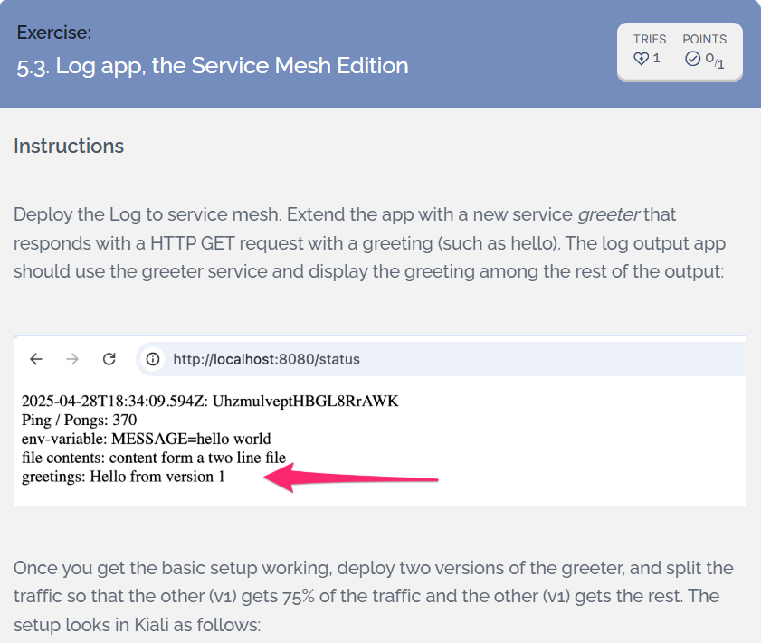
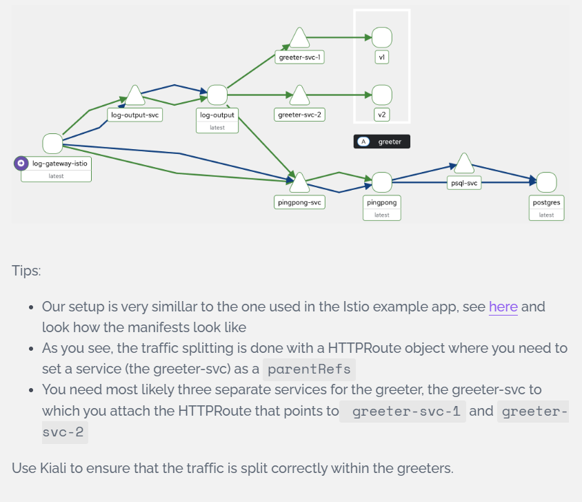
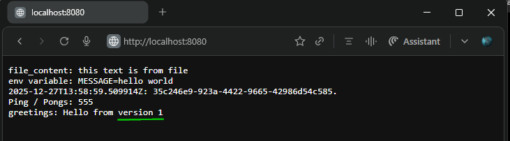
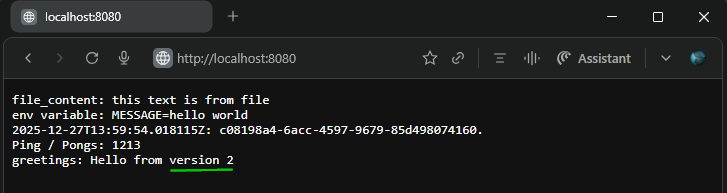
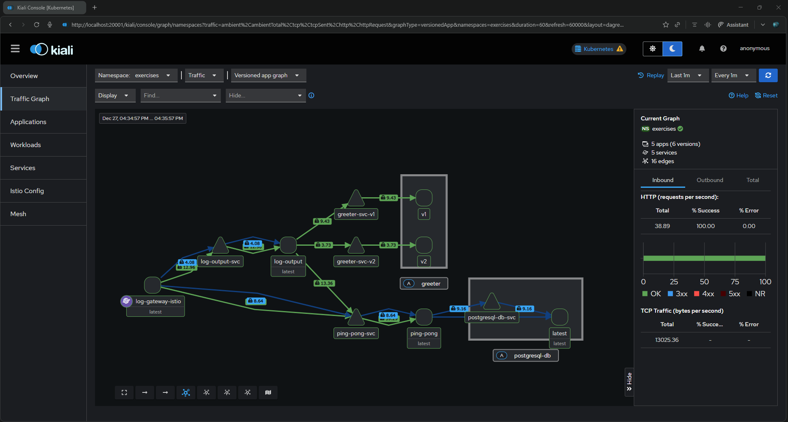

## [Exercise 5.3. Log app, the Service Mesh Edition](https://courses.mooc.fi/org/uh-cs/courses/devops-with-kubernetes/chapter-6/service-mesh)  



---

### 1. Key Changes from Base

**Application Updates**
- [`greeter`](../greeter/) - Greeter application folder
  - [`greeter/app.py`](../greeter/app.py) - Implements greeter aplication code
  - [`greeter/Dockerfile`](../greeter/Dockerfile) - To containerize greeter application
  - [`greeter/requirements.txt`](../greeter/requirements.txt) - Package dependencies
- [`log_output/reader/reader.py`](../log_output/reader/reader.py) - Enhanced to query `greeter-svc` and includes received greeting message in response

**Greeter Application Manifests and Kustomize Integration**  
  
- [`apps/greeter`](../apps/greeter/) - Base manifests for Greeter application
    - [`kustomization.yaml`](../apps/greeter/kustomization.yaml) - Kustomization entry point for [`greeter`](../greeter/) manifests  
    - [`greeter-dep-v1.yaml`](../apps/greeter/greeter-dep-v1.yaml) - Defines deployment for `greeter-v1`
    - [`greeter-dep-v2.yaml`](../apps/greeter/greeter-dep-v2.yaml) - Defines deployment for `greeter-v2`
    - [`greeter-svc.yaml`](../apps/greeter/greeter-svc.yaml) - Greeter parent service `greeter-svc`
    - [`greeter-svc-v1.yaml`](../apps/greeter/greeter-svc-v1.yaml) - Defines `greeter-svc-v1`
    - [`greeter-svc-v2.yaml`](../apps/greeter/greeter-svc-v2.yaml) - Defines `greeter-svc-v2`
    - [`greeter-route.yaml`](../apps/greeter/greeter-route.yaml) - Defines HTTPRoute to bind `greeter-svc` as `parentRefs` to `greeter-svc-v1` and `greeter-svc-v2`
    - [`service-account.yaml`](../apps/greeter/service-account.yaml) - Defines Service Account `greeter-sa` (Istio identity)  
- [`environments/exercises-local/`](../environments/exercises-local/) - Overlay folder integrating `log-output`, `ping-pong` and `greeter` applications  
  - [`kustomization.yaml`](../environments/exercises-local/kustomization.yaml) - Top level overlay kustomization entry point for [`apps/ping-pong-log-output/`](../apps/ping-pong-log-output/) and [`apps/greeter/`](../apps/greeter/) manifests  
  - [`log-output-gateway.yaml`](../environments/exercises-local/log-output-gateway.yaml) - Defines Gateway `log-output-gateway` (`istio` class, ClusterIP)  
  - [`log-output-route.yaml`](../environments/exercises-local/log-output-route.yaml) - Defines HTTPRoute `/greet` to `greeter-svc`  
  - [`ping-pong-route.yaml`](../environments/exercises-local/ping-pong-route.yaml) - Defines HTTPRoute `/pingpong` and`/pings` to `ping-pong-svc`  

- Base application:  
  - [Log output v4.7](https://github.com/arkb2023/devops-kubernetes/tree/4.7/log_output)
  - [Ping pong v4.7](https://github.com/arkb2023/devops-kubernetes/tree/4.7/ping-pong)

---

### 2. Directory and File Structure
<pre>
.github/                                        # github workflows root folder
└── workflows
    └── gitops-log-output.yaml                  # GitOps workflow for exercises (log-output + ping-pong)

environments/                                   # Multi-env overlays (local/GKE)
├── exercises-gke                               # GKE environment specific overlays
│   ├── gateway.yaml                            # Gateway API
│   ├── kustomization.yaml                      # Top level kustomization entry point 
│   ├── log-output-route.yaml                   # log-output HTTPRoute
│   ├── namespace.yaml                          # Namespace
│   └── ping-pong-route.yaml                    # ping-pong HTTPRoute
├── exercises-local                             # Local k3d environment specific overlays
│   ├── kustomization.yaml                      # Top level kustomization entry point
│   ├── namespace.yaml                          # Namespace
│   ├── log-output-gateway.yaml                 # Log output gateway
│   ├── log-output-route.yaml                   # Log-output httproutes
│   ├── ping-pong-route.yaml                    # Ping-pong httproutes
│   ├── postgresql-init-script.yaml             # ostgreSQL Init script
│   └── postgresql-statefulset-patch.yaml       # PostgreSQL StatefulSet patch

apps/                                           # Shared base resources
├── ping-pong-log-output                        # Consolidated app manifests + kustomization
│   ├── kustomization.yaml                      # Base manifests for ping-pong + log-output
│   ├── log-output-configmap.yaml               # log-output ConfigMap
│   ├── log-output-deployment.yaml              # log-output Deployment
│   ├── log-output-service.yaml                 # log-output Service 
│   ├── ping-pong-deployment.yaml               # ping-pong Deployment 
│   ├── ping-pong-service.yaml                  # ping-pong Service
│   ├── postgresql-configmap.yaml               # PostgreSQL ConfigMap
│   ├── postgresql-service.yaml                 # PostgreSQL Service
│   └── postgresql-statefulset.yaml             # PostgreSQL StatefulSet 

ping-pong/                                      # Ping Pong application folder
├── Dockerfile                                  # Dockerfile for pingpong application
├── README.md                                   # Readme
└── pingpong.py                                 # Ping Pong application code

log_output/                                 
└── reader                                      # Log outut application folder
    ├── Dockerfile                              # Dockerfile for log output application
    └── reader.py                               # Log output application code
./greeter/                                      # Greeter application folder
├── Dockerfile                                  # Dockerfile for Greeter application
├── app.py                                      # Greeter application code
└── requirements.txt                            # Package dependencies
</pre>

  
***

### 3. Base Setup  
- Docker  
- k3d (K3s in Docker)  
- kubectl
  ```
  Client Version: v1.34.1
  Kustomize Version: v5.7.1
  Server Version: v1.31.5+k3s1
  ```
- Create Cluster 
  ```bash
  k3d cluster create dwk-local --agents 2 --port 8081:80@loadbalancer
  ```
- Istio Ambient 1.28.2
  ```bash
  istioctl install --set profile=ambient --set values.global.platform=k3d --skip-confirmation
  ```
- Gateway API CRD Fix (Required for kubectl v1.34.1)  
  *Apply workaround:* [kubernetes-sigs/gateway-api#4156](https://github.com/kubernetes-sigs/gateway-api/issues/4156#issuecomment-3381682929)
  ```bash
  cat > ~/.kube/kuberc <<EOF
  apiVersion: kubectl.config.k8s.io/v1beta1
  kind: Preference
  defaults:
    - command: apply
      options:
        - name: server-side
          default: "true"
  EOF
  ```
  > Problem: kubectl v1.34.1 rejects Experimental CRDs `httproutes.gateway.networking.k8s.io` - annotations > 262144 bytes limit
  > Solution: ~/.kube/kuberc - server-side apply default bypasses client validation 
- Install Gateway API
  ```bash
  kubectl get crd gateways.gateway.networking.k8s.io &> /dev/null || \
  kubectl apply --server-side -f https://github.com/kubernetes-sigs/gateway-api/releases/download/v1.4.0/experimental-install.yaml
  ```
  Gateway API + HTTPRoute CRDs installed:
  ```bash
  kubectl get crd gateways.gateway.networking.k8s.io httproutes.gateway.networking.k8s.io
  # Output
  NAME                                   CREATED AT
  gateways.gateway.networking.k8s.io     2025-12-26T05:35:12Z
  httproutes.gateway.networking.k8s.io   2025-12-26T05:35:12Z
  ```
---

### 4. Deploy Application stack
- Use kustomize to apply application stack manifests: `Postgresql` `log-output` `ping-pong` `greeter` `httproutes` and `gateway API`
  ```bash
  kustomize build environments/exercises-local | kubectl apply -f -
  # Output
  namespace/exercises serverside-applied
  serviceaccount/greeter-sa serverside-applied
  configmap/log-output-config serverside-applied
  configmap/postgres-db-config serverside-applied
  configmap/postgres-init-script serverside-applied
  service/greeter-svc serverside-applied
  service/greeter-svc-v1 serverside-applied
  service/greeter-svc-v2 serverside-applied
  service/log-output-svc serverside-applied
  service/ping-pong-svc serverside-applied
  service/postgresql-db-svc serverside-applied
  deployment.apps/greeter-v1 serverside-applied
  deployment.apps/greeter-v2 serverside-applied
  deployment.apps/log-output-dep serverside-applied
  statefulset.apps/postgresql-db serverside-applied
  analysistemplate.argoproj.io/pingpong-cpu-analysis serverside-applied
  rollout.argoproj.io/ping-pong-rollout serverside-applied
  gateway.gateway.networking.k8s.io/log-output-gateway serverside-applied
  httproute.gateway.networking.k8s.io/greeter-route serverside-applied
  httproute.gateway.networking.k8s.io/log-output-route serverside-applied
  httproute.gateway.networking.k8s.io/ping-pong-route serverside-applied
  ```

- Stack Health check  
  ```bash
  kubectl -n exercises get all
  # Output
  NAME                                            READY   STATUS    RESTARTS   AGE
  pod/greeter-v1-b66fd4478-fb5d7                  1/1     Running   0          41s
  pod/greeter-v2-5c8949496b-2l5mg                 1/1     Running   0          41s
  pod/log-output-dep-794dbb555-f2lb2              2/2     Running   0          41s
  pod/log-output-gateway-istio-7985c4b65c-cg959   1/1     Running   0          40s
  pod/ping-pong-rollout-696d9d65cf-lv8p4          1/1     Running   0          40s
  pod/postgresql-db-0                             1/1     Running   0          41s

  NAME                               TYPE           CLUSTER-IP      EXTERNAL-IP   PORT(S)                        AGE
  service/greeter-svc                ClusterIP      10.43.31.3      <none>        8000/TCP                       41s
  service/greeter-svc-v1             ClusterIP      10.43.204.7     <none>        8000/TCP                       41s
  service/greeter-svc-v2             ClusterIP      10.43.241.157   <none>        8000/TCP                       41s
  service/log-output-gateway-istio   LoadBalancer   10.43.93.92     <pending>     15021:32092/TCP,80:32021/TCP   40s
  service/log-output-svc             ClusterIP      10.43.57.207    <none>        80/TCP                         41s
  service/ping-pong-svc              ClusterIP      10.43.254.175   <none>        3456/TCP                       41s
  service/postgresql-db-svc          ClusterIP      None            <none>        5432/TCP                       41s

  NAME                                       READY   UP-TO-DATE   AVAILABLE   AGE
  deployment.apps/greeter-v1                 1/1     1            1           41s
  deployment.apps/greeter-v2                 1/1     1            1           41s
  deployment.apps/log-output-dep             1/1     1            1           41s
  deployment.apps/log-output-gateway-istio   1/1     1            1           40s

  NAME                                                  DESIRED   CURRENT   READY   AGE
  replicaset.apps/greeter-v1-b66fd4478                  1         1         1       42s
  replicaset.apps/greeter-v2-5c8949496b                 1         1         1       42s
  replicaset.apps/log-output-dep-794dbb555              1         1         1       42s
  replicaset.apps/log-output-gateway-istio-7985c4b65c   1         1         1       41s
  replicaset.apps/ping-pong-rollout-696d9d65cf          1         1         1       41s

  NAME                             READY   AGE
  statefulset.apps/postgresql-db   1/1     42s
  ```

- HTTP Routes  
  ```bash
  # List Routes
  kubectl -n exercises get httproute
  # Output
  NAME                                                   HOSTNAMES   AGE
  httproute.gateway.networking.k8s.io/greeter-route                  50m
  httproute.gateway.networking.k8s.io/log-output-route               50m
  httproute.gateway.networking.k8s.io/ping-pong-route                50m
  ```

- Greeter Traffic Splitting (75/25)
  ```bash
  # Describe greeter-route
  kubectl  -n exercises describe httproute greeter-route |grep -A17 "Spec:"
  Spec:
    Parent Refs:
      Group:
      Kind:   Service
      Name:   greeter-svc
      Port:   8000
    Rules:
      Backend Refs:
        Group:
        Kind:    Service
        Name:    greeter-svc-v1
        Port:    8000
        Weight:  75
        Group:
        Kind:    Service
        Name:    greeter-svc-v2
        Port:    8000
        Weight:  25
  ```

---

### 5. Instio Service Mesh Integration  
- Gateway Configuration
  ```bash
  kubectl annotate gateway log-output-gateway networking.istio.io/service-type=ClusterIP -n exercises --overwrite
  ```
  - Verify Annotation: `networking.istio.io/service-type: ClusterIP`
    ```bash
    kubectl -n exercises describe gateway log-output-gateway |grep -2 "Annotations:"
    
    # Output
    Namespace:    exercises
    Labels:       <none>
    Annotations:  networking.istio.io/service-type: ClusterIP
    API Version:  gateway.networking.k8s.io/v1
    Kind:         Gateway
    ```
  - Gateway API Status: `PROGRAMMED=True`
    ```
    kubectl -n exercises get gateway
    # Output
    NAME                 CLASS   ADDRESS                                                PROGRAMMED   AGE
    log-output-gateway   istio   log-output-gateway-istio.exercises.svc.cluster.local   True         4m48s
    ```
  
- Setup Istio Ambient (Ztunnel L4)
  - Enable Istio Ambient
    ```bash
    kubectl label ns exercises istio.io/dataplane-mode=ambient --overwrite
    ```
  - `exercises` Namespace enabled with `istio.io/dataplane-mode=ambient` label
    ```bash
    kubectl describe namespace exercises
    # Output
    Name:         exercises
    Labels:       istio.io/dataplane-mode=ambient
                  kubernetes.io/metadata.name=exercises
    Annotations:  <none>
    Status:       Active

    No resource quota.

    No LimitRange resource.
    ```
  - Ztunnel pods
    ```bash
    kubectl get pods -n istio-system | egrep "NAME|ztunnel"
    # Output
    NAME                          READY   STATUS    RESTARTS      AGE
    ztunnel-bbgz8                 1/1     Running   1 (15h ago)   39h
    ztunnel-jr74b                 1/1     Running   1 (15h ago)   39h
    ztunnel-stqdv                 1/1     Running   1 (15h ago)   39h
    ```

- Setup Waypoint Proxy (L7 HTTP)
  - Enable Istio Waypoint
    ```bash
    istioctl waypoint apply --namespace exercises --enroll-namespace --wait
    ```
  - `exercises` Namespace enabled with `istio.io/use-waypoint=waypoint` label
    ```bash
    kubectl describe namespace exercises
    # Output
    Name:         exercises
    Labels:       istio.io/dataplane-mode=ambient
                  istio.io/use-waypoint=waypoint
                  kubernetes.io/metadata.name=exercises
    Annotations:  <none>
    Status:       Active

    No resource quota.

    No LimitRange resource.
    ```

  - Waypoint Resources
    ```bash
    kubectl -n exercises get svc waypoint
    # Output
    NAME       TYPE        CLUSTER-IP     EXTERNAL-IP   PORT(S)               AGE
    waypoint   ClusterIP   10.43.48.219   <none>        15021/TCP,15008/TCP   2m39s

    # Deployment
    kubectl -n exercises get deployments waypoint
    # Output
    NAME       READY   UP-TO-DATE   AVAILABLE   AGE
    waypoint   1/1     1            1           2m53s

    # Gateway: Programmed=True
    kubectl -n exercises get gateway waypoint 
    # Output
    NAME       CLASS            ADDRESS        PROGRAMMED   AGE
    waypoint   istio-waypoint   10.43.48.219   True         3m12s
    ```

- Setup Observability
  - Apply Prometheus and Kiali manifests
    ```bash
    # Prometheus
    kubectl apply -f https://raw.githubusercontent.com/istio/istio/1.28.2/samples/addons/prometheus.yaml
    # Output
    serviceaccount/prometheus serverside-applied
    configmap/prometheus serverside-applied
    clusterrole.rbac.authorization.k8s.io/prometheus serverside-applied
    clusterrolebinding.rbac.authorization.k8s.io/prometheus serverside-applied
    service/prometheus serverside-applied
    deployment.apps/prometheus serverside-applied

    # Kiali
    kubectl apply -f https://raw.githubusercontent.com/istio/istio/1.28.2/samples/addons/kiali.yaml
    # Output
    serviceaccount/kiali serverside-applied
    configmap/kiali serverside-applied
    clusterrole.rbac.authorization.k8s.io/kiali serverside-applied
    clusterrolebinding.rbac.authorization.k8s.io/kiali serverside-applied
    service/kiali serverside-applied
    deployment.apps/kiali serverside-applied
    ```

  - Prometheus and Kiali healthy service and pods 
    ```bash
    # Service
    kubectl get svc -n istio-system prometheus kiali
    NAME         TYPE        CLUSTER-IP      EXTERNAL-IP   PORT(S)              AGE
    prometheus   ClusterIP   10.43.215.114   <none>        9090/TCP             25h
    kiali        ClusterIP   10.43.105.224   <none>        20001/TCP,9090/TCP   25h

    # Pods
    kubectl get pods -n istio-system | egrep "NAME|kiali|prometheus"
    NAME                          READY   STATUS    RESTARTS      AGE
    kiali-75466ff674-tgr2m        1/1     Running   1 (15h ago)   32h
    prometheus-54c7c856b5-5gzzv   2/2     Running   2 (15h ago)   32h
    ```

---

### 6. Access the application
- Port-Forward Gateway  
  ```bash
  kubectl port-forward svc/log-gateway-istio 8080:80 -n exercises
  ```
- Application accessible: `http://localhost:8080`
  - Greeter v1 response along with other log output and ping pong information  

    

  - Greeter v2 response along with other log output and ping pong information  

    

---

### 7. Traffic Splitting Demo
- Launch Kiali dashboard
  ```bash
  istioctl dashboard kiali -n exercises
  ```
- Generate Sustained Traffic to all application services
  ```bash
  for i in $(seq 1 1000); do curl -s http://localhost:8080/{,/pings,/pingpong} -o /dev/null; done
  ```
- Access: `http://localhost:20001/kiali`
  

---

### 8. cleanup
```bash
kustomize build environments/exercises-local | kubectl delete -f -
```
---
