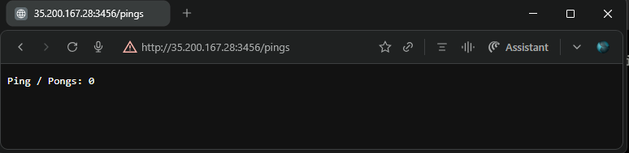
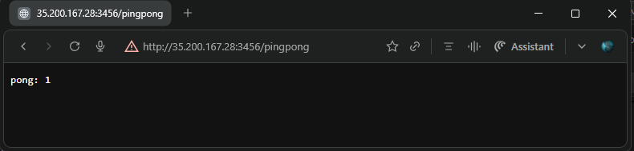
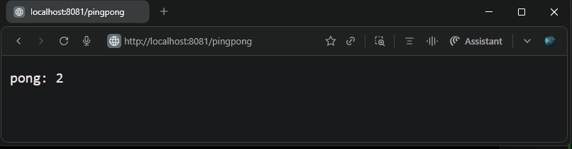
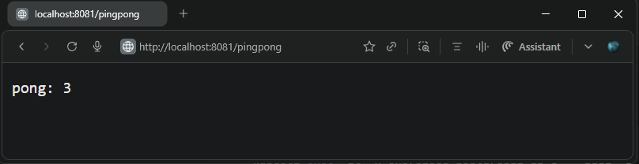

## Exercise 2.7. Stateful applications

Run a `Postgres` database as a stateful set and save the `Ping-pong` application counter into the database.

**Resource Updates**

- **Created [`postgresql/`](../postgresql/) directory** with new manifests for stateful PostgreSQL deployment:
  - [`postgresql-configmap.yaml`](../postgresql/postgresql-configmap.yaml): Defines Postgres initialization env vars and app connection vars.
  - [`postgresql-service.yaml`](../postgresql/postgresql-service.yaml): Headless Service `clusterIP: None` for stable pod DNS discovery `postgresql-db-svc.exercises.svc.cluster.local`.
  - [`postgresql-statefulset.yaml`](../postgresql/postgresql-statefulset.yaml): StatefulSet with 2 replicas, `envFrom` referencing ConfigMap and `volumeClaimTemplates` (100Mi local-path storage)
- **Updated `ping-pong` app [`deployment.yaml`](./manifests/deployment.yaml)**:
  - Added `envFrom` reference to `postgres-db-config` ConfigMap for database connectivity.
  - Pod template now receives Postgres connection details automatically.

## Application Updates

- **Refactored `ping-pong/pingpong.py`** from in-memory counter to PostgreSQL with asyncpg and SQLAlchemy ORM:
  - Replaced in-memory `Counter` with PostgreSQL-backed counter using `pingpong_counter` table.
  - `/pingpong` endpoint atomically increments the counter and returns the new value in a single database operation.
  - `/pings` endpoint fetches the current counter by selecting the stored value from the pingpong_counter table where the record ID is 1.
  - Startup event creates table schema and initializes id=1, value=0 row if missing.

- Base application versions used:  
  - [Ping pong v2.1](https://github.com/arkb2023/devops-kubernetes/tree/2.1/ping-pong)  

***

### 1. **Directory and File Structure**
<pre>
ping-pong/
├── Dockerfile
├── README.md
├── manifests
│   ├── deployment.yaml
│   ├── ingress.yaml
│   └── service.yaml
└── pingpong.py
postgresql/
├── postgresql-configmap.yaml
├── postgresql-service.yaml
└── postgresql-statefulset.yaml
</pre>

***


### 2. Prerequisites

- Ensure the following tools are installed:
  - Docker  
  - k3d (K3s in Docker)  
  - kubectl (Kubernetes CLI)
- Create and run a Kubernetes cluster with k3d, using 2 agent nodes and port mapping to expose the ingress load balancer on host port 8081:
    ```bash
    k3d cluster create mycluster --agents 2 --port 8081:80@loadbalancer
    ```
- `project` namespace created in the cluster
    ```bash
    kubectl create exercises project
    ```

***

### 3. Build and Push the Docker Image to DockerHub

```bash
cd ping-pong
docker build -t arkb2023/ping-pong:2.7.2 .
docker push arkb2023/ping-pong:2.7.2
```
> Docker images are published at:  
https://hub.docker.com/repository/docker/arkb2023/ping-pong/tags/2.7.2  

### 4. **Deploy to Kubernetes**

**Apply the `ping-pong` application and `postgress` Manifests**  

```bash
kubectl apply \
  -n exercises \
  -f postgresql/ \
  -f ping-pong/manifests/
```
*Output*
```text
configmap/postgres-db-config created
service/postgresql-db-svc created
statefulset.apps/postgresql-db created
deployment.apps/ping-pong-dep created
ingress.networking.k8s.io/dwk-ping-pong-ingress created
service/ping-pong-svc created
```

***

### Validate

- **Postgres pods are Running and PVCs are Bound:**

  **Verify pod status:**
  ```bash
  kubectl -n exercises get pods
  ```
  *Output:*
  ```text
  NAME                            READY   STATUS    RESTARTS   AGE
  ping-pong-dep-5fd4696644-67lt7 1/1     Running   0          14m
  postgresql-db-0                1/1     Running   0          49m
  postgresql-db-1                1/1     Running   0          49m
  ```

  **Verify PVC status:**
  ```bash
  kubectl -n exercises get pvc
  ```
  *Output:*
  ```text
  NAME                                STATUS   VOLUME                                     CAPACITY   ACCESS MODES   STORAGECLASS   VOLUMEATTRIBUTESCLASS   AGE
  postgresql-db-disk-postgresql-db-0  Bound    pvc-8f5cd105-8565-4fab-b15e-1dc1a17aee18  100Mi      RWO            local-path     <unset>                    42m
  postgresql-db-disk-postgresql-db-1  Bound    pvc-2ad2c4bd-5184-42e4-a88a-9f8709e12035  100Mi      RWO            local-path     <unset>                    42m
  ```

- **Get initial value by hitting `/pings` HTTP endpoint:**  
  Verify the application response value matches the Postgres database value.  

  - Application returns `0`  
      
      

  - Database query confirms `0`:  
    ```bash
    SELECT * FROM pingpong_counter;
    ```
    *Output:*  
    ```text
    id | value
    ----+-------
     1 |     0
    (1 row)
    ```

- **Hitting `/pingpong` HTTP endpoint increases the value by 1:**  
  Both the application response and Postgres database reflect the update.

  - Application returns `1`  
      
      

  - Database query confirms `1`:  
    ```bash
    SELECT * FROM pingpong_counter;
    ```
    *Output:*  
    ```text
    id | value
    ----+-------
     1 |     1
    (1 row)
    ```

- **Hitting `/pingpong` a second time increases the value by 1:**  
  Both application and database show the increment.

  - Application returns `2`  
      
      

  - Database query confirms `2`:  
    ```bash
    SELECT * FROM pingpong_counter;
    ```
    *Output:*  
    ```text
    id | value
    ----+-------
     1 |     2
    (1 row)
    ```

- **[DB persistence] Verify counter survives pod restart:**

  - Restart `ping-pong` deployment:  
    ```bash
    kubectl -n exercises rollout restart deployment ping-pong-dep
    ```
    *Output:*  
    ```text
    deployment.apps/ping-pong-dep restarted
    ```

  - Verify pod restart status:  
    ```bash
    kubectl -n exercises get pods
    ```
    *Output:*  
    ```text
    NAME                            READY   STATUS        RESTARTS   AGE
    ping-pong-dep-5fd4696644-67lt7 1/1     Terminating   0          36m
    ping-pong-dep-bd5dbfd55-hvvpb  1/1     Running       0          28s
    postgresql-db-0                1/1     Running       0          71m
    postgresql-db-1                1/1     Running       0          71m
    ```
    ```bash
    kubectl -n exercises get pods
    ```
    *Output:*  
    ```text
    NAME                           READY   STATUS    RESTARTS   AGE
    ping-pong-dep-bd5dbfd55-hvvpb 1/1     Running   0          81s
    postgresql-db-0                1/1     Running   0          72m
    postgresql-db-1                1/1     Running   0          72m
    ```

  - `/pingpong` returns `pong: N+1` continuing from the previous value:  
      
      

  - Database access confirms the same counter value:  
    ```bash
    SELECT * FROM pingpong_counter;
    ```
    *Output:*  
    ```text
    id | value
    ----+-------
     1 |     3
    (1 row)
    ```

***

### 6. **Cleanup**

**Delete Manifests** 
  ```bash
  kubectl delete \
    -n exercises \
    -f postgresql/ \
    -f ping-pong/manifests/
  ```
  *Output*
  ```text
  configmap "postgres-db-config" deleted from exercises namespace
  service "postgresql-db-svc" deleted from exercises namespace
  statefulset.apps "postgresql-db" deleted from exercises namespace
  deployment.apps "ping-pong-dep" deleted from exercises namespace
  ingress.networking.k8s.io "dwk-ping-pong-ingress" deleted from exercises namespace
  service "ping-pong-svc" deleted from exercises namespace
  ```

**Stop the k3d Cluster**  
```bash
k3d cluster delete k3s-default
```
*Output*
```text
INFO[0000] Deleting cluster 'k3s-default'
INFO[0003] Deleting cluster network 'k3d-k3s-default'
INFO[0003] Deleting 1 attached volumes...
INFO[0003] Removing cluster details from default kubeconfig...
INFO[0003] Removing standalone kubeconfig file (if there is one)...
INFO[0003] Successfully deleted cluster k3s-default!
```

---


<!--
check logs
kubectl -n exercises logs postgresql-db-1 -c postgresql-db
kubectl -n exercises logs postgresql-db-0 -c postgresql-db 
# live logs
kubectl -n exercises logs -f postgresql-db-1
-->