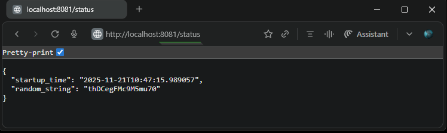
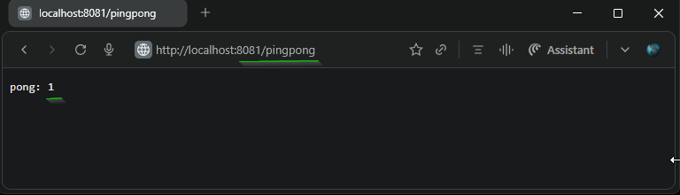
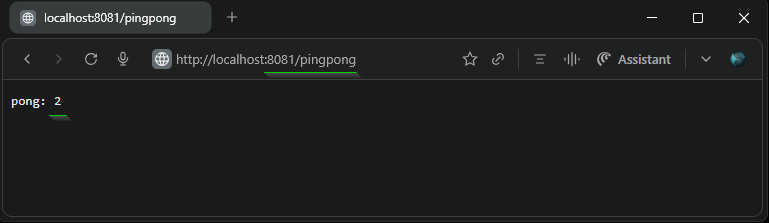

## Exercise: 1.9. More services 
### Pingpong App 

- Built upon the application from [Exercise 1.8. The project, step 5](https://github.com/arkb2023/devops-kubernetes/tree/1.8/the_project).  
- Added a new ping-pong app with the following resources:
    - [pingpong.py](./pingpong.py) application code
    - [Dockerfile](./Dockerfile) for building the app image
    - Manifests:
        - [deployment.yaml](./manifests/deployment.yaml)
        - [service.yaml](./manifests/service.yaml)
- Enhanced [log-output/ingress.yaml](../log_output/manifests/ingress.yaml) to support routing the `/pingpong` API endpoint to the ping-pong service.
- **Results:**
    1. The log-output app endpoint is accessible at `http://localhost:8081/status`
    2. The ping-pong app endpoint is accessible at `http://localhost:8081/pingpong`
***


### 1. **Directory and File Structure**
<pre>
├── ping-pong
│   ├── Dockerfile
│   ├── README.md
│   ├── manifests
│   │   ├── deployment.yaml
│   │   └── service.yaml
│   └── pingpong.py
├── log_output
│   ├── Dockerfile
│   ├── README.md
│   ├── log_output.py
│   └── manifests
│       ├── deployment.yaml
│       ├── ingress.yaml
│       └── service.yaml
</pre>

***

### 2. Prerequisites
- Docker, k3d, kubectl installed

### 3. Build and Push the Docker Image to DockerHub

```bash
docker build -t arkb2023/ping-pong:1.9.2 .
docker push arkb2023/ping-pong:1.9.2
```

> Docker image for the `pingpong` application is published at:  
> [https://hub.docker.com/repository/docker/arkb2023/ping-pong/tags/1.9.2](https://hub.docker.com/repository/docker/arkb2023/ping-pong/tags/1.9.2)  
>  
> The `log-output` application image from `Exercise 1.7` can be reused and is available at:  
> [https://hub.docker.com/repository/docker/arkb2023/log-output/tags/1.7.2](https://hub.docker.com/repository/docker/arkb2023/log-output/tags/1.7.2)  

***


### 4. **Deploy to Kubernetes**

**Create cluster**

```bash
k3d cluster create --port 8081:80@loadbalancer --agents 2
```

Where,  
`--port 8081:80@loadbalancer`: Exposes host port 8081 mapped to the load balancer's port 80.

---

**Apply the `Deployment` `Service` and `Ingress` resources for both `ping-pong` and `log-output` apps**
```bash
kubectl apply -f ping-pong/manifests/ -f log_output/manifests/
```
*Output*
```text
deployment.apps/ping-pong-dep created
service/ping-pong-svc created
deployment.apps/log-output-dep created
ingress.networking.k8s.io/dwk-log-output-ping-pong-ingress created
service/log-output-svc created
```

**Verify that the manifests are operational**
```bash
kubectl get deploy,svc,ing
```
*Output*
```text
NAME                             READY   UP-TO-DATE   AVAILABLE   AGE
deployment.apps/log-output-dep   0/1     1            0           9s
deployment.apps/ping-pong-dep    0/1     1            0           9s

NAME                     TYPE        CLUSTER-IP     EXTERNAL-IP   PORT(S)    AGE
service/kubernetes       ClusterIP   10.43.0.1      <none>        443/TCP    66s
service/log-output-svc   ClusterIP   10.43.136.75   <none>        2345/TCP   9s
service/ping-pong-svc    ClusterIP   10.43.6.37     <none>        3456/TCP   9s

NAME                                                         CLASS     HOSTS   ADDRESS                            PORTS   AGE
ingress.networking.k8s.io/dwk-log-output-ping-pong-ingress   traefik   *       172.18.0.3,172.18.0.4,172.18.0.5   80      9s
```
**Verify the ingress resource rules for the configured endpoints**
```bash
kubectl describe ingress dwk-log-output-ping-pong-ingress
```
*Output*
```text
Name:             dwk-log-output-ping-pong-ingress
Labels:           <none>
Namespace:        default
Address:          172.18.0.3,172.18.0.4,172.18.0.5
Ingress Class:    traefik
Default backend:  <default>
Rules:
  Host        Path  Backends
  ----        ----  --------
  *
              /status     log-output-svc:2345 (10.42.1.6:3000)
              /pingpong   ping-pong-svc:3456 (10.42.1.7:3000)
Annotations:  <none>
Events:       <none>
```
**Inspect `ping-pong` Pod logs for application readiness**
```bash
kubectl logs -f ping-pong-dep-7c655f8b47-2fjb2
```
*Output*
```text
kubectl logs -f ping-pong-dep-7c655f8b47-2fjb2
INFO:     Started server process [7]
INFO:     Waiting for application startup.
INFO:     Application startup complete.
INFO:     Uvicorn running on http://0.0.0.0:3000 (Press CTRL+C to quit)
INFO:     10.42.1.4:50198 - "GET /pingpong HTTP/1.1" 200 OK
INFO:     10.42.1.4:50198 - "GET /pingpong HTTP/1.1" 200 OK
```
**Inspect `log-output` Pod logs for application readiness**
```bash
kubectl logs -f log-output-dep-85c5bdb976-5gcgv
```
*Output*
```text
INFO:     Started server process [7]
INFO:     Waiting for application startup.
INFO:     Application startup complete.
INFO:     Uvicorn running on http://0.0.0.0:3000 (Press CTRL+C to quit)
INFO:     10.42.1.4:44766 - "GET /status HTTP/1.1" 200 OK
INFO:     10.42.1.4:58750 - "GET /status HTTP/1.1" 200 OK
```

### 5. Verify Application Endpoint Response  
Access the `log-output` application endpoint in a browser at: `http://localhost:8081/status`  
 

Access the `ping-pong` application endpoint in a browser at: `http://localhost:8081/pingpong`, counter response shows 1
 

Again access the `ping-pong` application endpoint , counter response increments to 2
 


### 6. **Cleanup**

**Delete the `Deployment` `Service` and `Ingress` Resources**  

```bash
kubectl delete -f ping-pong/manifests/ -f log_output/manifests/
```
*Output*
```text
deployment.apps "ping-pong-dep" deleted from default namespace
service "ping-pong-svc" deleted from default namespace
deployment.apps "log-output-dep" deleted from default namespace
ingress.networking.k8s.io "dwk-log-output-ping-pong-ingress" deleted from default namespace
service "log-output-svc" deleted from default namespace
```

**Stop the k3d Cluster**  
```bash
k3d cluster delete k3s-default
```
*Output*
```text
INFO[0000] Deleting cluster 'k3s-default'
INFO[0005] Deleting cluster network 'k3d-k3s-default'
INFO[0005] Deleting 1 attached volumes...
INFO[0006] Removing cluster details from default kubeconfig...
INFO[0006] Removing standalone kubeconfig file (if there is one)...
INFO[0006] Successfully deleted cluster k3s-default!
```
---