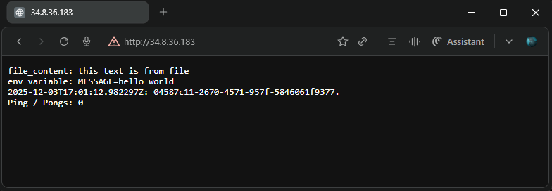
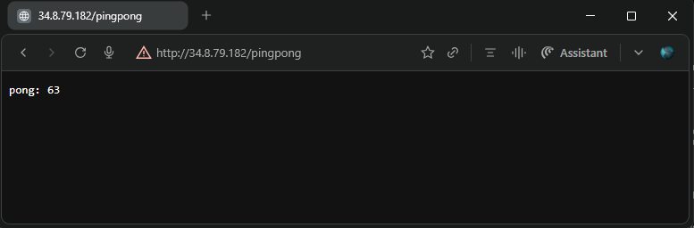
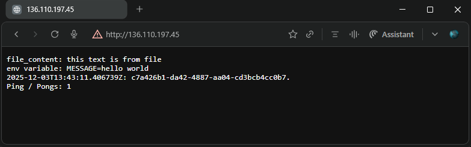

## Exercise 3.2 Back to Ingress

Deploy the "Log output" and "Ping-pong" applications into GKE and expose it with Ingress.


**Key Changes from Base**
- [`ping-pong/manifests/deployment.yaml`](./manifests/deployment.yaml) - Added `readinessProbe` with `httpGet` to `/pings` endpoint for health checks
- [`ping-pong/manifests/service.yaml`](./manifests/service.yaml) - Changed `type: LoadBalancer` → `type: NodePort` -- GKE Ingress requirement
- [`ping-pong/manifests/ingress.yaml`](./manifests/ingress.yaml) - Added GKE health check annotation:
  ```yaml
    annotations:
      ingress.gcp.kubernetes.io/healthcheck-path: "/pings"
  ```
- Base versions used:  
  - [Ping pong v3.1](https://github.com/arkb2023/devops-kubernetes/tree/3.1/ping-pong)  
  - [Log output v2.5](https://github.com/arkb2023/devops-kubernetes/tree/2.5/log_output)  
***


### 1. **Directory and File Structure**
<pre>
log_output
├── README.md
├── manifests
│   ├── configmap.yaml
│   ├── deployment.yaml
│   ├── ingress.yaml
│   │   └── service.yaml
│   └── reader
│       ├── Dockerfile
│       └── reader.py
ping-pong/
├── Dockerfile
├── README.md
├── manifests
│   ├── deployment.yaml
│   ├── ingress.yaml
│   └── service.yaml
└── pingpong.py
postgresql/
├── postgresql-configmap.yaml
├── postgresql-service.yaml
└── postgresql-statefulset.yaml
</pre>

***


### 2. Prerequisites (GCP/GKE)

- **Google Cloud CLI** (`gcloud`) updated to 548.0.0
- **kubectl** (Kubernetes CLI) with `gke-gcloud-auth-plugin`
- **GCP Project**: `dwk-gke-480015` configured
- **Cluster Creation**:
  ```bash
  gcloud container clusters create dwk-cluster \
    --zone=asia-south1-a \
    --cluster-version=1.32 \
    --disk-size=32 \
    --num-nodes=3 \
    --machine-type=e2-micro
  ```
  ```bash
  gcloud container clusters get-credentials dwk-cluster --zone=asia-south1-a
  ```
- **Utility Variables**:
  ```bash
  export NAMESPACE=exercises
  export PING_INGRESS="dwk-ping-pong-ingress"
  export LOG_INGRESS="dwk-log-output-ingress"
  ```
- **Namespace creation:**
  ```bash
  kubectl create namespace ${NAMESPACE}
  ```
***

### 3. **Deploy to Kubernetes**

- **Deploy PostgreSQL**:  
  ```bash
  kubectl apply -n ${NAMESPACE} -f postgresql/
  ```
- **Wait for the Pods to be in Running state**
  ```bash
  kubectl get pods -n ${NAMESPACE} -l app=postgresql-db
  ```
  *Output*
  ```text
  NAME              READY   STATUS    RESTARTS   AGE
  postgresql-db-0   1/1     Running   0          48m
  postgresql-db-1   1/1     Running   0          41m
  ```

- **PVC Should show Bound status**
  ```bash
  kubectl get pvc -n ${NAMESPACE}
  ```
  *Output*
  ```text
  NAME                                 STATUS   VOLUME                                     CAPACITY   ACCESS MODES   STORAGECLASS   VOLUMEATTRIBUTESCLASS   AGE
  postgresql-db-disk-postgresql-db-0   Bound    pvc-2fcfa9d4-b6be-4076-80f3-5b557c270fb4   1Gi        RWO            standard-rwo   <unset>                 49m
  postgresql-db-disk-postgresql-db-1   Bound    pvc-5ec78685-e1e4-4803-94e8-430678fdc804   1Gi        RWO            standard-rwo   <unset>                 43m
  ```

- **Initialize database table**
  ```bash
    kubectl exec -n $NAMESPACE postgresql-db-0 -- psql -U testdbuser -d testdb -c "
    CREATE TABLE IF NOT EXISTS pingpong_counter (
        id SERIAL PRIMARY KEY,
        value INTEGER NOT NULL DEFAULT 0
    );
    INSERT INTO pingpong_counter (id, value) VALUES (1, 0) ON CONFLICT (id) DO NOTHING;
    SELECT 'Table ready!' as status;
    "
  ```
  ```text
  CREATE TABLE
  INSERT 0 1
      status
  --------------
  Table ready!
  (1 row)
  ```
- **Deploy ping-pong application**
  ```bash
  kubectl apply -n $NAMESPACE -f ping-pong/manifests/
  ```

- **Wait for the Pods to be in Running state**
  ```bash
  kubectl get pods -n ${NAMESPACE} -l app=ping-pong
  ```
  *Output*
  ```text
  NAME                             READY   STATUS    RESTARTS   AGE
  ping-pong-dep-69fdc79868-qghs9   1/1     Running   0          31m
  ```

- **Wait for Ping-pong Ingress backend to become healthy**    
  ```bash
  kubectl -n ${NAMESPACE} describe ingress dwk-ping-pong-ingress
  ```
  *Output*
  ```text
  Name:             dwk-ping-pong-ingress
  Labels:           <none>
  Namespace:        exercises
  Address:          35.244.202.196
  Ingress Class:    <none>
  Default backend:  <default>
  Rules:
    Host        Path  Backends
    ----        ----  --------
    *
                /pingpong   ping-pong-svc:3456 (10.108.2.7:3000)
                /pings      ping-pong-svc:3456 (10.108.2.7:3000)
  Annotations:  ingress.gcp.kubernetes.io/healthcheck-path: /pings
                ingress.kubernetes.io/backends:
                  {"k8s1-62f840ff-exercises-ping-pong-svc-3456-508c37a1":"HEALTHY","k8s1-62f840ff-kube-system-default-http-backend-80-89655fba":"HEALTHY"}
                ingress.kubernetes.io/forwarding-rule: k8s2-fr-0opblubv-exercises-dwk-ping-pong-ingress-czlgrqko
                ingress.kubernetes.io/target-proxy: k8s2-tp-0opblubv-exercises-dwk-ping-pong-ingress-czlgrqko
                ingress.kubernetes.io/url-map: k8s2-um-0opblubv-exercises-dwk-ping-pong-ingress-czlgrqko
  Events:
    Type     Reason     Age                   From                     Message
    ----     ------     ----                  ----                     -------
    Warning  Translate  50m                   loadbalancer-controller  Translation failed: invalid ingress spec: could not find service "exercises/ping-pong-svc"; could not find service "exercises/ping-pong-svc"
    Normal   Sync       47m                   loadbalancer-controller  UrlMap "k8s2-um-0opblubv-exercises-dwk-ping-pong-ingress-czlgrqko" created
    Normal   Sync       47m                   loadbalancer-controller  TargetProxy "k8s2-tp-0opblubv-exercises-dwk-ping-pong-ingress-czlgrqko" created
    Normal   Sync       47m                   loadbalancer-controller  ForwardingRule "k8s2-fr-0opblubv-exercises-dwk-ping-pong-ingress-czlgrqko" created
    Normal   IPChanged  47m                   loadbalancer-controller  IP is now 35.244.202.196
    Normal   Sync       7m56s (x11 over 50m)  loadbalancer-controller  Scheduled for sync
  ```
  > Output shows:  
  > k8s1-62f840ff-exercises-ping-pong-svc-3456-508c37a1":"HEALTHY"  
  > Note down the Ping Pong Ingress address: 35.244.202.196   
  *Set it in a variable for ease of use later*  
  ```bash
  PINGPONG_INGRESS_IP="35.244.202.196"
  ```

- **Deploy log-output application**
  ```bash
  kubectl apply -n $NAMESPACE -f log_output/manifests/
  ```

- **Wait for log-output Ingress to become healthy**
  ```bash
  kubectl describe ingress ${LOG_INGRESS} -n ${NAMESPACE}
  ```
  *Output*
  ```text
  Name:             dwk-log-output-ingress
  Labels:           <none>
  Namespace:        exercises
  Address:          34.144.232.237
  Ingress Class:    <none>
  Default backend:  <default>
  Rules:
    Host        Path  Backends
    ----        ----  --------
    *
                /   log-output-svc:80 (10.108.0.8:3000)
  Annotations:  ingress.kubernetes.io/backends:
                  {"k8s1-62f840ff-exercises-log-output-svc-80-2a0f5f5f":"HEALTHY","k8s1-62f840ff-kube-system-default-http-backend-80-89655fba":"HEALTHY"}
                ingress.kubernetes.io/forwarding-rule: k8s2-fr-0opblubv-exercises-dwk-log-output-ingress-k7icfv8l
                ingress.kubernetes.io/target-proxy: k8s2-tp-0opblubv-exercises-dwk-log-output-ingress-k7icfv8l
                ingress.kubernetes.io/url-map: k8s2-um-0opblubv-exercises-dwk-log-output-ingress-k7icfv8l
  Events:
    Type     Reason     Age                   From                     Message
    ----     ------     ----                  ----                     -------
    Warning  Translate  39m (x6 over 39m)     loadbalancer-controller  Translation failed: invalid ingress spec: could not find service "exercises/log-output-svc"
    Normal   Sync       37m                   loadbalancer-controller  UrlMap "k8s2-um-0opblubv-exercises-dwk-log-output-ingress-k7icfv8l" created
    Normal   Sync       37m                   loadbalancer-controller  TargetProxy "k8s2-tp-0opblubv-exercises-dwk-log-output-ingress-k7icfv8l" created
    Normal   Sync       37m                   loadbalancer-controller  ForwardingRule "k8s2-fr-0opblubv-exercises-dwk-log-output-ingress-k7icfv8l" created
    Normal   IPChanged  37m                   loadbalancer-controller  IP is now 34.144.232.237
    Normal   Sync       5m38s (x11 over 39m)  loadbalancer-controller  Scheduled for sync
  ```
  > Output shows:  
  > "k8s1-62f840ff-exercises-log-output-svc-80-2a0f5f5f":"HEALTHY",  
  > Note down the Ping Pong Ingress address: 34.144.232.237  
  *Set it in a variable for ease of use later*  
  ```bash
  LOGOUTPUT_INGRESS_IP="136.110.197.45"
  ```


### 4. Validate

  Access App URLs via:
  - PingPong App reachable at: 
    - `http://${PINGPONG_INGRESS_IP}/pings`
    - `http://${PINGPONG_INGRESS_IP}/pingpong`
  - LogOutput App reachable at: 
    - `http://${LOGOUTPUT_INGRESS_IP}/`

- **Test Log Output App response on `/` HTTP endpoint:**  

  - Application returns the expected response  
      

- **Test Ping Pong App response on `/pings` HTTP endpoint:**  

  - Application returns `0` *(consistent with previous log-output app response as expected)*  
    
      

- **Test Ping Pong App response on `/pingpong` HTTP endpoint:**  

  - Application returns `N+1` value as expected  
      

- **Test Log Output App response on `/` HTTP endpoint:**  

  - Application response consistent with previous ping count  
      

### 6. **Cleanup**

**Delete Manifests** 
  ```bash
  kubectl delete -n ${NAMESPACE} -f log_output/manifests/
  kubectl delete -n ${NAMESPACE} -f ping-pong/manifests/
  kubectl delete -n ${NAMESPACE} -f postgresql/
  ```
  
**Stop the Cluster**  
```bash
gcloud container clusters delete dwk-cluster --zone=asia-south1-a
```
*Output*
```text
The following clusters will be deleted.
 - [dwk-cluster] in [asia-south1-a]

Do you want to continue (Y/n)?  Y

Deleting cluster dwk-cluster...done.
Deleted [https://container.googleapis.com/v1/projects/dwk-gke-480015/zones/asia-south1-a/clusters/dwk-cluster].
```

---


<!--
check logs
kubectl -n ${NAMESPACE} logs postgresql-db-1 -c postgresql-db
kubectl -n ${NAMESPACE} logs postgresql-db-0 -c postgresql-db 
# live logs
kubectl -n ${NAMESPACE} logs -f postgresql-db-1
-->