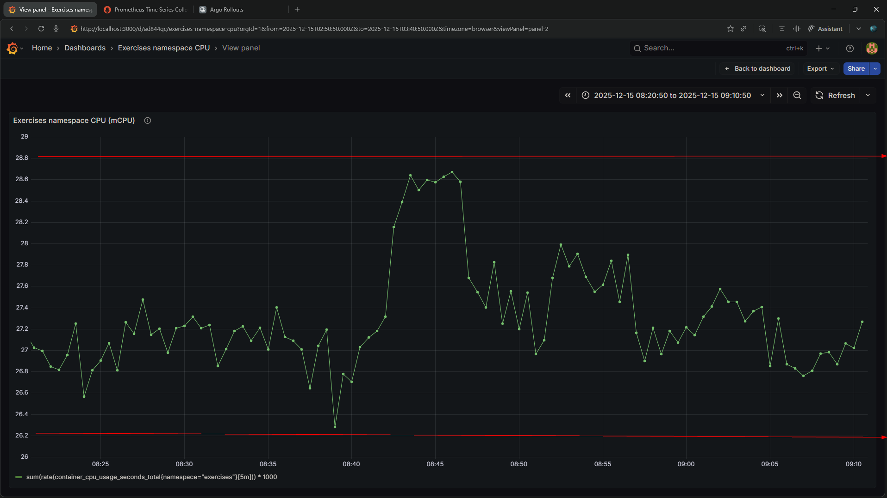
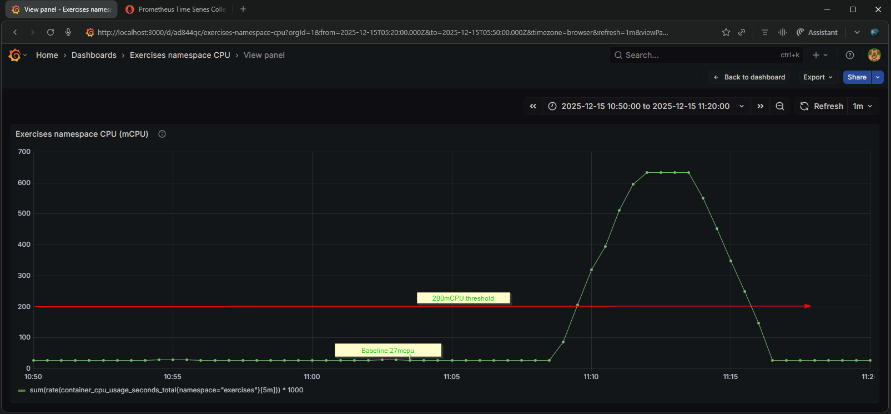
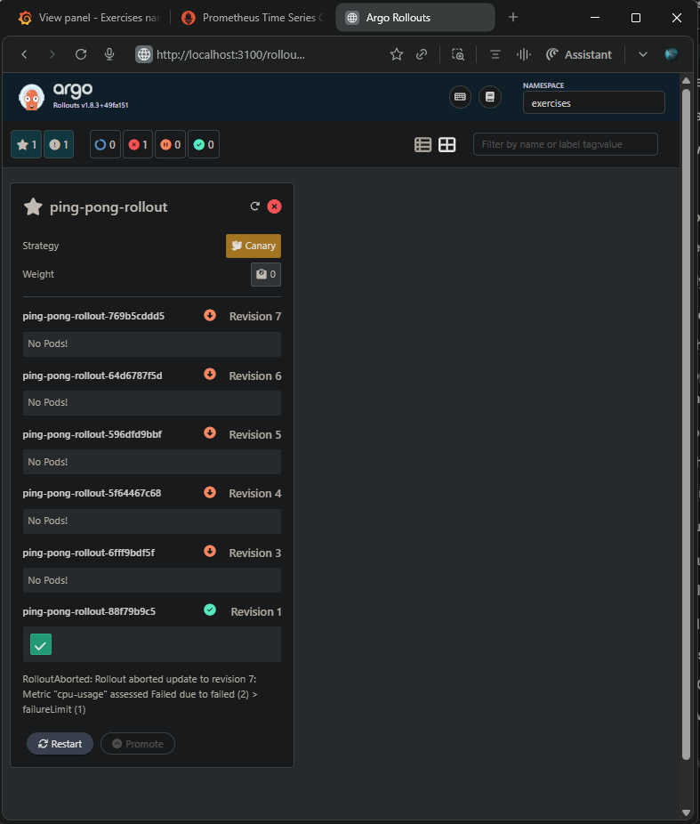
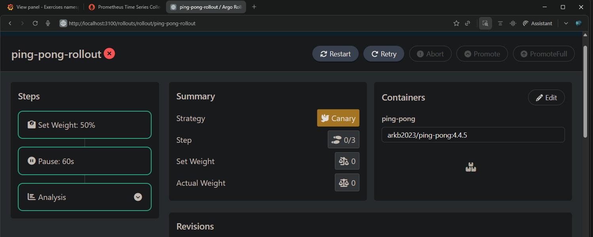
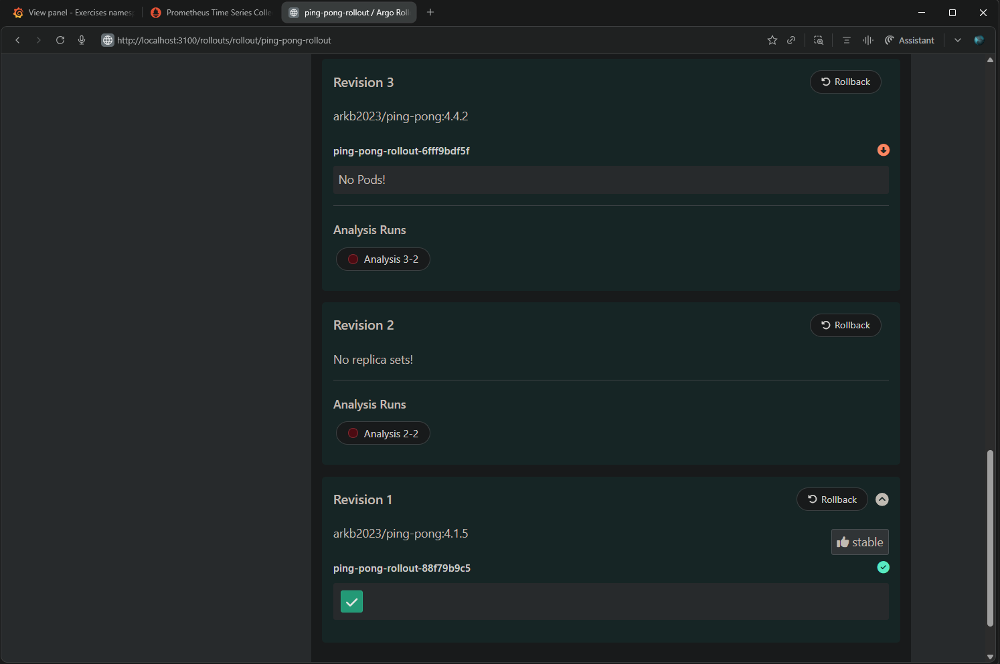
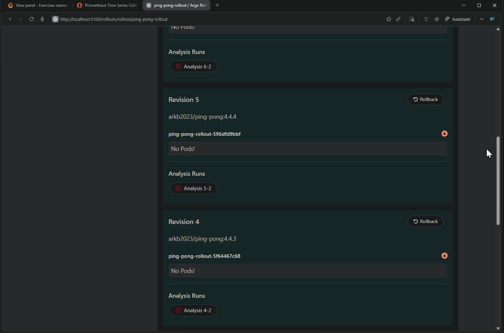
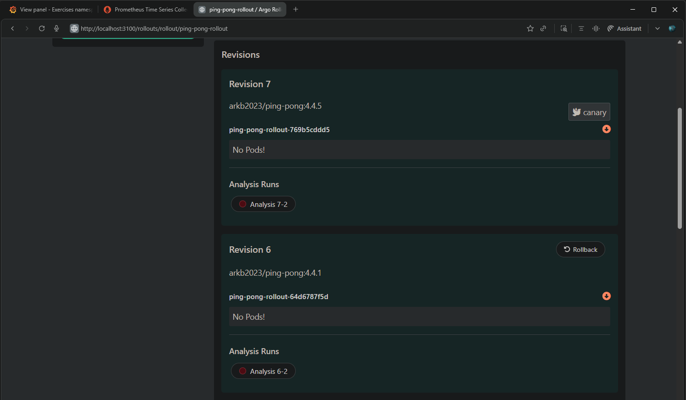
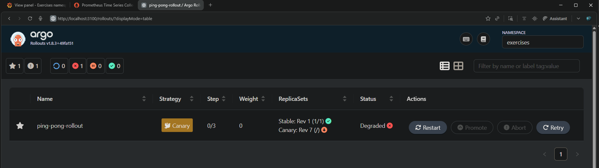

## Exercise 4.4. Your canary

**Instructions:**  

Create an `AnalysisTemplate` for the Ping-pong app that will follow the CPU usage of all containers in the namespace.

If the CPU usage rate sum for the namespace increases above a set value (you may choose a good hardcoded value) within 5 minutes, revert the update.

Make sure that the application doesn't get updated, if the value is set too low.

---

**Key Changes from Base**

- **[`cpu-analysis-template.yaml`](../apps/ping-pong-log-output/cpu-analysis-template.yaml)**  
  AnalysisTemplate monitoring total CPU usage (millicores) across all containers in the `exercises` namespace using Prometheus provider. Evaluates `sum(rate(container_cpu_usage_seconds_total{namespace="{{args.namespace}}"}[5m])) * 1000` every 1 minute for 5 minutes total.

- **[`ping-pong-rollout.yaml`](../apps/ping-pong-log-output/ping-pong-rollout.yaml)**  
  Replaces original `ping-pong-deployment.yaml` Deployment with Argo Rollouts using 3-step canary strategy: `setWeight: 50`, `pause: 60s`, and `analysis` referencing `pingpong-cpu-analysis` template.

- **[`pingpong.py`](./pingpong.py)**  
  Added conditional CPU stress burner controlled by `ENABLE_CPU_STRESS` environment flag to simulate high-CPU versions for testing analysis rollback behavior.

- Base application:  
  - [Ping pong v4.1](https://github.com/arkb2023/devops-kubernetes/tree/4.1/ping-pong)

---

**Approach:**

1. **Deploy stable baseline** - `arkb2023/ping-pong:4.1.5`, Measure Grafana CPU: **20-30 mCPU** steady state,  Set AnalysisTemplate threshold `result[0] < 200` *(With headroom)*.

2. **CPU stress test** - Deploy [`arkb2023/ping-pong:4.4.4`](https://hub.docker.com/repository/docker/arkb2023/ping-pong/tags/4.4.4) (`ENABLE_CPU_STRESS=true`): **Rollout aborts** (revision:5) as `cpu-usage > 200mCPU`, Auto-rollback to stable.

3. **Threshold protection** - Set `result[0] < 10` (below baseline) → Deploy normal version: **Rollout blocked** (revision:7) despite healthy app.

---

**Directory and File Structure**
<pre>
environments/                                   # Multi-env overlays (local/GKE)
├── exercises-gke                               # GKE environment specific overlays
│   ├── gateway.yaml                            # Gateway API
│   ├── kustomization.yaml                      # Top level kustomization entry point 
│   ├── log-output-route.yaml                   # log-output HTTPRoute
│   ├── namespace.yaml                          # Namespace
│   └── ping-pong-route.yaml                    # ping-pong HTTPRoute
├── exercises-local                             # Local k3d environment specific overlays
│   ├── kustomization.yaml                      # Top level kustomization entry point
│   ├── log-output-ingress.yaml                 # log-output ingress
│   ├── namespace.yaml                          # Namespace
│   └── ping-pong-ingress.yaml                  # Ping-pong ingress
  
apps/                                           # Shared base resources
├── ping-pong-log-output                        # Consolidated app manifests + kustomization
│   ├── kustomization.yaml                      # Base manifests for ping-pong + log-output
│   ├── log-output-configmap.yaml               # log-output ConfigMap
│   ├── log-output-deployment.yaml              # log-output Deployment
│   ├── log-output-service.yaml                 # log-output Service 
│   ├── ping-pong-deployment.yaml               # ping-pong Deployment 
│   ├── ping-pong-service.yaml                  # ping-pong Service
│   ├── postgresql-configmap.yaml               # PostgreSQL ConfigMap
│   ├── postgresql-service.yaml                 # PostgreSQL Service
│   ├── postgresql-statefulset.yaml             # PostgreSQL StatefulSet 
│   ├── ping-pong-rollout.yaml                  # Ping-pong rollout
│   └── cpu-analysis-template.yaml              # CPU analysis template 

# Ping Pong application
ping-pong/
├── Dockerfile
├── README.md
└── pingpong.py

# Log output application
log_output/
├── generator
│   ├── Dockerfile
│   └── generator.py
└── reader
    ├── Dockerfile
    └── reader.py
</pre>

---

**Setup**
- Docker  
- k3d (K3s in Docker)  
- kubectl (Kubernetes CLI)
- Helm: v3.19.2
- Create Cluster 
  ```bash
  k3d cluster create dwk-local --agents 2 --port 8081:80@loadbalancer
  ```
- Monitoring Stack (kube-prometheus-stack-1765510291):  
  - Prometheus:  
    ```bash
    kubectl -n prometheus port-forward svc/kube-prometheus-stack-1765-prometheus 9090:9090
    ```
    ```text
    Forwarding from 127.0.0.1:9090 -> 9090
    Forwarding from [::1]:9090 -> 9090
    ```
    > Prometheus accessible at `http://localhost:9090`
  - Graphana:  
    ```bash
    kubectl -n prometheus port-forward svc/kube-prometheus-stack-1765510291-grafana 3000:80
    ```
    Output:  
    ```text
    Forwarding from 127.0.0.1:3000 -> 3000
    Forwarding from [::1]:3000 -> 3000
    ```
    > Graphana accessible at `http://localhost:3000`

- Argo Rollouts Dashboard:  
  ```bash
  kubectl argo rollouts dashboard
  ```
  Output:  
  ```text
  INFO[0000] [core] [Channel #1 SubChannel #2]grpc: addrConn.createTransport failed to connect to {Addr: "0.0.0.0:3100", ServerName: "0.0.0.0:3100", }. Err: connection error: desc = "transport: Error while dialing: dial tcp 0.0.0.0:3100: connect: connection refused"
  INFO[0000] Argo Rollouts Dashboard is now available at http://localhost:3100/rollouts
  ```
  > Argo Rollouts accessible at `http://localhost:3100/rollouts`


---

### 1. Deploy stable version (arkb2023/ping-pong:4.1.5) and derive threshold
  - Switch to Argo Rollouts:
    - Edit [`kustomization.yaml`](../apps/ping-pong-log-output/kustomization.yaml)
    - Comment out deployment manifest [`ping-pong-deployment.yaml`](../apps/ping-pong-log-output/ping-pong-deployment.yaml)
    - Add [`ping-pong-rollout.yaml`](../apps/ping-pong-log-output/ping-pong-rollout.yaml) instead
  - Deploy  
  ```bash
  kustomize build environments/exercises-local/ | kubectl apply -f -
  ```
  - **Grafana baseline**: 
      
    > Observation: 20-30 mCPU steady state  

  - **Set AnalysisTemplate threshold**: `result[0] < 200` *(With headroom above baseline)* in [`cpu-analysis-template.yaml`](../apps/ping-pong-log-output/cpu-analysis-template.yaml)

### 2. Deploy CPU-stressing version arkb2023/ping-pong:4.4.4
  - Apply the Analysis Template
    ```bash
    kubectl -n exercises apply -f apps/ping-pong-log-output/cpu-analysis-template.yaml
    ```
  - Set `ENABLE_CPU_STRESS=true` in rollout manifest [`ping-pong-rollout.yaml`](../apps/ping-pong-log-output/ping-pong-rollout.yaml)
  
  - Redeploy
    ```bash
    kustomize build environments/exercises-local/ | kubectl apply -f -
    ```
  
  - Monitor Argo Rollout:  
    ```bash
    kubectl argo rollouts -n exercises get rollout ping-pong-rollout
    ```
  - Apply the Analysis template
    ```bash
    kubectl -n exercises apply -f apps/ping-pong-log-output/cpu-analysis-template.yaml
    ```
  - Monitor Argo rollout
    ```bash
    kubectl argo rollouts -n exercises get rollout ping-pong-rollout
    ```
    Output:  
    ```text
    Name:            ping-pong-rollout
    Namespace:       exercises
    Status:          ✖ Degraded
    Message:         RolloutAborted: Rollout aborted update to revision 5: Metric "cpu-usage" assessed Failed due to failed (2) > failureLimit (1)
    Strategy:        Canary
      Step:          0/3
      SetWeight:     0
      ActualWeight:  0
    Images:          arkb2023/ping-pong:4.1.5 (stable)
    Replicas:
      Desired:       1
      Current:       1
      Updated:       0
      Ready:         1
      Available:     1

    NAME                                          KIND         STATUS        AGE    INFO
    ⟳ ping-pong-rollout                           Rollout      ✖ Degraded    2d20h
    ├──# revision:5
    │  ├──⧉ ping-pong-rollout-596dfd9bbf          ReplicaSet   • ScaledDown  38m    canary
    │  └──α ping-pong-rollout-596dfd9bbf-5-2      AnalysisRun  ✖ Failed      36m    ✖ 2
    ├──# revision:4
    │  ├──⧉ ping-pong-rollout-5f64467c68          ReplicaSet   • ScaledDown  67m
    │  └──α ping-pong-rollout-5f64467c68-4-2      AnalysisRun  ⚠ Error       66m    ⚠ 5
    ├──# revision:3
    │  ├──⧉ ping-pong-rollout-6fff9bdf5f          ReplicaSet   • ScaledDown  89m
    │  └──α ping-pong-rollout-6fff9bdf5f-3-2      AnalysisRun  ⚠ Error       88m    ⚠ 5
    ├──# revision:2
    │  ├──⧉ ping-pong-rollout-64d6787f5d          ReplicaSet   • ScaledDown  112m
    │  └──α ping-pong-rollout-64d6787f5d-2-2      AnalysisRun  ⚠ Error       111m   ⚠ 5
    └──# revision:1
      └──⧉ ping-pong-rollout-88f79b9c5           ReplicaSet   ✔ Healthy     2d20h  stable
          └──□ ping-pong-rollout-88f79b9c5-2pxzc  Pod          ✔ Running     2d20h  ready:1/1,restarts:1
    ```
    **Revisions Summary:**  
    ```
    revision:1 (4.1.5) → ✔ Healthy (stable)
    revision:2-4 (4.4.1, 4.4.2, 4.4.3) → ⚠ Error (syntax issues, ignored, rolled back to baseline revision:1)
    revision:5 (4.4.4) → ✖ Failed (CPU > 200mCPU)
      └── AnalysisRun: ping-pong-rollout-596dfd9bbf-5-2 → ✖ Failed
    ```

  - **AnalysisRun Status:**
    ```bash
    kubectl -n exercises get analysisrun
    ```
    ```
    NAME                               STATUS   AGE
    ping-pong-rollout-596dfd9bbf-5-2   Failed   37m   # Successful in CPU threshold breach
    ping-pong-rollout-5f64467c68-4-2   Error    67m   # Error: v4.4.3 Ignore
    ping-pong-rollout-64d6787f5d-2-2   Error    112m  # Error: v4.4.1 Ignore
    ping-pong-rollout-6fff9bdf5f-3-2   Error    89m   # Error: v4.4.2 Ignore
    ```

  - **Grafana CPU spike:** 
    
    > Shows CPU spiked >200mCPU

  - **Conclusion:**  
    Argo Rollouts + AnalysisRun + Grafana confirm:  
    For **CPU > 200mCPU, Rollout aborted, Automatic rollback to stable `4.1.5`**

---

### 3. Threshold Protection Test *(Too-Low Threshold)*:  
**Test:** Verify application doesn't update when threshold is set too low.  

  - **Set AnalysisTemplate threshold**: `result[0] < 10` *(Well below 20-30 mCPU baseline)* in [`cpu-analysis-template.yaml`](../apps/ping-pong-log-output/cpu-analysis-template.yaml)

  - Apply the Analysis template
    ```bash
    kubectl -n exercises apply -f apps/ping-pong-log-output/cpu-analysis-template.yaml
    ```
  - Verify configuration
    ```bash
    kubectl -n exercises get analysistemplate pingpong-cpu-analysis -o yaml | sed -n '20,80p'
    ```
    Output:  
    ```text
    interval: 1m
    name: cpu-usage
    provider:
      prometheus:
        address: http://kube-prometheus-stack-1765-prometheus.prometheus.svc.cluster.local:9090
        query: |
          sum(rate(container_cpu_usage_seconds_total{namespace="{{args.namespace}}"}[5m])) * 1000
    successCondition: result[0] < 10
    ```
    > Threshold `result[0] < 10` set correctly  

  - Deploy normal version (ENABLE_CPU_STRESS=false, image 4.4.5):  
    ```bash
    kustomize build environments/exercises-local/ | kubectl apply -f -
    ```
  - Monitor Argo rollout
    ```bash
    kubectl argo rollouts -n exercises get rollout ping-pong-rollout
    ```
    Output:  
    ```text
    Name:            ping-pong-rollout
    Namespace:       exercises
    Status:          ✖ Degraded
    Message:         RolloutAborted: Rollout aborted update to revision 7: Metric "cpu-usage" assessed Failed due to failed (2) > failureLimit (1)
    Strategy:        Canary
      Step:          0/3
      SetWeight:     0
      ActualWeight:  0
    Images:          arkb2023/ping-pong:4.1.5 (stable)
    Replicas:
      Desired:       1
      Current:       1
      Updated:       0
      Ready:         1
      Available:     1

    NAME                                           KIND         STATUS         AGE    INFO
    ⟳ ping-pong-rollout                            Rollout      ✖ Degraded     2d21h
    ├──# revision:7
    │  ├──⧉ ping-pong-rollout-769b5cddd5           ReplicaSet   • ScaledDown   2m57s  canary
    │  │  └──□ ping-pong-rollout-769b5cddd5-gptfm  Pod          ◌ Terminating  2m57s  ready:1/1
    │  └──α ping-pong-rollout-769b5cddd5-7-2       AnalysisRun  ✖ Failed       86s    ✖ 2
    ├──# revision:6
    │  ├──⧉ ping-pong-rollout-64d6787f5d           ReplicaSet   • ScaledDown   137m
    │  └──α ping-pong-rollout-64d6787f5d-6-2       AnalysisRun  ✖ Failed       12m    ✖ 2
    ├──# revision:5
    │  ├──⧉ ping-pong-rollout-596dfd9bbf           ReplicaSet   • ScaledDown   63m
    │  └──α ping-pong-rollout-596dfd9bbf-5-2       AnalysisRun  ✖ Failed       61m    ✖ 2
    ├──# revision:4
    │  ├──⧉ ping-pong-rollout-5f64467c68           ReplicaSet   • ScaledDown   92m
    │  └──α ping-pong-rollout-5f64467c68-4-2       AnalysisRun  ⚠ Error        91m    ⚠ 5
    ├──# revision:3
    │  ├──⧉ ping-pong-rollout-6fff9bdf5f           ReplicaSet   • ScaledDown   114m
    │  └──α ping-pong-rollout-6fff9bdf5f-3-2       AnalysisRun  ⚠ Error        113m   ⚠ 5
    ├──# revision:2
    │  └──α ping-pong-rollout-64d6787f5d-2-2       AnalysisRun  ⚠ Error        136m   ⚠ 5
    └──# revision:1
      └──⧉ ping-pong-rollout-88f79b9c5            ReplicaSet   ✔ Healthy      2d21h  stable
          └──□ ping-pong-rollout-88f79b9c5-gsg45   Pod          ✔ Running      4m25s  ready:1/1
    ```
    **Revisions Summary:**  
    ```
    # --- Start: Same as before-----
    revision:1 (4.1.5) → ✔ Healthy (stable)
    revision:2-4 (4.4.1, 4.4.2, 4.4.3) → ⚠ Error (syntax issues, ignored, rolled back to baseline revision:1)
    revision:5 (4.4.4) → ✖ Failed (CPU > 200mCPU)
      └── AnalysisRun: ping-pong-rollout-596dfd9bbf-5-2 → ✖ Failed
    # --- End: Same as before-----
    revision:6 - ignore, wrong settings, rolled back to baseline revision:1
    revision:7 (4.4.5, normal app) → ✖ Failed (baseline CPU 20-30 > 10 threshold)
      └── AnalysisRun: ping-pong-rollout-769b5cddd5-7-2 → ✖ Failed
    ```

  - **AnalysisRun Status:**
    ```bash
    kubectl -n exercises get analysisrun --watch
    ```
    ```
    NAME                               STATUS   AGE
    ping-pong-rollout-596dfd9bbf-5-2   Failed   38m     # Same as before
    ping-pong-rollout-5f64467c68-4-2   Error    67m     # Same as before
    ping-pong-rollout-64d6787f5d-2-2   Error    113m    # Same as before
    ping-pong-rollout-6fff9bdf5f-3-2   Error    90m     # Same as before
    ping-pong-rollout-64d6787f5d-6-2            0s      # ignore, app with wrong setting
    ping-pong-rollout-64d6787f5d-6-2   Running   0s     #  
    ping-pong-rollout-64d6787f5d-6-2   Failed    60s    # 
    ping-pong-rollout-769b5cddd5-7-2             0s     # Booting 
    ping-pong-rollout-769b5cddd5-7-2   Running   0s     # Running
    ping-pong-rollout-769b5cddd5-7-2   Failed    60s    # Normal app blocked by low threshold
    ```

  - **Conclusion:**  
    Argo Rollouts + AnalysisRun + Grafana confirm:  
    Rollout of stable version with low threshold (CPU > 10mCPU) is not allowed 

### 4. Visualization of the states of rollouts in Argo Rollout Dashoard

- **Namespace Grid View:**  
    

- **Rollout Details:**  
    

- **Revision States:**  
  - *Revision 1, 2, 3*  
      

  - *Revision 4, 5*  
      

  - *Revision 6, 7*  
      

- **Table Summary:**  
  

---

### 5. **Cleanup**

**Delete resources**
```bash
kubectl delete namespace exercises 
```
**Delete Cluster**
```bash
k3d cluster delete dwk-local
```

---
# Docker secrets ready Wed Dec 17 11:16:44 IST 2025
