## Exercise 3.6. The project, step 15

**Objective**: Setup automatic deployment for the project - Integrate GitHub Actions Workflow, Google Artifact Registory and Google Kubernetes Engine.

**Key Changes from Base**  
  - [`dwk-gke-repository`](https://console.cloud.google.com/artifacts/docker/dwk-gke-480015/asia-south1/dwk-gke-repository?hl=en&project=dwk-gke-480015) - Google Artifact Registry for Docker images  
  - Google Service Account `github-actions` with IAM roles  
  - [.github/workflows/project-gke.yaml](../.github/workflows/project-gke.yaml) - GitHub Action workflow to Build, Push SHA images, Kustomize transform and GKE deploy
  - [environments/project-gke/kustomization.yaml](../environments/project-gke/kustomization.yaml) - Updated for Registry prefix overlay
***

**Base Application Version**
- [The project v3.5](https://github.com/arkb2023/devops-kubernetes/tree/3.5/the_project/)

### 1. **Directory and File Structure**
<pre>
  # Github actions workflow
  .github/
  └── workflows
      └── project-gke.yaml

  # kustomization: Common Project resource yamls 
    apps/the-project/
  ├── cron_wiki_todo.yaml
  ├── kustomization.yaml
  ├── postgres-db-secret.yaml
  ├── postgresql-configmap.yaml
  ├── postgresql-service.yaml
  ├── postgresql-statefulset.yaml
  ├── project-configmap.yaml
  ├── todo-app-deployment.yaml
  ├── todo-app-service.yaml
  ├── todo-backend-deployment.yaml
  └── todo-backend-service.yaml

  # kustomization: GKE Project resource yamls 
  environments/project-gke/
  ├── gateway.yaml
  ├── kustomization.yaml
  ├── namespace.yaml
  ├── persistentvolumeclaim.yaml
  ├── todo-app-route.yaml
  └── todo-backend-route.yaml

  # Todo App 
  the_project/todo_app/
  ├── Dockerfile
  ├── app
  │   ├── __init__.py
  │   ├── cache.py
  │   ├── main.py
  │   ├── routes
  │   │   ├── __init__.py
  │   │   └── frontend.py
  │   ├── static
  │   │   └── scripts.js
  │   └── templates
  │       └── index.html

  # Todo Backend App 
  the_project/todo_backend/
  ├── Dockerfile
  ├── app
  │   ├── __init__.py
  │   ├── main.py
  │   ├── models.py
  │   ├── routes
  │   │   ├── __init__.py
  │   │   └── todos.py
  │   └── storage.py
  ├── docker-compose.yml
  └── wait-for-it.sh

  # Wiki Todo Generator CronJob
  the_project/cronjob/
  ├── Dockerfile
  └── cron_wiki_todo.py
</pre>


### 2. Prerequisites (GCP/GKE)

- Google Cloud CLI (`gcloud`) updated to 548.0.0
- kubectl with `gke-gcloud-auth-plugin`
- GCP Project: `dwk-gke-480015` configured
- Cluster Creation:
  ```bash
  gcloud container clusters create dwk-cluster \
    --zone=asia-south1-a \
    --cluster-version=1.32 \
    --num-nodes=3 \
    --machine-type=e2-medium \
    --gateway-api=standard \
    --disk-size=50 \
    --enable-ip-alias
  ```
- Fetch and configure Kubernetes cluster access credentials locally, enabling kubectl to authenticate and manage the specified GKE cluster  
  ```bash
  gcloud container clusters get-credentials dwk-cluster --zone=asia-south1-a
  ```

### 3. Google Service Account
  - Created service Account `github-actions`  
    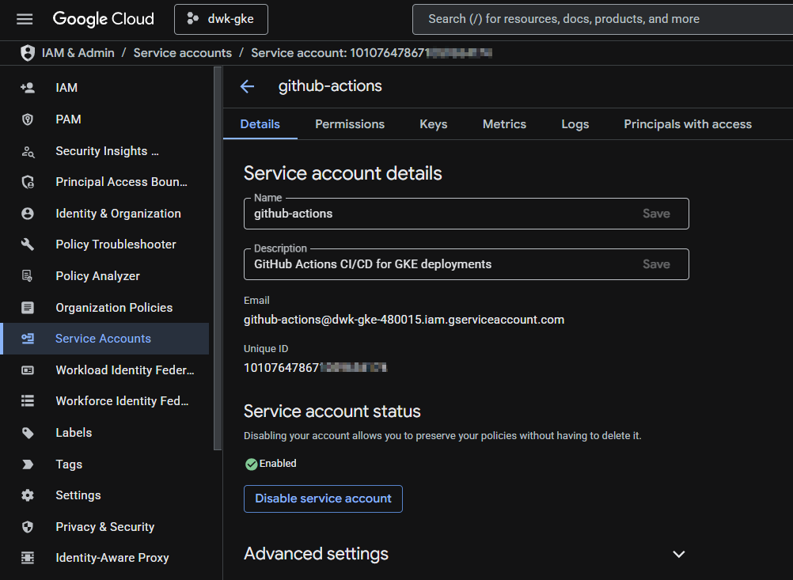  

  - Assign IAM roles  
    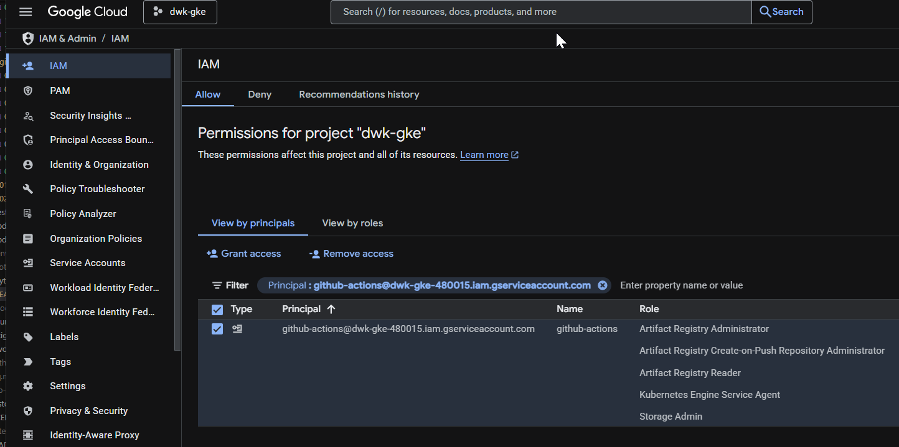  
    > Shows assisgned IAM roles  
    >   - Kubernetes Engine Service Agent  
    >   - Storage Admin  
    >   - Artifact Registry Administrator  
    >   - Artifact Registry Create-on-Push Repository Administrator  
    >   - Artifact Registry Reader  

### 4. Google Artifact Registry
  - Created repository `dwk-gke-repository` (asia-south1)  
      

### 5. GitHub Actions Repository secrets
  - GitHub Actions authentication for GKE + Artifact Registry via Repository Secrets:  
    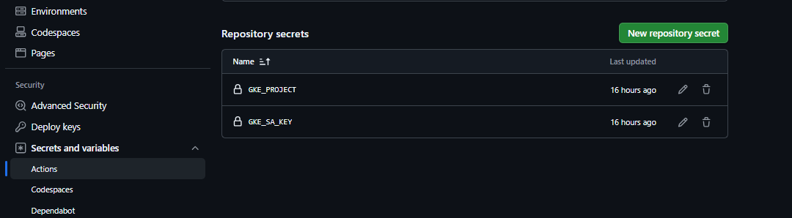

### 6. Setup GitHub Actions pipeline
  Automatic CI/CD triggered with relevant changes:
  - Trigger on push to main branch
  - Relavant environment variables
      ```yaml
      env:
        GKE_CLUSTER: dwk-cluster
        GKE_ZONE: asia-south1-a 
        PROJECT_ID: dwk-gke-480015
        REGISTRY: asia-south1-docker.pkg.dev
        REPOSITORY: dwk-gke-repository
      ```
  - Three jobs:
    - `build-todo-app`: Docker build, Push `todo-app:${GITHUB_SHA}` to Google Artifact Registry
    - `build-todo-backend`: Docker build, Push `todo-backend:${GITHUB_SHA}` to Google Artifact Registry
    - `deploy`: Depends on `build-todo-app` and `build-todo-backend`, kustomize SHA transform, GKE deploy
  - Workflow file: [`.github/workflows/project-gke.yaml`](../.github/workflows/project-gke.yaml)

### 7. End-to-end Validation
  - Trigger Pipeline
    ```bash
    git add .
    git commit -m "Test: Project - Build, Publish & Deploy"
    git push origin main
    ```
  - Workflow Success: [Run #19986721622](https://github.com/arkb2023/devops-kubernetes/actions/runs/19986721622) and monitor progress
    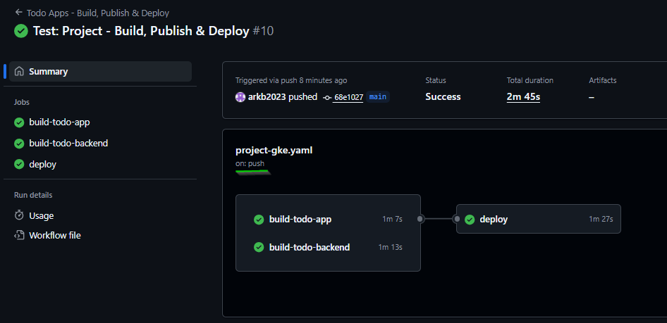  
    
  - Build Jobs - `build-todo-app` and `build-todo-backed`:  
    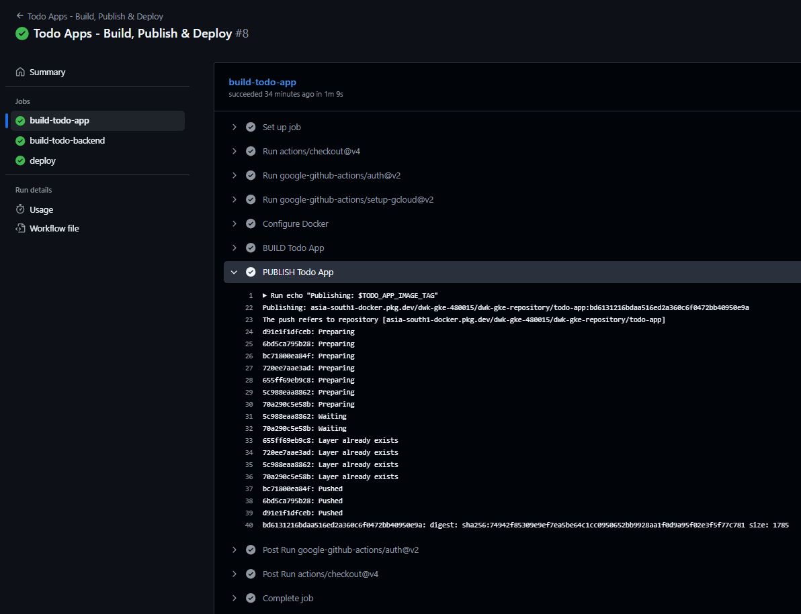  
    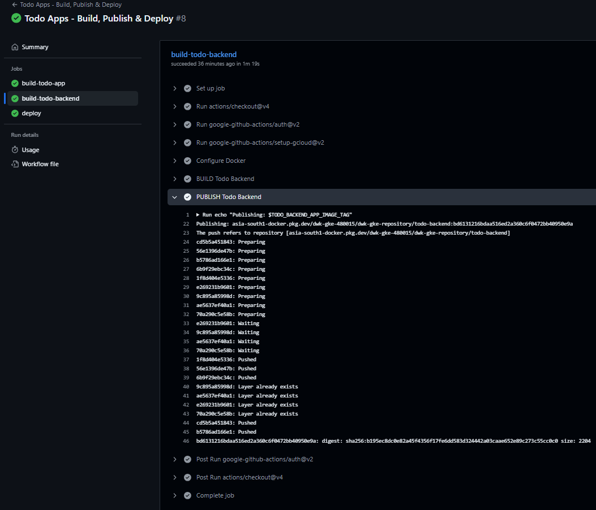  

  - SHA Deploy:  
    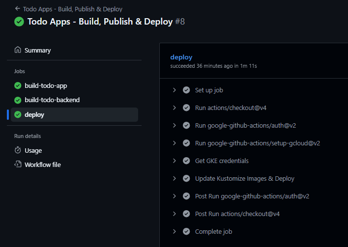  
      
      
    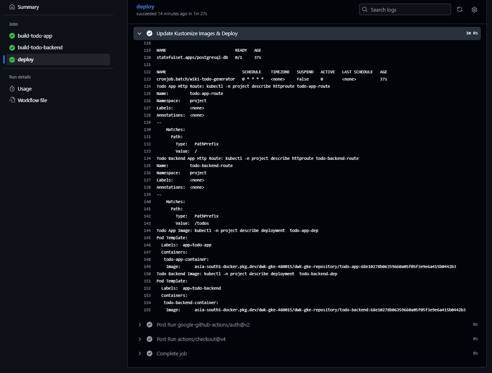  
  
  - Artifact Registry SHA Images  
    - SHA-tagged images created on GitHub Actions push:  
      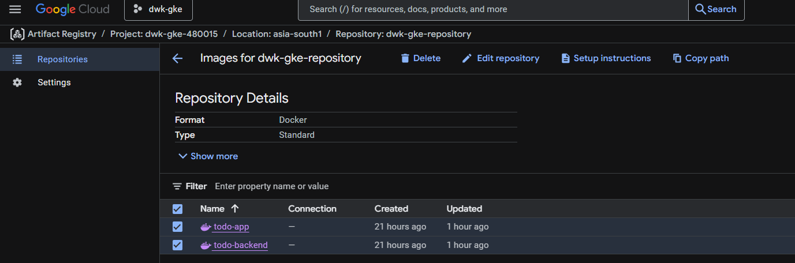

    - Todo App Image  
      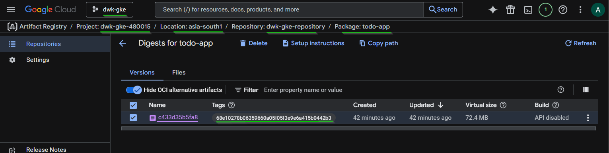  

    - Todo Backend App Image  
      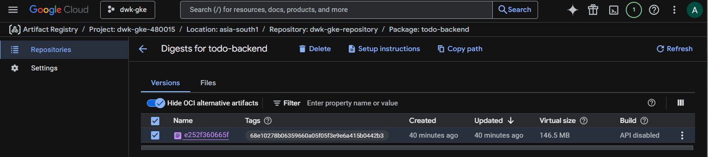  
  
  - Validate deployment through gcloud cli  
    - Verify PVC status  
      ```bash
      kubectl -n project get pvc
      ```
      *Output*
      ```text
      NAME                                 STATUS   VOLUME                                     CAPACITY   ACCESS MODES   STORAGECLASS   VOLUMEATTRIBUTESCLASS   AGE
      local-pv-claim                       Bound    pvc-a540ce25-ce14-494e-8806-815237dc72df   1Gi        RWO            standard-rwo   <unset>                 24m
      postgresql-db-disk-postgresql-db-0   Bound    pvc-465d9ed0-273c-453b-9943-0a7c1c3d10e6   1Gi        RWO            standard-rwo   <unset>                 24m
      ```
    - Verify Image in `todo-app` and `todo-backend` deployments
      - Check Todo App Deployment
        ```bash
        kubectl -n project describe deployment  todo-app-dep |grep -A4 "Pod Template:"
        ```
        *Output*
        ```text
        Pod Template:
          Labels:  app=todo-app
          Containers:
          todo-app-container:
            Image:      asia-south1-docker.pkg.dev/dwk-gke-480015/dwk-gke-repository/todo-app:bd6131216bdaa516ed2a360c6f0472bb40950e9a
        ```
      - Check Todo Backend App Deployment
        ```bash
        kubectl -n project describe deployment  todo-backend-dep |grep -A4 "Pod Template:"
        ```
        *Output*
        ```text
        Pod Template:
          Labels:  app=todo-backend
          Containers:
          todo-backend-container:
            Image:      asia-south1-docker.pkg.dev/dwk-gke-480015/dwk-gke-repository/todo-backend:bd6131216bdaa516ed2a360c6f0472bb40950e9a
        ```
    - GKE Cluster Health  
        ```bash
        kubectl -n project get all 
        ```
        *Output*
        ```text
        NAME                                     READY   STATUS      RESTARTS   AGE
        pod/postgresql-db-0                      1/1     Running     0          22m
        pod/todo-app-dep-f4c48bd87-2kmjz         1/1     Running     0          22m
        pod/todo-backend-dep-698997bf5b-kzlbh    1/1     Running     0          22m
        pod/wiki-todo-generator-29416920-n9kmf   0/1     Completed   0          7m36s

        NAME                        TYPE        CLUSTER-IP      EXTERNAL-IP   PORT(S)    AGE
        service/postgresql-db-svc   ClusterIP   None            <none>        5432/TCP   22m
        service/todo-app-svc        ClusterIP   34.118.230.54   <none>        1234/TCP   22m
        service/todo-backend-svc    ClusterIP   34.118.233.69   <none>        4567/TCP   22m

        NAME                               READY   UP-TO-DATE   AVAILABLE   AGE
        deployment.apps/todo-app-dep       1/1     1            1           22m
        deployment.apps/todo-backend-dep   1/1     1            1           22m

        NAME                                          DESIRED   CURRENT   READY   AGE
        replicaset.apps/todo-app-dep-f4c48bd87        1         1         1       22m
        replicaset.apps/todo-backend-dep-698997bf5b   1         1         1       22m

        NAME                             READY   AGE
        statefulset.apps/postgresql-db   1/1     22m

        NAME                                SCHEDULE    TIMEZONE   SUSPEND   ACTIVE   LAST SCHEDULE   AGE
        cronjob.batch/wiki-todo-generator   0 * * * *   <none>     False     0        7m37s           22m

        NAME                                     STATUS     COMPLETIONS   DURATION   AGE
        job.batch/wiki-todo-generator-29416920   Complete   1/1           13s        7m37s
        ```
    - Verify HTTProutes configured for `todo-app` and `todo-backend`
      - Check Todo App Route    
          ```bash
          kubectl -n project describe httproute todo-app-route |grep -A3 -e "Name:.*todo-app-route" -e "Matches:"
          ```
          *Output*
          ```text
          Name:         todo-app-route
          Namespace:    project
          Labels:       <none>
          Annotations:  <none>
          --
              Matches:
                Path:
                  Type:   PathPrefix
                  Value:  /
          ```
      - Check Todo Backend App Route    
          ```bash
          kubectl -n project describe httproute todo-backend-route |grep -A3 -e "Name:.*todo-backend-route" -e "Matches:"
          ```
          *Output*
          ```text
          Name:         todo-backend-route
          Namespace:    project
          Labels:       <none>
          Annotations:  <none>
          --
              Matches:
                Path:
                  Type:   PathPrefix
                  Value:  /todos
          ```
      - Verify Gateway API controller status  
        ```bash
        kubectl -n project get gateway
        ```
        *Output*
        ```text
        NAME              CLASS                            ADDRESS          PROGRAMMED   AGE
        project-gateway   gke-l7-global-external-managed   34.144.232.237   True         2m11s
        ```
  - Validate Live Application  
    Use the Gateway Address `http://34.144.232.237` to access the application:  
    - Test Todo App response on `/` HTTP endpoint:  
      - Application returns the expected response  
        
    
    - Test Todo Creation:  
      - Application shows the created todo item in response    
        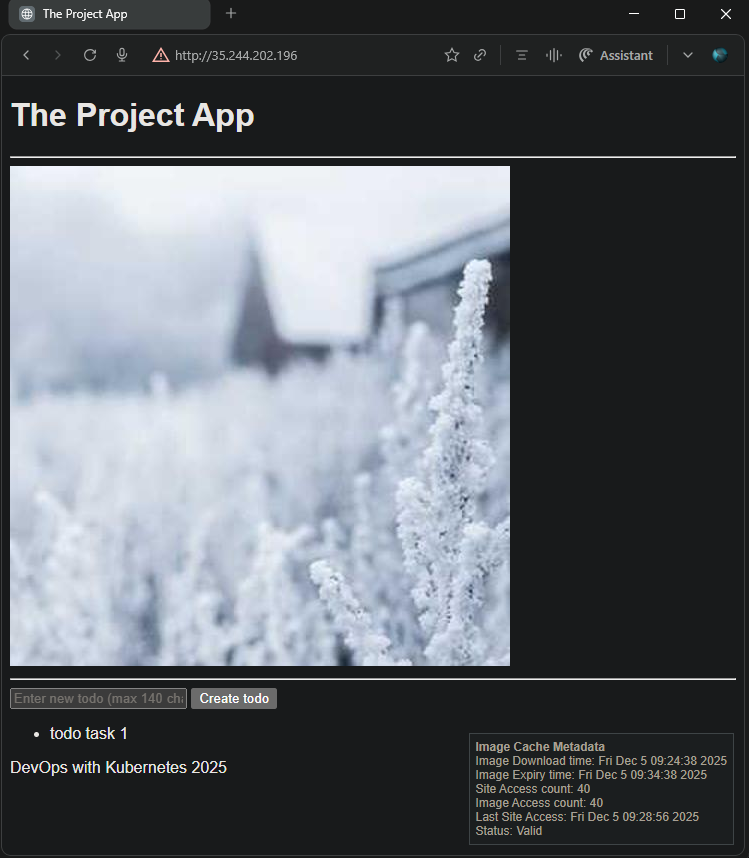
      
## 8. Cleanup

**Delete all project resources (Kustomize)**
```bash
kubectl delete -k environments/project-gke
```
**Delete GKE cluster**
```bash
gcloud container clusters delete dwk-cluster \
  --zone=asia-south1-a \
  --quiet
```

---