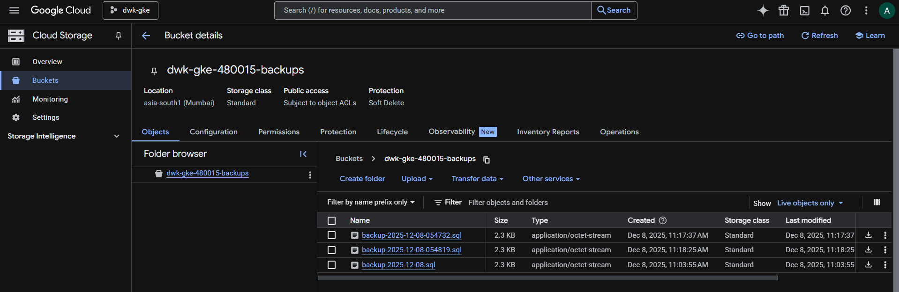

## Exercise 3.10. The project, step 18

**Objective**: Create a CronJob that makes a backup of todo database (once per 24 hours) and saves it to Google Object Storage.

**Key Components**  
  - [`postgresql-backup-cronjob.yaml`](./../apps/the-project/postgresql-backup-cronjob.yaml) - CronJob that backs up PostgreSQL database to Google Cloud Storage. Uses Workload Identity with PostgreSQL 18.
    - Runs daily at 2:00 AM UTC (`schedule: "0 2 * * *"`)
    - Uses PostgreSQL 18 client (matches database version)
    - Backs up database using `pg_dump`
    - Uploads backups to GCS bucket `dwk-gke-480015-backups`
    - Uses Workload Identity for secure authentication (no stored keys)
    - Backup files named as `backup-YYYY-MM-DD.sql`

**Verification**
- Backups successfully created and stored in Google Cloud Storage
- CronJob executes on schedule
- Backup files accessible via GCS console and `gsutil`

**Base Application**
- [The project v3.8](https://github.com/arkb2023/devops-kubernetes/tree/3.8/the_project/)

### 1. **Directory and File Structure**
<pre>
  # Github actions workflow
  .github/
  └── workflows
      ├── project-gke.yaml
      └── project-gke-cleanup.yaml

  # kustomization: Common Project resource yamls 
  apps/the-project/
  ├── cron_wiki_todo.yaml
  ├── kustomization.yaml
  ├── postgres-db-secret.yaml
  ├── postgresql-backup-cronjob.yaml      # Newly added
  ├── postgresql-configmap.yaml
  ├── postgresql-service.yaml
  ├── postgresql-statefulset.yaml
  ├── project-configmap.yaml
  ├── todo-app-deployment.yaml
  ├── todo-app-service.yaml
  ├── todo-backend-deployment.yaml
  └── todo-backend-service.yaml

  # kustomization: GKE Project resource yamls 
  environments/project-gke/
  ├── gateway.yaml
  ├── kustomization.yaml
  ├── namespace.yaml
  ├── persistentvolumeclaim.yaml
  ├── todo-app-route.yaml
  └── todo-backend-route.yaml

  # Todo App 
  the_project/todo_app/
  ├── Dockerfile
  ├── app
  │   ├── __init__.py
  │   ├── cache.py
  │   ├── main.py
  │   ├── routes
  │   │   ├── __init__.py
  │   │   └── frontend.py
  │   ├── static
  │   │   └── scripts.js
  │   └── templates
  │       └── index.html

  # Todo Backend App 
  the_project/todo_backend/
  ├── Dockerfile
  ├── app
  │   ├── __init__.py
  │   ├── main.py
  │   ├── models.py
  │   ├── routes
  │   │   ├── __init__.py
  │   │   └── todos.py
  │   └── storage.py
  ├── docker-compose.yml
  └── wait-for-it.sh

  # Wiki Todo Generator CronJob
  the_project/cronjob/
  ├── Dockerfile
  └── cron_wiki_todo.py
</pre>


### 2. **Setup Requirements**

- Google Cloud CLI (`gcloud`) updated to 548.0.0
- kubectl with `gke-gcloud-auth-plugin`
- GCP Project: `dwk-gke-480015` configured
- Google service Account `github-actions`wtih required IAM roles  
- Google Artifact Registry - repository `dwk-gke-repository` (asia-south1)  
- GitHub Actions authentication for GKE + Artifact Registry via Repository Secrets  
- Set environment variables  
    ```bash
    export PROJECT_ID=$(gcloud config get-value project)
    export BUCKET="dwk-gke-480015-backups"
    export CLUSTER_NAME="dwk-cluster"
    export ZONE="asia-south1-a"
    ```

### 3. Cluster Setup
- Cluster Creation:
    ```bash
    gcloud container clusters create dwk-cluster \
      --zone=asia-south1-a \
      --cluster-version=1.32 \
      --num-nodes=3 \
      --machine-type=e2-medium \
      --gateway-api=standard \
      --disk-size=50 \
      --enable-ip-alias \
      --scopes=cloud-platform \
      --workload-pool=${PROJECT_ID}.svc.id.goog
    ```
    Output:  
    ```text
    Creating cluster dwk-cluster in asia-south1-a... Cluster is being health-checked (Kubernetes Control Plane is healthy)...done.
    Created [https://container.googleapis.com/v1/projects/dwk-gke-480015/zones/asia-south1-a/clusters/dwk-cluster].
    To inspect the contents of your cluster, go to: https://console.cloud.google.com/kubernetes/workload_/gcloud/asia-south1-a/dwk-cluster?project=dwk-gke-480015
    kubeconfig entry generated for dwk-cluster.
    NAME         LOCATION       MASTER_VERSION      MASTER_IP      MACHINE_TYPE  NODE_VERSION        NUM_NODES  STATUS   STACK_TYPE
    dwk-cluster  asia-south1-a  1.32.9-gke.1239000  35.244.48.212  e2-medium     1.32.9-gke.1239000  3          RUNNING  IPV4
    ```
    > Enabled Workload Identity on cluster.  
- Get credentials 
    ```bash
    gcloud container clusters get-credentials dwk-cluster \
    --zone=asia-south1-a \
    --project=$PROJECT_ID
    ```
    Output:  
    ```text
    Fetching cluster endpoint and auth data.
    kubeconfig entry generated for dwk-cluster.
    ```
- Verify scope
    ```bash
    gcloud container node-pools describe default-pool \
    --cluster=dwk-cluster \
    --zone=asia-south1-a \
    --format="value(config.oauthScopes)"
    ```
    Output:  
    ```text
    https://www.googleapis.com/auth/cloud-platform
    ```

### 4. Create GCS Bucket
  ```bash
  gsutil mb -l asia-south1 gs://$BUCKET
  ```
  Output:  
  ```text
  Creating gs://dwk-gke-480015-backups/...  
  ```
### 5. Create GCS Service Account
  ```bash
  gcloud iam service-accounts create postgres-backup-sa \
    --display-name="PostgreSQL Backup Service Account"
  ```
  Output:  
  ```text
  Created service account [postgres-backup-sa].
  ```    

### 6. Grant storage permissions to GCP Service Account
  ```bash
  gcloud projects add-iam-policy-binding $PROJECT_ID \
    --member="serviceAccount:gcs-backup-sa@${PROJECT_ID}.iam.gserviceaccount.com" \
    --role="roles/storage.objectCreator"
  ```
  Output:  
  ```text
  Updated IAM policy for project [dwk-gke-480015].
  bindings:
  - members:
    - serviceAccount:github-actions@dwk-gke-480015.iam.gserviceaccount.com
    role: roles/artifactregistry.admin
  - members:
    - serviceAccount:github-actions@dwk-gke-480015.iam.gserviceaccount.com
    role: roles/artifactregistry.createOnPushRepoAdmin
  - members:
    - serviceAccount:github-actions@dwk-gke-480015.iam.gserviceaccount.com
    role: roles/artifactregistry.reader
  - members:
    - serviceAccount:service-929711803146@gcp-sa-artifactregistry.iam.gserviceaccount.com
    role: roles/artifactregistry.serviceAgent
  - members:
    - serviceAccount:929711803146@cloudbuild.gserviceaccount.com
    role: roles/cloudbuild.builds.builder
  - members:
    - serviceAccount:service-929711803146@gcp-sa-cloudbuild.iam.gserviceaccount.com
    role: roles/cloudbuild.serviceAgent
  - members:
    - serviceAccount:service-929711803146@compute-system.iam.gserviceaccount.com
    role: roles/compute.serviceAgent
  - members:
    - serviceAccount:service-929711803146@gcp-sa-gkenode.iam.gserviceaccount.com
    role: roles/container.defaultNodeServiceAgent
  - members:
    - serviceAccount:github-actions@dwk-gke-480015.iam.gserviceaccount.com
    - serviceAccount:service-929711803146@container-engine-robot.iam.gserviceaccount.com
    role: roles/container.serviceAgent
  - members:
    - serviceAccount:service-929711803146@containerregistry.iam.gserviceaccount.com
    role: roles/containerregistry.ServiceAgent
  - members:
    - serviceAccount:929711803146-compute@developer.gserviceaccount.com
    - serviceAccount:929711803146@cloudservices.gserviceaccount.com
    role: roles/editor
  - members:
    - serviceAccount:service-929711803146@gcp-sa-networkconnectivity.iam.gserviceaccount.com
    role: roles/networkconnectivity.serviceAgent
  - members:
    - user:role.owner@gmail.com
    role: roles/owner
  - members:
    - serviceAccount:service-929711803146@gcp-sa-pubsub.iam.gserviceaccount.com
    role: roles/pubsub.serviceAgent
  - members:
    - serviceAccount:github-actions@dwk-gke-480015.iam.gserviceaccount.com
    - serviceAccount:postgres-backup-sa@dwk-gke-480015.iam.gserviceaccount.com
    role: roles/storage.admin
  - members:
    - serviceAccount:postgres-backup-sa@dwk-gke-480015.iam.gserviceaccount.com
    role: roles/storage.objectCreator
  etag: BwZFaZk5ft4=
  version: 1  
  ```

### 4. Deploy the project applications
  - Trigger the GitHub deployment pipeline [Run #20017761578](https://github.com/arkb2023/devops-kubernetes/actions/runs/20017761578)  
  - Verify the application pods are up and running  
    ```bash
    kubectl  -n project get pods
    ```
    Output:  
    ```text
    NAME                                READY   STATUS    RESTARTS   AGE
    postgresql-db-0                     1/1     Running   0          84s
    todo-app-dep-9db5b57d7-k5l2t        1/1     Running   0          86s
    todo-backend-dep-66599fb868-zwksh   1/1     Running   0          85s
    ```
### 5. Apply the Kubernetes manifests: ServiceAccount + CronJob
  - Apply the the manifest  
      ```bash
      kubectl apply -f apps/the-project/postgresql-backup-cronjob.yaml
      ```
      Output:  
      ```text
      serviceaccount/postgres-backup-sa created
      cronjob.batch/postgres-backup configured
      ```
    - Verify job schedule  
      ```bash
      kubectl get cronjob -n project | grep postgres-backup
      ```
      Output:  
      ```text
      NAME                  SCHEDULE    TIMEZONE   SUSPEND   ACTIVE   LAST SCHEDULE   AGE
      postgres-backup       0 2 * * *   <none>     False     0        <none>          20m
      ```
    - Verify cronjob details  
        ```bash
        kubectl describe cronjob postgres-backup -n project | grep -A 5 -e "Name:" -e "Schedule:" -e "Job Template:" -e "Service Account:"
        ```
        Output:  
        ```text
        Name:                          postgres-backup
        Namespace:                     project
        Labels:                        <none>
        Annotations:                   <none>
        Schedule:                      0 2 * * *
        Concurrency Policy:            Allow
        Suspend:                       False
        Successful Job History Limit:  3
        Failed Job History Limit:      3
        Starting Deadline Seconds:     <unset>
        --
          Service Account:  postgres-backup-sa
          Containers:
          backup:
            Image:      postgres:18-alpine
            Port:       <none>
            Host Port:  <none>
        ```
      > loads the job with 24hr schedule  
### 6. Bind GCP Service Account to Kubernetes ServiceAccount  
  - Binding service accounts for Workload Identity  
    ```bash
    gcloud iam service-accounts add-iam-policy-binding \
      postgres-backup-sa@${PROJECT_ID}.iam.gserviceaccount.com \
      --role=roles/iam.workloadIdentityUser \
      --member="serviceAccount:${PROJECT_ID}.svc.id.goog[project/postgres-backup-sa]"
    ```

### 7. Test with manual jobs  

  - **Job#1**  
    ```bash
    kubectl -n project create job --from=cronjob/postgres-backup test-backup-001
    ```
    Output:  
    ```text
    job.batch/test-backup-001 created
    ```
    - Monitor Job#1 logs
        ```bash
        kubectl logs job/test-backup-001 -n project -f
        ```
        Output:  
        ```text
        ...<snip>---
        Starting backup of database: testdb
        Uploading backup to gs://dwk-gke-480015-backups/backup-2025-12-08.sql
        Copying file:///tmp/backup-2025-12-08.sql [Content-Type=application/octet-stream]...
        / [1 files][  2.2 KiB/  2.2 KiB]
        Operation completed over 1 objects/2.2 KiB.
        Backup completed successfully!
        ```
  - **Job#2**  
    ```bash
    kubectl -n project create job --from=cronjob/postgres-backup test-backup-002
    ```
    Output:  
    ```text
    job.batch/test-backup-002 created
    ```
    - Monitor Job#2 logs
        ```bash
        kubectl logs job/test-backup-002 -n project -f
        ```
        Output:  
        ```text
        ...<snip>---
        Starting backup of database: testdb
        Uploading backup to gs://dwk-gke-480015-backups/backup-2025-12-08-054732.sql
        Copying file:///tmp/backup-2025-12-08-054732.sql [Content-Type=application/octet-stream]...
        / [1 files][  2.2 KiB/  2.2 KiB]
        Operation completed over 1 objects/2.2 KiB.
        Backup completed successfully!      
        ```
  - **Job#3**  
    ```bash
    kubectl -n project create job --from=cronjob/postgres-backup test-backup-003
    ```
    Output:  
    ```text
    job.batch/test-backup-003 created
    ```
    - Monitor Job#3 logs        
        ```bash
        kubectl logs job/test-backup-003 -n project -f
        ```        
        ```text
        ...<snip>---
        Starting backup of database: testdb
        Uploading backup to gs://dwk-gke-480015-backups/backup-2025-12-08-054819.sql
        Copying file:///tmp/backup-2025-12-08-054819.sql [Content-Type=application/octet-stream]...
        / [1 files][  2.2 KiB/  2.2 KiB]
        Operation completed over 1 objects/2.2 KiB.
        Backup completed successfully!
        ```
  - Verify jobs completion  
      ```bash
      kubectl -n project get jobs 
      ```
      Output:  
      ```text
      NAME              STATUS     COMPLETIONS   DURATION   AGE
      test-backup-001   Complete   1/1           49s        22m
      test-backup-002   Complete   1/1           40s        8m42s
      test-backup-003   Complete   1/1           39s        7m54s
      ```

### 8. Verify backup in Google Cloud Storage Bucket  
    

### 9. Cleanup

```bash
# Delete all project resources
kubectl delete ns project

# Delete GCS bucket and all backups
gsutil rm -r gs://$BUCKET/

# Remove IAM policy bindings from GCP Service Account
gcloud projects remove-iam-policy-binding $PROJECT_ID \
  --member="serviceAccount:postgres-backup-sa@${PROJECT_ID}.iam.gserviceaccount.com" \
  --role="roles/storage.admin"

gcloud projects remove-iam-policy-binding $PROJECT_ID \
  --member="serviceAccount:postgres-backup-sa@${PROJECT_ID}.iam.gserviceaccount.com" \
  --role="roles/storage.objectCreator"

# Remove Workload Identity binding
gcloud iam service-accounts remove-iam-policy-binding \
  postgres-backup-sa@${PROJECT_ID}.iam.gserviceaccount.com \
  --role=roles/iam.workloadIdentityUser \
  --member="serviceAccount:${PROJECT_ID}.svc.id.goog[project/postgres-backup-sa]"

# Delete GCP Service Account
gcloud iam service-accounts delete \
  postgres-backup-sa@${PROJECT_ID}.iam.gserviceaccount.com \
  --quiet

# Delete GKE cluster
gcloud container clusters delete dwk-cluster \
  --zone=asia-south1-a \
  --quiet
```
---

