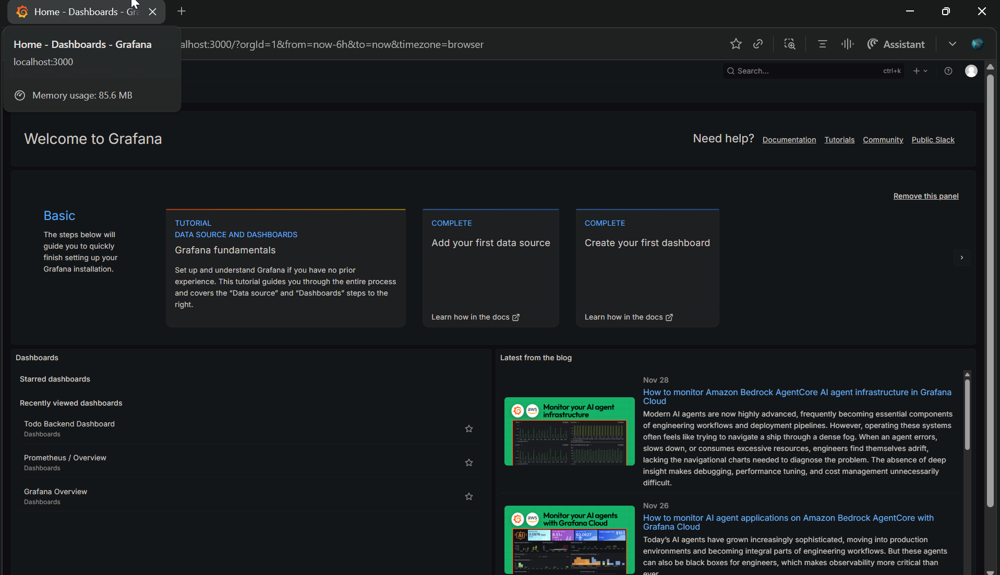
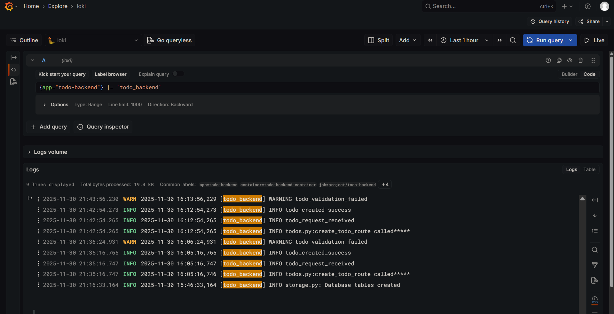
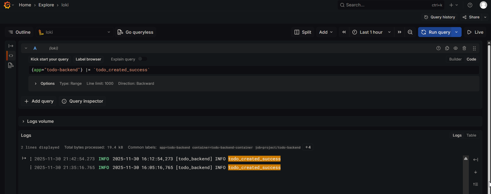
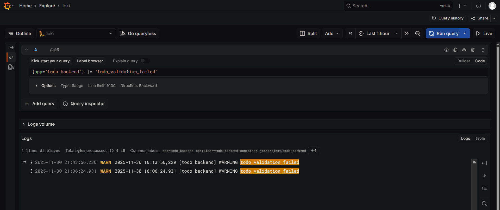
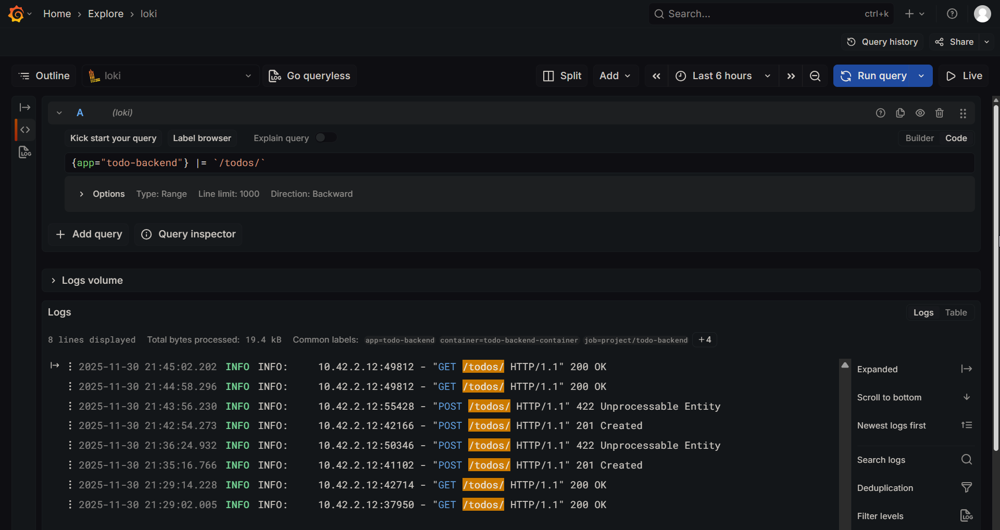
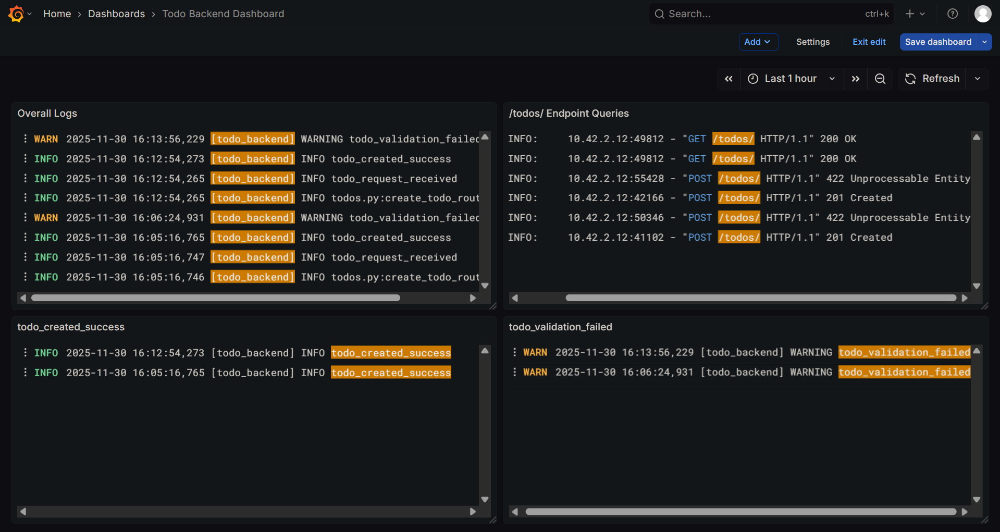
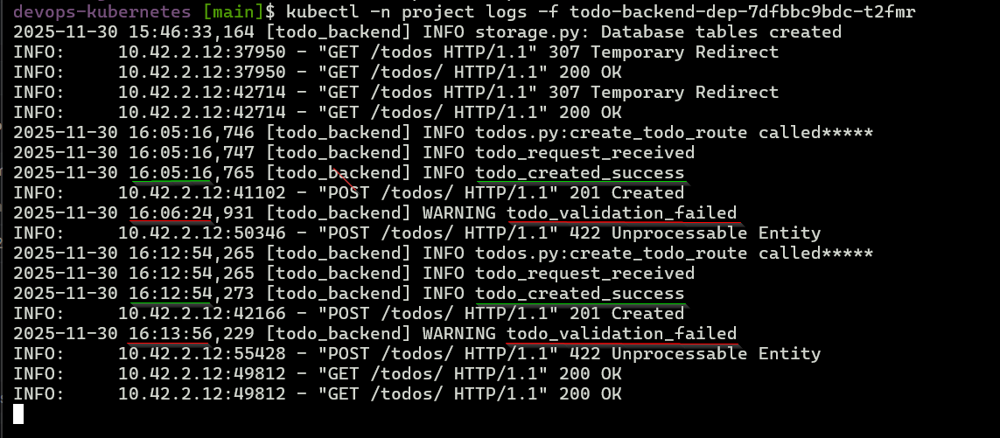

# Exercise 2.10: The project, step 13
Todo Backend Request Logging & Validation (140 char limit) and monitoring through Graphana

**Todo Backend Application Enhancements (v2.10.1):**
- `POST /todos`: Validates `text` length ≤140 chars, returns **HTTP 422 Unprocessable Entity** for violations
- Added **structured logging** for all endpoints
**Monitoring Stack Setup:**
- **Helm v3.19.2** installed and verified
- **kube-prometheus-stack** (Prometheus + Grafana):

**Grafana Loki Verification (Data Source: Loki)**
- Query for all custom app logs:  
  *{app="todo-backend"} |= `[todo_backend]`*
- Query for Successfull todo requests  
  *{app="todo-backend"} |= `todo_created_success`*
- Rejected todos (>140 chars)
  *{app="todo-backend"} |= `todo_validation_failed`*
- Query to filter all `/todos/` endpoint requests   
  *{app="todo-backend"} |= `/todos/`*


**Base Application Versions**
- [Todo Backend v2.9](https://github.com/arkb2023/devops-kubernetes/tree/2.9/the_project/todo_backend)

### 1. **Directory and File Structure**
<pre>
the_project
├── README.md
└── todo_backend
    ├── Dockerfile
    ├── app
    │   ├── __init__.py
    │   ├── main.py
    │   ├── models.py
    │   ├── routes
    │   │   ├── __init__.py
    │   │   └── todos.py
    │   └── storage.py
    ├── manifests
    │   ├── deployment.yaml
    │   ├── ingress.yaml
    │   ├── postgres-db-secret.yaml
    │   ├── postgresql-configmap.yaml
    │   ├── postgresql-service.yaml
    │   ├── postgresql-statefulset.yaml
    │   └── service.yaml
    ├── requirements.txt
    └── wait-for-it.sh
</pre>


### 2. Prerequisites

- Ensure the following tools are installed:
  - Docker  
  - k3d (K3s in Docker)  
  - kubectl (Kubernetes CLI)
- Create and run a Kubernetes cluster with k3d, using 2 agent nodes and port mapping to expose the ingress load balancer on host port 8081:
    ```bash
    k3d cluster create mycluster --agents 2 --port 8081:80@loadbalancer
    ```
- `project` namespace created in the cluster
    ```bash
    kubectl create namespace project
    ```

***

### 3. Monitoring Stack Installation (Prometheus + Grafana + Loki)

**3.1 Install Helm v3.19.2**
```
curl -fsSL -o get_helm.sh https://raw.githubusercontent.com/helm/helm/main/scripts/get-helm-4
chmod 700 get_helm.sh
./get_helm.sh
helm version  # Verify v3.19.2
```

**3.2 Add Helm Repositories**
```
helm repo add prometheus-community https://prometheus-community.github.io/helm-charts
helm repo add grafana https://grafana.github.io/helm-charts
helm repo update
```

**3.3 Install kube-prometheus-stack**
```
kubectl create namespace prometheus
helm install prometheus-community/kube-prometheus-stack --generate-name --namespace prometheus
```
**Grafana Access:**
```
# Get admin password
kubectl --namespace prometheus get secrets kube-prometheus-stack-1764485418-grafana -o jsonpath="{.data.admin-password}" | base64 -d ; echo
# Port-forward
kubectl -n prometheus port-forward kube-prometheus-stack-1764485418-grafana-6d959467cb-mrjn7 3000
```
Grafana: `http://localhost:3000` (admin/password)

**3.4 Install Loki Stack (Log Aggregation)**
```
kubectl create namespace loki-stack
helm upgrade --install loki --namespace=loki-stack grafana/loki-stack --set loki.image.tag=2.9.3
```
**Verify pods running:**
```
kubectl get pods -n loki-stack  # loki-0, loki-promtail-* READY
kubectl get pods -n prometheus  # grafana, prometheus READY
```

**3.5 Verify Monitoring Stack (All Pods Running )**  

**Helm**
```bash
helm version
```
```text
version.BuildInfo{Version:"v3.19.2", GitCommit:"8766e718a0119851f10ddbe4577593a45fadf544", GitTreeState:"clean", GoVersion:"go1.24.9"}
```

**Prometheus Namespace:**
```bash
kubectl get pods -n prometheus
```
```test
NAME                                                              READY   STATUS    RESTARTS        AGE
alertmanager-kube-prometheus-stack-1764-alertmanager-0            2/2     Running   2 (3h24m ago)   12h
kube-prometheus-stack-1764-operator-679b4d44b8-lkdwh              1/1     Running   2 (3h24m ago)   12h
kube-prometheus-stack-1764485418-grafana-6d959467cb-mrjn7         3/3     Running   3 (3h24m ago)   12h
kube-prometheus-stack-1764485418-kube-state-metrics-65847bl4vjv   1/1     Running   1 (3h24m ago)   12h
kube-prometheus-stack-1764485418-prometheus-node-exporter-cmm6s   1/1     Running   1 (3h24m ago)   12h
kube-prometheus-stack-1764485418-prometheus-node-exporter-kzgt4   1/1     Running   1 (3h24m ago)   12h
kube-prometheus-stack-1764485418-prometheus-node-exporter-sj56r   1/1     Running   3 (3h23m ago)   12h
prometheus-kube-prometheus-stack-1764-prometheus-0                2/2     Running   2 (3h24m ago)   12h
```

**Loki Stack Namespace:**
```bash
kubectl get pods -n loki-stack
```
```text
NAME                  READY   STATUS    RESTARTS        AGE
loki-0                1/1     Running   1 (3h24m ago)   12h
loki-promtail-fdfq9   1/1     Running   1 (3h24m ago)   12h
loki-promtail-gcsjz   1/1     Running   1 (3h24m ago)   12h
loki-promtail-nfn97   1/1     Running   1 (3h24m ago)   12h
```
- Grafana login screen (http://localhost:3000) 
    

### 4. Docker Image Build & Push
```
docker build -t arkb2023/todo-backend:2.10.1 .
docker push arkb2023/todo-backend:2.10.1
```
> Docker images are published at:  
https://hub.docker.com/repository/docker/arkb2023/todo-backend/tags/2.10.1  


### 5. Deploy Project to `project` Namespace 

**Setup Local PersistentVolume**  
```bash
docker exec k3d-mycluster-agent-0 mkdir -p /tmp/kube
```

```bash
kubectl apply -n project \
  -f the_project/todo_app/manifests/ \
  -f the_project/todo_backend/manifests/ \
  -f the_project/configmaps/ \
  -f volumes/
  
```

### 6. Test Backend Validation (140 char limit)

**6.1 Valid Todo (short text)**
```bash
http POST http://localhost:8081/todos/ text="Read https://en.wikipedia.org/wiki/Test"
```
```text
HTTP/1.1 201 Created
Content-Length: 118
Content-Type: application/json
Date: Sun, 30 Nov 2025 16:05:15 GMT
Server: uvicorn

{
    "completed": false,
    "created_at": "2025-11-30T16:05:16.752528Z",
    "id": 1,
    "text": "Read https://en.wikipedia.org/wiki/Test"
}
```

**6.2 Invalid Todo (>140 chars) - HTTP 422**
```bash
http POST http://localhost:8081/todos/ text="'$(python3 -c "print('x'*150)")'"
```
```text
HTTP/1.1 422 Unprocessable Entity
Content-Length: 299
Content-Type: application/json
Date: Sun, 30 Nov 2025 16:06:23 GMT
Server: uvicorn

{
    "detail": [
        {
            "ctx": {
                "max_length": 140
            },
            "input": "'xxxxxxxxxxxxxxxxxxxxxxxxxxxxxxxxxxxxxxxxxxxxxxxxxxxxxxxxxxxxxxxxxxxxxxxxxxxxxxxxxxxxxxxxxxxxxxxxxxxxxxxxxxxxxxxxxxxxxxxxxxxxxxxxxxxxxxxxxxxxxxxxxxxxxx'",
            "loc": [
                "body",
                "text"
            ],
            "msg": "String should have at most 140 characters",
            "type": "string_too_long"
        }
    ]
}
```

**6.3 List All Todos**
```bash
http GET http://localhost:8081/todos/
```
```text
HTTP/1.1 200 OK
Content-Length: 357
Content-Type: application/json
Date: Sun, 30 Nov 2025 16:14:57 GMT
Server: uvicorn

[
    {
        "completed": false,
        "created_at": "2025-11-30T16:05:16.752528Z",
        "id": 1,
        "text": "Read https://en.wikipedia.org/wiki/Test"
    }
]
```
### 7. Grafana Loki Verification (Data Source: Loki) 
- Query for all custom app logs:  
  *{app="todo-backend"} |= `[todo_backend]`*  
    
- Query for Successfull todo requests  
  *{app="todo-backend"} |= `todo_created_success`*  
    
- Rejected todos (>140 chars)  
  *{app="todo-backend"} |= `todo_validation_failed`*  
    
- Query to filter all `/todos/` endpoint requests   
  *{app="todo-backend"} |= `/todos/`*
  
- Dashboard for the app.
  
- Terminal show todo backend application pod logs for coorelation
  

## 8. Cleanup Commands
```
helm uninstall loki -n loki-stack
helm uninstall prometheus -n prometheus
kubectl delete namespace project
```