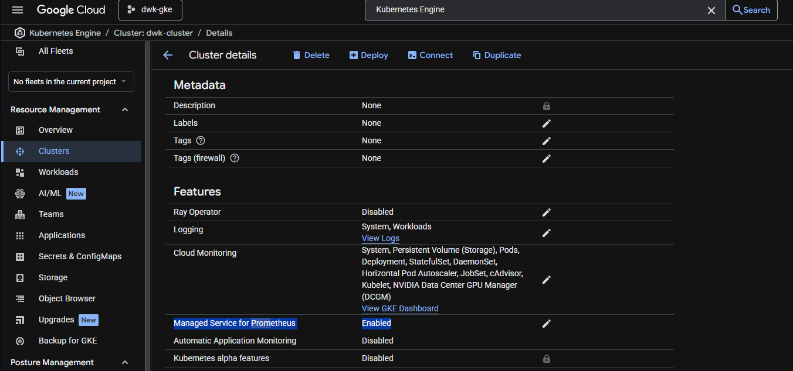
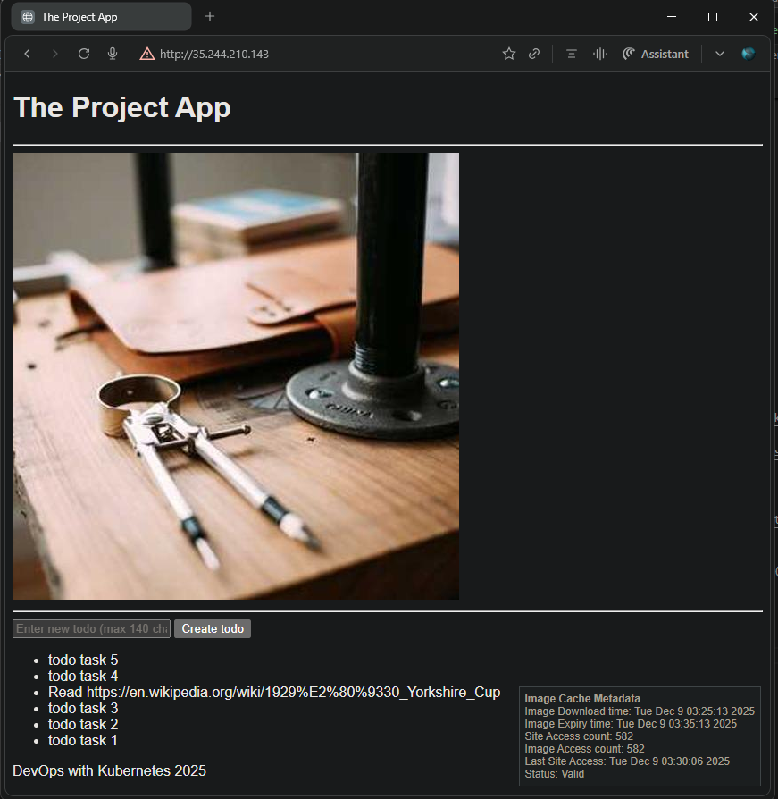
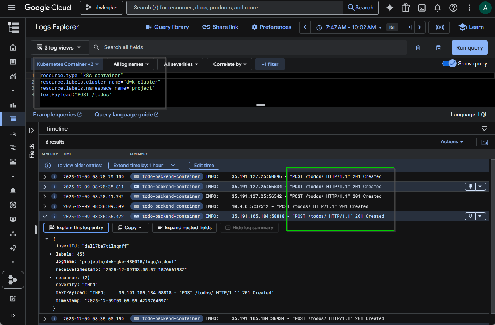
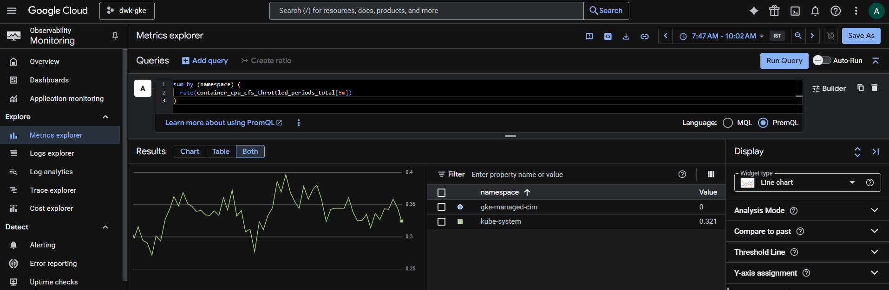

## Exercise 3.12. The project, step 20

**Objective**: Enable logging for the project in GKE and optionally demonstrate Prometheus-based monitoring for the cluster.

**Key Components**  
- Cloud Operations for GKE logging enabled so application logs from the `project` namespace (todo app) are sent to Cloud Logging.
- Managed Service for Prometheus enabled at cluster level and queried via Metrics Explorer (PromQL).  

**Verification**
- Confirmed todo application logs appear in Cloud Logging when a new todo is created.
- Executed a PromQL query and observed non-zero results for system namespaces, proving Prometheus metrics are being scraped.

**Base Application**
- [The project v3.10](https://github.com/arkb2023/devops-kubernetes/tree/3.10/the_project/)


### 1. **Directory and File Structure**
<pre>
  # Github actions workflow
  .github/
  └── workflows
      ├── project-gke.yaml
      └── project-gke-cleanup.yaml

  # kustomization: Common Project resource yamls 
  apps/the-project/
  ├── cron_wiki_todo.yaml
  ├── kustomization.yaml
  ├── postgres-db-secret.yaml
  ├── postgresql-backup-cronjob.yaml
  ├── postgresql-configmap.yaml
  ├── postgresql-service.yaml
  ├── postgresql-statefulset.yaml
  ├── project-configmap.yaml
  ├── todo-app-deployment.yaml
  ├── todo-app-service.yaml
  ├── todo-backend-deployment.yaml
  └── todo-backend-service.yaml

  # kustomization: GKE Project resource yamls 
  environments/project-gke/
  ├── gateway.yaml
  ├── kustomization.yaml
  ├── namespace.yaml
  ├── persistentvolumeclaim.yaml
  ├── todo-app-route.yaml
  └── todo-backend-route.yaml

  # Todo App 
  the_project/todo_app/
  ├── Dockerfile
  ├── app
  │   ├── __init__.py
  │   ├── cache.py
  │   ├── main.py
  │   ├── routes
  │   │   ├── __init__.py
  │   │   └── frontend.py
  │   ├── static
  │   │   └── scripts.js
  │   └── templates
  │       └── index.html

  # Todo Backend App 
  the_project/todo_backend/
  ├── Dockerfile
  ├── app
  │   ├── __init__.py
  │   ├── main.py
  │   ├── models.py
  │   ├── routes
  │   │   ├── __init__.py
  │   │   └── todos.py
  │   └── storage.py
  ├── docker-compose.yml
  └── wait-for-it.sh

  # Wiki Todo Generator CronJob
  the_project/cronjob/
  ├── Dockerfile
  └── cron_wiki_todo.py
</pre>


### 2. **Setup Requirements**

- Google Cloud CLI (`gcloud`) updated to 548.0.0
- kubectl with `gke-gcloud-auth-plugin`
- GCP Project: `dwk-gke-480015` configured
- Google service Account `github-actions`wtih required IAM roles  
- Google Artifact Registry - repository `dwk-gke-repository` (asia-south1)  
- GitHub Actions authentication for GKE + Artifact Registry via Repository Secrets  
- Set environment variables  
    ```bash
    export PROJECT_ID=$(gcloud config get-value project)
    export CLUSTER_NAME="dwk-cluster"
    export ZONE="asia-south1-a"
    ```

### 3. Cluster Setup
- Create cluster:
    ```bash
    gcloud container clusters create $CLUSTER_NAME \
        --zone=$ZONE \
        --cluster-version=1.32 \
        --num-nodes=3 \
        --machine-type=e2-medium \
        --gateway-api=standard \
        --disk-size=50 \
        --enable-ip-alias
    ```
- Get credentials:
  ```bash
  gcloud container clusters get-credentials $CLUSTER_NAME --zone=$ZONE --project=$PROJECT_ID
  ```
- Enable GKE logging for system + workloads:
  ```bash
  gcloud container clusters update "$CLUSTER_NAME" \
    --zone="$ZONE" \
    --logging=SYSTEM,WORKLOAD
  ```
  Output:
  ```text
  Updating dwk-cluster...done.
  Updated [https://container.googleapis.com/v1/projects/dwk-gke-480015/zones/asia-south1-a/clusters/dwk-cluster].
  To inspect the contents of your cluster, go to: https://console.cloud.google.com/kubernetes/workload_/gcloud/asia-south1-a/dwk-cluster?project=dwk-gke-480015
  ```
- Verify logging / monitoring configuration: 
  ```bash
  gcloud container clusters describe $CLUSTER_NAME --zone=$ZONE | grep -E "monitoring|logging"
  ```
  Output:
  ```text
      - https://www.googleapis.com/auth/logging.write
      - https://www.googleapis.com/auth/monitoring
  loggingConfig:
  loggingService: logging.googleapis.com/kubernetes
  monitoringConfig:
  monitoringService: monitoring.googleapis.com/kubernetes
    - https://www.googleapis.com/auth/logging.write
    - https://www.googleapis.com/auth/monitoring
      loggingConfig:
      - https://www.googleapis.com/auth/logging.write
      - https://www.googleapis.com/auth/monitoring  
  ```
- Enable Managed Service for Prometheus:
  ```bash
  gcloud container clusters update "$CLUSTER_NAME" \
    --zone="$ZONE" \
    --enable-managed-prometheus
  ```
  Output:
  ```text
  Updating dwk-cluster...done.
  Updated [https://container.googleapis.com/v1/projects/dwk-gke-480015/zones/asia-south1-a/clusters/dwk-cluster].
  To inspect the contents of your cluster, go to: https://console.cloud.google.com/kubernetes/workload_/gcloud/asia-south1-a/dwk-cluster?project=dwk-gke-480015
  ```
- Verify Managed Service for Prometheus is enabled 
  

### 4. Deploy the project applications
  - Trigger GitHub Actions deployment pipeline:  
    [Todo Apps – Build, Publish & Deploy · Run #20050027243](https://github.com/arkb2023/devops-kubernetes/actions/runs/20050027243)  

  - Verify Gateway external IP:
    ```bash
    kubectl  get gateway -A
    ```
    Output:
    ```
    NAMESPACE   NAME              CLASS                            ADDRESS          PROGRAMMED   AGE
    project     project-gateway   gke-l7-global-external-managed   35.244.210.143   True         71m
    ```

### 5. Generate log events for the todo application
  - Access the application at `http://35.244.210.143` and create one or more new todos.  
    

### 6. Verify Cloud Logging
    
  - Cloud Logging - Logs Explorer shows todo POST logs when a new todo is created:  
    ```query
    resource.type="k8s_container"
    resource.labels.cluster_name="dwk-cluster"
    resource.labels.namespace_name="project"
    textPayload:"POST /todos"
    ```
    

### 7. Verify Prometheus metric scraping
  - Cloud Monitoring - Metrics Explorer (PromQL mode) shows non‑zero values, confirming Prometheus metrics are being scraped:  
    ```PromQL
    sum by (namespace) (
      rate(container_cpu_cfs_throttled_periods_total[5m])
    )
    ```
    

### 8. Cleanup

**Delete all project resources**
```bash
kubectl delete ns project
```
**Delete GKE cluster**
```bash
gcloud container clusters delete dwk-cluster \
  --zone=asia-south1-a \
  --quiet
```

---
