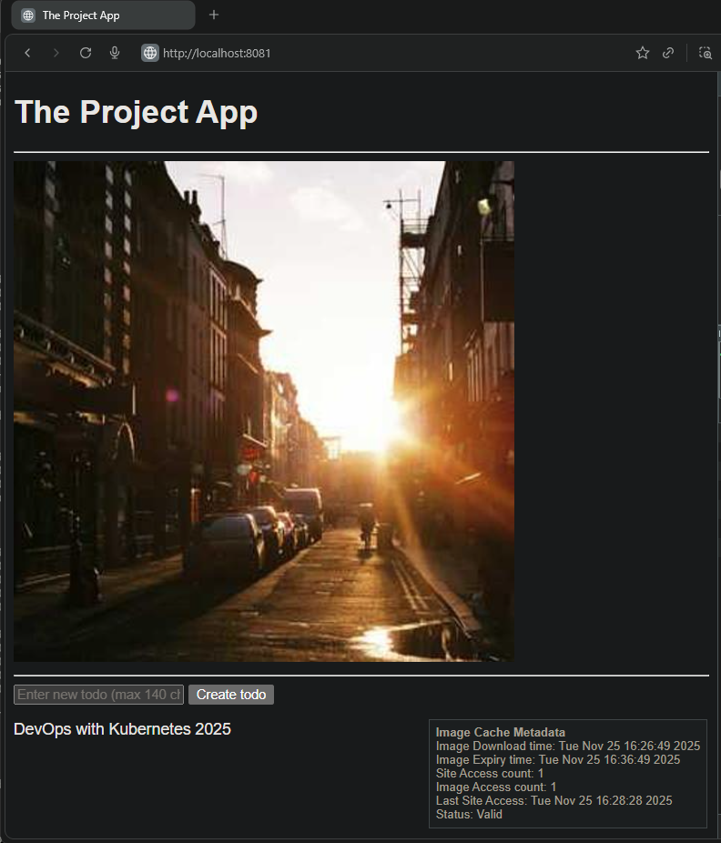
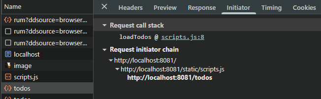
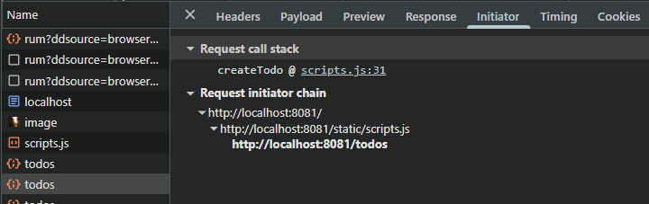
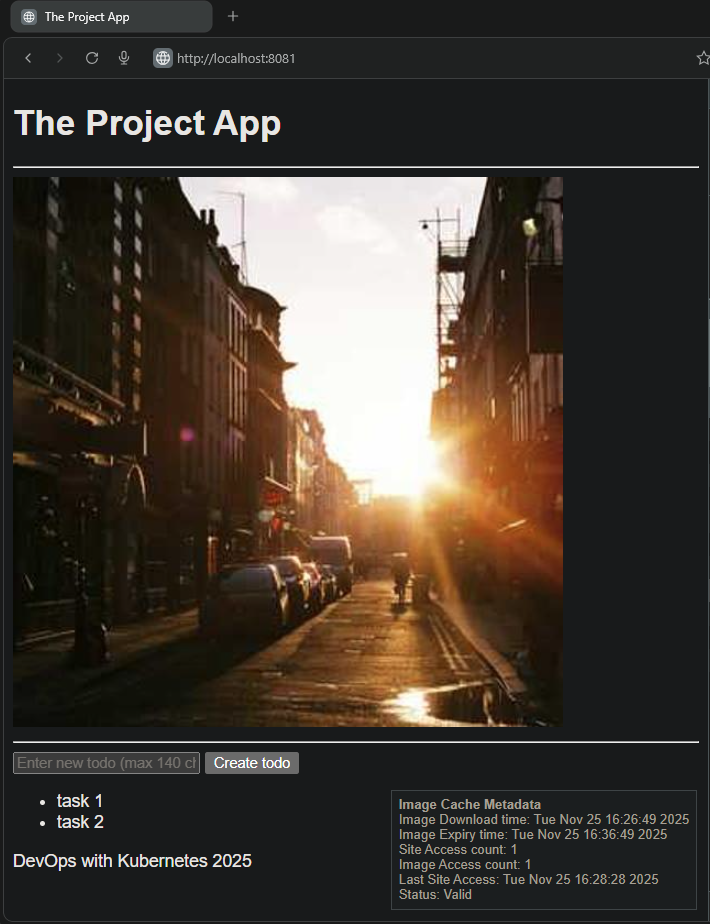
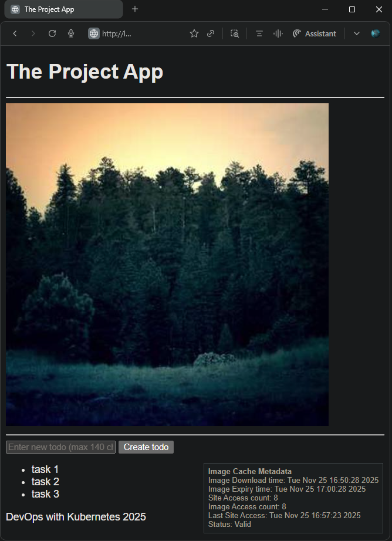
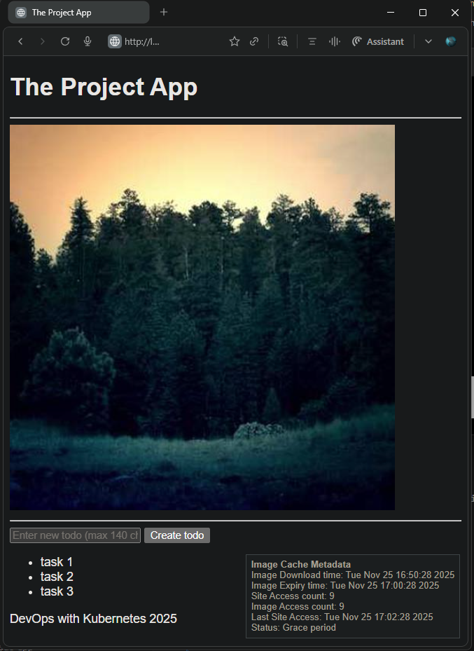

## Exercise: 2.2. The Project, Step 8

### Summary  
Added the `todo-backend` service to manage todo items and integrated it with the frontend `todo_app` application.

### Resource Updates  
- `todo_backend`:  
  - [deployment.yaml](./todo_backend/manifests/deployment.yaml): Deployment defined for the `todo-backend` application.  
  - [service.yaml](./todo_backend/manifests/service.yaml): Defines `todo-backend-svc` of type `ClusterIP` exposing port `4567`, mapped to the application port `3000`.  
  - [ingress.yaml](./todo_backend/manifests/ingress.yaml): Defines `todo-backend-ingress` with path prefix `/todos` routed to `todo-backend-svc` port `4567`.

### Application Updates  
- `todo-backend`:  
  - Supports in-memory management of todo items.  
  - Implements API endpoints:  
    - `GET /todos`: Retrieve todo items.  
    - `POST /todos`: Add a new todo item.  
- `todo-app`:  
  - Supports `GET /` endpoint.  
  - Serves [HTML](./todo_app/app/templates/index.html) and [JavaScript](./todo_app/app/static/scripts.js) to the browser.  
  - Retains logic for serving random pictures and caching.

### Volume Resources  
- Persistent Volume and Persistent Volume Claim configurations are included.

### Base Application Version  
- Built upon [Todo App v1.13](https://github.com/arkb2023/devops-kubernetes/tree/1.13/the_project)

### Application URL  
- Accessible at: `http://localhost:8081`


### Validation Coverage
- Initial page served with a random picture and an empty todo item list.
- Test Create Todo button functionality.
- Test frontend backend API interactions
- Test data persistence

***
### End-to-End Network Routing Configuration: Host to Application Path

This table summarizes the routing setup in the Kubernetes cluster that enables requests from the host at `localhost:8081` to reach the appropriate application components. It integrates the `port mappings` `ingress path rules` `service definitions` and `backend container ports` to illustrate how external and cluster networking resources work together to route requests.

| URL                          | Port Mapping `Host::Loadbalancer` | Ingress Resource      | API Endpoint `Ingress` Path | Service Port | Service Name      | Target Port | Application   |
|------------------------------|-----------------------------------|-----------------------|-----------------------------|--------------|-------------------|-------------|---------------|
| *http://localhost:8081       |  8081::80                         | todo-app-ingress      | /                           | 1245         | todo-app-svc      | 3000        | todo-app      |
| **http://localhost:8081/todos|  8081::80                         | todo-backend-ingress  | /todos                      | 4567         | todo-backend-svc  | 3000        | todo-backend  |

*`todo-app` reachability configuration rule  
**`todo-backend` reachability configuration rule

***


### 1. **Directory and File Structure**
<pre>
├── todo_app
│   ├── Dockerfile
│   ├── app
│   │   ├── __init__.py
│   │   ├── cache.py
│   │   ├── main.py
│   │   ├── routes
│   │   │   ├── __init__.py
│   │   │   └── frontend.py
│   │   ├── static
│   │   │   └── scripts.js
│   │   └── templates
│   │       └── index.html
│   ├── manifests
│   │   ├── deployment.yaml
│   │   ├── ingress.yaml
│   │   └── service.yaml
├── todo_backend
│   ├── Dockerfile
│   ├── app
│   │   ├── __init__.py
│   │   ├── main.py
│   │   ├── models.py
│   │   ├── routes
│   │   │   ├── __init__.py
│   │   │   └── todos.py
│   │   └── storage.py
│   ├── manifests
│   │   ├── deployment.yaml
│   │   ├── ingress.yaml
│   │   └── service.yaml
└── volumes
    ├── persistentvolume.yaml
    └── persistentvolumeclaim.yaml
</pre>


***

### 2. Prerequisites
- `Docker` `k3d` `kubectl` installed

### 3. Build and Push the Docker Image to DockerHub

```bash

cd todo_backend
docker build -t arkb2023/todo-backend:2.2 .
docker push arkb2023/todo-backend:2.2

cd todo_app
docker build -t arkb2023/todo-app:2.5 .
docker push arkb2023/todo-app:2.5

```
> Docker image published at:  
> https://hub.docker.com/repository/docker/arkb2023/todo-app/tags/2.5  
> https://hub.docker.com/repository/docker/arkb2023/todo-backend/tags/2.2


***

### 4. Deploy to Kubernetes

**Creates a cluster**
```bash
k3d cluster create --port 8081:80@loadbalancer --agents 2
```

**Setup Local PersistentVolume**  
To bind `PersistentVolume` to a local host path in a containerized node, create the backing storage directory inside the node container.

```bash
docker exec k3d-k3s-default-agent-0 mkdir -p /tmp/kube
```

**Apply the `Deployment` `Service` `Ingress` `PersistentVolume` and `PersistentVolumeClaim` Manifests**  

```bash
kubectl apply \
  -f ./the_project/todo_app/manifests/deployment.yaml \
  -f ./the_project/todo_app/manifests/ingress.yaml \
  -f ./the_project/todo_app/manifests/service.yaml \
  -f ./the_project/todo_backend/manifests/deployment.yaml \
  -f ./the_project/todo_backend/manifests/ingress.yaml \
  -f ./the_project/todo_backend/manifests/service.yaml \
  -f ./volumes/persistentvolume.yaml \
  -f ./volumes/persistentvolumeclaim.yaml
```

**Verify Ingress Resource Configuration**

```bash
kubectl describe ingress
```
- The output confirms the **`todo-app-ingress`** rule with the `/` path is associated with backend `todo-app-svc:1234`, verifying that `GET /` requests route correctly to the Todo App.
- Similarly, **`todo-backend-ingress`** is shown with the `/todos` path mapped to `todo-backend-svc:4567`, ensuring `/todos` requests are forwarded to the backend service.

*output*
```text
Name:             todo-app-ingress
Namespace:        default
Address:          172.18.0.3,172.18.0.4,172.18.0.5
Rules:
  Host        Path   Backends
  ----        ----   --------
  *           /      todo-app-svc:1234 (10.42.0.10:3000)

Name:             todo-backend-ingress
Namespace:        default
Address:          172.18.0.3,172.18.0.4,172.18.0.5
Rules:
  Host        Path     Backends
  ----        ----     --------
  *           /todos   todo-backend-svc:4567 (10.42.0.7:3000)
```

**Verify Service Resource Configuration**

```bash
kubectl describe service
```

- The output confirms the **`todo-app-svc`** service is correctly associated with the `todo-app` application by the presence of the endpoint `10.42.0.10:3000`.
- The **`todo-backend-svc`** service is similarly linked to the `todo-backend` application via the endpoint `10.42.0.7:3000`.

*Output*
```text
Name:                todo-app-svc
Namespace:           default
Selector:            app=todo-app
Type:                ClusterIP
IP:                  10.43.187.35
Port:                1234/TCP
TargetPort:          3000/TCP
Endpoints:           10.42.0.10:3000

Name:                todo-backend-svc
Namespace:           default
Selector:            app=todo-backend
Type:                ClusterIP
IP:                  10.43.54.232
Port:                4567/TCP
TargetPort:          3000/TCP
Endpoints:           10.42.0.7:3000
```

### 5. Validation

- **Verify initial page load:**  
  *Initial browser page shows image and empty todo list*  
    

  *Corresponding browser network panel confirming JavaScript behavior: A `GET /` request triggers the `loadTodos` JS function call, as expected.*
    

- **Test Create Todo button:**  
  Adding a new todo item successfully updates the list on the page and persists in the backend.

  *Successful POST request, tasks added, update verified visually and via network panel*  
    

  *Corresponding browser network panel confirming JavaScript behavior: A `POST /todos` request triggers the `CreateTodos` JS function call, as expected.*  
    
    
  *Browser page shows todo list items*    
    

- **Confirm API interactions:**  
  Frontend JavaScript correctly sends requests to backend endpoints (`GET /todos` and `POST /todos`).

    *Application logs demonstrate proper API calls and responses*  
    ```bash
    kubectl logs -f todo-app-dep-5fc56fc975-xqbnn
    ```
    ```text
    INFO:     10.42.0.26:47464 - "GET / HTTP/1.1" 200 OK
    INFO:     10.42.0.26:47464 - "GET /image HTTP/1.1" 200 OK
    INFO:     10.42.0.26:47480 - "GET /static/scripts.js HTTP/1.1" 200 OK
    ```
    ```bash
    kubectl logs -f todo-backend-dep-d855d6f86-44ltd
    ```
    ```text
    INFO:     10.42.0.26:34396 - "GET /todos HTTP/1.1" 200 OK
    INFO:     10.42.1.4:46118 - "POST /todos HTTP/1.1" 201 Created
    ```

- **Ensure data persistence:**  
  Same image remains available after container reboot, confirming backend storage integrity.

  *Image before restart*  
    
  
  **Reboot frontend container**
  ```bash
  kubectl rollout restart deployment todo-app-dep
  ```
  *Verify containers restarted*
  ```bash
  kubectl get pods
  ```
  ```text
  NAME                          READY   STATUS        RESTARTS   AGE
  todo-app-dep-5cd4f9456c-xsjrs 1/1     Running       0          2s
  todo-app-dep-85958cb866-k7s4b 1/1     Terminating   0          3m28s
  todo-backend-dep-745ddccd-d78jc 1/1   Running       0          32m
  ```

  *Post-restart validation*
  ```bash
  kubectl get pods
  ```
  ```text
  NAME                          READY   STATUS    RESTARTS   AGE
  todo-app-dep-5cd4f9456c-xsjrs 1/1     Running   0          2m10s
  todo-backend-dep-745ddccd-d78jc 1/1   Running   0          34m
  ```

  *Same image shows up after restart*  
    
  

### 6. **Cleanup**

**Delete the `Deployment` `Service` and `Ingress` `PersistentVolume` and `PersistentVolumeClaim` Manifests**  
```bash
kubectl delete \
    -f ./the_project/todo_app/manifests/deployment.yaml \
    -f ./the_project/todo_app/manifests/ingress.yaml \
    -f ./the_project/todo_app/manifests/service.yaml \
    -f ./the_project/todo_backend/manifests/deployment.yaml \
    -f ./the_project/todo_backend/manifests/ingress.yaml \
    -f ./the_project/todo_backend/manifests/service.yaml \
    -f ./volumes/persistentvolume.yaml \
    -f ./volumes/persistentvolumeclaim.yaml
```

**Stop the k3d Cluster**  
```bash
k3d cluster delete k3s-default
```
***
