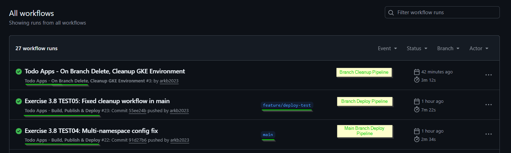
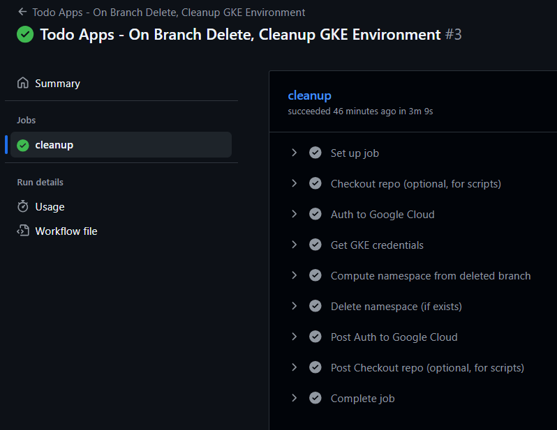
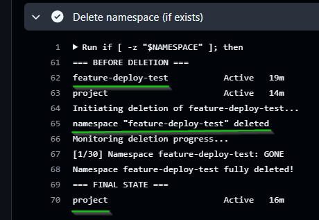

## Exercise 3.8. The project, step 17

**Objective**: Create a new workflow so that deleting a branch deletes the environment.

**Key Changes from Base**  
  - [.github/workflows/project-gke-cleanup.yaml](../.github/workflows/project-gke-cleanup.yaml) - Multi-Branch GitHub Actions Cleanup Workflow

**Base Application Version**
- [The project v3.7](https://github.com/arkb2023/devops-kubernetes/tree/3.7/the_project/)

**Bug Fixes:**

### 1. **Directory and File Structure**
<pre>
  # Github actions workflow
  .github/
  └── workflows
      ├── project-gke.yaml
      └── project-gke-cleanup.yaml

  # kustomization: Common Project resource yamls 
  apps/the-project/
  ├── cron_wiki_todo.yaml
  ├── kustomization.yaml
  ├── postgres-db-secret.yaml
  ├── postgresql-configmap.yaml
  ├── postgresql-service.yaml
  ├── postgresql-statefulset.yaml
  ├── project-configmap.yaml
  ├── todo-app-deployment.yaml
  ├── todo-app-service.yaml
  ├── todo-backend-deployment.yaml
  └── todo-backend-service.yaml

  # kustomization: GKE Project resource yamls 
  environments/project-gke/
  ├── gateway.yaml
  ├── kustomization.yaml
  ├── namespace.yaml
  ├── persistentvolumeclaim.yaml
  ├── todo-app-route.yaml
  └── todo-backend-route.yaml

  # Todo App 
  the_project/todo_app/
  ├── Dockerfile
  ├── app
  │   ├── __init__.py
  │   ├── cache.py
  │   ├── main.py
  │   ├── routes
  │   │   ├── __init__.py
  │   │   └── frontend.py
  │   ├── static
  │   │   └── scripts.js
  │   └── templates
  │       └── index.html

  # Todo Backend App 
  the_project/todo_backend/
  ├── Dockerfile
  ├── app
  │   ├── __init__.py
  │   ├── main.py
  │   ├── models.py
  │   ├── routes
  │   │   ├── __init__.py
  │   │   └── todos.py
  │   └── storage.py
  ├── docker-compose.yml
  └── wait-for-it.sh

  # Wiki Todo Generator CronJob
  the_project/cronjob/
  ├── Dockerfile
  └── cron_wiki_todo.py
</pre>


### 2. Prerequisites (GCP/GKE)

- Google Cloud CLI (`gcloud`) updated to 548.0.0
- kubectl with `gke-gcloud-auth-plugin`
- GCP Project: `dwk-gke-480015` configured
- Cluster Creation:
  ```bash
  gcloud container clusters create dwk-cluster \
    --zone=asia-south1-a \
    --cluster-version=1.32 \
    --num-nodes=3 \
    --machine-type=e2-medium \
    --gateway-api=standard \
    --disk-size=50 \
    --enable-ip-alias
  ```
- Fetch and configure Kubernetes cluster access credentials locally, enabling kubectl to authenticate and manage the specified GKE cluster  
  ```bash
  gcloud container clusters get-credentials dwk-cluster --zone=asia-south1-a
  ```
- Google service Account `github-actions`wtih required IAM roles  
- Google Artifact Registry - repository `dwk-gke-repository` (asia-south1)  
- GitHub Actions authentication for GKE + Artifact Registry via Repository Secrets  


### 3. Cleanup Pipeline validation
  - Trigger Deployment from `main` and `feature/deploy-test` branch  
    - Feature branch:  
      ```bash
      git checkout -b feature/deploy-test
      echo "# Exercise 3.8 TEST04: Fixed config" >> environments/project-gke/kustomization.yaml
      git commit -m "[Exercise: 3.8. The project, step 17] Test04- Build, Publish & Deploy"
      git push origin feature/deploy-test
      ```
    - Main branch:  
      ```bash
      git checkout main
      git add .
      echo "# Exercise 3.8 TEST04: Fixed config" >> environments/project-gke/kustomization.yaml
      git commit -m "[Exercise: 3.8. The project, step 17] Test04- Build, Publish & Deploy"
      git push origin main
      ```
  - Deploy Pipelines:
    - `main` [Run #19999659810](https://github.com/arkb2023/devops-kubernetes/actions/runs/19999659810)
    - `feature/deploy-test` [Run #19999682641](https://github.com/arkb2023/devops-kubernetes/actions/runs/19999682641) 
  - Active Namespaces:  
    ```bash
    kubectl get ns |egrep -i "NAME|feature|project"
    ```
    *Output*
    ```text
    NAME                          STATUS   AGE
    feature-deploy-test           Active   16m
    project                       Active   11m
    ```
  - Gateway Isolation (Unique IPs!):
    ```bash
    kubectl get gateway -A
    ```
    *Output*
    ```text
    NAMESPACE             NAME              CLASS                            ADDRESS       PROGRAMMED   AGE
    feature-deploy-test   project-gateway   gke-l7-global-external-managed   34.8.36.183   True         17m
    project               project-gateway   gke-l7-global-external-managed   34.8.79.182   True         12m
    ```
- Cleanup Trigger:
    ```bash
    git push origin --delete feature/deploy-test
    ```
    *Output*
    ```text
    To github.com:arkb2023/devops-kubernetes.git
    - [deleted]         feature/deploy-test
    ```

- Cleanup Pipeline: [Run #19999824142](https://github.com/arkb2023/devops-kubernetes/actions/runs/19999824142)
  - Cleanup job:  
    
  - Cleanup stages:  
    
  - Cleanup - namespace deletion stage  
    

- Namespace Termination 
  - Live Monitoring
    ```bash
    kubectl get ns -w |egrep -i "NAME|feature|project"
    ```
    *Output*
    ```text
    NAME                          STATUS        AGE
    feature-deploy-test           Terminating   20m
    project                       Active        15m
    feature-deploy-test           Terminating   20m
    feature-deploy-test           Terminating   21m
    feature-deploy-test           Terminating   21m
    ```
  - Feature namespace GONE, Main Preserved
    ```bash
    kubectl get ns |egrep -i "NAME|feature|project"
    ```
    *Output*
    ```text
    NAME                          STATUS   AGE
    project                       Active   18m
    ```
    kubectl get gateway -A
    ```
    *Output*
    ```text
    NAMESPACE   NAME              CLASS                            ADDRESS       PROGRAMMED   AGE
    project     project-gateway   gke-l7-global-external-managed   34.8.79.182   True         18m
    ```
## 4. Cleanup

**Delete all project resources**
```bash
kubectl delete ns project

```
**Delete GKE cluster**
```bash
gcloud container clusters delete dwk-cluster \
  --zone=asia-south1-a \
  --quiet
```

---


<!--
feature/ui-v1 
bugfix/api-v2 
release/v1.2 
main
-->


