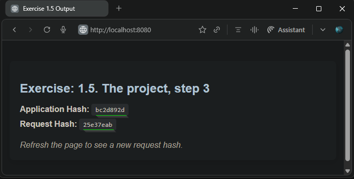
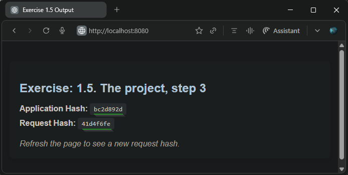

## Exercise: 1.5. The project, step 3
### Todo App Server Enhancements

- Built upon the application from [Exercise: 1.4. The project, step2](https://github.com/arkb2023/devops-kubernetes/tree/1.4/the_project)
- Added HTTP server responding with two hashes:
    - Application Hash: Persistent until process exit
    - Request Hash: Unique per HTTP request
- Used kubectl port-forward to forward cluster pod port to localhost

### 1. **Directory and File Structure**
```
the_project
├── README.md
└── todo-app
    ├── Dockerfile
    ├── main.py
    └── manifests
        └── deployment.yaml
```

***


### 2. Prerequisites
- `Docker` `k3d` `kubectl` installed and `k3s-default` cluster running via `k3d`

***


### 3. **Build & Push Docker Image**

**Build the Docker image locally and tag it**
```bash
docker build -t arkb2023/todo-app:1.5 .
```

**Push the tagged image to the Docker Hub repository**
```bash
docker push arkb2023/todo-app:1.5
```
> The image is published at:
https://hub.docker.com/repository/docker/arkb2023/todo-app/tags/1.5

***

### 4. **Deploy to Kubernetes**

**Deploy the application:**
```bash
kubectl apply -f manifests/deployment.yaml
```
**Check that the deployment was created and is available:**
```bash
kubectl get deployments
```
**Ensure the pod is running and ready:**
```bash
kubectl get pods
```
**Inspect Pod Logs for Application Readiness**
```bash
kubectl logs -f todo-app-6ccb798d5d-rhr7f
```
*Output*
```text
INFO:     Started server process [7]
INFO:     Waiting for application startup.
INFO:     Application startup complete.
INFO:     Uvicorn running on http://0.0.0.0:8080 (Press CTRL+C to quit)
INFO:     127.0.0.1:43432 - "GET / HTTP/1.1" 200 OK
INFO:     127.0.0.1:43530 - "GET / HTTP/1.1" 200 OK
```

**Configure Access to the Cluster Application**
Use `kubectl port-forward` to forward the pod port to local machine for access:
```bash
kubectl port-forward todo-app-6ccb798d5d-rhr7f 8080:8080
```
*Output*
```text
Forwarding from 127.0.0.1:8080 -> 8080
Forwarding from [::1]:8080 -> 8080
Handling connection for 8080
Handling connection for 8080
```

***

### 5. Verify Application Response in Browser

- **Initial Browser View**  
Access the application in browser (`http://localhost:8080`) after port-forwarding. The page should display the formatted HTML containing the Application Hash and Request Hash:  
 

- **Refresh and Hash Update**  
Refresh the page to generate a new Request Hash. The Application Hash remains the same (since the app process is persistent), but the Request Hash updates to reflect the new request:  
 

This testing, ensures `kubectl port-forward` command is active, forwarding the pod port `8080:8080`

### 5. **Cleanup**

**Delete the Kubernetes Deployment**
```bash
kubectl delete deployment todo-app
```
***