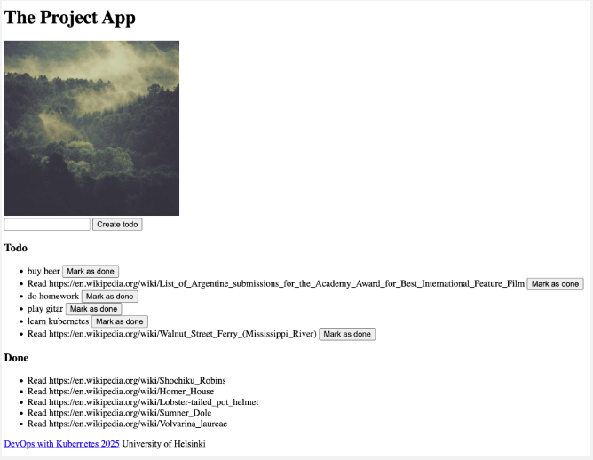
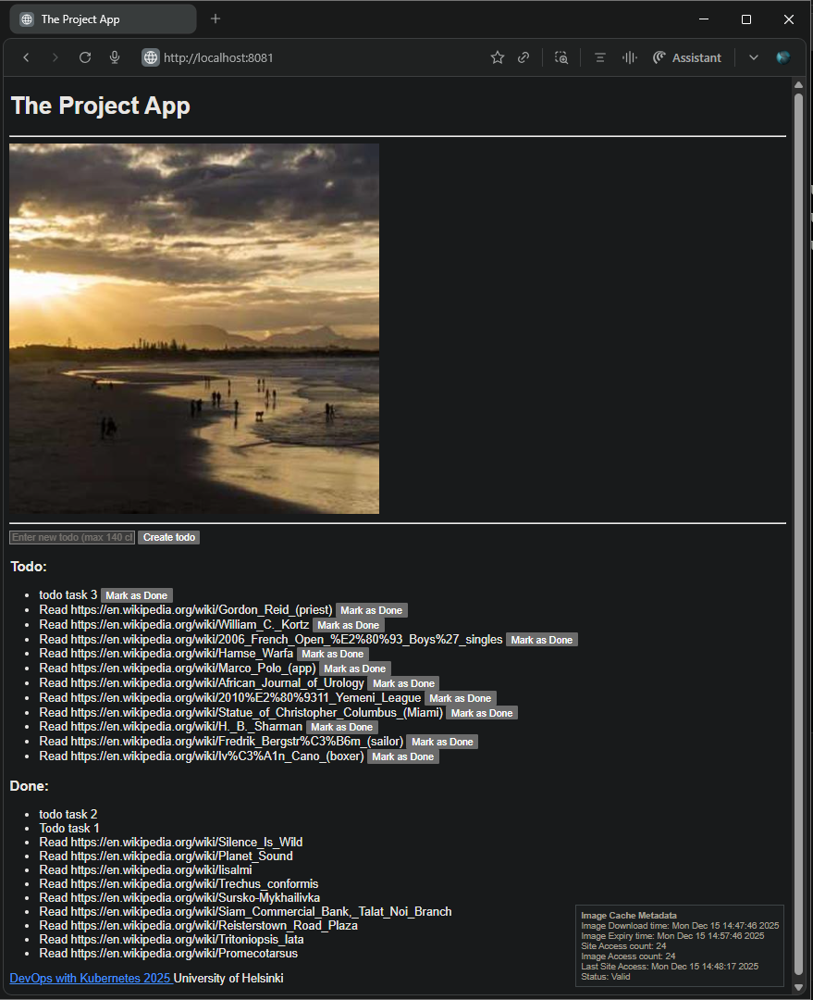
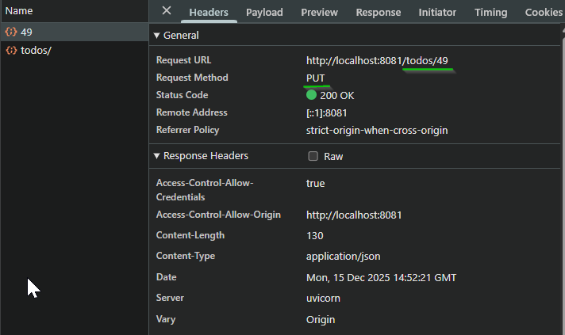

## Exercise 4.5. The project, step 22

**Instructions:**  

Speaking of updating. Our todo application could use "Done" field for todos that are already done. It should be a PUT request to /todos/<id>.

After this exercise, your app could look something like this:  
  

---

**Key Changes from Base**

Key changes from the base version:

- **[`todo_backend/app/models.py`](./todo_backend/app/models.py)**  
  Added a `completed: bool` field to the `TodoDB` model and exposed it via `TodoResponse` / `TodoUpdate` so todos can store and update their done state.

- **[`todo_backend/app/storage.py`](./todo_backend/app/storage.py)**  
  Implemented `update_todo` get todo from the ORM `TodoDB` instance and modify the `completed` field correctly and refresh the ORM object before returning a `TodoResponse`.

- **[`todo_backend/app/routes/todos.py`](./todo_backend/app/routes/todos.py)**  
  Implemented the `update_todo_route` to handle `PUT /todos/{todo_id}` endpoint to support updating the `completed` status via the `TodoUpdate` model.

- **[`todo_app/app/templates/index.html`](./todo_app/app/templates/index.html)**  
  Split the list into separate **Todo** and **Done** sections (`<ul id="todoList">` and `<ul id="doneList">`) and updated the footer to show the course link “DevOps with Kubernetes 2025 University of Helsinki”.

- **[`todo_app/app/static/scripts.js`](todo_app/app/static/scripts.js)**  
  Enhanced the frontend logic to:
  - Load todos from the backend and render them into **Todo** vs **Done** lists based on `completed`.  
  - Add a **“Mark as Done”** button for active todos that sends a `PUT /todos/{id}` with `{ completed: true }`.  
  - Refresh the view after creating or marking a todo as done.

- Base application:  
  - [Todo App and Todo Backend v4.2](https://github.com/arkb2023/devops-kubernetes/tree/4.2/the_project)


### 1. **Directory and File Structure**
<pre>

environments/                                   # Multi-env overlays (k3dlocal/GKE)
├── project-gke                                 # GKE environment specific overlays
│   ├── gateway.yaml                            # Gateway API (GKE)
│   ├── kustomization.yaml                      # Top level kustomization entry point 
│   ├── namespace.yaml                          # Namespace
│   ├── persistentvolumeclaim.yaml              # Persistent Volume Claim
│   ├── podmonitoring-todo-backend.yaml         # Pod monitoring
│   ├── postgresql-backup-cronjob.yaml          # PostgreSQL Backup Cronbjob
│   ├── todo-app-route.yaml                     # Todo-App HTTPRoute (GKE)
│   └── todo-backend-route.yaml                 # Todo-backend App HTTPRoute (GKE)
└── project-local                               # k3d Local environment specific overlays
    ├── kustomization.yaml                      # Top level kustomization entry point 
    ├── namespace.yaml                          # Namespace
    ├── persistentvolume.yaml                   # Persistent Volume
    ├── persistentvolumeclaim.yaml              # Persistent Volume Claim
    └── todo-ingress.yaml                       # Traefik ingress

apps/                                           # Shared base resources
└── the-project                                 # Consolidated app manifests + kustomization
    ├── cron_wiki_todo.yaml                     # Wiki Generator CronJob
    ├── kustomization.yaml                      # Base manifests for Todo App, Todo backend, Postgress and Wiki Generator
    ├── postgresql-configmap.yaml               # PostgreSQL ConfigMap
    ├── postgresql-dbsecret.yaml                # PostgreSQL Secret
    ├── postgresql-service.yaml                 # PostgreSQL Service
    ├── postgresql-statefulset.yaml             # PostgreSQL StatefulSet
    ├── todo-app-configmap.yaml                 # Todo Application ConfigMap
    ├── todo-app-deployment.yaml                # Todo Application Deployment
    ├── todo-app-service.yaml                   # Todo Application Service
    ├── todo-backend-configmap.yaml             # Todo Backend Application ConfigMap
    ├── todo-backend-deployment.yaml            # Todo Backend Application Deployment
    └── todo-backend-service.yaml               # Todo Backend Application Service

the_project/                                    # Project root
├── todo_app                                    # Frontend application
│   ├── Dockerfile                              # Dockerfile for image
│   ├── app                                     # Application code
│   │   ├── __init__.py
│   │   ├── cache.py
│   │   ├── main.py
│   │   ├── routes
│   │   │   ├── __init__.py
│   │   │   └── frontend.py
│   │   ├── static
│   │   │   └── scripts.js
│   │   └── templates
│   │       └── index.html
│   └── requirements.txt
└── todo_backend                                # Backend application
    ├── Dockerfile                              # Dockerfile for image
    ├── app                                     # Application code
    │   ├── __init__.py
    │   ├── main.py
    │   ├── models.py
    │   ├── routes
    │   │   ├── __init__.py
    │   │   └── todos.py
    │   └── storage.py
    └── requirements.txt

# Deployment flow:
# kustomize build environments/project-local | kubectl apply -f -
# kustomize build environments/project-gke | kubectl apply -f -

</pre>

  
***

### 2. Setup  
- Docker  
- k3d (K3s in Docker)  
- kubectl (Kubernetes CLI)
- Create Cluster 
  ```bash
  k3d cluster create dwk-local --agents 2 --port 8081:80@loadbalancer
  ```
- Build and Push Docker images
  ```bash
  docker build -t arkb2023/todo-app:4.5.3 ./the_project/todo_app/
  docker push arkb2023/todo-app:4.5.3
  docker build -t arkb2023/todo-backend:4.5.3 ./the_project/todo_backend/
  docker push arkb2023/todo-backend:4.5.3
  ```
  > Docker Hub links: [`frontend`](https://hub.docker.com/repository/docker/arkb2023/todo-app/tags/4.5.3) and [`backend`](https://hub.docker.com/repository/docker/arkb2023/todo-backend/tags/4.5.3)

- Update Kustomize images
  ```bash
  cd environments/project-local/ 
  # frontend
  kustomize edit set image arkb2023/todo-app:latest=arkb2023/todo-app:4.5.3
  # backend
  kustomize edit set image arkb2023/todo-backend:latest=arkb2023/todo-backend:4.5.3
  cd -
  ```
  > Updates the project-local environment to use frontend and backend images tagged 4.5.3.

### 3. **Deploy**  
- Deploy with Kustomize
  ```bash
  kustomize build environments/project-local | kubectl apply -f -
  ```

- Deployment status:  
  ```bash
  kubectl -n project get pods
  ```
  Output:  
  ```text
  NAME                                 READY   STATUS      RESTARTS      AGE
  postgresql-db-0                      1/1     Running     2 (12h ago)   4d
  todo-app-dep-7b9fdc74c7-9zwsv        2/2     Running     0             28m
  todo-backend-dep-5787d48fc5-tmzxn    1/1     Running     0             36m
  wiki-todo-generator-29430060-hj867   0/1     Completed   0             134m
  wiki-todo-generator-29430120-hvkht   0/1     Completed   0             73m
  wiki-todo-generator-29430180-d6c6g   0/1     Completed   0             13m
  devops-kubernetes [main]$ kubectl -n project get all
  NAME                                     READY   STATUS      RESTARTS      AGE
  pod/postgresql-db-0                      1/1     Running     2 (12h ago)   4d
  pod/todo-app-dep-7b9fdc74c7-9zwsv        2/2     Running     0             28m
  pod/todo-backend-dep-5787d48fc5-tmzxn    1/1     Running     0             36m
  pod/wiki-todo-generator-29430060-hj867   0/1     Completed   0             134m
  pod/wiki-todo-generator-29430120-hvkht   0/1     Completed   0             73m
  pod/wiki-todo-generator-29430180-d6c6g   0/1     Completed   0             13m

  NAME                        TYPE        CLUSTER-IP      EXTERNAL-IP   PORT(S)    AGE
  service/postgresql-db-svc   ClusterIP   None            <none>        5432/TCP   4d
  service/todo-app-svc        ClusterIP   10.43.87.14     <none>        1234/TCP   4d
  service/todo-backend-svc    ClusterIP   10.43.161.195   <none>        4567/TCP   4d

  NAME                               READY   UP-TO-DATE   AVAILABLE   AGE
  deployment.apps/todo-app-dep       1/1     1            1           4d
  deployment.apps/todo-backend-dep   1/1     1            1           4d

  NAME                                          DESIRED   CURRENT   READY   AGE
  replicaset.apps/todo-app-dep-6c6cfc68b9       0         0         0       4d
  replicaset.apps/todo-app-dep-6dcdf46669       0         0         0       56m
  replicaset.apps/todo-app-dep-7b9fdc74c7       1         1         1       28m
  replicaset.apps/todo-app-dep-7d6f78c757       0         0         0       81m
  replicaset.apps/todo-backend-dep-557bd47cf7   0         0         0       81m
  replicaset.apps/todo-backend-dep-5787d48fc5   1         1         1       36m
  replicaset.apps/todo-backend-dep-5d9d44fc6    0         0         0       44m
  replicaset.apps/todo-backend-dep-7b9d466c54   0         0         0       4d

  NAME                             READY   AGE
  statefulset.apps/postgresql-db   1/1     4d

  NAME                                SCHEDULE    TIMEZONE   SUSPEND   ACTIVE   LAST SCHEDULE   AGE
  cronjob.batch/wiki-todo-generator   0 * * * *   <none>     False     0        15m             4d

  NAME                                     STATUS     COMPLETIONS   DURATION   AGE
  job.batch/wiki-todo-generator-29430060   Complete   1/1           4s         134m
  job.batch/wiki-todo-generator-29430120   Complete   1/1           3s         73m
  job.batch/wiki-todo-generator-29430180   Complete   1/1           4s         13m
  ```

### 4. Test Application Enhancements

- Application shows a **“Mark as done”** button next to each todo in the **Todo** section.  
- Clicking **“Mark as done”** moves the selected item from **Todo** to the **Done** section.  

  

- Browser DevTools Network panel confirms a **PUT** request to `/todos/<id>` is sent when the **“Mark as done”** button is clicked.  

  


### 6. **Cleanup**

**Delete resources**
```bash
kubectl delete namespace project 
```
**Delete Cluster**
```bash
k3d cluster delete dwk-local
```
