## [Exercise: 4.9. The project, step 25](https://courses.mooc.fi/org/uh-cs/courses/devops-with-kubernetes/chapter-5/gitops)

**Instructions:**  
Enhance the Project setup as follows  

- Create two separate environments, production and staging that are in their own namespaces  
- Each commit to the main branch should result in deployment to the staging environment  
- Each tagged commit results in deployment to the production environment  
- In staging the broadcaster just logs all the messages, it does not forward those to any external service  
- In staging database is not backed up  
- You may assume that secrets are readily applied outside of the ArgoCD  

---
### 1. Overview

**GitOps architecture** implements **Kustomize base+overlays** pattern with **ArgoCD Applications** and **GitHub Actions** CI/CD:

- **base/**: Shared Kubernetes manifests (Deployments, Services, PostgreSQL StatefulSet)
- **overlays/{staging,prod}/**: Environment-specific patches via `kustomization.yaml`
- **argocd-apps/**: ArgoCD **Application CRs** (`prod-app.yaml`, `staging-app.yaml`)
- **.github/workflows/**: **main→staging**, **tags→production** pipelines
- **Application Enhancements**: `POD_NAMESPACE` env var drives environment isolation:

| Category | Feature | Staging | Production |
|----------|---------|---------|------------|
| **Deployment** | Namespace | `staging` | `production` |
| | Trigger | `main` commits | `v4.9.*` tags |
| | Images | `<commit-sha>` | `<git-tag>` |
| | ArgoCD App | `the-project-staging` | `the-project-production` |
| **Database** | Name | `todos-staging` | `todos-production` |
| | Host | `staging-postgresql-db` | `production-postgresql-db` |
| | Backups | None | CronJob |
| **Broadcaster** | Behavior | NATS + Logs only | NATS + Slack |
| | Subjects | `staging.todos.*` | `production.todos.*` |
| | Queue Group | `staging-broadcaster-workers` | `production-broadcaster-workers` |
| **API/Ingress** | Path Prefix | `/staging` | `/production` |
| | PVC | `staging-local-pv` | `production-local-pv` |

### 2. Key Enhancements on Base [`project v4.8`](https://github.com/arkb2023/devops-kubernetes/tree/4.8/the_project)

- **ArgoCD Applications:**
- [`apps/the-project/argocd-apps/staging-app.yaml`](../apps/the-project/argocd-apps/staging-app.yaml): ArgoCD Application CR for staging environment.
  - points to the `apps/the-project/overlays/staging` overlay in the repository
  - target namespace set to `staging`
- [`apps/the-project/argocd-apps/prod-app.yaml`](../apps/the-project/argocd-apps/prod-app.yaml): ArgoCD Application CR for production environment.
  - points to the `apps/the-project/overlays/prod` overlay in the repository
  - target namespace set to `production`

- **Staging environment:**
  - [`apps/the-project/overlays/staging/kustomization.yaml`](../apps/the-project/overlays/staging/kustomization.yaml) - Defines staging environment attributes like namespace, resources, patches, namePrefix and images
    - namespace set to `staging`
    - Resources such as,
      - `persistentvolume.yaml` - define `staging-local-pv` with local path `/tmp/kube-staging` on `k3d-dwk-local-agent-0`
      - `persistentvolumeclaim.yaml` - define PVC for staging volume `staging-local-pv`
      - `postgresql-init-script.yaml` - Initializes `todos-staging` database
      - `todo-ingressroute.yaml` - IngressRoute for staging at `/staging` and `/staging/todos` paths with middleware to strip `/staging` prefix
    - Patches such as,
      - `broadcaster-patch.yaml` - Patches [`base/broadcaster-deployment.yaml`](../apps/the-project/base/broadcaster-deployment.yaml) with environment variable `FORWARD_TO_EXTERNAL_SERVICE` set to `false` to configure broadcaster for staging to log messages only
      - `postgresql-statefulset-patch.yaml` - Patches [`base/postgresql-statefulset.yaml`](../apps/the-project/base/postgresql-statefulset.yaml) with container to trigger db initialization script for staging
      - `postgresql-configmap-patch.yaml` - Patches the [`base/postgresql-configmap.yaml`](../apps/the-project/base/postgresql-configmap.yaml) configmap with staging database `todos-staging`
    - namePrefix set to `staging-` so that all resources are prefixed with `staging-`
    - images updated to use commit sha tags from main branch commits for all three applications

- **Production environment:**
  - [`apps/the-project/overlays/prod/kustomization.yaml`](../apps/the-project/overlays/prod/kustomization.yaml) - Defines production environment attributes like namespace, resources, patches, namePrefix and images
    - namespace set to `production`
    - Resources such as,
      - `persistentvolume.yaml` - define `production-local-pv` with local path `/tmp/kube-production` on `k3d-dwk-local-agent-0`
      - `persistentvolumeclaim.yaml` - define PVC for production volume `production-local-pv`
      - `postgresql-backup-cronjob.yaml` - CronJob to backup production database
      - `postgresql-init-script.yaml` - Initializes `todos-production` database
      - `todo-ingressroute.yaml` - IngressRoute for production at `/production` and `/production/todos` paths with middleware to strip `/production` prefix
    - Patches such as,
      - `broadcaster-patch.yaml` - Patches [`base/broadcaster-deployment.yaml`](../apps/the-project/base/broadcaster-deployment.yaml) with environment variables
        - `FORWARD_TO_EXTERNAL_SERVICE` set to `true` to configure broadcaster for production to forward messages to Slack
        - `SLACK_WEBHOOK_URL` set from `slack-webhook-secret` secret
      - `postgresql-statefulset-patch.yaml` - Patches [`base/postgresql-statefulset.yaml`](../apps/the-project/base/postgresql-statefulset.yaml) with container to trigger db initialization script for production
      - `postgresql-configmap-patch.yaml` - Patches the [`base/postgresql-configmap.yaml`](../apps/the-project/base/postgresql-configmap.yaml) configmap with production database `todos-roduction`
    - namePrefix set to `production-` so that all resources are prefixed with `production-`
    - images updated to use tagged commit versions for all three applications

- **GitHub Actions Workflows:**
  - [`.github/workflows/gitops-staging-project.yaml`](../.github/workflows/gitops-staging-project.yaml): Automates deployment to `staging` environment 
    - Triggers on push to `main` branch, 
    - Checks out the repository 
    - Builds and pushes Docker images sha tags for all three applications
    - Updates the [`overlays/staging/kustomization.yaml`](../apps/the-project/overlays/staging/kustomization.yaml) file with new image sha tags
    - Commits and pushes the updated kustomization file back to the repository
  - [`.github/workflows/gitops-production-project.yaml`](../.github/workflows/gitops-production-project.yaml): Automates deployment to `production` environment 
    - Triggers on push of tags matching `v4.9.*` pattern, 
    - Checks out the repository 
    - Builds and pushes Docker images with git tag for all three applications
    - Updates the [`overlays/prod/kustomization.yaml`](../apps/the-project/overlays/prod/kustomization.yaml) file with new image tag versions
    - Commits and pushes the updated kustomization file back to the repository

- **Application Enhancements:**
  - Broadcaster application:
    - [`the_project/broadcaster/broadcaster.py`](../the_project/broadcaster/broadcaster.py): 
      - Forwards to messages to `slack` if `FORWARD_TO_EXTERNAL_SERVICE` is `true` and `SLACK_WEBHOOK_URL` is defined
      - Logs messages if `FORWARD_TO_EXTERNAL_SERVICE` is `false`
      - Reads `POD_NAMESPACE` to find `namespace`, uses it derive the NATS subject to subscribe to as `<namespace>.todos.>` and queue group as `<namespace>-broadcaster-workers`
  - Todo backend Application:
      - [`nats_client.py`](../the_project/todo_backend/app/nats_client.py): 
        - Reads `POD_NAMESPACE` environment variable to derive NATS subjects for publishing messages as `<namespace>.todos.<action>` where `<action>` is `created` or `updated`
      - [`storage.py`](../the_project/todo_backend/app/storage.py):
        - Reads `POD_NAMESPACE` environment variable to derive the database host in format `<namespace>-<host-db>` where `<host-db>` is `postgresql-db`
        - Staging resolves to `staging-postgresql-db`
        - Production backend resolves to `production-postgresql-db`
  - Todo (frontend) Application:
    - [`the_project/todo_app/app/routes/frontend.py`](../the_project/todo_app/app/routes/frontend.py): 
      - Reads `POD_NAMESPACE` environment variable to derive the backend API in format: `<namespace>/todos/`
        - Staging environment resolves to `/staging/todos`
        - Production environment resolves to `/production/todos` 
      - Updates the Jinja2 template context to pass the derived backend API URL to the frontend template
    - [`the_project/todo_app/app/templates/index.html`](../the_project/todo_app/app/templates/index.html):
      - Updates the JavaScript code to use the passed `backend_api` variable for making API calls to the backend
        - Staging environment resolves to:   
          ```text
          GET /staging  
          GET /staging/todos  
          GET /staging/image  
          POST /staging/todos  
          PUT /staging/todos/{id}  
          ```
        - Production environment resolves to:  
          ```text
          GET /production  
          GET /production/todos  
          GET /production/image  
          POST /production/todos  
          PUT /production/todos/{id}
          ```

---


### 3. Directory and File Structure

<pre>
devops-kubernetes                               # Repository Root
└── apps/                                       # Root folder for applications manifest files for GitOps
    └── the-project                             # 'project' Application manifest folder
        ├── argocd-apps                         # Root folder for ArgoCD Application CRs
        │   ├── prod-app.yaml                   # ArgoCD Application CR - deploys production 
        │   └── staging-app.yaml                # ArgoCD Application CR - deploys staging
        ├── base                                # Root folder for base kustomize manifests 
        │   ├── broadcaster-deployment.yaml     # Broadcaster Deployment manifest
        │   ├── kustomization.yaml              # Kustomization file for base
        │   ├── persistentvolume.yaml           # PersistentVolume manifest
        │   ├── persistentvolumeclaim.yaml      # PersistentVolumeClaim manifest
        │   ├── postgresql-configmap.yaml       # PostgreSQL ConfigMap manifest
        │   ├── postgresql-dbsecret.yaml        # PostgreSQL Secret manifest
        │   ├── postgresql-init-configmap.yaml  # PostgreSQL Init ConfigMap manifest
        │   ├── postgresql-service.yaml         # PostgreSQL Service manifest
        │   ├── postgresql-statefulset.yaml     # PostgreSQL StatefulSet manifest
        │   ├── todo-app-configmap.yaml         # Todo App ConfigMap manifest 
        │   ├── todo-app-deployment.yaml        # Todo App Deployment manifest
        │   ├── todo-app-service.yaml           # Todo App Service manifest
        │   ├── todo-backend-configmap.yaml     # Todo Backend ConfigMap manifest
        │   ├── todo-backend-deployment.yaml    # Todo Backend Deployment manifest
        │   └── todo-backend-service.yaml       # Todo Backend Service manifest
        └── overlays                                    # Overlays on top of base for different environments
            ├── prod                                    # Production overlay
            │   ├── broadcaster-patch.yaml              # Broadcaster patch for production
            │   ├── kustomization.yaml                  # Kustomization file for production
            │   ├── persistentvolume.yaml               # PersistentVolume manifest
            │   ├── persistentvolumeclaim.yaml          # PersistentVolumeClaim manifest
            │   ├── postgresql-backup-cronjob.yaml      # PostgreSQL backup CronJob manifest
            │   ├── postgresql-configmap-patch.yaml     # PostgreSQL ConfigMap patch for production
            │   ├── postgresql-init-script.yaml         # PostgreSQL Init script manifest
            │   ├── postgresql-statefulset-patch.yaml   # PostgreSQL StatefulSet patch for production
            │   └── todo-ingressroute.yaml              # Todo App IngressRoute manifest
            └── staging                                 # Staging overlay 
                ├── broadcaster-patch.yaml              # Broadcaster patch for staging
                ├── kustomization.yaml                  # Kustomization file for staging
                ├── persistentvolume.yaml               # PersistentVolume manifest
                ├── persistentvolumeclaim.yaml          # PersistentVolumeClaim manifest
                ├── postgresql-configmap-patch.yaml     # PostgreSQL ConfigMap patch for staging
                ├── postgresql-init-script.yaml         # PostgreSQL Init script manifest
                ├── postgresql-statefulset-patch.yaml   # PostgreSQL StatefulSet patch for staging
                └── todo-ingressroute.yaml              # Todo App IngressRoute manifest
    .github/                                            # GitHub configuration folder  
    └── workflows
        ├── gitops-production-project.yaml              # GitHub Actions workflow for production deployment
        └── gitops-staging-project.yaml                 # GitHub Actions workflow for staging deployment

    the_project/                  # Application Source Code root folder            
    ├── broadcaster               # Broadcaster application folder
    │   ├── Dockerfile            # Dockerfile for Broadcaster application
    │   ├── broadcaster.py        # Broadcaster main application code
    ├── todo_app                  # Todo App application folder
    │   ├── Dockerfile            # Dockerfile for Todo App application
    │   ├── app                   # Todo App source code folder
    │   │   ├── cache.py          
    │   │   ├── main.py
    │   │   ├── routes
    │   │   │   ├── __init__.py
    │   │   │   └── frontend.py
    │   │   ├── static
    │   │   │   └── scripts.js
    │   │   └── templates
    │   │       └── index.html
    │   ├── requirements.txt
    ├── todo_backend              # Todo Backend application folder
    │   ├── Dockerfile            # Dockerfile for Todo Backend application
    │   ├── app                   # Todo Backend source code folder
    │   │   ├── __init__.py
    │   │   ├── main.py
    │   │   ├── models.py
    │   │   ├── nats_client.py
    │   │   ├── routes
    │   │   │   ├── __init__.py
    │   │   │   └── todos.py
    │   │   └── storage.py
    │   ├── requirements.txt
</pre>

### 4. Cluster Setup
- Docker  
- k3d (K3s in Docker)  
- kubectl (Kubernetes CLI)
- nats 0.1.6
- Create Cluster 
  ```bash
  k3d cluster create dwk-local --agents 2 --port 8081:80@loadbalancer
  ```
- Create staging and production directories for PersistentVolumes
  ```bash
  docker exec k3d-dwk-local-agent-0 mkdir -p /tmp/kube-staging
  docker exec k3d-dwk-local-agent-0 chmod 777 /tmp/kube-staging
  docker exec k3d-dwk-local-agent-0 mkdir -p /tmp/kube-production
  docker exec k3d-dwk-local-agent-0 chmod 777 /tmp/kube-production
  ```
- Install ArgoCD in the cluster
  ```bash
  kubectl create namespace argocd
  kubectl apply -n argocd -f https://raw.githubusercontent.com/argoproj/argo-cd/stable/manifests/install.yaml
  ```
- Port-forward ArgoCD server to localhost
  ```bash
  kubectl port-forward svc/argocd-server -n argocd 8080:80
  ```
- Get admin password:  
  ```bash
  kubectl get secret argocd-initial-admin-secret -n argocd -o jsonpath="{.data.password}" | base64 -d
  ```
- Access ArgoCD web UI at: `http://localhost:8080/applications`, use `admin` as username and the password retrieved above.

### 5. Deploy ArgoCD Applications
- Apply ArgoCD apps for staging and production
  ```bash
  # Staging 
  kubectl apply -f apps/the-project/argocd-apps/staging-app.yaml

  # Production
  kubectl apply -f apps/the-project/argocd-apps/prod-app.yaml
  ```
- Slack secret for production
  ```bash
  export SLACK_WEBHOOK_URL="https://hooks.slack.com/REAL" # Replace with real URL
  kubectl -n production create secret generic slack-webhook-secret --from-literal=webhook_url=$SLACK_WEBHOOK_URL
  ```

- Verify ArgoCD Sync
  ```bash
  kubectl -n argocd get applications
  NAME                     SYNC STATUS   HEALTH STATUS
  the-project-production   Synced        Healthy
  the-project-staging      Synced        Healthy
  ```
- ArgoCD UI - Applications deployed to respective namespaces:  
  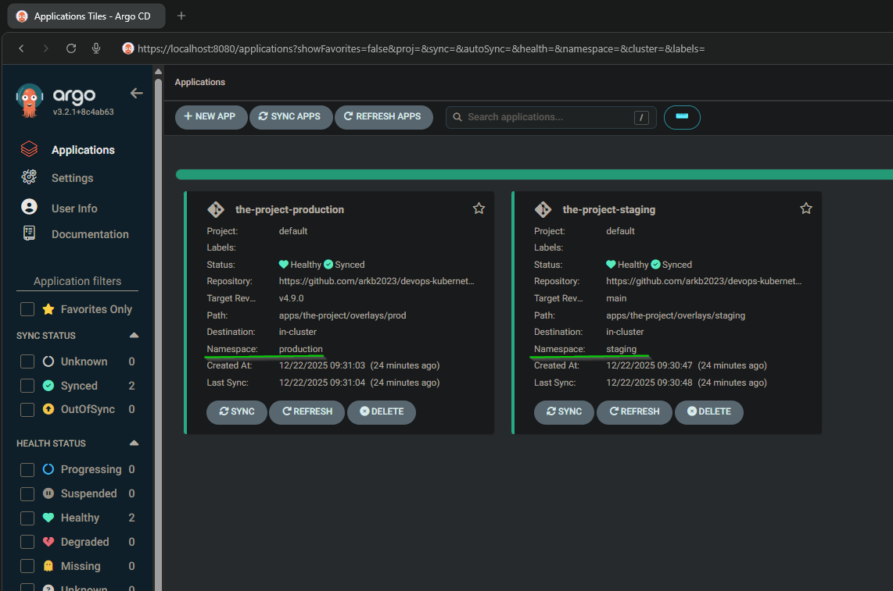

- Verify Pods (namePrefix Working)
  ```bash
  kubectl -n staging get pods
  NAME                                       READY   STATUS    RESTARTS   AGE
  staging-broadcaster-dep-64686df98-54bg8    1/1     Running   0          2m
  staging-broadcaster-dep-64686df98-7t7jg    1/1     Running   0          2m
  staging-broadcaster-dep-64686df98-9nstz    1/1     Running   0          2m
  staging-broadcaster-dep-64686df98-thg8v    1/1     Running   0          2m
  staging-broadcaster-dep-64686df98-vgxd5    1/1     Running   0          2m
  staging-broadcaster-dep-64686df98-x4b4v    1/1     Running   0          2m
  staging-postgresql-db-0                    1/1     Running   0          2m
  staging-todo-app-dep-99fc745dc-pqvs8       2/2     Running   0          2m
  staging-todo-backend-dep-d65b5657d-p9br4   1/1     Running   0          2m
  ```
  ```bash
  kubectl -n production get pods
  NAME                                          READY   STATUS    RESTARTS   AGE
  production-broadcaster-dep-75cc589fc9-2q2tg   1/1     Running   0          2m12s
  production-broadcaster-dep-75cc589fc9-2wcp5   1/1     Running   0          2m12s
  production-broadcaster-dep-75cc589fc9-c5nwz   1/1     Running   0          2m12s
  production-broadcaster-dep-75cc589fc9-hcqrt   1/1     Running   0          2m12s
  production-broadcaster-dep-75cc589fc9-kw6zn   1/1     Running   0          2m12s
  production-broadcaster-dep-75cc589fc9-m2cw4   1/1     Running   0          2m12s
  production-postgresql-db-0                    1/1     Running   0          2m12s
  production-todo-app-dep-67c5bf7bc9-lwj74      2/2     Running   0          2m12s
  production-todo-backend-dep-b5c6bbc76-bcr8t   1/1     Running   0          2m12s
  ```
  > *namePrefix:* `staging-` and `production-` prefixes applied correctly

### 6. Verify Main Branch → Staging Deployment  

- Git Commit:    
  ```bash
  # Make a code change 
  git add .
  git commit -m "Test02: staging deployment on main branch commit"
  git push origin main

  # Output:
  Enumerating objects: 11, done.
  Counting objects: 100% (11/11), done.
  Delta compression using up to 22 threads
  Compressing objects: 100% (5/5), done.
  Writing objects: 100% (6/6), 554 bytes | 554.00 KiB/s, done.
  Total 6 (delta 4), reused 0 (delta 0), pack-reused 0
  remote: Resolving deltas: 100% (4/4), completed with 4 local objects.
  To github.com:arkb2023/devops-kubernetes.git
    9c6b883..9b66e7a  main -> main
  ```
  > Note the new commit hash `9b66e7a` from above output to coorrelate with GitHub Actions run and ArgoCD sync.

- GitHub Actions run for commit `9b66e7a`:
  - [Run #20422232795](https://github.com/arkb2023/devops-kubernetes/actions/runs/20422232795)
  - Status: `Success`  

    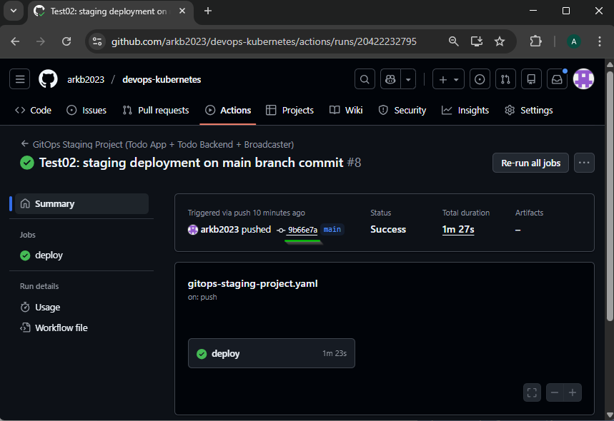

  - Commit step logs:
    
    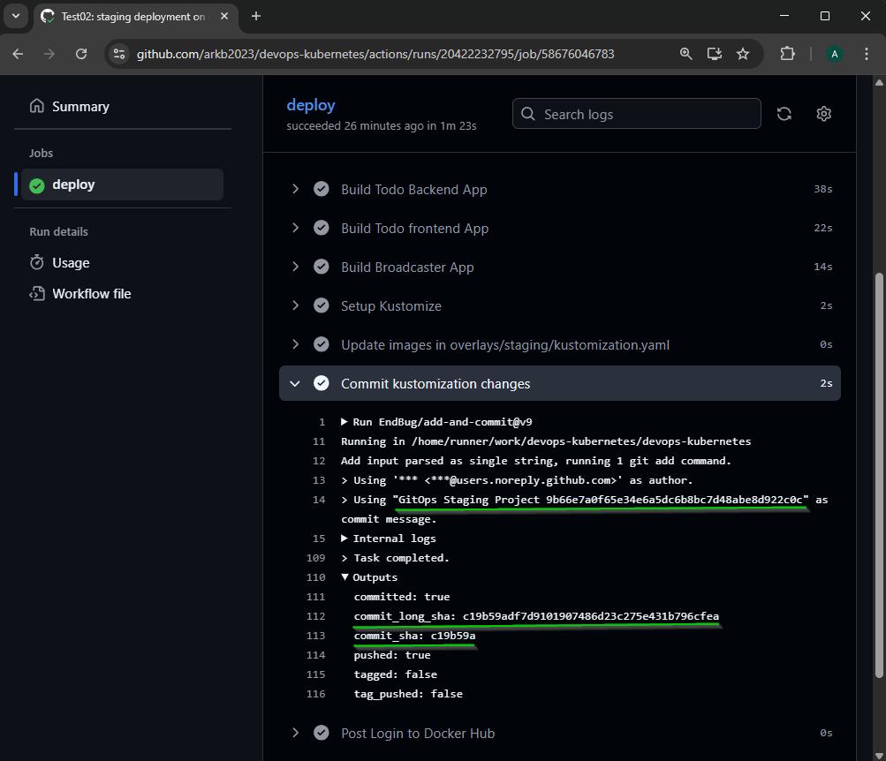

    Note:   
    - The commit message `GitOps Staging Project 9b66e7a0f65e34e6a5dc6b8bc7d48abe8d922c0c`, includes the main branch commit hash which is also used for the image tags - `arkb2023/*:9b66e7a0f65e34e6a5dc6b8bc7d48abe8d922c0c`
    - The new commit `c19b59a` on `overlays/staging/kustomization.yaml` gets detected by ArgoCD for automatic sync to staging environment.

  - [Commit #c19b59a](https://github.com/arkb2023/devops-kubernetes/commit/c19b59adf7d9101907486d23c275e431b796cfea) shows the updated production `kustomization.yaml`:

    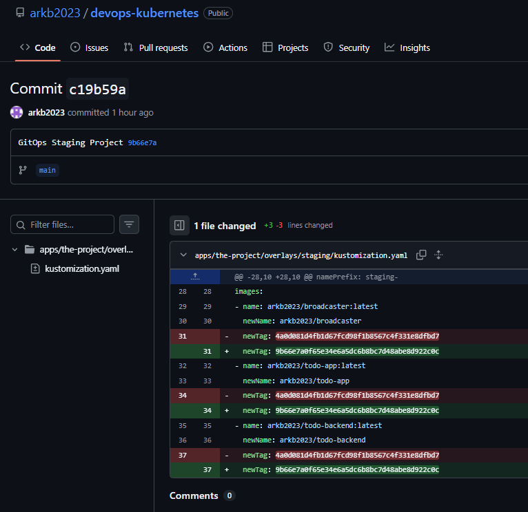

    > Shows updated newTag: `9b66e7a0f65e34e6a5dc6b8bc7d48abe8d922c0c` for all three applications

- Verify ArgoCD staging app syncs automatically with the new commit:
  ```bash
  kubectl -n argocd get application the-project-staging -o jsonpath="{.status.sync.revision}"
  
  # Output shows new commit sha:
  c19b59adf7d9101907486d23c275e431b796cfea
  ```

- Confirm in ArgoCD web UI that staging app is `Synced` and `Healthy` with new commit`c19b59a`:
  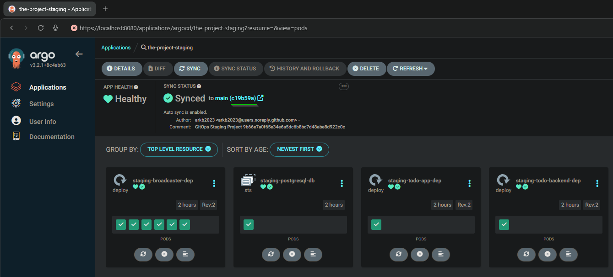

- Verify pods in staging namespace are READY and Running:
  ```bash 
  kubectl -n staging get pods
  # Output shows 1 Todo Backend, 1 PostgreSQL, 1 Todo App (2 containers), 6 Broadcaster pods:
  NAME                                        READY   STATUS    RESTARTS   AGE
  staging-broadcaster-dep-7ff8994569-5j6js    1/1     Running   0          104m
  staging-broadcaster-dep-7ff8994569-dzpsn    1/1     Running   0          104m
  staging-broadcaster-dep-7ff8994569-l2njb    1/1     Running   0          104m
  staging-broadcaster-dep-7ff8994569-m2647    1/1     Running   0          104m
  staging-broadcaster-dep-7ff8994569-nm9l6    1/1     Running   0          104m
  staging-broadcaster-dep-7ff8994569-xzzsz    1/1     Running   0          104m
  staging-postgresql-db-0                     1/1     Running   0          164m
  staging-todo-app-dep-d6896565f-pddsz        2/2     Running   0          104m
  staging-todo-backend-dep-5ddf49974f-mhr2j   1/1     Running   0          104m
  ```
  > Todo App (2 containers):   
  >   todo-app-container: Main application container  
  >   todo-backend-fetcher:  Sidecar container for backend application health check.  

- Verify images in staging pods correlate with kustomization.yaml updated newTag: `9b66e7a0f65e34e6a5dc6b8bc7d48abe8d922c0c`
  ```bash
  # Todo App Pod
  kubectl -n staging describe pod staging-todo-app-dep-d6896565f-pddsz |   grep -A2 'todo-app-container:'
  todo-app-container:
  # Output:
    Container ID:   containerd://22f7911b006c035248b3334d0ba54408fd5feb13e48716baa428dcc3832311c4
    Image:          arkb2023/todo-app:9b66e7a0f65e34e6a5dc6b8bc7d48abe8d922c0c

  # Todo Backend Pod
  kubectl -n staging describe pod staging-todo-backend-dep-5ddf49974f-mhr2j |   grep -A2 'todo-backend-container:'
  # Output:
  todo-backend-container:
    Container ID:   containerd://74d5d0a2ad9f2017dbadb91be00c8822250b88ae74cb68e81734d4b1afcd8ed6
    Image:          arkb2023/todo-backend:9b66e7a0f65e34e6a5dc6b8bc7d48abe8d922c0c

  # Broadcaster Pod
  kubectl -n staging describe pod staging-broadcaster-dep-7ff8994569-5j6js |   grep -A2 '  broadcaster:'
  # Output:
  broadcaster:
    Container ID:   containerd://fc435af23f144aa87f5bebc01e8c58489d30f5f66e34b746fe12159d12b70564
    Image:          arkb2023/broadcaster:9b66e7a0f65e34e6a5dc6b8bc7d48abe8d922c0c
  ```
- Access the Todo App in staging environment at: `http://localhost:8081/staging`  

  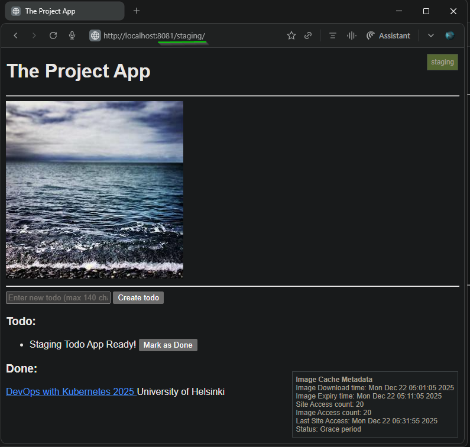

---


### 7. Verify Tagged Commit → Production Deployment

- Create a new tag on the main branch commit and push the tag to remote:  
  ```bash
  git tag -a v4.9.8 -m "Release v4.9.8"
  git push origin v4.9.8
  
  # Output:
  Enumerating objects: 1, done.
  Counting objects: 100% (1/1), done.
  Writing objects: 100% (1/1), 154 bytes | 154.00 KiB/s, done.
  Total 1 (delta 0), reused 0 (delta 0), pack-reused 0
  To github.com:arkb2023/devops-kubernetes.git
  * [new tag]         v4.9.8 -> v4.9.8
  ```
- GitHub Actions run for this tag `v4.9.8`:
  - [Run #20429721091](https://github.com/arkb2023/devops-kubernetes/actions/runs/20429721091)
  - Status: `Success`
    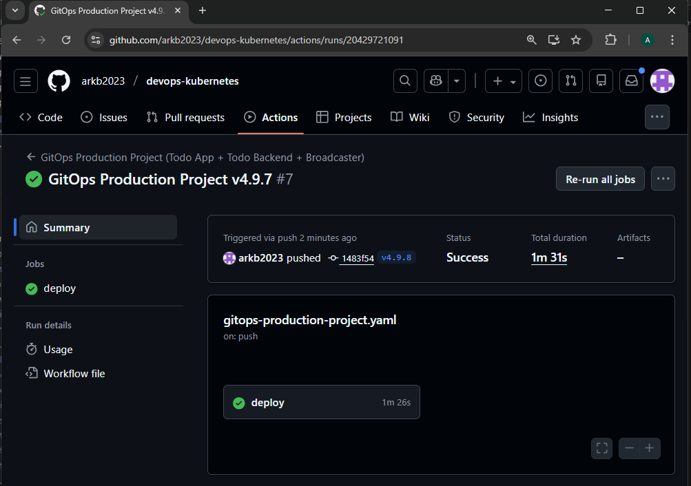

  - Commit step logs:  
    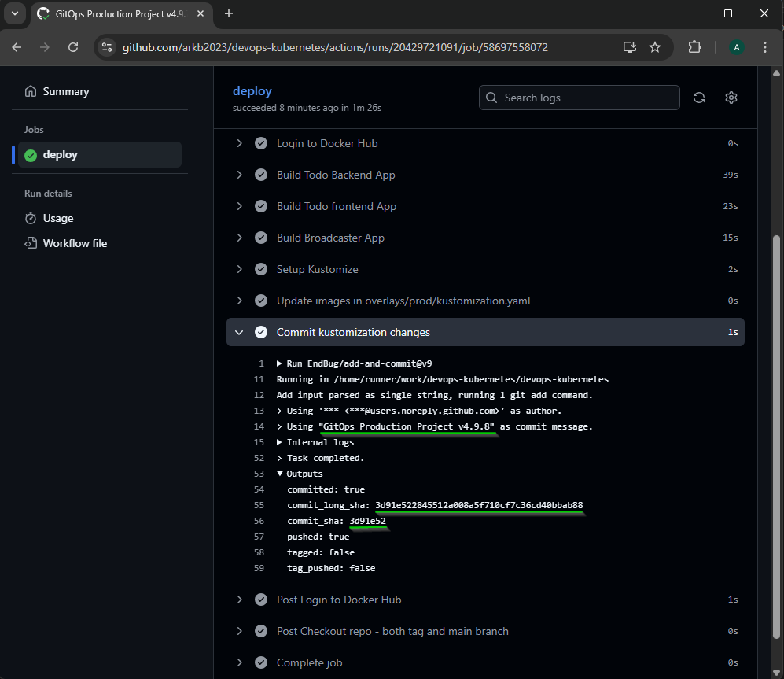
    Note:   
    - The commit message `GitOps Production Project v4.9.8`, includes the tag name `v4.9.8` 
    - The new commit `3d91e52` on `overlays/prod/kustomization.yaml` gets detected by ArgoCD for automatic sync to production environment.

  - [Commit #3d91e52](https://github.com/arkb2023/devops-kubernetes/commit/3d91e522845512a008a5f710cf7c36cd40bbab88) shows the updated production `kustomization.yaml`: 

  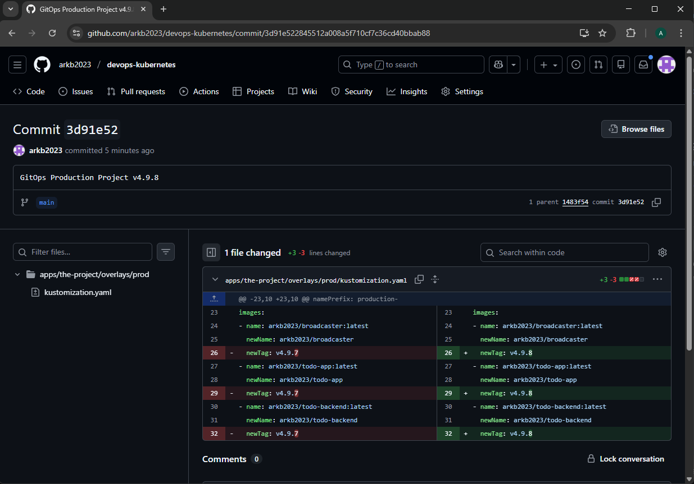
  > Shows updated newTag: `v4.9.8` for all three applications


- ArgoCD Auto-Synced to new commit `3d91e52`
  ```bash
  kubectl -n argocd get application the-project-production -o jsonpath="{.status.sync.revision}"
  # Output shows new commit sha:
  3d91e522845512a008a5f710cf7c36cd40bbab88
  ```

- ArgoCD UI - Synced to `3d91e52`  

  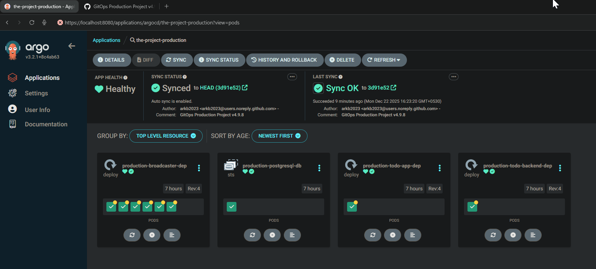

- Verify New Images Deployed with `v4.9.8` tag:
  ```bash
  
  # Todo App Pod
  kubectl -n production describe pod production-todo-app-dep-67486c8bd5-rmswh |   grep -A2 'todo-app-container:'
  todo-app-container:
  # Output:
  'todo-app-container:'
    todo-app-container:
      Container ID:   containerd://42c6bb727c070bd51d7afce4247ff939ec0c19fed37ca73b706ca213dcb06558
      Image:          arkb2023/todo-app:v4.9.8
  
  # Todo Backend Pod
  kubectl -n production describe pod production-todo-backend-dep-b5484cd-hwxjj |   grep -A2 'todo-backend-container:'
  # Output:
  todo-backend-container:
    Container ID:   containerd://2ca1aa1bca9da3c67ed3d28c9cf3bb237cea65b875709dd3417f15891728827a
    Image:          arkb2023/todo-backend:v4.9.8
  
  # Broadcaster Pod
  kubectl -n production describe pod production-broadcaster-dep-6d9b948847-8vqzs |   grep -A2 '  broadcaster:'
  # Output: 
  broadcaster:
    Container ID:   containerd://0cae347b46ac40ef4182f5d8ca28da800338bc976d42d2c4e040421867ca1cb3
    Image:          arkb2023/broadcaster:v4.9.8
  ```

- Pods are READY and Running:
  ```bash 
  kubectl -n production get pods
  # Output shows 1 Todo Backend, 1 PostgreSQL, 1 Todo App (2 containers), 6 Broadcaster pods:
  NAME                                          READY   STATUS    RESTARTS   AGE
  production-broadcaster-dep-6d9b948847-8vqzs   1/1     Running   0          33m
  production-broadcaster-dep-6d9b948847-g9675   1/1     Running   0          33m
  production-broadcaster-dep-6d9b948847-rblqd   1/1     Running   0          33m
  production-broadcaster-dep-6d9b948847-tfz67   1/1     Running   0          33m
  production-broadcaster-dep-6d9b948847-vzhww   1/1     Running   0          33m
  production-broadcaster-dep-6d9b948847-w5pds   1/1     Running   0          33m
  production-postgresql-db-0                    1/1     Running   0          7h25m
  production-todo-app-dep-67486c8bd5-rmswh      2/2     Running   0          33m
  production-todo-backend-dep-b5484cd-hwxjj     1/1     Running   0          33m
  ```

- Access the Todo App in production environment at: `http://localhost:8081/production`

  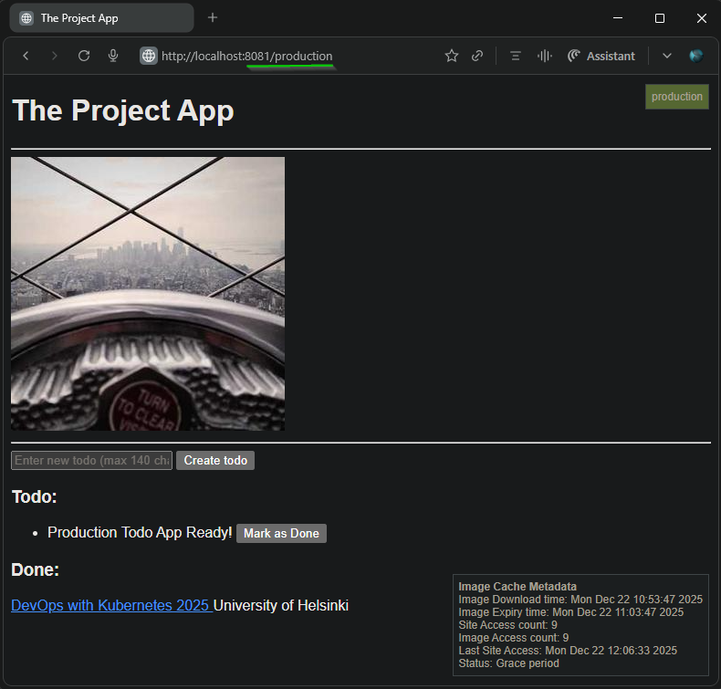

---

### 8. Verify Broadcaster Behavior
#### 8.1. Test: Create/update todos at `http://localhost:8081/staging`, NATS Subscribe + Logs messages   
  - Access the Todo App in staging environment at: `http://localhost:8081/staging` and create/update multiple todo items:  

    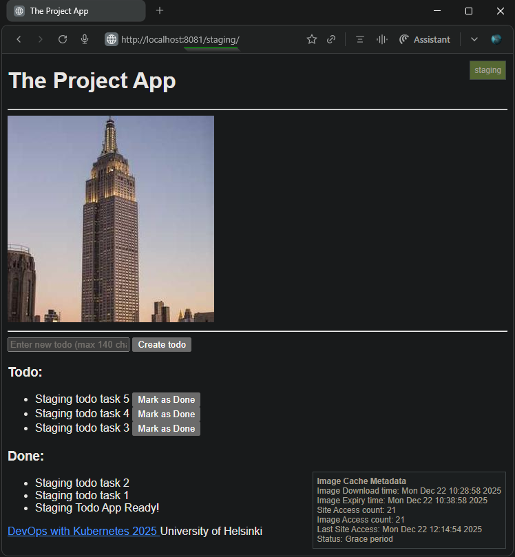
    
  - Broadcaster logs messages related to the created/updated todo operations:  

    ```bash
    kubectl -n staging logs -l app=broadcaster |egrep "subject=staging.|Staging: Logging only"

    # Output shows multiple messages received on `staging.todos.created` and `staging.todos.updated` subjects:
    2025-12-22 10:28:55,776 [staging-broadcaster] INFO Staging: Logging only
    2025-12-22 12:15:42,436 [staging-broadcaster] INFO subject=staging.todos.created data={"id": 6, "text": "Staging todo task 5", "completed": false, "created_at": "2025-12-22 12:15:42.416096+00:00"}
    2025-12-22 10:28:51,587 [staging-broadcaster] INFO Staging: Logging only
    2025-12-22 12:15:19,824 [staging-broadcaster] INFO subject=staging.todos.created data={"id": 3, "text": "Staging todo task 2", "completed": false, "created_at": "2025-12-22 12:15:19.799194+00:00"}
    2025-12-22 12:15:44,974 [staging-broadcaster] INFO subject=staging.todos.updated data={"id": 1, "text": "Staging Todo App Ready!", "completed": true, "created_at": "2025-12-20 13:37:22.474203+00:00"}
    2025-12-22 10:28:45,430 [staging-broadcaster] INFO Staging: Logging only
    2025-12-22 12:15:49,370 [staging-broadcaster] INFO subject=staging.todos.updated data={"id": 3, "text": "Staging todo task 2", "completed": true, "created_at": "2025-12-22 12:15:19.799194+00:00"}
    2025-12-22 10:28:51,015 [staging-broadcaster] INFO Staging: Logging only
    2025-12-22 10:28:56,288 [staging-broadcaster] INFO Staging: Logging only
    2025-12-22 12:15:22,832 [staging-broadcaster] INFO subject=staging.todos.created data={"id": 4, "text": "Staging todo task 3", "completed": false, "created_at": "2025-12-22 12:15:22.812641+00:00"}
    2025-12-22 12:15:38,090 [staging-broadcaster] INFO subject=staging.todos.created data={"id": 5, "text": "Staging todo task 4", "completed": false, "created_at": "2025-12-22 12:15:38.069718+00:00"}
    2025-12-22 10:28:55,561 [staging-broadcaster] INFO Staging: Logging only
    2025-12-22 12:15:12,669 [staging-broadcaster] INFO subject=staging.todos.created data={"id": 2, "text": "Staging todo task 1", "completed": false, "created_at": "2025-12-22 12:15:12.631869+00:00"}
    2025-12-22 12:15:48,011 [staging-broadcaster] INFO subject=staging.todos.updated data={"id": 2, "text": "Staging todo task 1", "completed": true, "created_at": "2025-12-22 12:15:12.631869+00:00"}
    ```    

#### 8.2. Test: Create/update todos at `http://localhost:8081/production`, NATS Subscribe + Slack Forward

  - Access the Todo App in production environment at: `http://localhost:8081/production` and create/update multiple todo items:  
    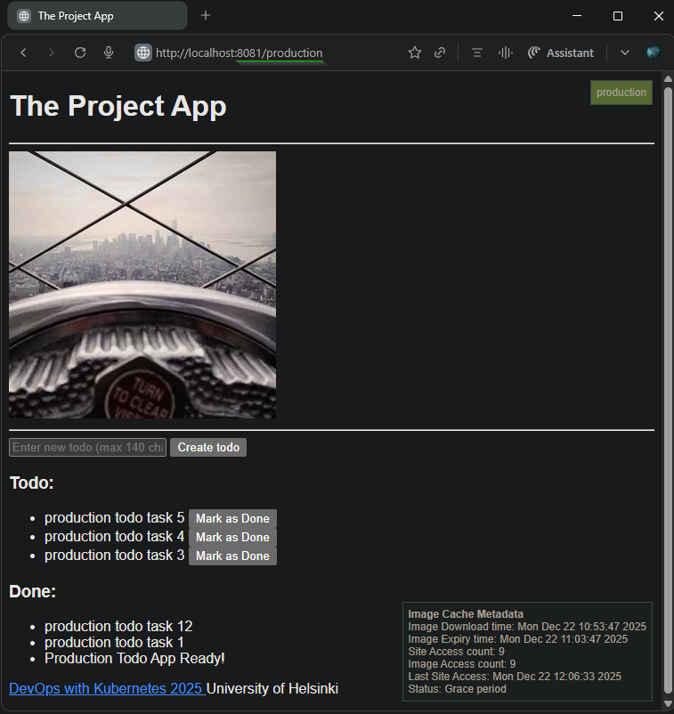
  
  - Slack Channel - Messages received successfully: 
    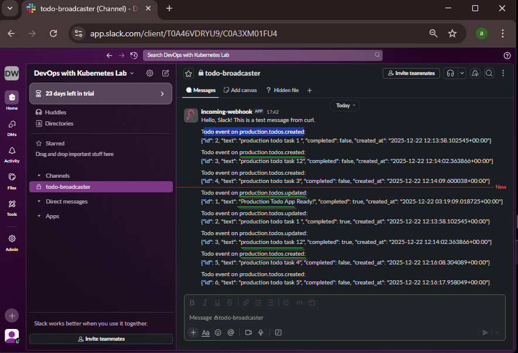

### 9. Production-Only DB Backups
  - Production DB - Multiple backups created:  
    ```bash
    kubectl -n production exec  production-postgresql-db-0 -- ls -l /data
    # Output:
    total 156
    -rw-r--r--  1 postgres postgres  5591 Dec 22 15:03 backup-full-20251222-150301.sql
    -rw-r--r--  1 postgres postgres  5591 Dec 22 15:37 backup-full-20251222-153707.sql
    -rw-r--r--  1 postgres postgres  5591 Dec 22 15:45 backup-full-20251222-154511.sql
    -rw-r--r--  1 postgres postgres  5591 Dec 22 15:45 backup-full-20251222-154514.sql
    -rw-r--r--  1 postgres postgres 10483 Dec 22 16:00 backup-full-20251222-160029.sql
    -rw-r--r--  1 postgres postgres 10483 Dec 22 16:15 backup-full-20251222-161531.sql
    -rw-r--r--  1 postgres postgres 10483 Dec 22 16:30 backup-full-20251222-163031.sql
    -rw-r--r--  1 postgres postgres 10483 Dec 22 16:45 backup-full-20251222-164533.sql
    -rw-r--r--  1 postgres postgres 10483 Dec 22 17:00 backup-full-20251222-170034.sql
    -rw-r--r--  1 postgres postgres 10483 Dec 22 17:15 backup-full-20251222-171535.sql
    -rw-r--r--  1 postgres postgres 10483 Dec 22 17:30 backup-full-20251222-173036.sql
    -rw-r--r--  1 postgres postgres 10483 Dec 22 17:45 backup-full-20251222-174536.sql
    -rw-r--r--  1 postgres postgres 10483 Dec 22 18:00 backup-full-20251222-180038.sql
    -rw-r--r--  1 postgres postgres 10483 Dec 22 18:15 backup-full-20251222-181538.sql
    drwx------ 19 postgres root      4096 Dec 22 04:01 pgdata
    ```
  
  - Staging DB - No backups (as expected):
    ```bash
    kubectl -n staging exec staging-postgresql-db-0 -- ls -l /data
    total 4
    drwx------ 19 postgres root 4096 Dec 22 04:00 pgdata
    ```

### 10. Cleanup
- Delete ArgoCD applications
  ```bash
  kubectl -n argocd delete application the-project-staging
  kubectl -n argocd delete application the-project-production
  ```
- Delete namespaces
  ```bash
  kubectl delete namespace staging
  kubectl delete namespace production
  ```
