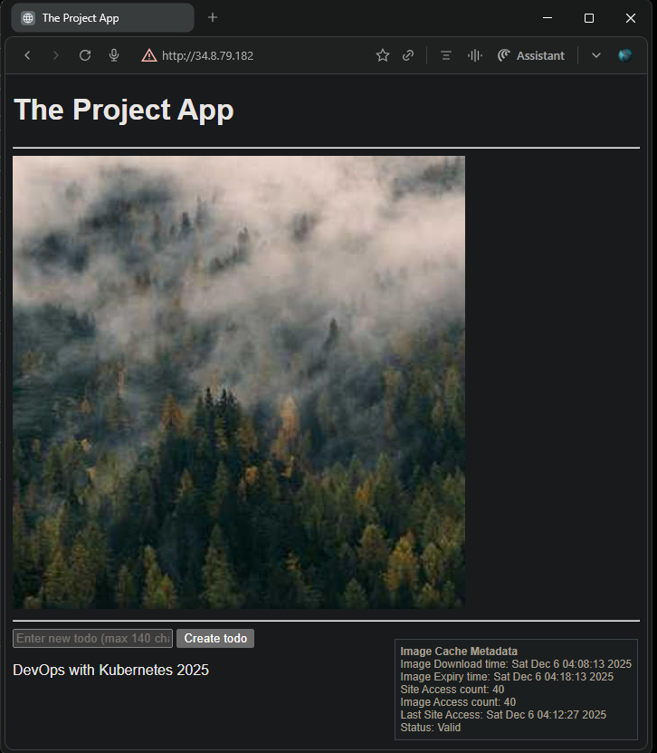

## Exercise 2.6: The Project, Step 10

Ensure that your project contains no hardcoded ports, URLs, or other configuration values in the source code. Pass all configurations to pods as environment variables defined either in ConfigMaps or directly in the deployment manifests.

### Resource Updates

- [`project-config.yaml`](./configmaps/project-config.yaml): Defines the `project-config-env` ConfigMap with the following environment variables:  
  - `IMG_URL`: `https://picsum.photos/200`  
  - `CACHE_DIR`: `/usr/src/app/files/cache`  
  - `TODO_BACKEND_URL`: `http://127.0.0.1:8081`

- `Todo App` [`deployment.yaml`](./todo_app/manifests/deployment.yaml) enhanced to use `envFrom` referencing the entire `project-config-env` ConfigMap to set environment variables in the `todo_app` container.

- `Todo Backend` [`deployment.yaml`](./todo_backend/manifests/deployment.yaml) similarly enhanced to use `envFrom` with `project-config-env`, defining environment variables for the `todo_backend` container.

### Application Updates

- The **Todo App** replaces the hardcoded image source URL `https://picsum.photos/200` with the environment variable `IMG_URL`.
- The **Todo App** replaces the hardcoded backend URL `http://127.0.0.1:8081` with the environment variable `TODO_BACKEND_URL`.
- Both **Todo Backend** and **Todo App** replace the shared volume path `/usr/src/app/files/cache` with the environment variable `CACHE_DIR`.

### Base Application Versions

- [Todo App v2.4](https://github.com/arkb2023/devops-kubernetes/tree/2.4/the_project/todo_app)  
- [Todo Backend v2.4](https://github.com/arkb2023/devops-kubernetes/tree/2.4/the_project/todo_backend)

***

### 1. **Directory and File Structure**
<pre>
the_project
├── configmaps
│   └── project-config-env.yaml
├── todo_app
│   ├── Dockerfile
│   ├── app
│   │   ├── __init__.py
│   │   ├── cache.py
│   │   ├── main.py
│   │   ├── routes
│   │   │   ├── __init__.py
│   │   │   └── frontend.py
│   │   ├── static
│   │   │   └── scripts.js
│   │   └── templates
│   │       └── index.html
│   ├── manifests
│   │   ├── deployment.yaml
│   │   ├── ingress.yaml
│   │   └── service.yaml
├── todo_backend
│   ├── Dockerfile
│   ├── app
│   │   ├── __init__.py
│   │   ├── main.py
│   │   ├── models.py
│   │   ├── routes
│   │   │   ├── __init__.py
│   │   │   └── todos.py
│   │   └── storage.py
│   ├── manifests
│   │   ├── deployment.yaml
│   │   ├── ingress.yaml
│   │   └── service.yaml
└── volumes
    ├── persistentvolume.yaml
    └── persistentvolumeclaim.yaml
</pre>


### 2. Prerequisites

- Ensure the following tools are installed:
  - Docker  
  - k3d (K3s in Docker)  
  - kubectl (Kubernetes CLI)
- Create and run a Kubernetes cluster with k3d, using 2 agent nodes and port mapping to expose the ingress load balancer on host port 8081:
    ```bash
    k3d cluster create mycluster --agents 2 --port 8081:80@loadbalancer
    ```
- `project` namespace created in the cluster
    ```bash
    kubectl create namespace project
    ```

***

### 3. Deploy the project resources into the `project` namespace along with the ConfigMap

```bash
kubectl apply -n project \
  -f the_project/todo_app/manifests/ \
  -f the_project/todo_backend/manifests/ \
  -f the_project/configmaps/ \
  -f volumes/
```

*output:*

```text
deployment.apps/todo-app-dep created
ingress.networking.k8s.io/todo-app-ingress created
service/todo-app-svc created
deployment.apps/todo-backend-dep created
ingress.networking.k8s.io/todo-backend-ingress created
service/todo-backend-svc created
configmap/project-config-env created
persistentvolume/local-pv created
persistentvolumeclaim/local-pv-claim created
```


**Verify ConfigMaps**

Run the following command to describe the `project-config-env` ConfigMap in the `project` namespace:

```bash
kubectl describe configmap project-config-env -n project
```

*output:*

```text
Name:         project-config-env
Namespace:    project
Labels:       <none>
Annotations:  <none>

Data
====
CACHE_DIR:
----
/usr/src/app/files/cache

IMG_URL:
----
https://picsum.photos/200

LOG_FORMAT:
----
ENV: %(asctime)s - %(name)s - %(levelname)s - %(message)s

LOG_LEVEL:
----
INFO

THE_PROJECT_ROOT:
----
/app

TODO_APP_HOST:
----
127.0.0.1

TODO_APP_PORT:
----
3000

TODO_APP_URL:
----
http://127.0.0.1:8080

TODO_BACKEND_HOST:
----
127.0.0.1

TODO_BACKEND_PORT:
----
3000

TODO_BACKEND_URL:
----
http://127.0.0.1:8081

BinaryData
====

Events:  <none>
```

**Verify environment variables in `todo-backend` and `todo-app` pod containers**

Check the environment variables inside the `todo-backend` container:

```bash
kubectl -n project exec -it todo-backend-dep-69b78f8c84-bpldj -c todo-backend-container -- printenv
```

*output:*

```text
PORT=3000
CACHE_DIR=/usr/src/app/files/cache
TODO_BACKEND_URL=http://127.0.0.1:8081
TODO_BACKEND_PORT=3000
TODO_APP_HOST=127.0.0.1
TODO_APP_PORT=3000
THE_PROJECT_ROOT=/app
TODO_APP_URL=http://127.0.0.1:8080
TODO_BACKEND_HOST=127.0.0.1
IMG_URL=https://picsum.photos/200
LOG_FORMAT=ENV: %(asctime)s - %(name)s - %(levelname)s - %(message)s
LOG_LEVEL=INFO
```

Check the environment variables inside the `todo-app` container:

```bash
kubectl -n project exec -it todo-app-dep-64cc79cbf7-q6vp5 -c todo-app-container -- printenv
```

*output:*

```text
PORT=3000
CACHE_DIR=/usr/src/app/files/cache
TODO_BACKEND_URL=http://127.0.0.1:8081
TODO_APP_URL=http://127.0.0.1:8080
IMG_URL=https://picsum.photos/200
LOG_FORMAT=ENV: %(asctime)s - %(name)s - %(levelname)s - %(message)s
TODO_APP_HOST=127.0.0.1
THE_PROJECT_ROOT=/app
TODO_BACKEND_HOST=127.0.0.1
TODO_BACKEND_PORT=3000
LOG_LEVEL=INFO
TODO_APP_PORT=3000
```

---

### 4. Validate

- **Initial page access:**  
  The image renders correctly alongside an empty todo list.  
  

- **Todo addition functionality:**  
  Adding a todo item works as expected and is reflected in subsequent GET requests.  
    

---

### Cleanup

Run the following command to delete all project-related resources from the `project` namespace:

```bash
kubectl delete -n project \
  -f the_project/todo_app/manifests/ \
  -f the_project/todo_backend/manifests/ \
  -f the_project/configmaps/ \
  -f volumes/
```

```
