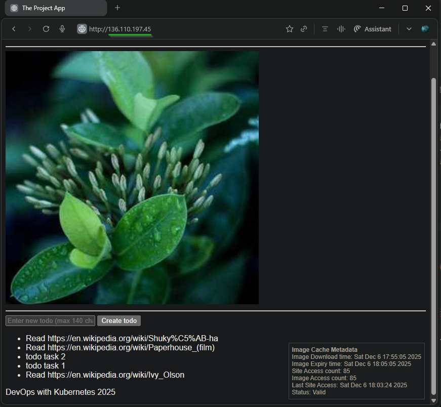
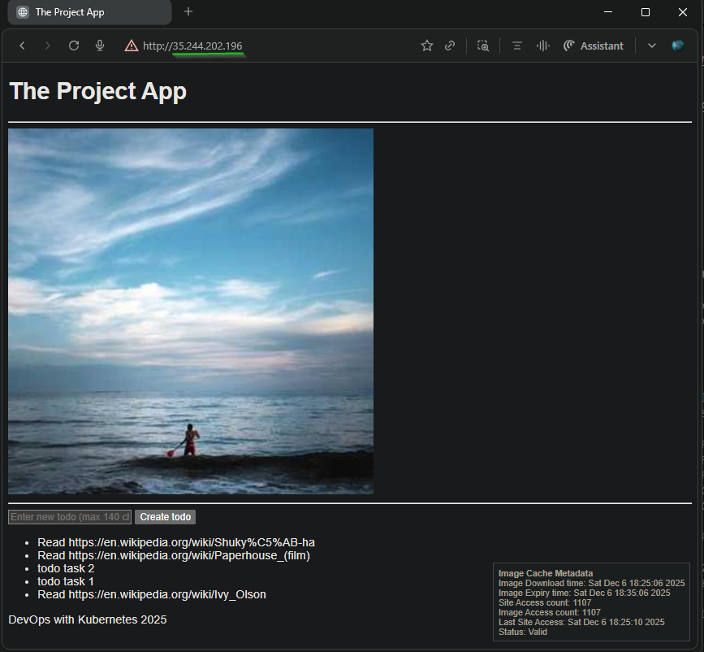

## Exercise 3.7. The project, step 16

**Objective**: Improve the deployment so that each branch creates a separate environment. The main branch should still be deployed in the namespace project.

**Key Changes from Base**  
  - [.github/workflows/project-gke.yaml](../.github/workflows/project-gke.yaml) - Enhanced for Multi-Branch GitHub Actions Workflow with dynamic namespace generation

**Base Application Version**
- [The project v3.6](https://github.com/arkb2023/devops-kubernetes/tree/3.6/the_project/)

### 1. **Directory and File Structure**
<pre>
  # Github actions workflow
  .github/
  └── workflows
      └── project-gke.yaml

  # kustomization: Common Project resource yamls 
  apps/the-project/
  ├── cron_wiki_todo.yaml
  ├── kustomization.yaml
  ├── postgres-db-secret.yaml
  ├── postgresql-configmap.yaml
  ├── postgresql-service.yaml
  ├── postgresql-statefulset.yaml
  ├── project-configmap.yaml
  ├── todo-app-deployment.yaml
  ├── todo-app-service.yaml
  ├── todo-backend-deployment.yaml
  └── todo-backend-service.yaml

  # kustomization: GKE Project resource yamls 
  environments/project-gke/
  ├── gateway.yaml
  ├── kustomization.yaml
  ├── namespace.yaml
  ├── persistentvolumeclaim.yaml
  ├── todo-app-route.yaml
  └── todo-backend-route.yaml

  # Todo App 
  the_project/todo_app/
  ├── Dockerfile
  ├── app
  │   ├── __init__.py
  │   ├── cache.py
  │   ├── main.py
  │   ├── routes
  │   │   ├── __init__.py
  │   │   └── frontend.py
  │   ├── static
  │   │   └── scripts.js
  │   └── templates
  │       └── index.html

  # Todo Backend App 
  the_project/todo_backend/
  ├── Dockerfile
  ├── app
  │   ├── __init__.py
  │   ├── main.py
  │   ├── models.py
  │   ├── routes
  │   │   ├── __init__.py
  │   │   └── todos.py
  │   └── storage.py
  ├── docker-compose.yml
  └── wait-for-it.sh

  # Wiki Todo Generator CronJob
  the_project/cronjob/
  ├── Dockerfile
  └── cron_wiki_todo.py
</pre>


### 2. Prerequisites (GCP/GKE)

- Google Cloud CLI (`gcloud`) updated to 548.0.0
- kubectl with `gke-gcloud-auth-plugin`
- GCP Project: `dwk-gke-480015` configured
- Cluster Creation:
  ```bash
  gcloud container clusters create dwk-cluster \
    --zone=asia-south1-a \
    --cluster-version=1.32 \
    --num-nodes=3 \
    --machine-type=e2-medium \
    --gateway-api=standard \
    --disk-size=50 \
    --enable-ip-alias
  ```
- Fetch and configure Kubernetes cluster access credentials locally, enabling kubectl to authenticate and manage the specified GKE cluster  
  ```bash
  gcloud container clusters get-credentials dwk-cluster --zone=asia-south1-a
  ```
- Google service Account `github-actions`wtih required IAM roles  
- Google Artifact Registry - repository `dwk-gke-repository` (asia-south1)  
- GitHub Actions authentication for GKE + Artifact Registry via Repository Secrets  

### 3. Multi-Branch GitOps Validation
  - Trigger Pipeline in `main` branch
    ```bash
    git checkout main
    git add .
    git commit -m "[Exercise: 3.7. The project, step 16] Test01- Build, Publish & Deploy"
    git push origin main
    ```
  - Trigger Pipeline in `feature/ui-v1` branch
    ```bash
    git checkout feature/ui-v1
    git add .
    git commit -m "[Exercise: 3.7. The project, step 16] Test04- Build, Publish & Deploy"
    git push origin main
    ```
  - Pipelines triggered for both `main` [Run #19991435542](https://github.com/arkb2023/devops-kubernetes/actions/runs/19991435542) and `feature/ui-v1` [Run #19992143321](https://github.com/arkb2023/devops-kubernetes/actions/runs/19992143321) branch  
      
  
  - Build Jobs - `main` and `feature/ui-v1` branch  
      
  
  - Validate Namespace Isolation  
      ```bash
      kubectl get ns | egrep "project|feature-ui-v1|NAME"
      ```
      *Output*  
      ```text
      NAME                          STATUS   AGE
      feature-ui-v1                 Active   69m
      project                       Active   86m
      ```

  - Validate Gateway Separation - Two unique external IPs
      ```bash
      kubectl get gateway -A | egrep "project|feature-ui-v1|NAMESPACE"
      ```
      *Output*  
      ```text
      NAMESPACE       NAME              CLASS                            ADDRESS          PROGRAMMED   AGE
      feature-ui-v1   project-gateway   gke-l7-global-external-managed   136.110.197.45   True         25m
      project         project-gateway   gke-l7-global-external-managed   35.244.202.196   True         87m
      ```
  - Validate Resource Isolation Per Namespace

    - `project` Namespace
        ```bash
        kubectl get all -n project -o wide
        ```
        *Output*  
        ```text
        NAME                                     READY   STATUS      RESTARTS   AGE   IP            NODE                                         NOMINATED NODE   READINESS GATES
        pod/postgresql-db-0                      1/1     Running     0          88m   10.108.2.8    gke-dwk-cluster-default-pool-f81a64d1-02f0   <none>           <none>
        pod/todo-app-dep-58fc874bc5-w5rxq        1/1     Running     0          71m   10.108.2.10   gke-dwk-cluster-default-pool-f81a64d1-02f0   <none>           1/1
        pod/todo-backend-dep-5cbcd8d5b8-kwwh6    1/1     Running     0          71m   10.108.2.11   gke-dwk-cluster-default-pool-f81a64d1-02f0   <none>           1/1
        pod/wiki-todo-generator-29417340-wgqbt   0/1     Completed   0          81m   10.108.0.5    gke-dwk-cluster-default-pool-f81a64d1-v074   <none>           <none>
        pod/wiki-todo-generator-29417400-lvkzr   0/1     Completed   0          21m   10.108.2.14   gke-dwk-cluster-default-pool-f81a64d1-02f0   <none>           <none>

        NAME                        TYPE        CLUSTER-IP       EXTERNAL-IP   PORT(S)    AGE   SELECTOR
        service/postgresql-db-svc   ClusterIP   None             <none>        5432/TCP   88m   app=postgresql-db
        service/todo-app-svc        ClusterIP   34.118.232.235   <none>        1234/TCP   88m   app=todo-app
        service/todo-backend-svc    ClusterIP   34.118.238.80    <none>        4567/TCP   88m   app=todo-backend

        NAME                               READY   UP-TO-DATE   AVAILABLE   AGE   CONTAINERS               IMAGES                                                                                                               SELECTOR
        deployment.apps/todo-app-dep       1/1     1            1           88m   todo-app-container       asia-south1-docker.pkg.dev/dwk-gke-480015/dwk-gke-repository/todo-app:5da976263bb43057e76b55d9b26735758078629e       app=todo-app
        deployment.apps/todo-backend-dep   1/1     1            1           88m   todo-backend-container   asia-south1-docker.pkg.dev/dwk-gke-480015/dwk-gke-repository/todo-backend:5da976263bb43057e76b55d9b26735758078629e   app=todo-backend

        NAME                                          DESIRED   CURRENT   READY   AGE   CONTAINERS               IMAGES                                                                                                               SELECTOR
        replicaset.apps/todo-app-dep-58fc874bc5       1         1         1       71m   todo-app-container       asia-south1-docker.pkg.dev/dwk-gke-480015/dwk-gke-repository/todo-app:5da976263bb43057e76b55d9b26735758078629e       app=todo-app,pod-template-hash=58fc874bc5
        replicaset.apps/todo-app-dep-646d55d6dc       0         0         0       80m   todo-app-container       asia-south1-docker.pkg.dev/dwk-gke-480015/dwk-gke-repository/todo-app:4750f76d0b2c5a45b1d309d23b509a17275a6761       app=todo-app,pod-template-hash=646d55d6dc
        replicaset.apps/todo-app-dep-8548d6bf97       0         0         0       88m   todo-app-container       asia-south1-docker.pkg.dev/dwk-gke-480015/dwk-gke-repository/todo-app:66f91eb78bc48772a8602e2dd00c6741e89b5592       app=todo-app,pod-template-hash=8548d6bf97
        replicaset.apps/todo-backend-dep-595449c656   0         0         0       80m   todo-backend-container   asia-south1-docker.pkg.dev/dwk-gke-480015/dwk-gke-repository/todo-backend:4750f76d0b2c5a45b1d309d23b509a17275a6761   app=todo-backend,pod-template-hash=595449c656
        replicaset.apps/todo-backend-dep-5cbcd8d5b8   1         1         1       71m   todo-backend-container   asia-south1-docker.pkg.dev/dwk-gke-480015/dwk-gke-repository/todo-backend:5da976263bb43057e76b55d9b26735758078629e   app=todo-backend,pod-template-hash=5cbcd8d5b8
        replicaset.apps/todo-backend-dep-6447cf79fd   0         0         0       88m   todo-backend-container   asia-south1-docker.pkg.dev/dwk-gke-480015/dwk-gke-repository/todo-backend:66f91eb78bc48772a8602e2dd00c6741e89b5592   app=todo-backend,pod-template-hash=6447cf79fd

        NAME                             READY   AGE   CONTAINERS      IMAGES
        statefulset.apps/postgresql-db   1/1     88m   postgresql-db   postgres:latest

        NAME                                SCHEDULE    TIMEZONE   SUSPEND   ACTIVE   LAST SCHEDULE   AGE   CONTAINERS   IMAGES                          SELECTOR
        cronjob.batch/wiki-todo-generator   0 * * * *   <none>     False     0        21m             88m   wiki-todo    arkb2023/wiki-todo-cron:2.9.3   <none>

        NAME                                     STATUS     COMPLETIONS   DURATION   AGE   CONTAINERS   IMAGES                          SELECTOR
        job.batch/wiki-todo-generator-29417340   Complete   1/1           12s        81m   wiki-todo    arkb2023/wiki-todo-cron:2.9.3   batch.kubernetes.io/controller-uid=af8bf100-9470-4500-8e7f-0406e06115b5
        job.batch/wiki-todo-generator-29417400   Complete   1/1           7s         21m   wiki-todo    arkb2023/wiki-todo-cron:2.9.3   batch.kubernetes.io/controller-uid=86c24fd7-b1c3-4918-af8b-98a957578057
        ```
    - `feature-ui-v1` Namespace
      ```bash
      kubectl get all -n feature-ui-v1 -o wide
      ```
      *Output*  
      ```text
      NAME                                     READY   STATUS      RESTARTS   AGE   IP            NODE                                         NOMINATED NODE   READINESS GATES
      pod/postgresql-db-0                      1/1     Running     0          27m   10.108.2.12   gke-dwk-cluster-default-pool-f81a64d1-02f0   <none>           <none>
      pod/todo-app-dep-58d657968d-cpsdw        1/1     Running     0          27m   10.108.0.6    gke-dwk-cluster-default-pool-f81a64d1-v074   <none>           <none>
      pod/todo-backend-dep-d5844bbbc-blvxt     1/1     Running     0          27m   10.108.0.7    gke-dwk-cluster-default-pool-f81a64d1-v074   <none>           <none>
      pod/wiki-todo-generator-29417400-hkz6g   0/1     Completed   0          21m   10.108.2.13   gke-dwk-cluster-default-pool-f81a64d1-02f0   <none>           <none>

      NAME                        TYPE        CLUSTER-IP       EXTERNAL-IP   PORT(S)    AGE   SELECTOR
      service/postgresql-db-svc   ClusterIP   None             <none>        5432/TCP   27m   app=postgresql-db
      service/todo-app-svc        ClusterIP   34.118.238.53    <none>        1234/TCP   27m   app=todo-app
      service/todo-backend-svc    ClusterIP   34.118.227.157   <none>        4567/TCP   27m   app=todo-backend

      NAME                               READY   UP-TO-DATE   AVAILABLE   AGE   CONTAINERS               IMAGES                                                                                                               SELECTOR
      deployment.apps/todo-app-dep       1/1     1            1           27m   todo-app-container       asia-south1-docker.pkg.dev/dwk-gke-480015/dwk-gke-repository/todo-app:a257f26ae4f6049dad2fe50064d9ca436b050671       app=todo-app
      deployment.apps/todo-backend-dep   1/1     1            1           27m   todo-backend-container   asia-south1-docker.pkg.dev/dwk-gke-480015/dwk-gke-repository/todo-backend:a257f26ae4f6049dad2fe50064d9ca436b050671   app=todo-backend

      NAME                                         DESIRED   CURRENT   READY   AGE   CONTAINERS               IMAGES                                                                                                               SELECTOR
      replicaset.apps/todo-app-dep-58d657968d      1         1         1       27m   todo-app-container       asia-south1-docker.pkg.dev/dwk-gke-480015/dwk-gke-repository/todo-app:a257f26ae4f6049dad2fe50064d9ca436b050671       app=todo-app,pod-template-hash=58d657968d
      replicaset.apps/todo-backend-dep-d5844bbbc   1         1         1       27m   todo-backend-container   asia-south1-docker.pkg.dev/dwk-gke-480015/dwk-gke-repository/todo-backend:a257f26ae4f6049dad2fe50064d9ca436b050671   app=todo-backend,pod-template-hash=d5844bbbc

      NAME                             READY   AGE   CONTAINERS      IMAGES
      statefulset.apps/postgresql-db   1/1     27m   postgresql-db   postgres:latest

      NAME                                SCHEDULE    TIMEZONE   SUSPEND   ACTIVE   LAST SCHEDULE   AGE   CONTAINERS   IMAGES                          SELECTOR
      cronjob.batch/wiki-todo-generator   0 * * * *   <none>     False     0        21m             27m   wiki-todo    arkb2023/wiki-todo-cron:2.9.3   <none>

      NAME                                     STATUS     COMPLETIONS   DURATION   AGE   CONTAINERS   IMAGES                          SELECTOR
      job.batch/wiki-todo-generator-29417400   Complete   1/1           8s         21m   wiki-todo    arkb2023/wiki-todo-cron:2.9.3   batch.kubernetes.io/controller-uid=1f1774a6-064f-4e72-8886-1bb975377c39
      ```
  - Validate SHA Images Deployed (Different SHAs!)
    - `todo-app-dep` image in `project` Namespace
      ```bash
      kubectl get deployment -n project todo-app-dep -o jsonpath='{.spec.template.spec.containers[0].image}'
      ```
      *Output*
      ```text
      asia-south1-docker.pkg.dev/dwk-gke-480015/dwk-gke-repository/todo-app:5da976263bb43057e76b55d9b26735758078629e
      ```
    - `todo-app-dep` image in `feature-ui-v1` Namespace
      ```bash
      kubectl get deployment -n feature-ui-v1 todo-app-dep -o jsonpath='{.spec.template.spec.containers[0].image}'
      ```
      *Output*
      ```text
      asia-south1-docker.pkg.dev/dwk-gke-480015/dwk-gke-repository/todo-app:a257f26ae4f6049dad2fe50064d9ca436b050671
      ```
  
  - Validate Application Access (Both LIVE!)
    - Feature branch application: `http://136.110.197.45`  
        
    - Main branch Application: `http://35.244.202.196`
        
      
## 4. Cleanup

**Delete all project resources (Kustomize)**
```bash
kubectl delete ns feature-ui-v1
kubectl delete ns project

```
**Delete GKE cluster**
```bash
gcloud container clusters delete dwk-cluster \
  --zone=asia-south1-a \
  --quiet
```

---


<!--
feature/ui-v1 
bugfix/api-v2 
release/v1.2 
main
-->