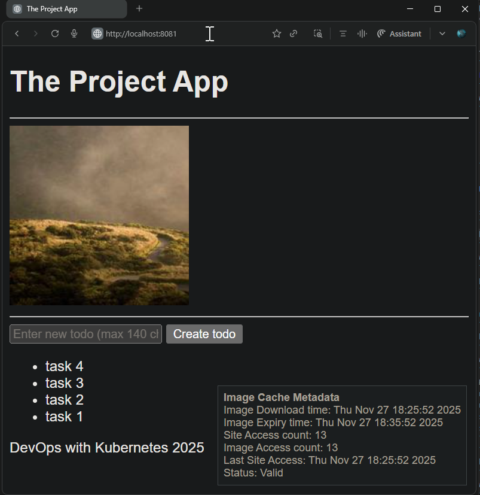
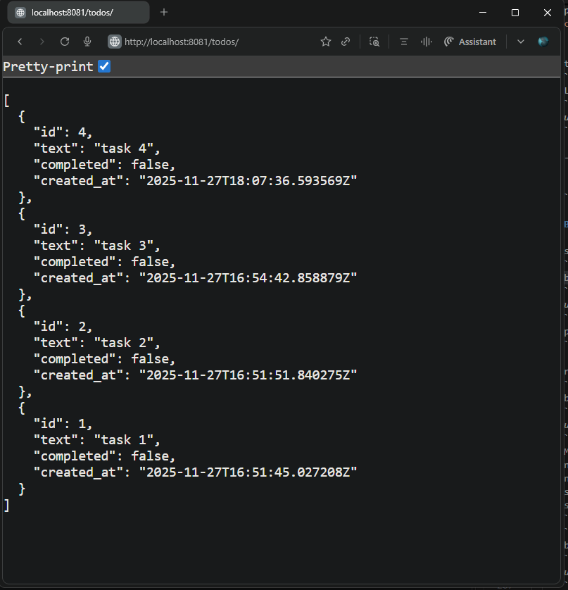

## Exercise 2.8. The project, step 11

Create a database and save the todos there. Again, the database should be defined as a stateful set with one replica. Use Secrets and/or ConfigMaps to have the backend access the database.

**Resource Updates**

- [`postgresql-configmap.yaml`](./todo_backend/manifests/postgresql-configmap.yaml): Defines Postgres initialization environment variables and backend application database connection variables.  
- [`postgresql-service.yaml`](./todo_backend/manifests/postgresql-service.yaml): Headless Service with `clusterIP: None` providing stable DNS discovery at `postgresql-db-svc.project.svc.cluster.local` for the Postgres StatefulSet.  
- [`postgres-db-secret.yaml`](todo_backend/manifests/postgres-db-secret.yaml): Kubernetes Secret containing sensitive data `POSTGRES_PASSWORD` used by the Postgres StatefulSet and backend.  
- [`postgresql-statefulset.yaml`](./todo_backend/manifests/postgresql-statefulset.yaml): StatefulSet manifest defining a `single replica` Postgres pod with `persistent volume claims` for durable storage, `envFrom` injecting `ConfigMap` and `Secret` references for configuration and credentials.

- [`deployment.yaml`](./todo_backend/manifests/deployment.yaml) Updated to reference `ConfigMaps` for database connection details and `Secrets` for database credentials securely through `envFrom` and `secretRef` respectively.

**Application Updates**

- **Refactored `Todo Backend`** app to replace in-memory task storage to persistent PostgreSQL with asyncpg and SQLAlchemy ORM
- Implemented database schema creation on startup to ensure the todos table is created as needed.
- `POST /todos` enhanced to add new todo items into the PostgreSQL database.
- `GET /todos` enhanced to retrieve and serialize todos as JSON using Pydantic models.
- Enhanced application configuration to use Kubernetes-managed environment variables and secrets for database connection parameters

**Base Application Versions**
- [Todo Backend v2.6](https://github.com/arkb2023/devops-kubernetes/tree/2.6/the_project/todo_backend)

***

### 1. **Directory and File Structure**
<pre>
the_project
├── configmaps
│   └── project-config-env.yaml
├── todo_backend
│   ├── Dockerfile
│   ├── app
│   │   ├── __init__.py
│   │   ├── main.py
│   │   ├── models.py
│   │   ├── routes
│   │   │   ├── __init__.py
│   │   │   └── todos.py
│   │   └── storage.py
│   ├── manifests
│   │   ├── deployment.yaml
│   │   ├── ingress.yaml
│   │   ├── postgres-db-secret.yaml
│   │   ├── postgresql-configmap.yaml
│   │   ├── postgresql-service.yaml
│   │   ├── postgresql-statefulset.yaml
│   │   └── service.yaml
└── volumes
    ├── persistentvolume.yaml
    └── persistentvolumeclaim.yaml
</pre>


### 2. Prerequisites

- Ensure the following tools are installed:
  - Docker  
  - k3d (K3s in Docker)  
  - kubectl (Kubernetes CLI)
- Create and run a Kubernetes cluster with k3d, using 2 agent nodes and port mapping to expose the ingress load balancer on host port 8081:
    ```bash
    k3d cluster create mycluster --agents 2 --port 8081:80@loadbalancer
    ```
- `project` namespace created in the cluster
    ```bash
    kubectl create namespace project
    ```

***

### 3. Build and Push the Docker Image to DockerHub

```bash
cd todo_backend
docker build -t arkb2023/todo-backend:2.8.6 .
docker push arkb2023/todo-backend:2.8.6
```
> Docker images are published at:  
https://hub.docker.com/repository/docker/arkb2023/todo-backend/tags/2.8.6  


### 4. Deploy the project resources into the `project` namespace along with the ConfigMap

```bash
kubectl apply -n project \
  -f the_project/todo_app/manifests/ \
  -f the_project/todo_backend/manifests/ \
  -f the_project/configmaps/ \
  -f volumes/
```

*output:*

```text
deployment.apps/todo-app-dep created
ingress.networking.k8s.io/todo-app-ingress created
service/todo-app-svc created
deployment.apps/todo-backend-dep created
ingress.networking.k8s.io/todo-backend-ingress created
configmap/postgres-db-config created
service/postgresql-db-svc created
statefulset.apps/postgresql-db created
service/todo-backend-svc created
configmap/project-config-env created
persistentvolume/local-pv created
persistentvolumeclaim/local-pv-claim created
```

**Setup Local PersistentVolume**  
To bind PersistentVolume to a local host path in a containerized node, create the backing storage directory inside the node container.  
```bash
docker exec k3d-k3s-default-agent-0 mkdir -p /tmp/kube
```

### 5. Validate Configuration Settings

**Verify pod status:**  
```bash
kubectl get pod -n project
```
*Output:*  
```text
NAME                                READY   STATUS    RESTARTS   AGE
postgresql-db-0                     1/1     Running   0          62m
todo-app-dep-6f5bd4998f-k46n6      1/1     Running   0          152m
todo-backend-dep-5b6bddd695-bs67j  1/1     Running   0          7m3s
```


**Verify ConfigMaps for environment settings:**  
```bash
kubectl describe configmap postgres-db-config -n project
```
*Output:*  
```text
Name:         postgres-db-config
Namespace:    project
Labels:       app=postgresql-db
Annotations:  <none>

Data
====
DB_HOST:
----
postgresql-db-svc.project.svc.cluster.local

DB_PORT:
----
5432

LOG_LEVEL:
----
DEBUG

PGDATA:
----
/data/pgdata

POSTGRES_DB:
----
testdb

POSTGRES_USER:
----
testdbuser

BinaryData
====

Events:  <none>
```


**Verify StatefulSet:**  
```bash
kubectl describe statefulset -n project
```
In the output, look for references to `postgres-db-secret` and `postgres-db-config` to confirm that ConfigMaps and Secrets are successfully loaded.

*Sample Output:*  
```text
Name:               postgresql-db
Namespace:          project
CreationTimestamp:  Thu, 27 Nov 2025 20:56:55 +0530
Selector:           app=postgresql-db
Replicas:           1 desired | 1 total
Update Strategy:    RollingUpdate
Pods Status:        1 Running / 0 Waiting / 0 Succeeded / 0 Failed
Pod Template:
  Labels:  app=postgresql-db
  Containers:
   postgresql-db:
    Image:      postgres:latest
    Environment Variables from:
      postgres-db-config  ConfigMap  Optional: false
    Environment:
      POSTGRES_PASSWORD:  <set to the key 'POSTGRES_PASSWORD' in secret 'postgres-db-secret'>  Optional: false
    Mounts:
      /data from postgresql-db-disk (rw)
Volume Claims:
  Name:           postgresql-db-disk
  StorageClass:   local-path
  Capacity:       100Mi
  Access Modes:   [ReadWriteOnce]
Events:  <none>
```


**Verify PVC status:**  
```bash
kubectl -n project get pvc
```
*Output:*  
```text
NAME                                 STATUS   VOLUME                                  CAPACITY   ACCESS MODES   STORAGECLASS   AGE
local-pv-claim                      Bound    local-pv                                1Gi        RWO           manual         156m
postgresql-db-disk-postgresql-db-0 Bound    pvc-e2b8a0ba-59ba-4477-8e39-4819d932ba56  100Mi    RWO           local-path     164m
```

**Verify environment variables in `todo-backend` pod container:**  

Check environment variables inside the `todo-backend` container:  
```bash
kubectl -n project exec -it todo-backend-dep-5b6bddd695-bs67j -c todo-backend-container -- printenv | egrep -e "DB|POST"
```
*Output:*  
```text
POSTGRES_USER=testdbuser
DB_PORT=5432
POSTGRES_DB=testdb
DB_HOST=postgresql-db-svc.project.svc.cluster.local
POSTGRES_PASSWORD=testdbuserpassword
```

### 7. Validate functionality

- **Image loads and Todo addition functionality - confirms `POST /todos` handling:**  
  

- **`JSON` formatted todo list returned - confirms `GET /todos` handling:**  
    

- **[DB persistence] Restart `todo_backend` and verify same Image and Todo list:**  

  - Restart `Todo backend` deployment:  
    ```bash
    kubectl -n project rollout restart deployment todo-backend-dep
    ```
    *Output*
    ```text
    deployment.apps/todo-backend-dep restarted
    ```
  - Verify pod restart status: 
    ```bash
    kubectl -n project get pods
    ```
    ```text
    NAME                                READY   STATUS        RESTARTS   AGE
    postgresql-db-0                     1/1     Running       0          90m
    todo-app-dep-6f5bd4998f-k46n6       1/1     Running       0          3h
    todo-backend-dep-84f5655695-5sfdz   1/1     Running       0          2s
    todo-backend-dep-c5495555-f4qnp     1/1     Terminating   0          4m20s
    ```
    ```bash
    kubectl -n project get pods
    ```
    ```text
    NAME                                READY   STATUS    RESTARTS   AGE
    postgresql-db-0                     1/1     Running   0          91m
    todo-app-dep-6f5bd4998f-k46n6       1/1     Running   0          3h1m
    todo-backend-dep-84f5655695-5sfdz   1/1     Running   0          44s
    ```
  - Post restart: Same Image and Todo list returned  
      

***

### 8. Cleanup

**Delete Manifests** 

```bash
kubectl delete -n project \
  -f the_project/todo_app/manifests/ \
  -f the_project/todo_backend/manifests/ \
  -f the_project/configmaps/ \
  -f volumes/
```

```
