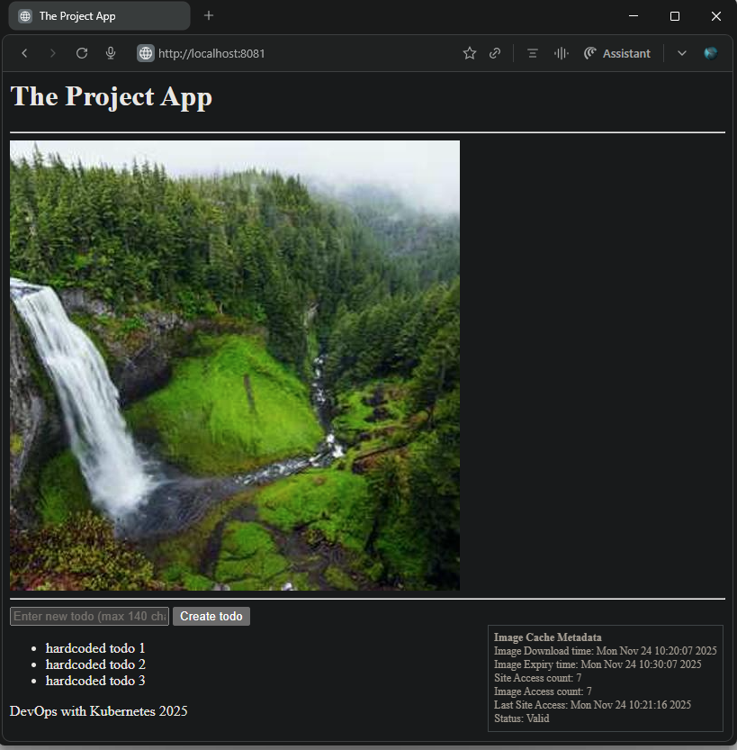

## Exercise 1.13. The project, step 7

### Summary
The `Todo App` is enhanced with Basic Todo Input and List

### The Application implements following updates
1. Add an input field. The input should not take todos that are over 140 characters long.  
2. Add a send button. It does not have to send the todo yet.  
3. Add a list of the existing todos with some hardcoded todos.  

### Base Application Version
- Built upon [Todo App v1.12](https://github.com/arkb2023/devops-kubernetes/tree/1.12/the_project)

### Application URL
- Accessible at: `http://localhost:8081`

***


### 1. **Directory and File Structure**
<pre>
├── the_project
│   ├── README.md
│   └── todo-app
│       ├── Dockerfile
│       ├── main.py
│       ├── manifests
│       │   ├── deployment.yaml
│       │   ├── ingress.yaml
│       │   └── service.yaml
└── volumes
    ├── persistentvolume.yaml
    └── persistentvolumeclaim.yaml
</pre>


***

### 2. Prerequisites
- `Docker` `k3d` `kubectl` installed

### 3. Build and Push the Docker Image to DockerHub

```bash
docker build -t arkb2023/todo-app:1.13.1 ./the_project/todo-app/
docker push arkb2023/todo-app:1.13.1
```
> Docker image published at: https://hub.docker.com/repository/docker/arkb2023/todo-app/tags/1.13.1

***

### 4. Deploy to Kubernetes

**Creates a cluster**

```bash
k3d cluster create --port 8081:80@loadbalancer --agents 2
```

**Setup Local PersistentVolume**  
To bind `PersistentVolume` to a local host path in a containerized node, create the backing storage directory inside the node container.

```bash
docker exec k3d-k3s-default-agent-0 mkdir -p /tmp/kube
```

**Apply the `Deployment` `Service` `Ingress` `PersistentVolume` and `PersistentVolumeClaim` Manifests**  

```bash
kubectl apply \
  -f ./the_project/todo-app/manifests/deployment.yaml \
  -f ./the_project/todo-app/manifests/ingress.yaml \
  -f ./the_project/todo-app/manifests/service.yaml \
  -f ./volumes/persistentvolume.yaml \
  -f ./volumes/persistentvolumeclaim.yaml
```

### 5. Validate the Enhancements

The rendered front page displays the required updates:  
    - An input text box for todos with a 140-character limit  
    - A "Create todo" button next to the input  
    - A hardcoded list of todo items  
      

### 6. **Cleanup**

**Delete the `Deployment` `Service` and `Ingress` Resources**  
```bash
kubectl delete \
    -f ./the_project/todo-app/manifests/deployment.yaml \
    -f ./the_project/todo-app/manifests/ingress.yaml \
    -f ./the_project/todo-app/manifests/service.yaml \
    -f ./volumes/persistentvolume.yaml \
    -f ./volumes/persistentvolumeclaim.yaml
```
*Output*
```text
deployment.apps "todo-app-dep" deleted from default namespace
ingress.networking.k8s.io "dwk-todo-app-ingress" deleted from default namespace
service "todo-app-svc" deleted from default namespace
persistentvolume "local-pv" deleted
persistentvolumeclaim "local-pv-claim" deleted from default namespace
```

**Stop the k3d Cluster**  
```bash
k3d cluster delete k3s-default
```
*Output*
```text
INFO[0000] Deleting cluster 'k3s-default'
INFO[0003] Deleting cluster network 'k3d-k3s-default'
INFO[0003] Deleting 1 attached volumes...
INFO[0003] Removing cluster details from default kubeconfig...
INFO[0003] Removing standalone kubeconfig file (if there is one)...
INFO[0003] Successfully deleted cluster k3s-default!
```
***
