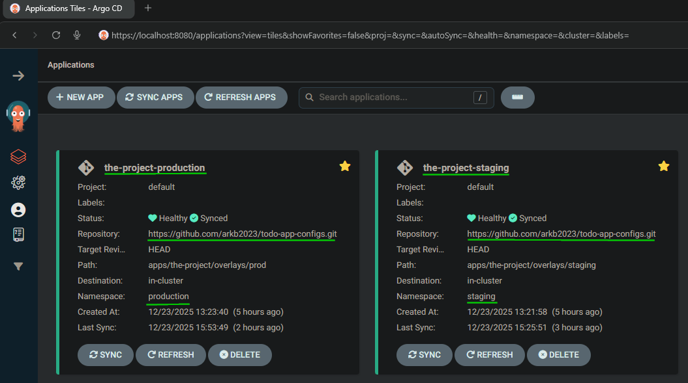
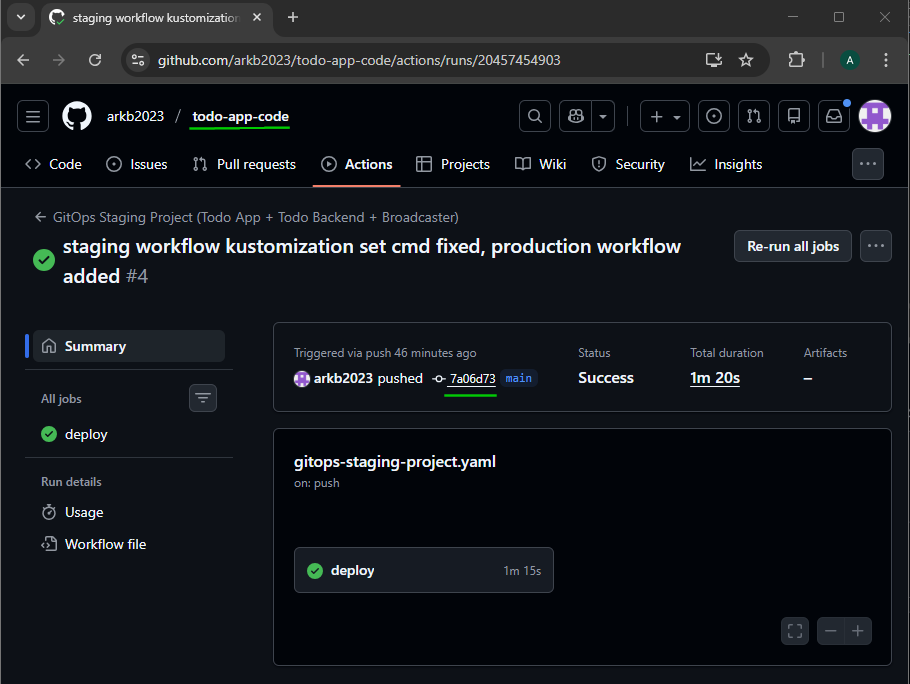
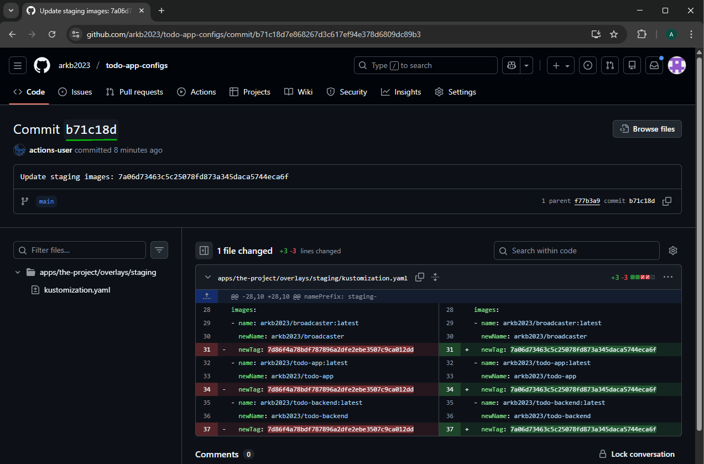
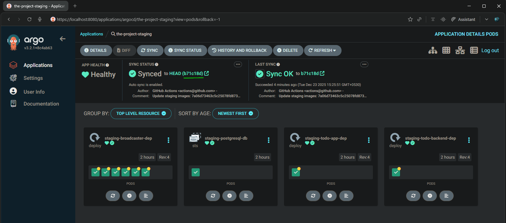
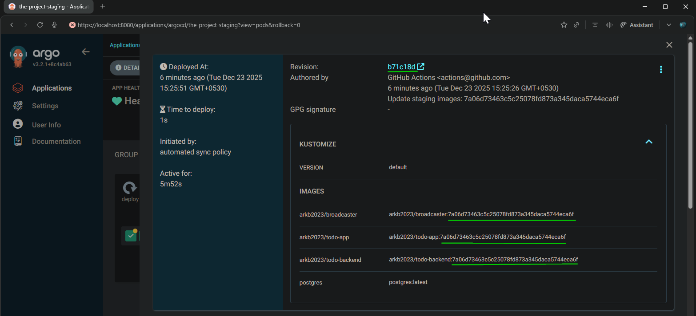
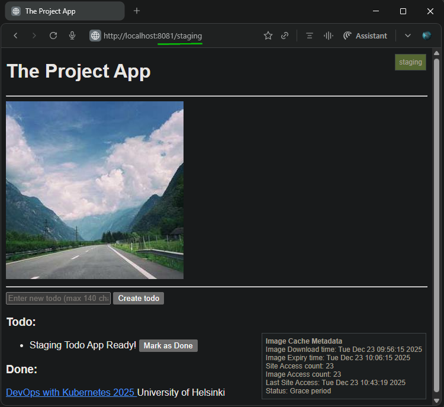
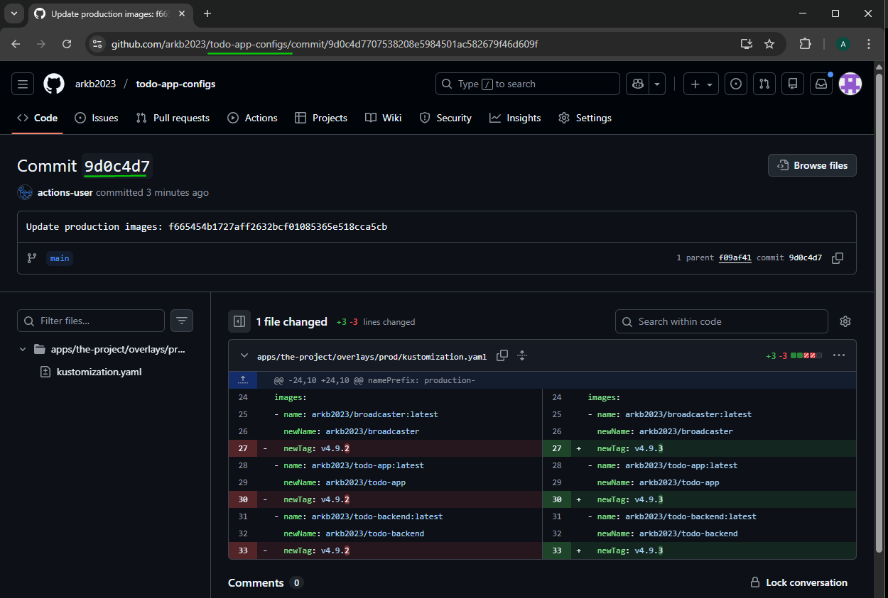
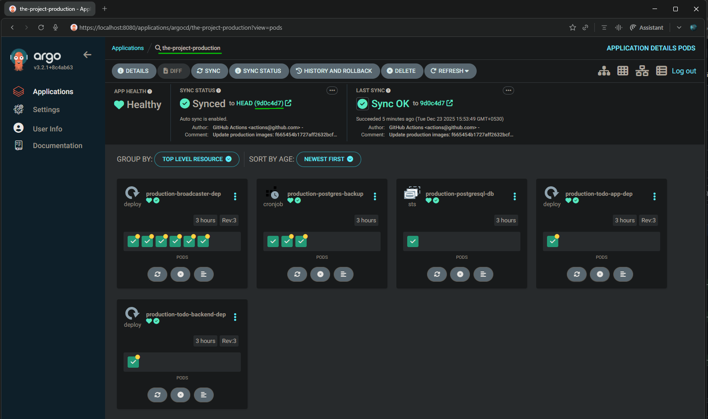
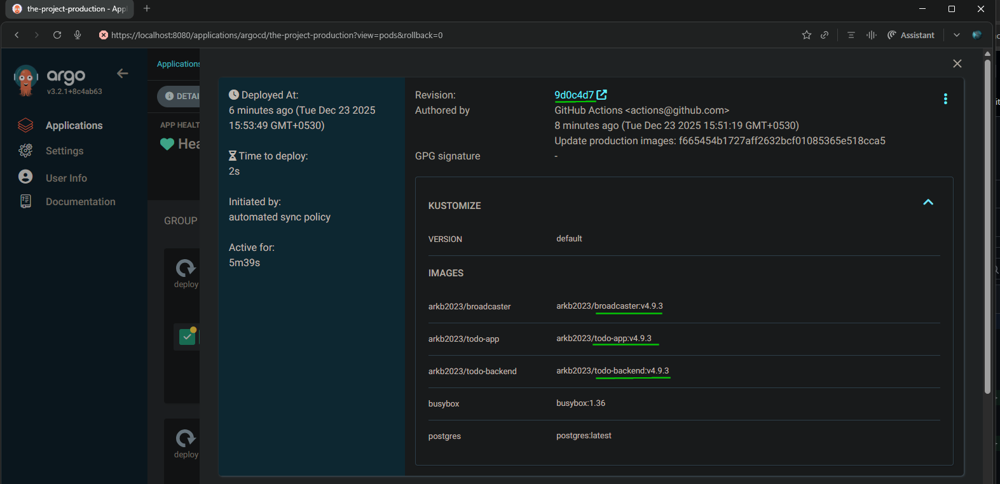
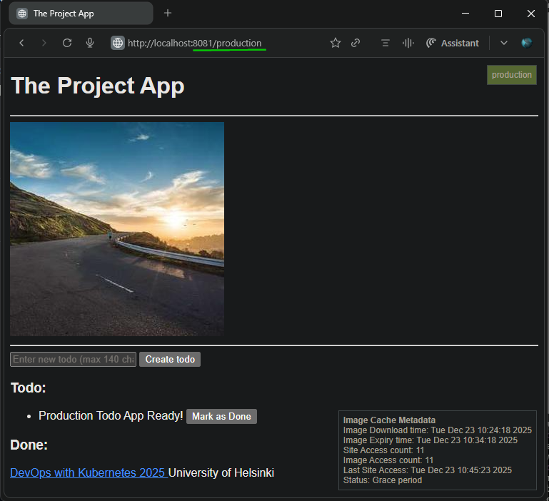

## [Exercise: 4.10. The project, the grande finale](https://courses.mooc.fi/org/uh-cs/courses/devops-with-kubernetes/chapter-5/gitops)

**Instructions:**  
Finalize the project setup so that it uses different repositories for the code and configurations.

---

### 1. Overview

This exercise separates the application code and Kubernetes manifests/configurations from the single repository [`devops-kubernetes`](https://github.com/arkb2023/devops-kubernetes/tree/4.9) into the following two new repositories:

1. [`todo-app-configs`](https://github.com/arkb2023/todo-app-configs) - Kubernetes manifests and GitOps configurations  
2. [`todo-app-code`](https://github.com/arkb2023/todo-app-code) - Application source code and CI/CD workflows

### 2. Repository Migration Summary

**Configs Repo** (Kubernetes + GitOps):
| Component            | Original Repo/Location             | New Repo/Location    |
| -------------------- | ---------------------------------- | ---------------------------------- |
| App Manifests        | [devops-kubernetes/apps](https://github.com/arkb2023/devops-kubernetes/tree/main/apps) | [todo-app-configs/apps](https://github.com/arkb2023/todo-app-configs/tree/main/apps) |
| ArgoCD Applications  | [devops-kubernetes/apps/the-project/argocd-apps/](https://github.com/arkb2023/devops-kubernetes/tree/main/apps/the-project/argocd-apps)      | [todo-app-configs/apps/the-project/argocd-apps/](https://github.com/arkb2023/todo-app-configs/tree/main/apps/the-project/argocd-apps/)      |
| Kustomize Base       | [devops-kubernetes/apps/the-project/base/](https://github.com/arkb2023/devops-kubernetes/tree/main/apps/the-project/base/)             | [todo-app-configs/apps/the-project/base/](https://github.com/arkb2023/todo-app-configs/tree/main/apps/the-project/base/)             |
| Kustomize Staging    | [devops-kubernetes/apps/the-project/overlays/staging/](https://github.com/arkb2023/devops-kubernetes/tree/main/apps/the-project/overlays/staging/) | [todo-app-configs/apps/the-project/overlays/staging/](https://github.com/arkb2023/todo-app-configs/tree/main/apps/the-project/overlays/staging/)  |
| Kustomize Production | [devops-kubernetes/apps/the-project/overlays/prod/](https://github.com/arkb2023/devops-kubernetes/tree/main/apps/the-project/overlays/prod/)    | [todo-app-configs/apps/the-project/overlays/prod/](https://github.com/arkb2023/todo-app-configs/tree/main/apps/the-project/overlays/prod/)    |

**Code Repo** (Application + CI/CD):

| Component           | Original Repo/Location                           | New Repo/Location              |
| ------------------- | ------------------------------------------------ | ------------------------------ |
| Broadcaster App     | [devops-kubernetes/the_project/broadcaster/](https://github.com/arkb2023/devops-kubernetes/tree/main/the_project/broadcaster)     | [todo-app-code/broadcaster/](https://github.com/arkb2023/todo-app-code/tree/main/broadcaster) |
| Todo Backend        | [devops-kubernetes/the_project/todo_backend/](https://github.com/arkb2023/devops-kubernetes/tree/main/the_project/todo_backend)    | [todo-app-code/todo_backend/](https://github.com/arkb2023/todo-app-code/tree/main/todo_backend) |
| Todo Frontend       | [devops-kubernetes/the_project/todo_app/](https://github.com/arkb2023/devops-kubernetes/tree/main/the_project/todo_app)        | [todo-app-code/todo_app/](https://github.com/arkb2023/todo-app-code/tree/main/todo_app)|
| Staging Workflow    | [devops-kubernetes/.github/workflows/gitops-staging-project.yaml](https://github.com/arkb2023/devops-kubernetes/blob/main/.github/workflows/gitops-staging-project.yaml)    | [todo-app-code/.github/workflows/gitops-staging-project.yaml](https://github.com/arkb2023/todo-app-code/blob/main/.github/workflows/gitops-staging-project.yaml)    |
| Production Workflow | [devops-kubernetes/.github/workflows/gitops-production-project.yaml](https://github.com/arkb2023/devops-kubernetes/blob/main/.github/workflows/gitops-production-project.yaml) | [todo-app-code/.github/workflows/gitops-production-project.yaml](https://github.com/arkb2023/todo-app-code/blob/main/.github/workflows/gitops-production-project.yaml) |

---

### 3. Application Source Code Repository [`todo-app-code`](https://github.com/arkb2023/todo-app-code/)
  <pre>
  todo-app-code                     # Application Source Code Repository Root
  ├── broadcaster                   # Broadcaster application folder
  │   ├── Dockerfile
  │   ├── broadcaster.py
  │   ├── dev.Dockerfile
  │   └── docker-compose.dev.yml
  ├── todo_app                      # Todo App application folder
  │   ├── Dockerfile
  │   ├── app
  │   │   ├── __init__.py
  │   │   ├── cache.py
  │   │   ├── main.py
  │   │   ├── routes
  │   │   │   ├── __init__.py
  │   │   │   └── frontend.py
  │   │   ├── static
  │   │   │   └── scripts.js
  │   │   └── templates
  │   │       └── index.html
  │   └── requirements.txt
  └── todo_backend                  # Todo Backend application folder
      ├── Dockerfile
      ├── README.md
      ├── app
      │   ├── __init__.py
      │   ├── main.py
      │   ├── models.py
      │   ├── nats_client.py
      │   ├── routes
      │   │   ├── __init__.py
      │   │   └── todos.py
      │   └── storage.py
      ├── docker-compose.yml
      ├── requirements.txt
      └── wait-for-it.sh
  </pre>

### 4. Kubernetes manifests and GitOps repository [`todo-app-configs`](https://github.com/arkb2023/todo-app-configs)

  <pre>
  todo-app-configs                                # Repository Root
  └── apps/                                       # Root folder for applications manifest files for GitOps
      └── the-project                             # 'project' Application manifest folder
          ├── argocd-apps                         # Root folder for ArgoCD Application CRs
          │   ├── prod-app.yaml                   # ArgoCD Application CR - deploys production 
          │   └── staging-app.yaml                # ArgoCD Application CR - deploys staging
          ├── base                                # Root folder for base kustomize manifests 
          │   ├── broadcaster-deployment.yaml     # Broadcaster Deployment manifest
          │   ├── kustomization.yaml              # Kustomization file for base
          │   ├── persistentvolume.yaml           # PersistentVolume manifest
          │   ├── persistentvolumeclaim.yaml      # PersistentVolumeClaim manifest
          │   ├── postgresql-configmap.yaml       # PostgreSQL ConfigMap manifest
          │   ├── postgresql-dbsecret.yaml        # PostgreSQL Secret manifest
          │   ├── postgresql-init-configmap.yaml  # PostgreSQL Init ConfigMap manifest
          │   ├── postgresql-service.yaml         # PostgreSQL Service manifest
          │   ├── postgresql-statefulset.yaml     # PostgreSQL StatefulSet manifest
          │   ├── todo-app-configmap.yaml         # Todo App ConfigMap manifest 
          │   ├── todo-app-deployment.yaml        # Todo App Deployment manifest
          │   ├── todo-app-service.yaml           # Todo App Service manifest
          │   ├── todo-backend-configmap.yaml     # Todo Backend ConfigMap manifest
          │   ├── todo-backend-deployment.yaml    # Todo Backend Deployment manifest
          │   └── todo-backend-service.yaml       # Todo Backend Service manifest
          └── overlays                                    # Overlays on top of base for different environments
              ├── prod                                    # Production overlay
              │   ├── broadcaster-patch.yaml              # Broadcaster patch for production
              │   ├── kustomization.yaml                  # Kustomization file for production
              │   ├── persistentvolume.yaml               # PersistentVolume manifest
              │   ├── persistentvolumeclaim.yaml          # PersistentVolumeClaim manifest
              │   ├── postgresql-backup-cronjob.yaml      # PostgreSQL backup CronJob manifest
              │   ├── postgresql-configmap-patch.yaml     # PostgreSQL ConfigMap patch for production
              │   ├── postgresql-init-script.yaml         # PostgreSQL Init script manifest
              │   ├── postgresql-statefulset-patch.yaml   # PostgreSQL StatefulSet patch for production
              │   └── todo-ingressroute.yaml              # Todo App IngressRoute manifest
              └── staging                                 # Staging overlay 
                  ├── broadcaster-patch.yaml              # Broadcaster patch for staging
                  ├── kustomization.yaml                  # Kustomization file for staging
                  ├── persistentvolume.yaml               # PersistentVolume manifest
                  ├── persistentvolumeclaim.yaml          # PersistentVolumeClaim manifest
                  ├── postgresql-configmap-patch.yaml     # PostgreSQL ConfigMap patch for staging
                  ├── postgresql-init-script.yaml         # PostgreSQL Init script manifest
                  ├── postgresql-statefulset-patch.yaml   # PostgreSQL StatefulSet patch for staging
                  └── todo-ingressroute.yaml              # Todo App IngressRoute manifest
  </pre>

### 5. Cluster Setup

- Docker  
- k3d (K3s in Docker)  
- kubectl (Kubernetes CLI)
- nats 0.1.6
- Create Cluster 
  ```bash
  k3d cluster create dwk-local --agents 2 --port 8081:80@loadbalancer
  ```
- Create staging and production directories for PersistentVolumes
  ```bash
  docker exec k3d-dwk-local-agent-0 mkdir -p /tmp/kube-staging
  docker exec k3d-dwk-local-agent-0 chmod 777 /tmp/kube-staging
  docker exec k3d-dwk-local-agent-0 mkdir -p /tmp/kube-production
  docker exec k3d-dwk-local-agent-0 chmod 777 /tmp/kube-production
  ```
- Install ArgoCD in the cluster
  ```bash
  kubectl create namespace argocd
  kubectl apply -n argocd -f https://raw.githubusercontent.com/argoproj/argo-cd/stable/manifests/install.yaml
  ```
- Port-forward ArgoCD server to localhost
  ```bash
  kubectl port-forward svc/argocd-server -n argocd 8080:80
  ```
- Get admin password:  
  ```bash
  kubectl get secret argocd-initial-admin-secret -n argocd -o jsonpath="{.data.password}" | base64 -d
  ```
- Access ArgoCD web UI at: `http://localhost:8080/applications`, use `admin` as username and the password retrieved above.

### 6. Deploy ArgoCD Applications from `todo-app-configs` repository
- Apply ArgoCD apps  
  ```bash
  # Staging Application
  kubectl apply -f https://raw.githubusercontent.com/arkb2023/todo-app-configs/refs/heads/main/apps/the-project/argocd-apps/staging-app.yaml

  # Production Application
  kubectl apply -f https://raw.githubusercontent.com/arkb2023/todo-app-configs/refs/heads/main/apps/the-project/argocd-apps/prod-app.yaml
  ```
- Slack secret
  ```bash
  export SLACK_WEBHOOK_URL="https://hooks.slack.com/REAL" # Replace with real URL
  kubectl -n production create secret generic slack-webhook-secret --from-literal=webhook_url=$SLACK_WEBHOOK_URL
  ```
- ArgoCD UI - Applications deployed to respective namespaces, synced and healthy  

  


### 7. Main Branch → Staging GitOps Pipeline (Verified) 

- Git Commit:    
  ```bash
  # Make a code change 
  git add .
  git commit -m "staging workflow kustomization set cmd fixed, production workflow added "
  git push origin main

  # Output:
  Enumerating objects: 11, done.
  Counting objects: 100% (11/11), done.
  Delta compression using up to 22 threads
  Compressing objects: 100% (5/5), done.
  Writing objects: 100% (6/6), 1.03 KiB | 1.03 MiB/s, done.
  Total 6 (delta 3), reused 0 (delta 0), pack-reused 0
  remote: Resolving deltas: 100% (3/3), completed with 3 local objects.
  To https://github.com/arkb2023/todo-app-code.git
    cda89f6..7a06d73  main -> main
  ```
  > Note the commit hash `7a06d73` from above output to coorrelate with GitHub Actions run.

- GitHub Actions workflow triggered *(commit `7a06d73`)*:
  - [Run #20457454903](https://github.com/arkb2023/todo-app-code/actions/runs/20457454903)
  - Status: `Success`  

    

  - Workflow updates staging `kustomization.yaml` under [Commit #b71c18d](https://github.com/arkb2023/todo-app-configs/commit/b71c18d7e868267d3c617ef94e378d6809dc89b3):

    

   > Note Commit `b71c18d` for coorelation with ArgoCD sync

- ArgoCD staging app syncs automatically with the workflow commit  
  

- Staging pods images synced with updated image tags:  
  

- Access the Todo App in staging environment at: `http://localhost:8081/staging`  

  

---


### 8. Tagged Commit → Production GitOps Pipeline (Verified)

- Create a new tag on the main branch commit and push the tag to remote:  
  ```bash
  git tag v4.9.3
  git push origin v4.9.3
  
  # Output:
  Total 0 (delta 0), reused 0 (delta 0), pack-reused 0
  To https://github.com/arkb2023/todo-app-code.git
   * [new tag]         v4.9.3 -> v4.9.3
  ```

- GitHub Actions workflow triggered for this tag `v4.9.3`:
  - [Run #20458047484](https://github.com/arkb2023/todo-app-code/actions/runs/20458047484)  
  - Status: `Success`  

    
  
  - Workflow updates Production `kustomization.yaml` under [Commit #9d0c4d7](https://github.com/arkb2023/todo-app-configs/commit/9d0c4d7707538208e5984501ac582679f46d609f):

    
   > Note Commit `9d0c4d7` for coorelation with ArgoCD sync

- ArgoCD Production app syncs automatically with the workflow commit  

    

- Production pods images synced with updated image tags:  

    

- Access the Todo App in Production environment at: `http://localhost:8081/production`  

    


---

### 9. Cleanup
- Delete ArgoCD applications
  ```bash
  kubectl -n argocd delete application the-project-staging
  kubectl -n argocd delete application the-project-production
  ```
- Delete namespaces
  ```bash
  kubectl delete namespace staging
  kubectl delete namespace production
  ```
