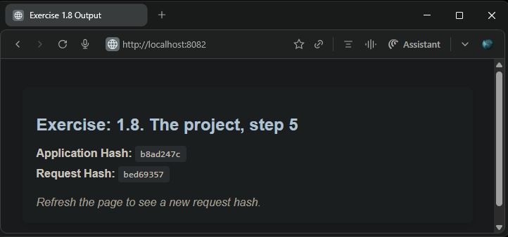

## Exercise: 1.8. The project, step 5
### Todo App Server Enhancements

- Built upon the application from [Exercise: 1.6. The project, step 4](https://github.com/arkb2023/devops-kubernetes/tree/1.6/the_project)
- Implemented a [Ingress](./todo-app/manifests/ingress.yaml) resource to route requests with path prefix `/` to the `todo-app-svc` service on port `1234`.  
- Modified the `todo-app-svc` [service](./todo-app/manifests/service.yaml) type to `ClusterIP` on port `1234`, directing traffic to the `todo-app` app container listening on port `3000`.  
- **Result**: The `todo-app` app endpoint `/` is accessible externally at `http://localhost:8082/` via the ingress controller, which acts as a reverse proxy within the cluster.


### 1. **Directory and File Structure**
```
the_project
├── README.md
└── todo-app
    ├── Dockerfile
    ├── main.py
    └── manifests
        ├── deployment.yaml
        ├── ingress.yaml
        └── service.yaml
```

***

### 2. Prerequisites
- `Docker` `k3d` `kubectl` installed


### 3. Build and Push the Docker Image to DockerHub

```bash
docker build -t arkb2023/log-output:1.8.1 .
docker push arkb2023/log-output:1.8.1
```
> Docker image published at: https://hub.docker.com/repository/docker/arkb2023/todo-app/tags/1.8.1

***

### 3. Deploy to Kubernetes

**Creates a cluster**

```bash
k3d cluster create --port 8082:80@loadbalancer --agents 2
```
Where,  

`-port 8082:80@loadbalancer`: Exposes host port 8082 mapped to the load balancer's port 80.

**Verify the loadbalancer port mappings**

```bash
docker port k3d-k3s-default-serverlb
```
*Output*
```text
80/tcp -> 0.0.0.0:8082
80/tcp -> [::]:8082
6443/tcp -> 0.0.0.0:39245
```

**Apply the `Deployment` `Service` and `Ingress` Manifests**
```bash
kubectl create -f the_project/todo-app/manifests/
```
*Output*
```text
deployment.apps/todo-app-dep created
ingress.networking.k8s.io/dwk-todo-app-ingress created
service/todo-app-svc created
```

**Verify that the manifests are operational**  
```bash
kubectl get deploy,svc,ing
```
*Output*
```text
NAME                           READY   UP-TO-DATE   AVAILABLE   AGE
deployment.apps/todo-app-dep   0/1     1            0           13s

NAME                   TYPE        CLUSTER-IP      EXTERNAL-IP   PORT(S)    AGE
service/kubernetes     ClusterIP   10.43.0.1       <none>        443/TCP    13m
service/todo-app-svc   ClusterIP   10.43.184.213   <none>        1234/TCP   13s

NAME                                             CLASS     HOSTS   ADDRESS                            PORTS   AGE
ingress.networking.k8s.io/dwk-todo-app-ingress   traefik   *       172.18.0.3,172.18.0.4,172.18.0.5   80      13s
```

**Ensure the pod is running and ready:**

```bash
kubectl get pods
*Output*
```text
NAME                            READY   STATUS    RESTARTS   AGE
todo-app-dep-5d6b7f9d47-9m5cs   1/1     Running   0          17s
```


**Inspect Pod Logs for Application Readiness**
```bash
kubectl logs -f todo-app-dep-5d6b7f9d47-9m5cs
```
*Output*
```text
INFO:     Started server process [7]
INFO:     Waiting for application startup.
INFO:     Application startup complete.
INFO:     Uvicorn running on http://0.0.0.0:3000 (Press CTRL+C to quit)
Starting app on port 3000...
App mode: Production
Application hash: b8ad247c
INFO:     10.42.0.4:34948 - "GET / HTTP/1.1" 200 OK
```

***

### 5. Verify Application Endpoint Response  
Access the application endpoint in a browser at: `http://localhost:8082`  
 


### 5. **Cleanup**

**Delete the `Deployment` `Service` and `Ingress` Resources**  
```bash
kubectl delete -f the_project/todo-app/manifests/
```
*Output*
```text
deployment.apps "todo-app-dep" deleted from default namespace
ingress.networking.k8s.io "dwk-todo-app-ingress" deleted from default namespace
service "todo-app-svc" deleted from default namespace
```

**Stop the k3d Cluster**  
```bash
k3d cluster delete k3s-default
```
*Output*
```text
INFO[0000] Deleting cluster 'k3s-default'
INFO[0003] Deleting cluster network 'k3d-k3s-default'
INFO[0003] Deleting 1 attached volumes...
INFO[0003] Removing cluster details from default kubeconfig...
INFO[0003] Removing standalone kubeconfig file (if there is one)...
INFO[0003] Successfully deleted cluster k3s-default!
```
***