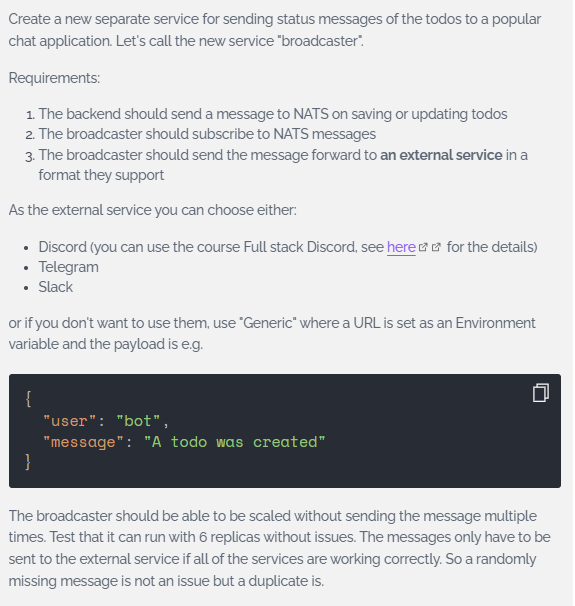

## [Exercise 4.6. The project, step 23](https://courses.mooc.fi/org/uh-cs/courses/devops-with-kubernetes/chapter-5/messaging-systems)

**Instructions:**  
  

---

**Key Changes from Base**

- [`environments/project-local/nats-dep.yaml`](../environments/project-local/nats-dep.yaml) – Defines NATS server deployment  
- [`broadcaster/broadcaster.py`](./broadcaster/broadcaster.py) – Broadcaster service that consumes todo events from NATS and forwards them to Slack via an incoming webhook.  
- [`broadcaster/Dockerfile`](./broadcaster/Dockerfile) – Dockerfile to containerize broadcaster application  
- [`todo_backend/app/routes/todos.py`](./todo_backend/app/routes/todos.py) – `POST /todos` and `PUT /todos/{todo_id}` handlers updated to publish todo events to NATS after successful DB commits.  
- [`todo_backend/app/nats_client.py`](./todo_backend/app/nats_client.py) – Helper module for serializing todo payloads and publishing events to NATS using the configured `NATS_URL`.
- [`apps/the-project/broadcaster-deployment.yaml`](../apps/the-project/broadcaster-deployment.yaml) – Defines the broadcaster deployment with `replicas: 6` and environment wiring to NATS and Slack.

- Base application:  
  - [Todo App and Todo Backend v4.5](https://github.com/arkb2023/devops-kubernetes/tree/4.5/the_project)


**Directory and File Structure**
<pre>

environments/                                   # Multi-env overlays (k3dlocal/GKE)
├── project-gke                                 # GKE environment specific overlays
│   ├── gateway.yaml                            # Gateway API (GKE)
│   ├── kustomization.yaml                      # Top level kustomization entry point 
│   ├── namespace.yaml                          # Namespace
│   ├── persistentvolumeclaim.yaml              # Persistent Volume Claim
│   ├── podmonitoring-todo-backend.yaml         # Pod monitoring
│   ├── postgresql-backup-cronjob.yaml          # PostgreSQL Backup Cronbjob
│   ├── todo-app-route.yaml                     # Todo-App HTTPRoute (GKE)
│   └── todo-backend-route.yaml                 # Todo-backend App HTTPRoute (GKE)
└── project-local                               # k3d Local environment specific overlays
    ├── kustomization.yaml                      # Top level kustomization entry point 
    ├── namespace.yaml                          # Namespace
    ├── persistentvolume.yaml                   # Persistent Volume
    ├── persistentvolumeclaim.yaml              # Persistent Volume Claim
    ├── todo-ingress.yaml                       # Traefik ingress
    └── nats-dep.yaml                           # NATS deployment

apps/                                           # Shared base resources
└── the-project                                 # Consolidated app manifests + kustomization
    ├── cron_wiki_todo.yaml                     # Wiki Generator CronJob
    ├── kustomization.yaml                      # Base manifests for Todo App, Todo backend, Postgress and Wiki Generator
    ├── postgresql-configmap.yaml               # PostgreSQL ConfigMap
    ├── postgresql-dbsecret.yaml                # PostgreSQL Secret
    ├── postgresql-service.yaml                 # PostgreSQL Service
    ├── postgresql-statefulset.yaml             # PostgreSQL StatefulSet
    ├── todo-app-configmap.yaml                 # Todo Application ConfigMap
    ├── todo-app-deployment.yaml                # Todo Application Deployment
    ├── todo-app-service.yaml                   # Todo Application Service
    ├── todo-backend-configmap.yaml             # Todo Backend Application ConfigMap
    ├── todo-backend-deployment.yaml            # Todo Backend Application Deployment
    └── todo-backend-service.yaml               # Todo Backend Application Service

the_project/                                    # Project root
├── broadcaster                                 # Broadcaster application
│   ├── Dockerfile                              # Dockerfile for image
│   └── broadcaster.py                          # Subscribe to NATS and post to Slack
├── todo_app                                    # Frontend application
│   ├── Dockerfile                              # Dockerfile for image
│   ├── app                                     # Application code
│   │   ├── __init__.py
│   │   ├── cache.py
│   │   ├── main.py
│   │   ├── routes
│   │   │   ├── __init__.py
│   │   │   └── frontend.py
│   │   ├── static
│   │   │   └── scripts.js
│   │   └── templates
│   │       └── index.html
│   └── requirements.txt
└── todo_backend                                # Backend application
    ├── Dockerfile                              # Dockerfile for image
    ├── app                                     # Application code
    │   ├── __init__.py
    │   ├── main.py
    │   ├── models.py
    │   ├── routes
    │   │   ├── __init__.py
    │   │   └── todos.py
    │   └── storage.py
    └── requirements.txt

# Deployment flow:
# kustomize build environments/project-local | kubectl apply -f -
# kustomize build environments/project-gke | kubectl apply -f -

</pre>

  
***

**Setup**  
- Docker  
- k3d (K3s in Docker)  
- kubectl (Kubernetes CLI)
- NATS 0.1.6
- Create Cluster 
  ```bash
  k3d cluster create dwk-local --agents 2 --port 8081:80@loadbalancer
  ```
- Build and Push Docker images
  ```bash
  # Todo backend application
  docker build -t arkb2023/todo-backend:4.6.1 ./the_project/todo_backend/
  docker push arkb2023/todo-backend:4.6.1

  # Broadcaster application
  docker build -t arkb2023/broadcaster:4.6.1 ./the_project/broadcaster/
  docker push arkb2023/broadcaster:4.6.1

  ```
  > Docker Hub links: [`backend`](https://hub.docker.com/repository/docker/arkb2023/todo-backend/tags/4.6.1) and [`broadcaster`](https://hub.docker.com/repository/docker/arkb2023/broadcaster/tags/4.6.1)  

- Update Kustomize image for `backend`
  ```bash
  cd environments/project-local/ 
  kustomize edit set image arkb2023/todo-backend:latest=arkb2023/todo-backend:4.6.1
  cd -
  ```
  > Updates the project-local environment to use backend images tagged 4.6.1.
- Edit [`apps/the-project/broadcaster-deployment.yaml`]( ../apps/the-project/broadcaster-deployment.yaml) and update `broadcaster` image  
  ```yaml
  image: arkb2023/broadcaster:4.6.1
  ```
- Set Slack webhook in environment:
  ```bash
  export SLACK_WEBHOOK_URL="https://hooks.slack.com/services/.../.../..."
  ```
- Create a Kubernetes Secret from the Slack webhook environment variable:  
  ```bash
  kubectl -n project create secret generic slack-webhook-secret \
    --from-literal=webhook_url=${SLACK_WEBHOOK_URL}
  ```
  > `slack-webhook-secret` is referenced via `secretKeyRef` in [`apps/the-project/broadcaster-deployment.yaml`](../apps/the-project/broadcaster-deployment.yaml).

- Deploy the Todo application stack:  
  ```bash
  kustomize build environments/project-local | kubectl apply -f -
  ```
- Todo Application deployments `READY` and `AVAILABLE`  
  ```bash
  kubectl -n project get deployments
  ```
  Output:  
  ```text
  NAME               READY   UP-TO-DATE   AVAILABLE   AGE
  todo-app-dep       1/1     1            1           5d4h
  todo-backend-dep   1/1     1            1           5d4h
  ```  
- Confirm NATS server is initialized and accepting subscriptions:  
  ```bash
  nats --server nats://127.0.0.1:4222 sub 'todos.>'
  ```
  Output:  
  ```text
  22:46:46 Subscribing on todos.>
  ```

### 1. Deploy the Broadcaster Application
- Apply the Deployment manifest for the broadcaster:  
  ```bash
  kubectl apply -f apps/the-project/broadcaster-deployment.yaml
  ```
- Verify the broadcaster Deployment has `6` replicas `READY` and `AVAILABLE`:  
  ```bash
  kubectl -n project get deployments
  ```
  Output:  
  ```text
  NAME               READY   UP-TO-DATE   AVAILABLE   AGE
  broadcaster-dep    6/6     6            6           4s
  todo-app-dep       1/1     1            1           5d4h
  todo-backend-dep   1/1     1            1           5d4h
  ```

- Confirm all pods are `READY`  
  ```bash
  kubectl -n project get pods
  ```
  Output:  
  ```text
  NAME                                 READY   STATUS      RESTARTS      AGE
  broadcaster-dep-d754bcc8-8l6v6       1/1     Running     0             4m55s
  broadcaster-dep-d754bcc8-phk69       1/1     Running     0             4m55s
  broadcaster-dep-d754bcc8-vnfk5       1/1     Running     0             4m55s
  broadcaster-dep-d754bcc8-wcvfk       1/1     Running     0             4m55s
  broadcaster-dep-d754bcc8-xjmkp       1/1     Running     0             4m55s
  broadcaster-dep-d754bcc8-znwml       1/1     Running     0             4m55s
  postgresql-db-0                      1/1     Running     3 (14h ago)   5d4h
  todo-app-dep-7b9fdc74c7-9zwsv        2/2     Running     2 (14h ago)   27h
  todo-backend-dep-b5fddbc8-qzftd      1/1     Running     0             3h7m
  wiki-todo-generator-29431680-m7chz   0/1     Completed   0             148m
  wiki-todo-generator-29431740-mpcvn   0/1     Completed   0             87m
  wiki-todo-generator-29431800-cn9kl   0/1     Completed   0             27m
  ```

---

### 2. Test `backend` → `NATS` → `Broadcaster` → `Slack` integration

- Access the todo frontend in the browser.  
- Use **Create Todo** to trigger `POST /todos` and generate `todos.created` events.  
- Use **Mark as done** to trigger `PUT /todos/{todo_id}` and generate `todos.updated` events.

All events should appear as formatted messages in the configured Slack channel, proving the full pipeline works end-to-end.
> Note: The following Slack demo GIFs is large and may take a few seconds to load, especially on slower connections.


---

**Cleanup**

```bash
# Delete resources
kubectl delete namespace project 

# Delete Cluster
k3d cluster delete dwk-local
```
