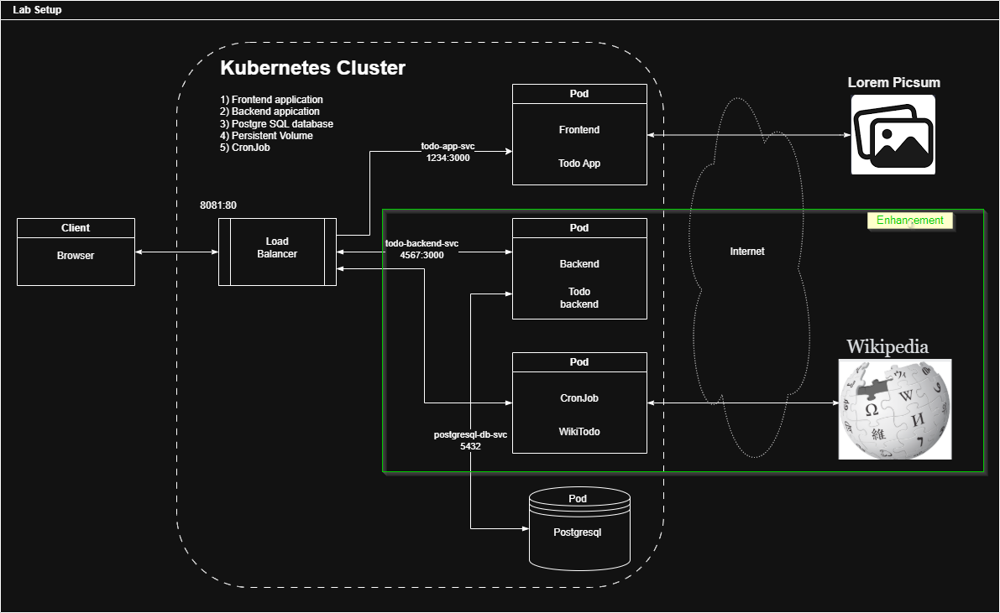
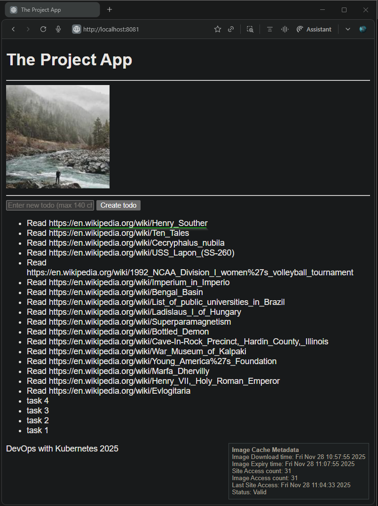

## Exercise 2.9 The project, step 12

Create a CronJob that generates a new todo every hour to remind you to do 'Read <URL>', here <URL> is a Wikipedia article that was decided by the job randomly. It does not have to be a hyperlink, the user can copy-paste the URL from the todo. https://en.wikipedia.org/wiki/Special:Random responds with a redirect to a random Wikipedia page so you can ask it to provide a random article for you to read. TIP: Check location header

**Resource and Applicaiton Enhancements**
- [`cron_wiki_todo.yaml`](./cronjob/cron_wiki_todo.yaml): `CronJob` resource with hourly schedule, references custom container image and points to `todo_backend` service endpoint for rechability to add `todos`.
- [`cron_wiki_todo.py`](./cronjob/cron_wiki_todo.py): Application to fetch random Wikipedia article via `https://en.wikipedia.org/wiki/Special:Random` (302 redirect Location header), formats todo text as `"Read <wikipedia-url>"`, POSTs to existing todo-backend API endpoint.
- [`Dockerfile`](./cronjob/Dockerfile): Custom container image with packaged application


**Base Application Versions**
- [Todo Backend v2.8](https://github.com/arkb2023/devops-kubernetes/tree/2.8/the_project/todo_backend)
- [Todo App v2.8](https://github.com/arkb2023/devops-kubernetes/tree/2.8/the_project/todo_app)


**Architecture**




### 1. **Directory and File Structure**
<pre>
the_project
├── README.md
├── configmaps
│   └── project-config.yaml
├── cronjob
│   ├── Dockerfile
│   ├── cron_wiki_todo.py
│   ├── cron_wiki_todo.yaml
├── todo_app
│   ├── Dockerfile
│   ├── app
│   │   ├── __init__.py
│   │   ├── cache.py
│   │   ├── main.py
│   │   ├── routes
│   │   │   ├── __init__.py
│   │   │   └── frontend.py
│   │   ├── static
│   │   │   └── scripts.js
│   │   └── templates
│   │       └── index.html
│   ├── manifests
│   │   ├── deployment.yaml
│   │   ├── ingress.yaml
│   │   └── service.yaml
└── todo_backend
    ├── Dockerfile
    ├── app
    │   ├── __init__.py
    │   ├── main.py
    │   ├── models.py
    │   ├── routes
    │   │   ├── __init__.py
    │   │   └── todos.py
    │   └── storage.py
    ├── manifests
    │   ├── deployment.yaml
    │   ├── ingress.yaml
    │   ├── postgres-db-secret.yaml
    │   ├── postgresql-configmap.yaml
    │   ├── postgresql-service.yaml
    │   ├── postgresql-statefulset.yaml
    │   └── service.yaml
    ├── requirements.txt
    └── wait-for-it.sh
</pre>


### 2. Prerequisites

- Ensure the following tools are installed:
  - Docker  
  - k3d (K3s in Docker)  
  - kubectl (Kubernetes CLI)
- Create and run a Kubernetes cluster with k3d, using 2 agent nodes and port mapping to expose the ingress load balancer on host port 8081:
    ```bash
    k3d cluster create mycluster --agents 2 --port 8081:80@loadbalancer
    ```
- `project` namespace created in the cluster
    ```bash
    kubectl create namespace project
    ```

***

### 3. Build and Push the Docker Image to DockerHub

```bash
cd cronjob
docker build -t arkb2023/wiki-todo-cron:2.9.3 .
docker push arkb2023/wiki-todo-cron:2.9.3
```
> Docker images are published at:  
https://hub.docker.com/repository/docker/arkb2023/wiki-todo-cron/tags/2.9.3  


### 4. Deploy the project resources into the `project` namespace along with the `CronJob` manifest

```bash
kubectl apply -n project \
  -f the_project/todo_app/manifests/ \
  -f the_project/todo_backend/manifests/ \
  -f the_project/configmaps/ \
  -f volumes/ \
  -f the_project/cronjob/cron_wiki_todo.yaml
```

*output:*

```text
deployment.apps/todo-app-dep created
ingress.networking.k8s.io/todo-app-ingress created
service/todo-app-svc created
deployment.apps/todo-backend-dep created
ingress.networking.k8s.io/todo-backend-ingress created
secret/postgres-db-secret created
configmap/postgres-db-config created
service/postgresql-db-svc created
statefulset.apps/postgresql-db created
service/todo-backend-svc created
configmap/project-config-env created
persistentvolume/local-pv created
persistentvolumeclaim/local-pv-claim created
cronjob.batch/wiki-todo-generator created
```

**Setup Local PersistentVolume**  
To bind PersistentVolume to a local host path in a containerized node, create the backing storage directory inside the node container.  
```bash
docker exec k3d-k3s-default-agent-0 mkdir -p /tmp/kube
```

### 5. Validate functionality

**Test CronJob manually (force immediate execution):**

```bash
kubectl create job --from=cronjob/wiki-todo-generator test-hourly-001 -n project
```
*Output:*
```
job.batch/test-hourly-001 created
```

**Check the job Status**
```bash
kubectl get pods -n project | grep test-hourly-001
```
*Output:*
```text
test-hourly-001-jk244   0/1     Completed   0          38s
```

**Check the job logs**
```bash
kubectl logs -n project job/test-hourly-001
```
*Output:*
```text
todo text: Read https://en.wikipedia.org/wiki/Henry_Souther
Created todo: Read https://en.wikipedia.org/wiki/Henry_Souther, Response status: 201
```

**Verify Wikipedia todo appears in UI:**


***

### 6. Cleanup

**Delete Manifests** 

```bash
kubectl delete -n project \
  -f the_project/todo_app/manifests/ \
  -f the_project/todo_backend/manifests/ \
  -f the_project/configmaps/ \
  -f volumes/ \
  -f cronjob/cron_wiki_todo.yaml
```

---
