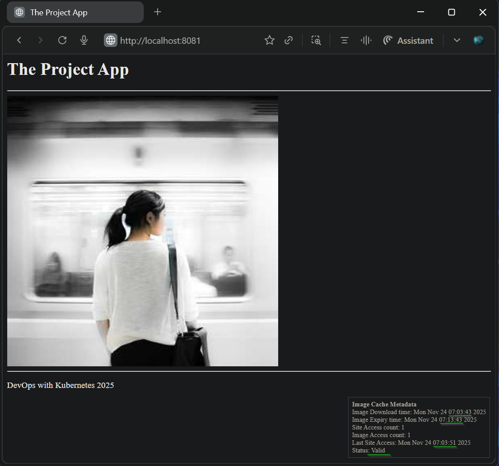
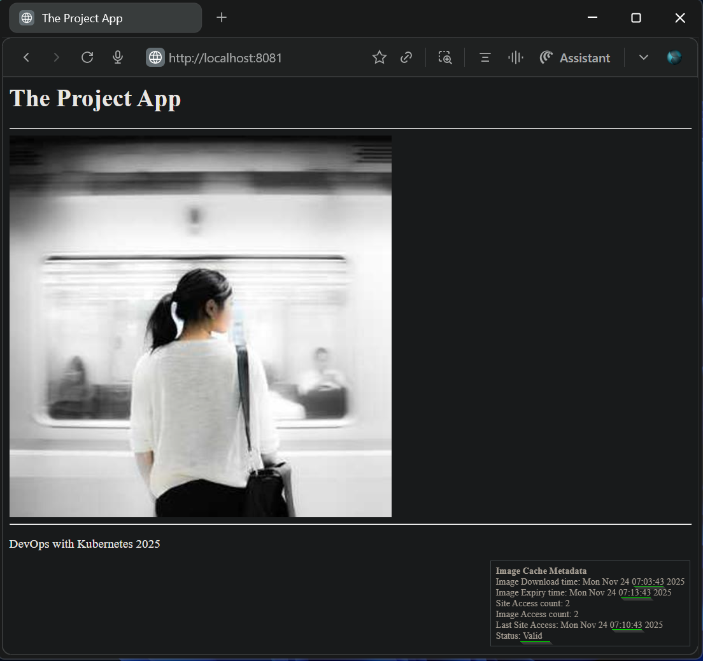
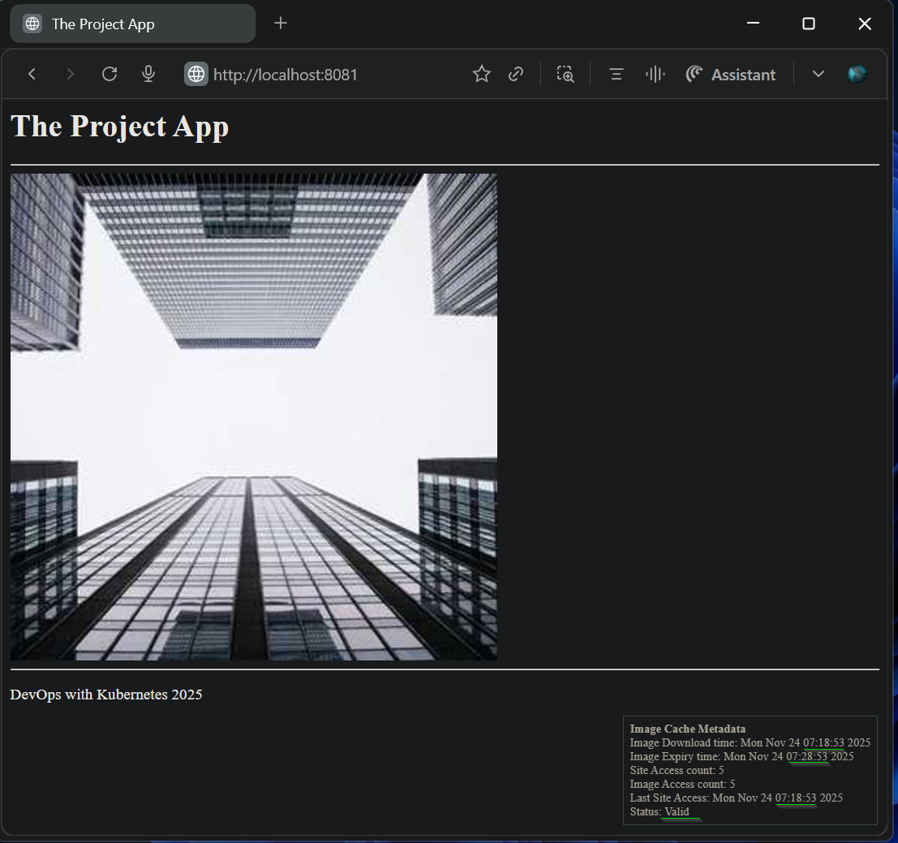
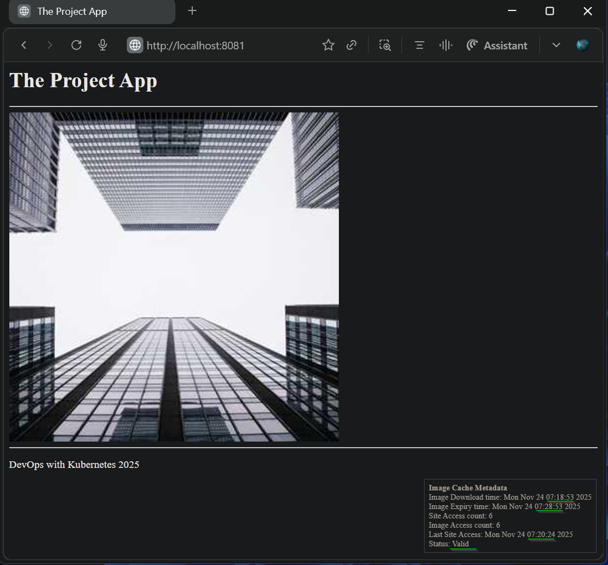

## Exercise 1.12: The project, step 6

### Summary
The `Todo App` is enhanced to download and render an hourly image cached in persistent storage using Kubernetes volumes.

### Volume Resources
- Integrated PersistentVolume and PersistentVolumeClaim configurations as introduced in [Exercise 1.11](https://github.com/arkb2023/devops-kubernetes/tree/1.11/log_output):
    - [PersistentVolume](../volumes/persistentvolume.yaml)
    - [PersistentVolumeClaim](../volumes/persistentvolumeclaim.yaml)
- The persistent storage ensures cache continuity across pod/container restarts.

### Application Updates
- Deployment manifest updated to mount PVC into the `todo-app-container`.
- New features:
    - Download and render a random image from an external API.
    - Use a shared persistent volume for image caching.
    - Manage image metadata including download timestamp, access count, and grace period usage.
    - Cache policy:
        - Cache validity: 10 minutes.
        - Grace period: after expiry, serve cached image once more.
        - Upon grace expiry, fetch and serve a new image.

### Base Application Version
- Built upon [Todo App v1.8](https://github.com/arkb2023/devops-kubernetes/tree/1.8/the_project)

### Application URL
- Accessible at: `http://localhost:8081`

### Validation Coverage
- On fresh deployment, an image is fetched and served.
- The same image is served for 10 minutes without changes.
- Upon cache expiry, the last cached image is served once more (grace period).
- After grace expiry, a new image is fetched and served.
- *Persistency test*: cached image and metadata survive container restarts, ensuring the old image continues to serve correctly.

***


### 1. **Directory and File Structure**
<pre>
├── the_project
│   ├── README.md
│   └── todo-app
│       ├── Dockerfile
│       ├── main.py
│       ├── manifests
│       │   ├── deployment.yaml
│       │   ├── ingress.yaml
│       │   └── service.yaml
└── volumes
    ├── persistentvolume.yaml
    └── persistentvolumeclaim.yaml
</pre>


***

### 2. Prerequisites
- `Docker` `k3d` `kubectl` installed

### 3. Build and Push the Docker Image to DockerHub

```bash
docker build -t arkb2023/todo-app:1.12.3 ./the_project/todo-app/
docker push arkb2023/todo-app:1.12.3
```
> Docker image published at: https://hub.docker.com/repository/docker/arkb2023/todo-app/tags/1.12.3

***

### 3. Deploy to Kubernetes

**Creates a cluster**

```bash
k3d cluster create --port 8081:80@loadbalancer --agents 2
```

**Setup Local PersistentVolume**  
To bind `PersistentVolume` to a local host path in a containerized node, create the backing storage directory inside the node container.

```bash
docker exec k3d-k3s-default-agent-0 mkdir -p /tmp/kube
```

**Apply the `Deployment` `Service` `Ingress` `PersistentVolume` and `PersistentVolumeClaim` Manifests**  

```bash
kubectl apply \
  -f ./the_project/todo-app/manifests/deployment.yaml \
  -f ./the_project/todo-app/manifests/ingress.yaml \
  -f ./the_project/todo-app/manifests/service.yaml \
  -f ./volumes/persistentvolume.yaml \
  -f ./volumes/persistentvolumeclaim.yaml
```

**Verify the Pod is Running**  
```bash
kubectl get pods
```
*Output*
```text
NAME                           READY   STATUS    RESTARTS   AGE
todo-app-dep-f795fd676-6gpgs   1/1     Running   0          3m48s
```

**Verification of Persistent Volume Mount Points on `Node` and `Pod`**

Check the volume mount on the Kubernetes node container `k3d-k3s-default-agent-0`  

```bash
docker exec k3d-k3s-default-agent-0 ls -l /tmp/kube/cache/
```
*Output*
```text
total 28
-rw-r--r-- 1 root root   140 Nov 24 05:35 cache_metadata.json
-rw-r--r-- 1 root root 21276 Nov 24 05:35 cached_image.jpg
```

Check the volume mount inside the pod container  
```bash
kubectl exec -it todo-app-dep-f795fd676-6gpgs -c todo-app-container -- ls -l /usr/src/app/files/cache
```
*Output*
```text
total 28
-rw-r--r-- 1 root root   140 Nov 24 05:35 cache_metadata.json
-rw-r--r-- 1 root root 21276 Nov 24 05:35 cached_image.jpg
```
> Same cache files appear both on the node’s storage path `/tmp/kube/cache/` and the pod’s mount path `/usr/src/app/files/cache`  
> File sizes and modification timestamps are identical, validating the PVC is properly bound to the PV and mounted into the pod.  

**Inspect Pod Logs for Application Readiness**
```bash
kubectl logs -f todo-app-dep-f795fd676-6gpgs
```

*Output*
```text
2025-11-24 05:35:32,668 - DEBUG - Setting up FastAPI app with lifespan
2025-11-24 05:35:32,668 - DEBUG - FastAPI app setup complete
INFO:     Started server process [7]
INFO:     Waiting for application startup.
2025-11-24 05:35:32,669 - DEBUG - ImageCache initialized with cache_dir: /usr/src/app/files/cache, ttl: 600s
2025-11-24 05:35:32,669 - DEBUG - Lifespan startup: Cache initialized with dir /usr/src/app/files/cache
2025-11-24 05:35:32,669 - DEBUG - Cache expired: Missing image or download timestamp
2025-11-24 05:35:32,669 - DEBUG - Lifespan startup: Cache is expired on startup, fetching new image
2025-11-24 05:35:32,669 - DEBUG - Fetching new image from external source
2025-11-24 05:35:33,851 - DEBUG - Image fetched and cached successfully at 1763962533.8509443
2025-11-24 05:35:33,851 - DEBUG - Lifespan startup: Image fetched and cached successfully on startup
INFO:     Application startup complete.
INFO:     Uvicorn running on http://0.0.0.0:3000 (Press CTRL+C to quit)
```
> logs confirm `ImageCache` object is initialized, pointing to the mounted cache directory inside the container `/usr/src/app/files/cache`

### 5. Validation

- On fresh start, an image is served  
      
    > Metadata confirms, this is the first access with a 10-minute cache window:  
    >   Image Download time: 07:03:43  
    >   Image Expiry time: 07:13:43  
    >   Current page served at: *Last Site Access: 07:03:51*  
    >   Cache timer status: *Valid*  

- For 10 minutes, the same image is served  
    
    > Metadata confirms access is within the cache period:  
    >   Image Download time: 07:03:43  
    >   Image Expiry time: 07:13:43  
    >   Current page served at: *Last Site Access: 07:10:43*  
    >   Cache timer status: *Valid*  

- No change in image during grace period request  
      
    > Metadata indicates grace period active:  
    >   Image Download time: 07:03:43  
    >   Image Expiry time: 07:13:43  
    >   Current page served at: *Last Site Access: 07:14:33*  
    >   Cache timer status: *Grace period*  

- New image served after grace period expiry
      
    > Metadata confirms 10-minute cache window validity for newly served image:  
    >   Image Download time: 07:18:53  
    >   Image Expiry time: 07:28:53  
    >   Current page served at: *Last Site Access: 07:18:53*  
    >   Cache timer status: *Valid*  
    
- *Persistency Test* - Upon container restart, the same old image is served

    - Restart Both Pods  

    ```bash
    kubectl rollout restart deployment todo-app-dep
    ```

    - The cached image persists and continues to be served after restarts:
          
        Metadata confirms that both the Image Download time and Expiry time remain unchanged, validating cache retention after the restart.  
        >   Image Download time: 07:18:53  
        >   Image Expiry time: 07:28:53  
        >   Current page served at: *Last Site Access: 07:20:24*  
        >   Cache timer status: *Valid*  


### 5. **Cleanup**

**Delete the `Deployment` `Service` and `Ingress` Resources**  
```bash
kubectl delete \
    -f ./the_project/todo-app/manifests/deployment.yaml \
    -f ./the_project/todo-app/manifests/ingress.yaml \
    -f ./the_project/todo-app/manifests/service.yaml \
    -f ./volumes/persistentvolume.yaml \
    -f ./volumes/persistentvolumeclaim.yaml
```
*Output*
```text
deployment.apps "todo-app-dep" deleted from default namespace
ingress.networking.k8s.io "dwk-todo-app-ingress" deleted from default namespace
service "todo-app-svc" deleted from default namespace
persistentvolume "local-pv" deleted
persistentvolumeclaim "local-pv-claim" deleted from default namespace
```

**Stop the k3d Cluster**  
```bash
k3d cluster delete k3s-default
```
*Output*
```text
INFO[0000] Deleting cluster 'k3s-default'
INFO[0003] Deleting cluster network 'k3d-k3s-default'
INFO[0003] Deleting 1 attached volumes...
INFO[0003] Removing cluster details from default kubeconfig...
INFO[0003] Removing standalone kubeconfig file (if there is one)...
INFO[0003] Successfully deleted cluster k3s-default!
```
***

### Known Issue: 
The image access count does not reset after a new image is fetched post grace period expiry, causing cumulative access counts across multiple cached images instead of per-image counts.